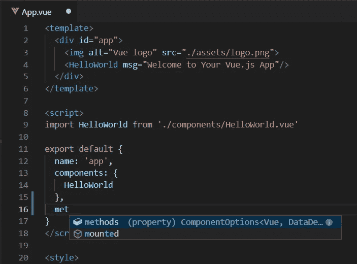
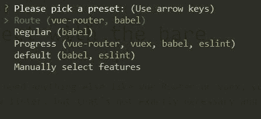
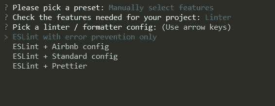
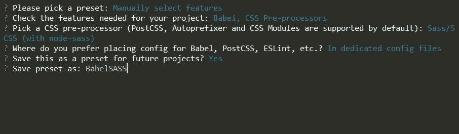
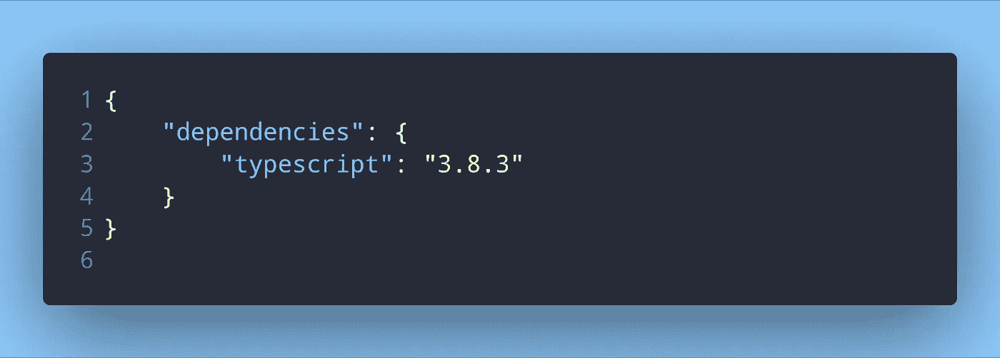
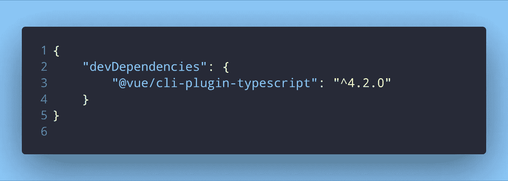
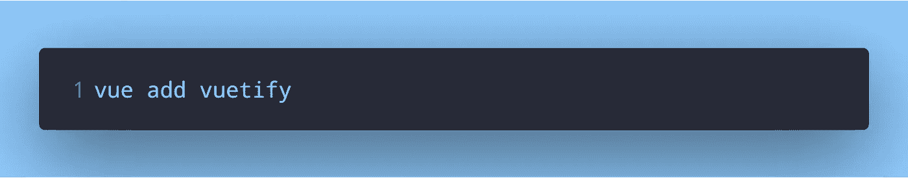
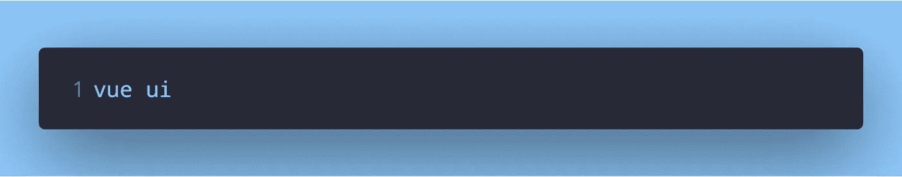
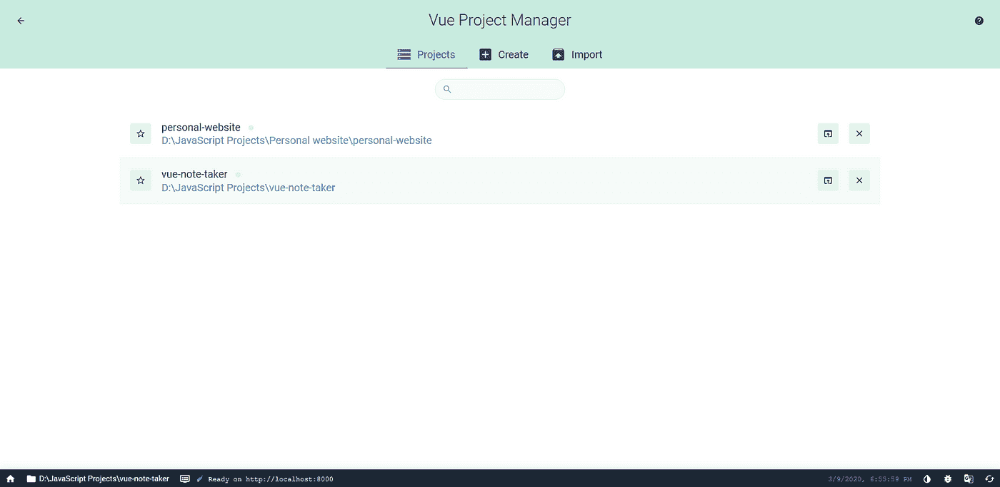
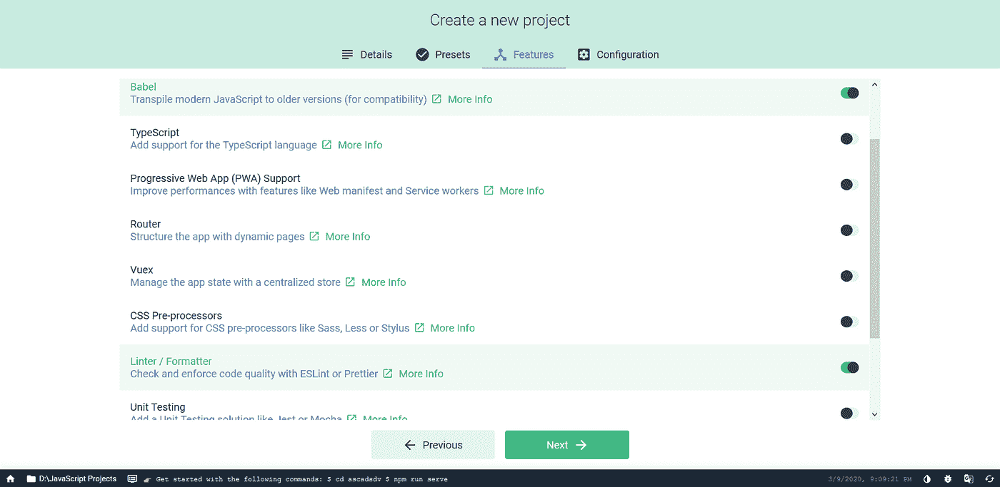

# 如何使用 Vue CLI 创建新项目

> 原文：<https://itnext.io/how-to-create-new-projects-with-the-vue-cli-454be13701d8?source=collection_archive---------4----------------------->

# 介绍

这是一个使用 Vue CLI v3.x 创建新 Vue 项目的指南。它来自 Vuejs v2.x，可能有点让人不知所措，因为有相当多的选项可供选择。本指南将向您展示:

1.  如何用最少的资源创建一个简单的项目
2.  如何在项目创建后添加插件
3.  如何保存您的首选项，以便您可以在下次创建项目时快速选择它们
4.  如何使用 Vue UI 创建和管理项目

# 用最少的资源创建一个项目

即使对于一个不需要 Vue 路由器或 Vuex 之类的其他东西的 Vue 项目，你仍然需要 Babel。你可能还需要一个棉绒，但这不是完全必要的，取决于你是否使用它。

创建新项目

运行这个命令后，Vue 将在当前目录下创建一个名为 **sample-project** 的新项目。但是在创建项目之前，它会显示一系列选项。对我来说，这些选项如下所示:

询问预设选项

呈现给我们的这些选项被称为*预设*。预设包含与其他配置选项捆绑在一起的各种插件/选项，因此选择预设意味着选择所有这些选项。

例如，有一个名为 *default* 的预设，这是我们第一次创建项目时可用的预设。它有 babel 和 eslint 作为选项/功能。因此，如果我们选择这个默认的预置，我们名为 **sample-project** 的项目将被创建，并在项目创建期间安装 babel 和 eslint。当然，没有必要选择预设。从上图可以看出，我们也可以手动选择想要的选项和插件。预置是为了节省我们的时间，使项目创建更快。在这里您可以选择*默认*预设，因为我们正在创建一个最小的项目。

使用箭头键导航并按 enter 键选择一个预设，或者如果您不想要默认*预设*中的 babel 附带的 eslint，则选择选项手动选择您的选项。

# 创建您自己的预设

## 选择一个选项并导航选项列表

如果您选择手动选择选项，而不是选择预设，您将看到所有可用选项的列表。在导航和与选项/功能列表交互时，我有点困惑。如果你也是，这里有一个简短的解释:

1.  按下`a`将切换所有选项。因此，第一次按下它将选择所有选项，再次按下它将取消选择所有选项。
2.  按下`space`将选择一个选项，而按下`enter`将完成您的选择。一定不要把这两个搞混了！你要么重新开始，要么花时间删除/安装功能。按下`space`仅选择高亮显示的选项，您仍可以按下`space`取消选择该特定选项并继续选择您的功能。按下`enter`将完成您的选择，Vue 将继续使用列表中选择的特性创建您的项目。
3.  按下`i`将反转您的选择。例如，如果您从功能列表中选择了*路由器*和*打字稿*，按下`i`将**反转**您的列表。这意味着*路由器*和*打字稿*将被取消选择，而*所有*其他选项将被选择。

## 选择某些功能时的额外选项

通常，在选择了您想要的特性并按下回车键后，系统会询问您希望您的配置文件保存在哪里——在专用配置文件中还是在`package.json`中。

但是在被询问你想在哪里保存你的配置文件之前，如果你选择了像林挺或者 CSS 预处理程序这样的特性，那么你会被要求在其中选择一个。例如，如果您选择林挺，您将会看到以下选项:

棉绒选项

手动选择您想要的特性，选择您选择的 linter、预处理器等(如果您选择了像 linter 和 CSS 预处理器特性这样的选项)并选择您想要存储配置文件的位置后，您将会看到一个选项，询问您是否想要将您到目前为止选择的任何内容保存为预置。

保存预设

因此，如果我将我选择的 CSS 预处理器和 Babel 保存为一个预置，并给它一个名称，这意味着下次我创建 Vue 项目时，我只需在开始时选择这个预置，它就会自动为我选择其余的选项(包括关于配置文件的选项)并创建项目。

因此，要创建您自己的预设，请手动选择您想要的功能，选择所有选项，然后将您的选择保存为预设，并为其命名。就这样，你现在有了自己的预设。

# 创建项目后添加插件

在项目创建过程中，您可以选择要添加到项目中的功能。这些功能是作为插件实现的，因为 Vue CLI 使用基于插件的体系结构。

如果您在项目的`package.json`中查找您在项目创建期间添加的特性，您会发现它们以`@vue/cli-plugin-`开头。以 *TypeScript* 为例，如果我们使用 npm 将 TypeScript 作为一个包安装，我们会在`package.json`中看到类似这样的内容:

从 npm 安装 TypeScript

另一方面，在使用 Vue CLI 创建项目的过程中添加 TypeScript 作为一项功能，您会得到如下结果:

使用 Vue 将 TypeScript 作为插件安装

> 请注意，这些包的版本号是在我写这篇文章的时候正常安装的。

现在，尽管你已经在你的项目中拥有了所有你想要的特性/插件，但是可能会有一个时候你需要一个你以前不需要或者认为你不需要的特性。它只需要一个添加包的命令:

将 Vuetify 添加为插件

这里我们将`Vuetify`插件添加到我们的项目中。你可以用同样的命令- `vue add plugin-name`添加任何你需要的插件。

你可以在这里找到核心 Vue CLI 插件[的文档。还有](https://cli.vuejs.org/core-plugins/)[其他官方插件](https://awesomejs.dev/for/vue-cli/)除了这些也有很好的文档。

除了使用 CLI 命令创建项目，还有一个 GUI 可用于创建新项目和管理现有项目。

对于现有的项目，您可以添加和删除插件、依赖项等等。您还可以将现有插件和依赖项更新到最新版本。

要使用 GUI，请在控制台中输入以下命令:

使用 Vue GUI

GUI 将在您的浏览器中打开。

Vue GUI 开始主屏幕

`Projects`选项卡显示现有的 Vue 项目。`Create`标签是我们需要的。单击它，选择要在其中创建项目的文件夹，然后单击开始在该位置创建新项目。

为项目文件夹命名，选择您想要的选项，然后继续下一步。以下步骤与 CLI 版本中的步骤相同:

1.  选择预设或手动选择功能
2.  如果您手动选择了功能，您可以将它们保存为预设
3.  新项目已创建

在 GUI 中为新项目选择功能

# 包扎

本指南到此为止。我希望这篇文章能帮助你用 Vue CLI 创建项目。如果你有任何问题或建议，请在下面的评论中畅所欲言。

*原载于* [*dev.to*](https://dev.to/napoleon039/how-to-create-new-projects-with-the-vue-cli-3pgo) *。*