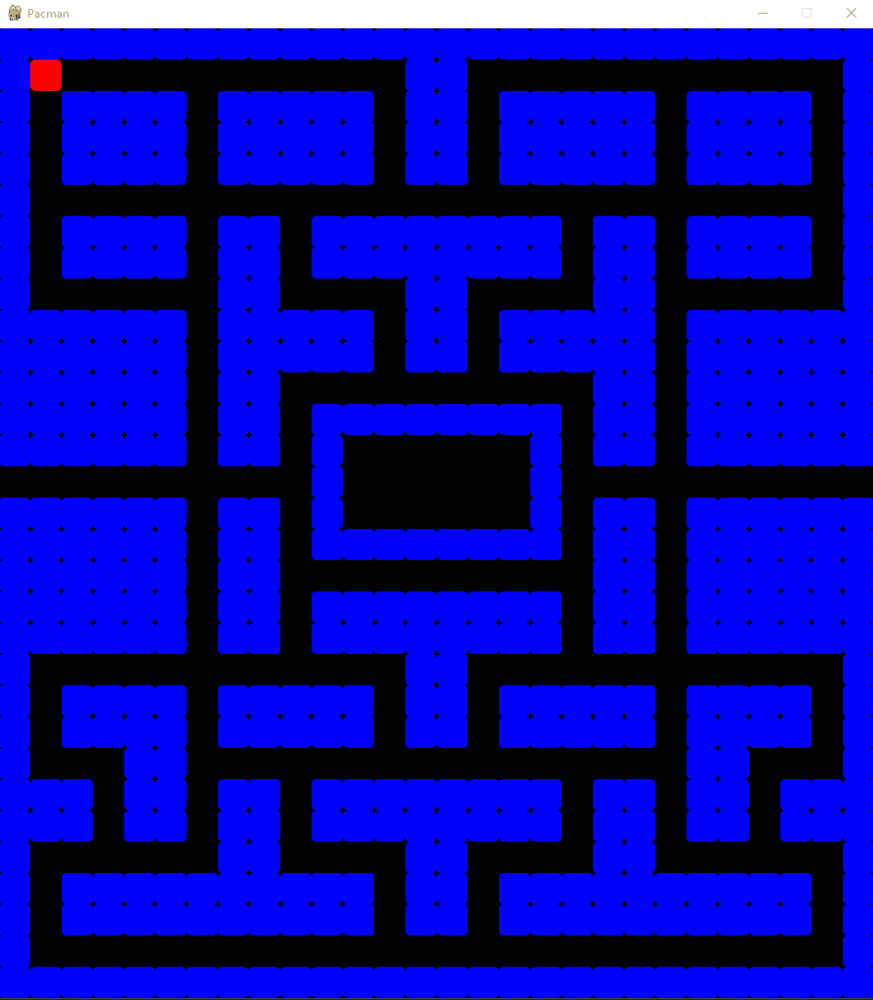
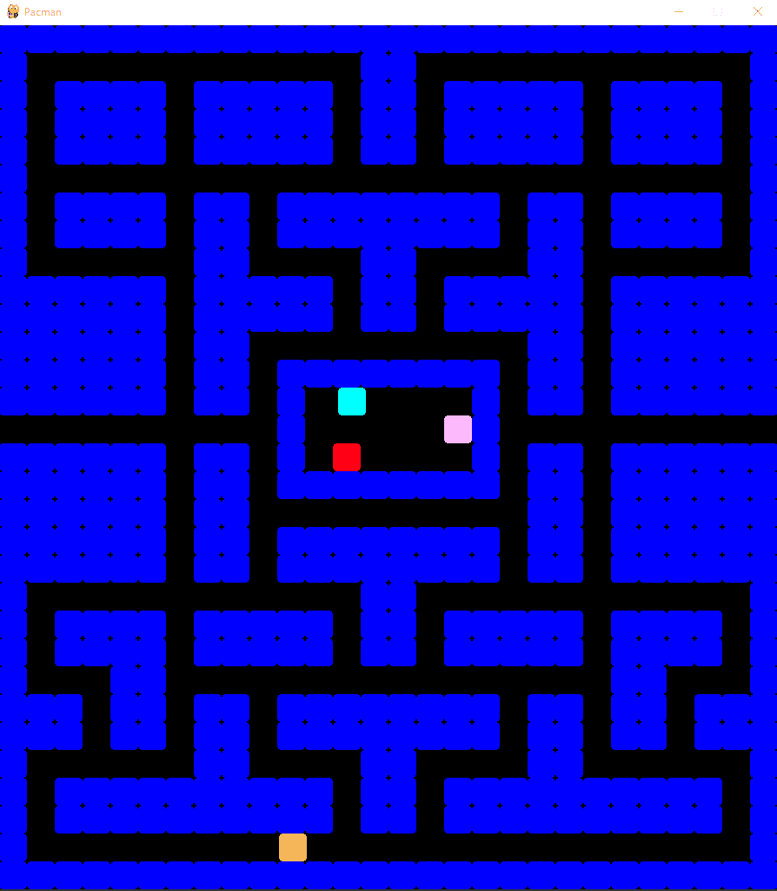
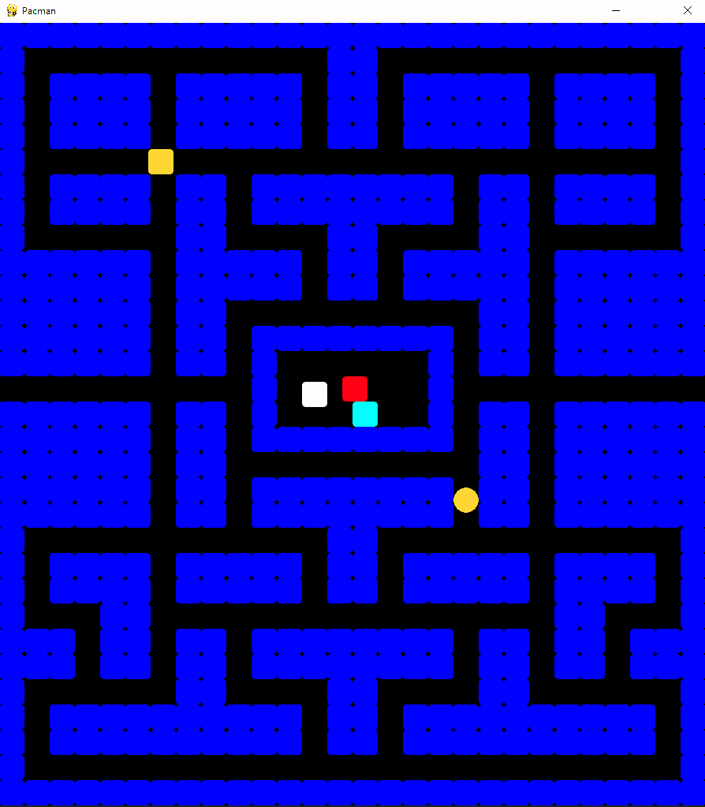
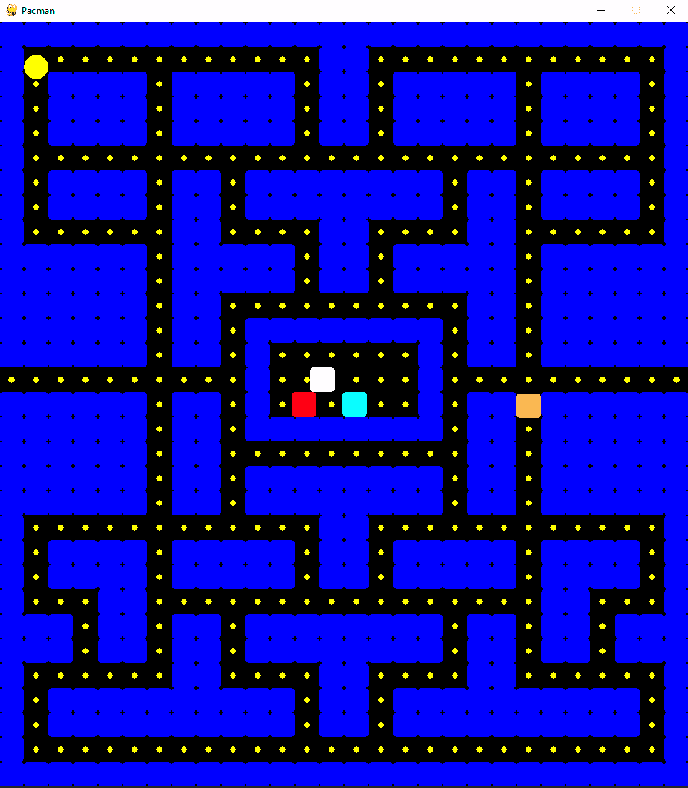
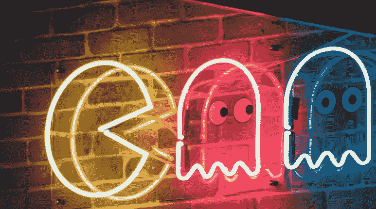

# 用 300 行或更少的代码用 Python 创建 Pac-Man 克隆——第 1 部分

> 原文：<https://itnext.io/how-to-create-pac-man-in-python-in-300-lines-of-code-or-less-part-1-288d54baf939?source=collection_archive---------0----------------------->

《吃豆人》是一款经典的平台游戏，大概今天大家都知道了。“吃豆人”这个名字来自日语单词“paku”，意思是张开和闭上嘴巴。创作者岩谷彻的灵感来自日本的一个故事，讲的是一种通过吃掉怪物来保护儿童免受怪物伤害的生物。在创作游戏时，他用故事中的关键词作为跳板，动词“吃”成为一切的基础。


到这篇文章结束时，你将已经和我一起创造了这个！

这些怪物被描绘成四个幽灵，它们连续攻击玩家，类似于太空入侵者。每个鬼魂也有独特的个性。在这个故事中，还有一个更重要的元素，生命力的概念“kokoro”，它允许生物吃怪物。在游戏中，这种能量表现为给吃豆人提供短期吃掉怪物的能力的能量饼干。

在教程中，我将首先指导您完成基本设置，然后我们将为迷宫墙、Pac-Man 和幽灵创建游戏对象，确保在迷宫中寻路，给幽灵随机移动，为玩家实现箭头控制，最后，在整个迷宫中放置饼干形式的食物。为了更好地表现，我会用图片和 gif 来说明一切。

# >>基本 _ 设置

最终的游戏大约有 300 行代码，所以我在这里只列出最重要的部分。完整的代码可以在我的 GitHub 库上找到[。第一步是安装必要的软件包。我们需要 pygame，numpy 和 tcod。使用 pip 工具安装它们(您可以在关于 Python 应用程序的文章中找到如何安装)。如果您使用的是 PyCharm 之类的 IDE(我推荐)，安装将在点击缺失包错误消息后发生。](https://github.com/janjilecek/pacman_python_pygame/blob/main/pacman.py)

首先，我们将创建一个游戏窗口，类似于之前关于太空入侵者游戏(只有 100 行)的[教程。在这里，我将准备用于指定窗口大小、游戏名称、刷新率和几个数据字段的参数，这些数据字段将保存对游戏对象和玩家的引用。tick 函数迭代遍历所有游戏对象，并调用它们的内部逻辑和渲染。接下来要做的就是重新绘制整个游戏区域，并处理鼠标点击和键盘输入等输入事件。_handle_events 函数将为此目的服务。](https://medium.com/itnext/creating-space-invaders-clone-in-pygame-ea0f5336c677)

```
import pygame # import packages (install with "pip install pygame" in cmd)
import numpy as np
import tcod

class GameRenderer:
    def __init__(self, in_width: int, in_height: int):
        pygame.init()
        self._width = in_width
        self._height = in_height
        self._screen = pygame.display.set_mode((in_width, in_height))
        pygame.display.set_caption('Pacman')
        self._clock = pygame.time.Clock()
        self._done = False
        self._game_objects = []
        self._walls = []
        self._cookies = []
        self._hero: Hero = None

    def tick(self, in_fps: int):
        black = (0, 0, 0)
        while not self._done:
            for game_object in self._game_objects:
                game_object.tick()
                game_object.draw()

            pygame.display.flip()
            self._clock.tick(in_fps)
            self._screen.fill(black)
            self._handle_events()
         print("Game over")

    def add_game_object(self, obj: GameObject):
        self._game_objects.append(obj)

    def add_wall(self, obj: Wall):
        self.add_game_object(obj)
        self._walls.append(obj)

    def _handle_events(self):
        pass # we'll implement this later
```

# >>父母 _ 游戏 _ 对象

接下来，我将创建一个名为 game object 的父游戏对象，其他类将从它继承功能。在游戏中，我们将有墙(墙)、吃豆人(英雄)、鬼(幽灵)和饼干(饼干)的对象。对于上面提到的可移动游戏实体，我稍后会创建一个名为 MovableObject 的类，它将是 GameObject 类的扩展，具有移动功能。

在对象初始化期间，我指定了它的颜色、形状和位置。每个对象还有一个对渲染 surface _surface 的引用，这样它就可以在主表面上处理自己的渲染。为此，我们有一个名为 draw 的函数，由之前创建的 GameRenderer 为每个游戏对象调用。根据 is_circle 参数的不同，对象要么呈现为圆形，要么呈现为矩形(在我们的例子中，我使用了一个带有略微圆角的正方形作为墙壁，一个圆形作为 Pac-Man 和 cookies)。

```
class GameObject:
    def __init__(self, in_surface, x, y,
                 in_size: int, in_color=(255, 0, 0),
                 is_circle: bool = False):
        self._size = in_size
        self._renderer: GameRenderer = in_surface
        self._surface = in_surface._screen
        self.y = y
        self.x = x
        self._color = in_color
        self._circle = is_circle
        self._shape = pygame.Rect(self.x, self.y, in_size, in_size)

    def draw(self):
        if self._circle:
            pygame.draw.circle(self._surface,
                               self._color,
                               (self.x, self.y),
                               self._size)
        else:
            rect_object = pygame.Rect(self.x, self.y, self._size, self._size)
            pygame.draw.rect(self._surface,
                             self._color,
                             rect_object,
                             border_radius=4)

    def tick(self):
        pass
```

创建 wall 类很简单。我根据最初的 Pac-Man 为墙壁选择了蓝色(颜色参数—蓝色 255，其余为 0)。

```
class Wall(GameObject):
    def __init__(self, in_surface, x, y, in_size: int, in_color=(0, 0, 255)):
        super().__init__(in_surface, x * in_size, y * in_size, in_size, in_color)
```

准备用于渲染的代码和用于墙壁的对象。编写时，确保 Wall 和 GameObject 类在 GameRenderer 类之上，以便该类“看到”它们。下一步是在屏幕上渲染迷宫。但在此之前，我们必须创建一个助手类。

# >>游戏 _ 控制器 _ 类

我将用 ASCII 字符将迷宫保存在新的 PacmanGameController 类的变量中。我将使用原始的迷宫尺寸——28x 31 的瓷砖。稍后，我将不得不确保幽灵们能够正确地找到通过迷宫的路，并有可能找到玩家。首先我会把迷宫读成字符，转换成 1 和 0 的矩阵，其中墙是 0，可通行空间是 1。这些值作为所谓的成本函数服务于寻路算法。零表示通行成本无限大，因此数组中以这种方式标记的项目将被视为不可通行。注意 reachable_spaces 数组，它保存了迷宫中可以通过的部分。稍后我会详细介绍，首先我要准备类结构。可以从 [my GitHub](https://github.com/janjilecek/pacman_python_pygame/blob/main/pacman.py) 中复制 ASCII 形式的迷宫。在人物符号中，我用“X”代表墙，“P”代表吃豆人，“G”代表幽灵。

```
class PacmanGameController:
    def __init__(self):
        self.ascii_maze = [
            "XXXXXXXXXXXXXXXXXXXXXXXXXXXX",
            "XP           XX            X",
            "X XXXX XXXXX XX XXXXX XXXX X",
            "X XXXX XXXXX XX XXXXX XXXX X",
            "X XXXX XXXXX XX XXXXX XXXX X",
            "X                          X",
            "X XXXX XX XXXXXXXX XX XXXX X",
            "X XXXX XX XXXXXXXX XX XXXX X",
            "X      XX    XX    XX      X",
            "XXXXXX XXXXX XX XXXXX XXXXXX",
            "XXXXXX XXXXX XX XXXXX XXXXXX",
            "XXXXXX XX          XX XXXXXX",
            "XXXXXX XX XXXXXXXX XX XXXXXX",
            "XXXXXX XX X   G  X XX XXXXXX",
            "          X G    X          ",
            "XXXXXX XX X   G  X XX XXXXXX",
            # shortened for article, full ascii on my github
            "XXXXXXXXXXXXXXXXXXXXXXXXXXXX",
        ]

        self.numpy_maze = []
        self.cookie_spaces = []
        self.reachable_spaces = []
        self.ghost_spawns = []

        self.size = (0, 0)
        self.convert_maze_to_numpy()
        #self.p = Pathfinder(self.numpy_maze) # use later

    def convert_maze_to_numpy(self):
        for x, row in enumerate(self.ascii_maze):
            self.size = (len(row), x + 1)
            binary_row = []
            for y, column in enumerate(row):
                if column == "G":
                    self.ghost_spawns.append((y, x))

                if column == "X":
                    binary_row.append(0)
                else:
                    binary_row.append(1)
                    self.cookie_spaces.append((y, x))
                    self.reachable_spaces.append((y, x))
            self.numpy_maze.append(binary_row)
```

# >>渲染 _ 迷宫 _ 迷宫

渲染迷宫所需的一切都准备好了，所以剩下的就是创建我们的 PacmanGameController 类的实例，遍历具有墙位置的 2D 数组，并在这些位置创建一个墙对象(我使用的是 add_wall 函数，这里没有显示，同样，看看我的 GitHub 上的完整代码[)。我把刷新率设为每秒 120 帧。](https://github.com/janjilecek/pacman_python_pygame/blob/main/pacman.py)

```
if __name__ == "__main__":
    unified_size = 32
    pacman_game = PacmanGameController()
    size = pacman_game.size
    game_renderer = GameRenderer(size[0] * unified_size, size[1] * unified_size)

    for y, row in enumerate(pacman_game.numpy_maze):
        for x, column in enumerate(row):
            if column == 0:
                game_renderer.add_wall(Wall(game_renderer, x, y, unified_size))

    game_renderer.tick(120)
```


# >>来 _ 加 _ 鬼吧！

在最初的《吃豆人》中，有四个幽灵，分别叫布林基、平基、因基和克莱德，他们都有自己的个性和能力。这个游戏的概念是基于一个日本童话(更多的[在这里](https://www.gamedeveloper.com/design/the-pac-man-dossier)和[在这里](https://gameinternals.com/understanding-pac-man-ghost-behavior))和日文中的原始名称也暗示了他们的能力(例如，Pinky 有日文名称小偷，Blinky 是影子)。然而，对于我们的游戏，我们不会进入这样的细节，每个幽灵将只使用原始版本中的基本行为循环，即追逐，分散和恐惧模式。我们将在第二部分描述和处理这些人工智能模式。

ghost 类将是简单的，从父 MovableObject 类继承其大部分行为(查看 my [GitHub](https://github.com/janjilecek/pacman_python_pygame/blob/main/pacman.py) ，该类稍微复杂一些，包括向四个方向移动的逻辑，遵循一条路线，并检查与墙壁的碰撞)。

```
class Ghost(MovableObject):
    def __init__(self, in_surface, x, y, in_size: int, in_game_controller, in_color=(255, 0, 0)):
        super().__init__(in_surface, x, y, in_size, in_color, False)
        self.game_controller = in_game_controller
```

我将把每个鬼的颜色的 RGB 值添加到 PacmanGameController 类中，并在 main 函数中生成四个彩色鬼。我还将准备一个用于坐标转换的静态函数，该函数简单地转换迷宫坐标(例如，x=16 y=16 大约是迷宫的中心，乘以单元格或瓷砖的大小，得到游戏表面上的坐标，以像素为单位)。

```
# inPacmanGameController
self.ghost_colors = [
        (255, 184, 255),
        (255, 0, 20),
        (0, 255, 255),
        (255, 184, 82)
    ]

# in main
for i, ghost_spawn in enumerate(pacman_game.ghost_spawns):
    translated = translate_maze_to_screen(ghost_spawn)
    ghost = Ghost(game_renderer, translated[0], translated[1], unified_size, pacman_game,
                  pacman_game.ghost_colors[i % 4])
    game_renderer.add_game_object(ghost)

# General functions for coordinate conversion, place at the beginning of the code
def translate_screen_to_maze(in_coords, in_size=32):
    return int(in_coords[0] / in_size), int(in_coords[1] / in_size)

def translate_maze_to_screen(in_coords, in_size=32):
    return in_coords[0] * in_size, in_coords[1] * in_size
```

在这个阶段，四个幽灵将在游戏启动时在迷宫中呈现。我们现在想让他们搬走。

# >>迷宫 _ 寻路

现在可能是最复杂的部分。在 2D 空间或图中寻找路径是一个困难的问题。实现一个算法来解决这样的问题将需要另一篇文章，所以我们将使用一个现成的解决方案。最有效的寻路算法是 A*算法。这是我们一开始安装的 tcod 包提供的。

为了移动幽灵，我将创建一个名为`Pathfinder`的类。在构造函数中，我将用传递的代价初始化一个 numpy 数组(前面描述过的一个由 1 和 0 组成的数组),并创建一个类变量`pf`,它将保存 A* pathfinder 的一个实例。当使用迷宫中的坐标(从哪里，到哪里)调用时，`get_path`函数将计算并返回路径，作为一个数组中的一系列步骤。

```
class Pathfinder:
    def __init__(self, in_arr):
        cost = np.array(in_arr, dtype=np.bool_).tolist()
        self.pf = tcod.path.AStar(cost=cost, diagonal=0)

    def get_path(self, from_x, from_y, to_x, to_y) -> object:
        res = self.pf.get_path(from_x, from_y, to_x, to_y)
        return [(sub[1], sub[0]) for sub in res]
```

我现在将向 main 函数添加一个部分来演示寻路。我选择路线的起点坐标[1，1]和终点[24，24]。这是可选代码。

```
# draw path - optional
red = (255, 0, 0)
green = (0, 255, 0)
_from = (1, 1)
_to = (24, 24)
path_array = pacman_game.p.get_path(_from[1], _from[0], _to[1], _to[0])

print(path_array)
# [(1, 2), (1, 3), (1, 4), (1, 5), (2, 5), (3, 5), (4, 5), (5, 5), (6, 5), (6, 6), (6, 7) ...

white = (255, 255, 255)
for path in path_array:
    game_renderer.add_game_object(Wall(game_renderer, path[0], path[1], unified_size, white))

from_translated = translate_maze_to_screen(_from)
game_renderer.add_game_object(
    GameObject(game_renderer, from_translated[0], from_translated[1], unified_size, red))

to_translated = translate_maze_to_screen(_to)
game_renderer.add_game_object(
    GameObject(game_renderer, to_translated[0], to_translated[1], unified_size, green))
```

在游戏中，最短路线的渲染是这样的:



# >>随机化 _ 幽灵 _ 运动

现在，我们将在 PacmanGameController 类中创建一个新函数，用于从 reachable_spaces 数组中选择一个随机点。每个幽灵到达目的地后都会使用这个功能。这样，鬼魂将简单地选择一条路径，从他们在迷宫中的当前位置到一个随机的目的地。我们将在下一部分实现更复杂的行为，比如追逐和逃离玩家。

```
def request_new_random_path(self, in_ghost: Ghost):
    random_space = random.choice(self.reachable_spaces)
    current_maze_coord = translate_screen_to_maze(in_ghost.get_position())

    path = self.p.get_path(current_maze_coord[1], current_maze_coord[0], random_space[1],
                           random_space[0])
    test_path = [translate_maze_to_screen(item) for item in path]
    in_ghost.set_new_path(test_path)
```

在 Ghost 类中，我们添加了跟踪路径的新逻辑。每一帧都调用 reached_target 函数，检查重影是否已经到达其目标。如果有，它将确定迷宫路径的下一步是哪个方向，并开始向上、向下、向左或向右改变其位置(移动的逻辑在父级 MovableObject 类中调用)。

```
def reached_target(self):
    if (self.x, self.y) == self.next_target:
        self.next_target = self.get_next_location()
    self.current_direction = self.calculate_direction_to_next_target()

def set_new_path(self, in_path):
    for item in in_path:
        self.location_queue.append(item)
    self.next_target = self.get_next_location()

def calculate_direction_to_next_target(self) -> Direction:
    if self.next_target is None:
        self.game_controller.request_new_random_path(self)
        return Direction.NONE
    diff_x = self.next_target[0] - self.x
    diff_y = self.next_target[1] - self.y
    if diff_x == 0:
        return Direction.DOWN if diff_y > 0 else Direction.UP
    if diff_y == 0:
        return Direction.LEFT if diff_x < 0 else Direction.RIGHT
    self.game_controller.request_new_random_path(self)
    return Direction.NONE

def automatic_move(self, in_direction: Direction):
    if in_direction == Direction.UP:
        self.set_position(self.x, self.y - 1)
    elif in_direction == Direction.DOWN:
        self.set_position(self.x, self.y + 1)
    elif in_direction == Direction.LEFT:
        self.set_position(self.x - 1, self.y)
    elif in_direction == Direction.RIGHT:
        self.set_position(self.x + 1, self.y)
```

现在，重影在原始 ASCII 迷宫中由字母“G”指示的位置创建，并开始搜索随机路径。我把三个鬼魂关在笼子里——和原版吃豆人一样，他们会被一个个释放——还有一个在迷宫里游荡:



# >>玩家控制

为了添加播放器功能，我将创建一个名为 Hero 的类。控制玩家和幽灵的大部分逻辑都在 MovableObject 类中处理，所以我们只需要几个函数来指定玩家的行为。在最初的吃豆人游戏中，玩家可以通过箭头键控制向四个方向移动。如果没有箭头键被按下，玩家将继续在最后一个有效的方向。如果在玩家不能移动的方向上按下一个键，该方向将被保存并在下一个可用回合使用。我将在我们的游戏中复制这一行为，并添加了 Pacman 从迷宫的一端传送到另一端的能力——我将检查玩家是否在游戏区域的左侧或右侧，并相应地将他们的位置设置为迷宫的对面。Pacman 也有一个修改过的渲染函数，我们需要用它通常占据正方形一半的大小来渲染它(使用 pygame.rect)。

```
class Hero(MovableObject):
    def __init__(self, in_surface, x, y, in_size: int):
        super().__init__(in_surface, x, y, in_size, (255, 255, 0), False)
        self.last_non_colliding_position = (0, 0)

    def tick(self):
        # TELEPORT
        if self.x < 0:
            self.x = self._renderer._width

        if self.x > self._renderer._width:
            self.x = 0

        self.last_non_colliding_position = self.get_position()

        if self.check_collision_in_direction(self.direction_buffer)[0]:
            self.automatic_move(self.current_direction)
        else:
            self.automatic_move(self.direction_buffer)
            self.current_direction = self.direction_buffer

        if self.collides_with_wall((self.x, self.y)):
            self.set_position(self.last_non_colliding_position[0], self.last_non_colliding_position[1])

        self.handle_cookie_pickup()

    def automatic_move(self, in_direction: Direction):
        collision_result = self.check_collision_in_direction(in_direction)

        desired_position_collides = collision_result[0]
        if not desired_position_collides:
            self.last_working_direction = self.current_direction
            desired_position = collision_result[1]
            self.set_position(desired_position[0], desired_position[1])
        else:
            self.current_direction = self.last_working_direction

    def handle_cookie_pickup(self):
        collision_rect = pygame.Rect(self.x, self.y, self._size, self._size)
        cookies = self._renderer.get_cookies()
        game_objects = self._renderer.get_game_objects()
        for cookie in cookies:
            collides = collision_rect.colliderect(cookie.get_shape())
            if collides and cookie in game_objects:
                game_objects.remove(cookie)

    def draw(self):
        half_size = self._size / 2
        pygame.draw.circle(self._surface, self._color, (self.x + half_size, self.y + half_size), half_size)
```

我在 main 函数的末尾实例化了 Hero 类。我将位置设置为坐标[1，1] — unified_size 是一个图块的大小。我们还需要将输入事件的处理添加到 GameRenderer 类中，以便我们可以控制游戏角色。

```
# in GameRenderer class
def add_hero(self, in_hero):
        self.add_game_object(in_hero)
        self._hero = in_hero

def _handle_events(self):
    for event in pygame.event.get():
        if event.type == pygame.QUIT:
            self._done = True

    pressed = pygame.key.get_pressed()
    if pressed[pygame.K_UP]:
        self._hero.set_direction(Direction.UP)
    elif pressed[pygame.K_LEFT]:
        self._hero.set_direction(Direction.LEFT)
    elif pressed[pygame.K_DOWN]:
        self._hero.set_direction(Direction.DOWN)
    elif pressed[pygame.K_RIGHT]:
        self._hero.set_direction(Direction.RIGHT)

# at the end of main function
pacman = Hero(game_renderer, unified_size, unified_size, unified_size)
game_renderer.add_hero(pacman)
game_renderer.tick(120)
```

现在推出游戏后，我们就可以控制玩家了——吃豆人！



# >>添加 _ cookies

迷宫里没有饼干就不是吃豆人了。从游戏性的角度来看，它们决定了对世界的探索程度，一些饼干甚至逆转了鬼魂和吃豆人的能力。因此，它们是玩家的最终奖励，也是他们通过关卡的主要指标。在今天的游戏中，游戏设计者想要鼓励玩家的行为通常会得到奖励。一个美丽的例子是今年的 Elden Ring，任何探索世界每个角落的人都会得到奖励。越危险越偏僻，奖励越大。另一方面，像《现代刺客信条》这样的游戏支持任务完成，所以你在玩的时候会有一种你是在工作而不是在玩的感觉。

添加 cookies 将是整个教程中最简单的事情，这就是为什么我把它留到了最后，作为顶部的樱桃。我将创建一个名为 Cookie 的类。它的实例总是四个像素大小，黄色，圆形。在 main 函数中，我将在开始时保存在 cookie_spaces 数组(与 reachable_spaces 相同)中的所有瓦片上创建 cookie。我会给播放器添加一个名为 handle_cookie_pickup 的函数，在这个函数中，我不断地检查播放器是否与任何 cookie 发生冲突。如果是这种情况，我将从数组中删除 cookie，它将不再被呈现。

```
class Cookie(GameObject):
    def __init__(self, in_surface, x, y):
        super().__init__(in_surface, x, y, 4, (255, 255, 0), True)

# in GameRenderer class 
def add_cookie(self, obj: GameObject):
        self._game_objects.append(obj)
        self._cookies.append(obj)

# in Hero class
def handle_cookie_pickup(self):
    collision_rect = pygame.Rect(self.x, self.y, self._size, self._size)
    cookies = self._renderer.get_cookies()
    game_objects = self._renderer.get_game_objects()
    for cookie in cookies:
        collides = collision_rect.colliderect(cookie.get_shape())
        if collides and cookie in game_objects:
            game_objects.remove(cookie)

# in main function:
for cookie_space in pacman_game.cookie_spaces:
    translated = translate_maze_to_screen(cookie_space)
    cookie = Cookie(game_renderer, translated[0] + unified_size / 2, translated[1] + unified_size / 2)
    game_renderer.add_cookie(cookie)
```

现在是我们努力的结果:



结尾有一个有趣的事实——在最初的游戏中，吃豆人在吃完每块饼干后会停下来一帧，所以幽灵们可以在游戏开始时更容易地抓住他，那时场地仍然是满的。在下一部分，我们将实现类似的游戏机制，你也可以期待人工智能的幽灵，分数跟踪，声音，动画，纹理，开机，屏幕震动效果，生活，和结束游戏状态。

