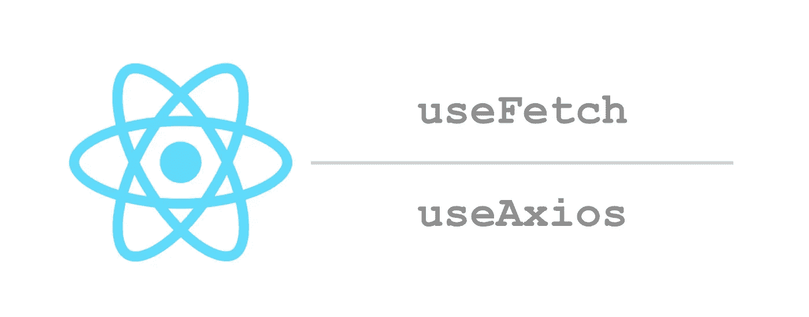

# 如何使用 useEffect 为数据提取创建 React 自定义挂钩

> 原文：<https://itnext.io/how-to-create-react-custom-hooks-for-data-fetching-with-useeffect-74c5dc47000a?source=collection_archive---------1----------------------->

## react-hooks-async 库简介



## 背景

React 16.8 增加了一个新的 API，Hooks。如果你还没有学会钩子，在继续这篇文章之前，去官方网站阅读整个文档。

[](https://reactjs.org/docs/hooks-intro.html) [## 介绍钩子-反应

### 钩子是 React 16.8 中的新增功能。它们允许您使用状态和其他 React 特性，而无需编写类。这个…

reactjs.org](https://reactjs.org/docs/hooks-intro.html) 

这篇文章是关于如何为数据获取创建定制钩子的。如[路线图](https://reactjs.org/blog/2018/11/27/react-16-roadmap.html)中所述，React 正计划在不久的将来发布 react-cache 和暂挂以获取数据。这将成为 React 中数据获取的标准方式，然而，在某些获取数据的生命周期与组件生命周期相同的用例中，使用 useEffect 获取数据仍然很有用。在这种用例中，缓存并不重要，我们可以安全地将获取的数据存储在组件本地状态中。

这篇文章描述了一个用于数据获取的自定义钩子的简单实现，它的局限性，一个关于可移植异步函数的 API 建议和为 API 实现的库。

## 一个天真的定制钩子

如果你对 React 钩子有很好的理解，下面这样的实现很容易实现。

```
const useFetch = (url) => {
  const [data, setData] = useState(null);
  useEffect(() => {
    (async () => {
      const res = await fetch(url);
      const data = await res.json();
      setData(data);
    })();
  }, [url]);
  return data;
};
```

注意，为了简单起见，这段代码中省略了错误处理和加载状态。

带有这个钩子的数据只存在于组件状态中，并且在组件被卸载时被丢弃。为了避免为卸载的组件设置状态，通常会引入一个如下所示的标志。

```
const useFetch = (url) => {
  const [data, setData] = useState(null);
  useEffect(() => {
    let mounted = true;
    (async () => {
      const res = await fetch(url);
      const data = await res.json();
      if (mounted) setData(data);
    })();
    const cleanup = () => { mounted = false; };
    return cleanup;
  }, [url]);
  return data;
};
```

这确实有效，但实际上并没有停止数据获取。如果我们真的能在浏览器中停止取数据就更好了。 [AbortController](https://developer.mozilla.org/en-US/docs/Web/API/AbortController) 启用它，代码如下。

```
const useFetch = (url) => {
  const [data, setData] = useState(null);
  useEffect(() => {
    let mounted = true;
    const abortController = new AbortController();
    (async () => {
      const res = await fetch(url, {
        signal: abortController.signal,
      });
      const data = await res.json();
      if (mounted) setData(data);
    })();
    const cleanup = () => {
       mounted = false;
       abortController.abort();
    };
    return cleanup;
  }, [url]);
  return data;
};
```

## 可移植异步函数的通用 API

让我们概括一下，让 AbortController 支持任何异步函数。我们定义了一个 API，它是一个在第一个参数中接收 AbortController 实例并返回一个承诺的函数。

使用这个 API，fetch 的实现如下:

```
// this is pseudo code
const abortableFetch = (url) => async (abortController) => {
  const res = await fetch(url, { signal: abortController.signal });
  const data = await res.json();
  return data;
};
```

类似地， [axios](https://github.com/axios/axios) 有一个不同的取消机制，可以这样实现:

```
// this is pseudo code
const abortableAxios = (url) => async (abortController) => {
  const source = axios.CancelToken.source();
  abortController.signal.addEventListener('abort', () => {
    source.cancel('canceled');
  );
  const { data } = await axios({ url, cancelToken: source.token });
  return data;
};
```

## *可移植异步函数的定制钩子*

我们现在用这个 API 创建自定义挂钩。有两个钩子；一个被称为`useAsyncTask`以准备一个准备启动的异步函数，另一个被称为`useAsyncRun`以实际启动它。由`useAsyncTask`返回的对象`task`包含异步函数的状态以及启动和中止它的方法。

## useAsyncTask 挂钩

现在，我们实现第一个钩子。除了异步函数的结果，我们还处理挂起状态和错误。

最初的`task`定义如下。

```
const initialTask = {
  started: false, // if this async function is started
  pending: true,  // if this async function is not finished
  error: null,    // error of this async function
  result: null,   // result of this async function
  start: null,    // a method to start this async function
  abort: null,    // a method to abort this async function
};
```

我们使用术语`pending`和`result`而不是`loading`和`data`，因为`task`不仅用于数据获取。

与用于`task`的 useReducer 一起使用的减速器定义如下。

```
const reducer = (task, action) => {
  switch (action.type) {
    case 'init':
      return initialTask;
    case 'ready':
      return {
        ...task,
        start: action.start,
        abort: action.abort,
      };
    case 'start':
      return {
        ...task,
        started: true,
      };
    case 'result':
      return {
        ...task,
        pending: false,
        result: action.result,
      };
    case 'error':
      return {
        ...task,
        pending: false,
        error: action.error,
      };
    default:
      throw new Error(`unexpected action type: ${action.type}`);
  }
};
```

有了以上这些，我们的定制钩子就实现了。

```
const useAsyncTask = (func, deps) => {
  const [state, dispatch] = useReducer(reducer, initialTask);
  useEffect(() => {
    let dispatchSafe = action => dispatch(action);
    let abortController = null;
    const start = async () => {
      if (abortController) return;
      abortController = new AbortController();
      dispatchSafe({ type: 'start' });
      try {
        const result = await func(abortController);
        dispatchSafe({ type: 'result', result });
      } catch (e) {
        dispatchSafe({ type: 'error', error: e });
      }
    };
    const abort = () => {
      if (abortController) {
        abortController.abort();
      }
    };
    dispatch({ type: 'ready', start, abort });
    const cleanup = () => {
      dispatchSafe = () => null; // avoid to dispatch after stopped
      dispatch({ type: 'init' });
    };
    return cleanup;
  }, deps);
  return state;
};
```

在这个实现中，我们简单地接收`deps`作为第二个参数，并将其传递给 useEffect。这是一个避免使用 [useMemo](https://reactjs.org/docs/hooks-reference.html#usememo) 的设计选择，对于语义保证不推荐使用。

## useAsyncRun 挂钩

第二个钩子相对容易实现。

```
const useAsyncRun = (asyncTask) => {
  const start = asyncTask && asyncTask.start;
  const abort = asyncTask && asyncTask.abort;
  useEffect(() => {
    if (start) start();
    const cleanup = () => {
      if (abort) abort();
    };
    return cleanup;
  }, [start]);
};
```

这个钩子不是必须使用的。您可以在事件回调中调用 task 对象中的 start 和 abort 方法。参考:[例](https://github.com/dai-shi/react-hooks-async/tree/master/examples/03_startbutton)。

## useFetch 挂钩

基于上面描述的两个钩子，我们可以实现`useAsyncTaskFetch`和`useFetch`。

```
const defaultInit = {};
const defaultReadBody = body => body.json();

const useAsyncTaskFetch = (
  input,
  init = defaultInit,
  readBody = defaultReadBody,
) => useAsyncTask(
  async (abortController) => {
    const response = await fetch(input, {
      signal: abortController.signal,
      ...init,
    });
    if (!response.ok) {
      throw new Error(response.statusText);
    }
    const body = await readBody(response);
    return body;
  },
  [input, init, readBody],
);

const useFetch = (...args) => {
  const asyncTask = useAsyncTaskFetch(...args);
  useAsyncRun(asyncTask);
  return asyncTask;
};
```

useAxios 挂钩也可以类似地实现。参考:[代码](https://github.com/dai-shi/react-hooks-async/blob/master/src/use-async-task-axios.js)。

## 演示

## react-hooks-异步库

本文中描述的钩子的实现可以作为一个库获得。

[](https://github.com/dai-shi/react-hooks-async) [## 戴式/反应式挂钩异步

### 一个带有 React Hooks 的异步函数库

github.com](https://github.com/dai-shi/react-hooks-async) 

这个库不仅仅是为了获取数据。它为可移植的异步函数和一些实用函数提供了一个通用的 API。一个值得注意的用例是提前输入搜索。查看回购中的示例以了解更多信息。

## 最后的想法

使用 useEffect 获取数据有很多建议和实现，React 可能会正式提供一个。自己实现一个是可能的，但不是微不足道的。从各种库中选择一个也不是小事。我希望这篇文章有助于理解如何用钩子实现可移植的 fetch。我期待着任何关于 Twitter 或 GitHub 问题库的反馈。