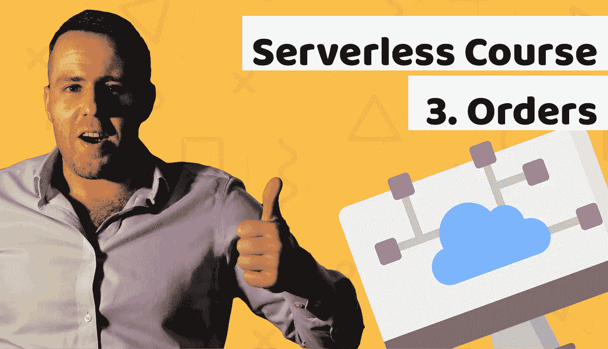

# 如何用 Node.js、MongoDB 和 AWS Lambda 创建无服务器 REST API

> 原文：<https://itnext.io/how-to-create-serverless-rest-api-with-node-js-mongodb-and-aws-lambda-18167fbc4b54?source=collection_archive---------3----------------------->



# 无服务器课程简介第 3 课

今天您将学习如何在 Node.js 中创建 MongoDB REST API。

在无服务器课程的前几期中，您已经学习了如何设置 AWS Lambda 无服务器项目。
网址如下:

[https://www . blog . duomly . com/lesson-1-无服务器-入门指南/](https://www.blog.duomly.com/lesson-1-serverless-how-to-get-started-tutorial/)

在第二课中，您已经学习了如何使用 Node.js 和 MongoDB 创建 AWS Lambda 无服务器身份验证，URL 如下:

[https://www . blog . duomly . com/lesson-2-server less-authentic ation/](https://www.blog.duomly.com/lesson-2-serverless-authentication/)

我对我们将要构建的内容感到非常兴奋，因为我们将在今天的课程中继续学习，开发更多功能。

SaaS 应用程序最重要的部分之一是下订单，这也是我们今天要做的。

我们将学习如何创建订单，如何更新订单，如何在无服务器框架中处理 API 端点，以及如何保护它们。

开始吧！

如果你喜欢视频，这是 youtube 的版本:

# 将 AuthenticationHelpers.js 中的 signJWT 更改为 module.exports.signJWT

因为在上一课中我忘记了更改它，所以现在我们应该进入 AuthenticationHelpers.js 文件，将“this”更改为“module.exports”。

让我们看看整个函数“verifyPassword”应该是什么样子:

```
module.exports.verifyPassword = (sentPassword, realPassword, userId) => {
  return bcrypt.compare(sentPassword, realPassword)
    .then(valid => !valid ? Promise.reject(new Error('Incorrect password or username')) : module.exports.signJWT(userId)
  );
}
```

# 将 createdAt 添加到 User.js 并注册函数

为了使所有数据透明，我们应该知道用户是何时创建的。

我们需要将“createdAt”字段添加到 User.js 文件中的用户模型中。

```
const mongoose = require('mongoose');const UserSchema = new mongoose.Schema({  
  name: String,
  email: String,
  password: String,
  premium: Boolean,
  premiumEnds: Date,
  createdAt: Date,
});
mongoose.model('User', UserSchema);module.exports = mongoose.model('User');
```

接下来，我们应该进入 AuthenticationHandler.js 文件，进入 register 函数，并添加该字段。

```
function register(body) {
  return validRegistration(body)
    .then(() => User.findOne({ email: body.email }))
    .then(exists => exists ? Promise.reject(new Error('User exists')) : bcrypt.hash(body.password, 8))
    .then(hashedPass => User.create({ name: body.name, email: body.email, password: hashedPass, premium: false, createdAt: new Date()}))
    .then(user => ({ auth: true, token: signJWT(user._id) })); 
}
```

# 如何创建 MongoDB 模型

好了，现在我们可以开始开发新功能了。

我们应该做的第一步是在名为“Order”的目录中创建 Order.js 文件。

接下来，我们应该为订单创建一个 MongoDB 模型。

```
const mongoose = require('mongoose');const OrderSchema = new mongoose.Schema({  
  userId: String,
  status: String,
  amount: Number,
  createdAt: Date,
});
mongoose.model('Order', OrderSchema);module.exports = mongoose.model('Order');
```

# 将 createOrder 处理程序添加到 serverless.yml 中

下一步，我们应该进入 serverless.yml 并在其中定义第一个 AWS Lambda 函数。

定义名为“createOrder”的 AWS Lambda 函数，并传递“order/OrderHandler.create”作为处理程序。

接下来，使用“verify-jwt”授权器保护该功能。

```
createOrder:
  handler: order/OrderHandler.create
  events:
    - http:
        path: order/create
        method: post
        cors: true
        authorizer: verify-jwt
```

# 将 myOrders 添加到 serverless.yml 中

我们应该在 serverless.yml 文件中再添加一个东西。

事情是“myOrders”函数，用“myOrders”作为处理程序的名称。

JWT 仍然是那里的验证者。

无论如何，记住改变端点的路径。

```
myOrders:
  handler: order/OrderHandler.myOrders
  events:
    - http:
        path: order/my
        method: get
        cors: true
        authorizer: verify-jwt
```

# 创建订单处理程序

太好了！现在，我们可以进入处理程序，通过 AWS Lambda 函数和 API 端点来处理 Node.js 逻辑。

作为第一步，您应该在“order”目录中创建一个文件“OrderHandler.js”。

创建文件后，我们应该导入数据库、订单、成功和 errResponse 函数。

看看下面的例子:

```
const db = require('../database');
const Order = require('./Order');
const { success, errResponse } = require('../authentication/AuthenticationHelpers');
```

# 创建要创建的处理程序和函数

在下一步中，我们处理创建订单端点。

我们可以通过创建函数处理程序来做到这一点，这一点非常重要，因为 node.js 导出了. module，所以 serverless 将能够导入功能并推入 AWS Lambda 函数。

```
module.exports.create = (r, cb) => {
  cb.callbackWaitsForEmptyEventLoop = false;
  return db()
    .then(() => create(JSON.parse(r.body), r.requestContext.authorizer.principalId))
    .then(res => success(res))
    .catch(err => errResponse(err));
};
```

接下来，我们需要创建一个函数，该函数包含负责在 MongoDB 数据库中创建订单的逻辑:

```
function create(body, id) {
  return Order.create({userId: id, status: 'pending', amount: body.amount, createdAt: new Date()});
}
```

# 为更新创建处理程序和函数

在这一步中，我们应该为“更新”特性创建一个导出的模块。

我们没有将它添加为 AWS Lambda 函数和端点，因为我们不想将其公开。

只有我们的应用程序能够调用该逻辑，并且只有在通过一些条件之后，比如支付是否成功执行。

让我们看看我们应该创建的 Node.js 模块:

```
module.exports.update = (r, cb) => {
  cb.callbackWaitsForEmptyEventLoop = false;
  return db()
    .then(() => update(JSON.parse(r.body)))
    .then(res => success(res))
    .catch(err => errResponse(err));
};
```

我们现在应该创建包含“更新”模块逻辑的函数:

```
function update(body) {
  return Order.findByIdAndUpdate(body.id, body, { new: true })
}
```

# 为 myOrders 创建处理程序和函数

好了，我们几乎完成了无服务器节点。JS REST API。

我们应该创建的最后一个逻辑是与我的订单相关的逻辑。

该逻辑将通过查看用户 Id 字段与从 JWT 令牌编码的用户 id 字段相同的订单来搜索我们的订单。

为此，我们需要两部分。第一个是导出的模块:

```
module.exports.myOrders = (r, cb) => {
  cb.callbackWaitsForEmptyEventLoop = false;
  return db()
    .then(() => myOrders(r.requestContext.authorizer.principalId))
    .then(res => success(res))
    .catch(err => errResponse(err));
};
```

第二部分是与数据库相关的逻辑:

```
function myOrders(id) {
  return Order.find({userId: id})
    .then(orders => !orders.length ? Promise.reject('Orders not found.') : orders)
    .catch(err => Promise.reject(new Error(err)));
}
```

# 如何在 Node.js 中测试 MongoDB REST API

呜哇！您已经创建了下一个 SaaS 应用程序功能，您的订单已经准备好了！

现在，我们可以进入测试阶段。

有两种方法来测试我们的无服务器应用程序。

第一个是将应用程序部署到 AWS 基础设施中，并在 live API 上进行测试，这对您来说是一个很好的体验。

如果您想将所有应用程序部署到 AWS 云中，您需要配置 AWS CLI，这将创建整个 AWS 基础架构，所以记得仔细检查您的设置、区域等。

为此，您只需打开终端并键入:

`sls deploy`

还有我喜欢的第二种方法，它提高了我的开发时间，因为我可以在本地启动应用程序。

这非常好，尤其是当您计划调试您的应用程序时，因为您可以放置 console.logs，它将在您触发一些端点时显示消息。

当你想知道数据是如何进入我们的应用程序，或者是如何出去的时候，这是非常方便的。

如何在本地启动应用程序我在之前的课程中已经告诉过你如何使用代码。

# 关于如何在 Node.js 中创建 MongoDB REST API 的总结

恭喜你！你的 AWS Lambda SaaS 应用程序现在看起来更先进了！

您已经学习了如何创建订单，如何创建 MongoDB 模型，如何在 MongoDB 和 Node.js 中更新项目，以及如何在 Node.js 中创建 AWS Lambda 函数。

我为你所建立的一切感到非常自豪，希望你能从今天的课程中获益良多。

记得订阅我们的频道，以立即获得有关新课的通知！

如果你想检查你的代码是否正确，这里是今天课程的网址:

[https://github . com/Duomly/AWS-server lesss-nodejs/tree/server less-course-less-lesson-3](https://github.com/Duomly/aws-serverlesss-nodejs/tree/serverless-course-lesson-3)


[二进制编程课程](https://www.duomly.com)

感谢您的阅读，
来自 Duomly 的 Radek