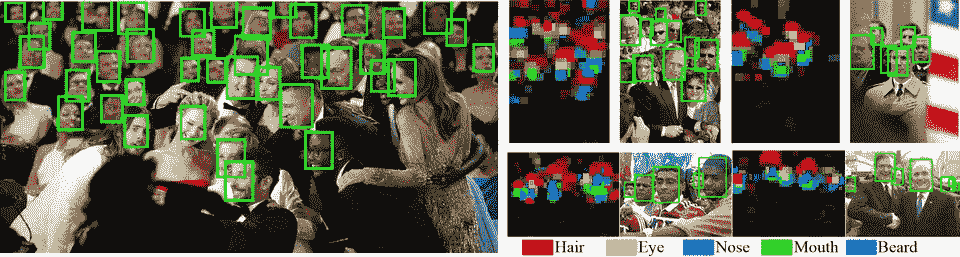
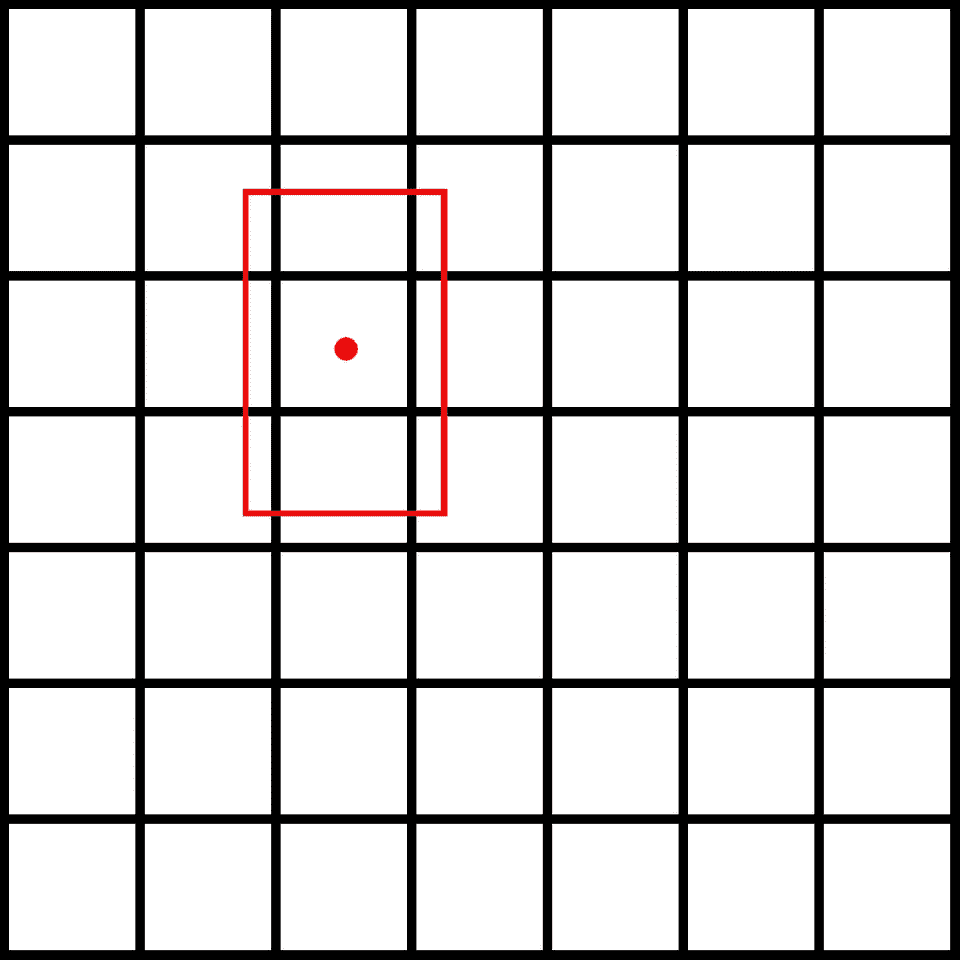

# 如何从头开始创建 Tensorflow 2 序列数据集

> 原文：<https://itnext.io/how-to-create-tensorflow-2-sequence-dataset-from-scratch-aaf9f1903f20?source=collection_archive---------3----------------------->



# 问题是

现代机器学习解决方案需要大量的数据，在处理图像识别/对象检测时肯定是这种情况。因此，我们需要创建越来越复杂的数据集来教授我们的模型。此时，我们无法将全部内容存储在内存中(有时甚至硬盘也会出现问题)，Tensorflow 的**数据集**通常无法直接读取该数据集的描述。这就是为什么我们需要创建一个现代的解决方案，使用序列以易于理解的方式处理和预处理大量的数据。

> **:**
> 
> **这里有一个代码:*[*https://gist . github . com/burn piro/c 3835 a 1 f 914545 f 2034 f 4190 B1 e 83153*](https://gist.github.com/burnpiro/c3835a1f914545f2034f4190b1e83153)*
> 
> **使用序列使数据集可维护且快速。**

# *顺序是什么？*

*根据文件，顺序是:*

> ****基对象用于拟合一系列数据，如数据集。****

*使用 [**序列类**](https://github.com/tensorflow/tensorflow/blob/r2.0/tensorflow/python/keras/utils/data_utils.py#L331-L406) 创建序列对象。最棒的是我们可以扩展它。每个序列必须实现 3 个方法:*

*   *`__getitem__` -用于从数据集中提取项目*
*   *`__len__` -返回数据集的长度*
*   *`__init__` -初始化我们的数据集(这不是必需的，但我们需要某种初始化)*

*Sequence 允许我们创建复杂的数据集，甚至通过实现`on_epoch_end`在每个时期结束时修改它们。我们将只关注这三种方法，但是如果你能玩`on_epoch_end`。*

# *我们的测试数据集*

*在我们的例子中，我们将使用更宽的人脸数据集*

> **指令如何获取数据集是* [*这里是*](https://github.com/burnpiro/tiny-face-detection-tensorflow2#dataset)*

*该数据集包含超过 32k 的图像，重量约为 2GB，因此我们并不真的希望一直将它保存在内存中。该数据集用于教导对象检测模型，因此它包含图像上每个面的边界框。*

## *数据结构*

*数据集已经被分割成**训练**和**验证**，所以我们不必再做一遍。我们有两个文件夹: **WIDER_train** 和 **WIDER_val** 。图像描述存储在`wider_face_train_bbx_gt.txt`和`wider_face_val_bbx_gt.txt`中。这是其中一张图片的例子*

**

*`.txt`文件中的图像描述如下:*

```
*22--Picnic/22_Picnic_Picnic_22_277.jpg 
3 
196 410 74 114 1 0 0 0 0 0 
344 404 62 88 1 0 0 0 0 0 
634 222 58 86 1 0 0 0 0 0*
```

*乍一看可能不清楚，但数据集的自述文件中解释了一切:*

```
*File name 
Number of bounding box 
x1, y1, w, h, blur, expression, illumination, invalid, occlusion, pose*
```

*所以我们的图像包含 3 个盒子。前两个数字是 X 和 Y 坐标，后面是框的宽度和高度。在此之后，我们有了更多关于盒子里面的人脸的信息，我们不打算使用这些信息，因为我们的目标只是物体检测(人脸检测),但请随意检查自述文件中的属性描述。*

## *模型的输入和输出*

*现在，在我们知道了数据集的样子之后，我们需要弄清楚什么是我们的**模型**的输入和输出。*

> *如果你愿意，可以跳过这一部分。除了知道模型的输入和输出大小之外，没有必要知道任何东西来构造训练示例。*
> 
> *输入— **224x224x3***
> 
> *输出— **7x7x5***
> 
> *依我看，理解它是有益的，但不是必需的。我选择了这个模型，因为大多数指南都使用回归网络中的简单例子，很难找到复杂例子的解决方案。*

*对于这个例子，我们将使用 **MobileNetV2** (准确地说是`mobilenet_v2_0.75_224`)，我们的模型的输入大小为 **224x224x3** (宽 x 高 x RGB)。所以我们句子中的每个例子都必须产生这样大小的输入。*

*另一方面，产量完全取决于我们。我们使用 MobileNet 作为特征提取器，从最后一个 Conv 层得到输出。我们希望保持 7x7 网格，并且我们的检测只需要每个网格 5 个值(因为我们只有一个类)。最终，我们的输出应该看起来像 **7x7x5** (网格宽度 x 网格宽度 x 类的数量乘以 5)。*

*我不打算讨论这个网络是如何工作的，你可以很容易地找到任何关于 CNN 以及如何使用它们作为对象检测的特征提取器的教程(也许将来会有其他指南)。*

*这是我们的模型最后的样子:*

```
*____________________________________________________________________
Layer (type) Output Shape Param # Connected to ====================================================================
input_1 (InputLayer) [(None, 224, 224, 3) 0 ________________________________________________________________________ ----- Rest of MobileNetV2 ------ ____________________________________________________________________
block_16_project_BN (BatchNorma (None, 7, 7, 240) 960 ____________________________________________________________________
----- Our Layers conected to MobileNet output------ ____________________________________________________________________
conv2d_2 (Conv2D) (None, 7, 7, 5) 1205*
```

*现在应该很清楚，我们的数据集应该生成如下示例:*

*   *输入— **224x224x3***
*   *输出— **7x7x5***

# *扩展序列类*

```
*# Data generator boilerplace
class DataGenerator(tf.keras.utils.Sequence): def __init__(self, file_path, config_path, debug=False):
        # Sequence initialization

    def __len__(self):
        # Should return Sequence length def __getitem__(self, idx):
        # Returns preprocessed data*
```

## *初始化*

*我们需要实现的第一件事是数据初始化。*

```
*def __init__(self, file_path, config_path, debug=False):
        # Sequence initialization*
```

*因为数据集描述位于两个不同的文件中(一个用于训练，一个用于验证)，所以我们需要传递图像文件夹的路径(`file_path`)和数据集规范的路径(`config_path`)。`debug`选项允许我们在处理数据集时显示附加信息。*

*在`__init__`方法中，我们可以访问`self`对象。这个对象代表我们的序列，我们想在它上面初始化一些默认值。*

```
*self.boxes = []
self.debug = debug
self.data_path = file_path*
```

*   *`self.boxes`将存储数据集中的所有箱子定义*
*   *`self.debug`启用**调试**模式*
*   *`self.data_path`存储图像的路径，供以后处理*

*初始化之后，我们需要检查路径是否有效(如果无效，就没有理由创建序列)。*

```
*if not os.path.isfile(config_path):
    print("File path {} does not exist. Exiting...".format(config_path))
    sys.exit()

if not os.path.isdir(file_path):
    print("Images folder path {} does not exist. Exiting...".format(file_path))
    sys.exit()*
```

*当一切正常时，我们可以开始读取配置文件*

```
*with open(config_path) as fp:
    image_name = fp.readline()
    cnt = 1
    while image_name:
        # image_name - relative path to our image
        # in this loop we have to process each image definition*
```

*我们将逐行读取该文件，但正如您所记得的，该文件是以一种特定的方式构建的:*

```
*File name
Number of bounding box
x1, y1, w, h, blur, expression, illumination, invalid, occlusion, pose*
```

*因此，在读取了**文件名**和**边界框编号**后，我们需要使用该编号来了解要读取多少行作为边界框定义。*

```
*with open(config_path) as fp:
    image_name = fp.readline()
    cnt = 1
    while image_name:
        num_of_obj = int(fp.readline())
        for i in range(num_of_obj):
            obj_box = fp.readline().split(' ')
            x0, y0, w, h = get_box(obj_box)
            if w == 0:
                # remove boxes with no width
                continue
            if h == 0:
                # remove boxes with no height
                continue
            self.boxes.append((image_name.strip(), x0, y0, w, h))
        image_name = fp.readline()
        cnt += 1*
```

*我们在`while`循环中要做的第一件事是提取有多少个盒子。为此，我们调用`int(tf.readline()`，它将下一行的值作为一个整数返回。我们使用这个数字来迭代接下来的`num_of_obj`行。每行值由一个空字符串分隔，因此我们必须在处理`obj_box = fp.readline().split(' ')`之前分割值。我们感兴趣的是每行的前 4 个值，但这些值必须是整数。要提取这些值，创建一个辅助函数`get_box`更容易:*

```
*# Input: [x0, y0, w, h, blur, expression, illumination, invalid, occlusion, pose]
# Output: x0, y0, w, h
def get_box(data):
    x0 = int(data[0])
    y0 = int(data[1])
    w = int(data[2])
    h = int(data[3])
    return x0, y0, w, h*
```

*这个函数接收一个字符串列表，并返回我们需要的 4 个整数。之后，我们将我们的盒子附加到序列对象`self.boxes.append((image_name.strip(), x0, y0, w, h))`并读取下一行。*

*一切看起来都很好，我们应该准备好进入下一部分，但是如果我们试图执行这段代码，它将会失败。*

```
*ValueError: invalid literal for int( ) with base 10: '0--Parade/0_Parade_Parade_0_630.jpg\n'*
```

*我们在代码中犯了错误吗？不，我们没有。我们只是没有足够仔细地探索我们的数据集。如果我们跳到我们的**。txt** 文件，找到那句话的那一行，刚刚发生的事情就清楚多了。*

```
*0--Parade/0_Parade_Parade_0_452.jpg
0
0 0 0 0 0 0 0 0 0 0 
0--Parade/0_Parade_Parade_0_630.jpg*
```

*我们没有预料到会有没有脸的图像，因为我们的迭代是如何设计的，所以在阅读完`num_of_obj = 0`后不会跳过有零的行。知道我们可以在 for 循环之后创建一个快速修复:*

```
*if num_of_obj == 0:
    obj_box = fp.readline().split(' ')
    x0, y0, w, h = get_box(obj_box)
    self.boxes.append((image_name.strip(), x0, y0, w, h))*
```

*这样，当图像上没有人脸时，我们将创建一个空示例。*

## *数据集的返回长度*

*这应该很容易…但并不容易:)在实现`__len__`方法时，我们需要记住训练是分批进行的。因此，我们必须将盒子的数量除以我们的批量大小，并返回它，而不仅仅是数组的长度。*

```
*def __len__(self):
    return math.ceil(len(self.boxes) / cfg.TRAIN.BATCH_SIZE)*
```

*注意，我们使用了一个神秘的配置，叫做`cfg`。这只是一个保存我们数据集设置的`EasyDict`字典。你现在不用担心它，我会在最后给你看它的定义。现在，假设它存储了所有的配置值。*

## *退回物品*

*到目前为止，我们已经成功创建了我们的序列，但我们仍然没有定义如何处理数据集中的图像。序列中的每个框有 5 个值:*

*   *图像路径*
*   *框中心的 x 值*
*   *框中心的 y 值*
*   *盒子宽度*
*   *盒子高度*

*`__getitem__(self, idx)`方法应该返回两个值(输入，输出)。但是因为我们是成批工作的，这些值将是包含多个图像和相应方框的数组。*

```
*def __getitem__(self, idx):
    boxes = self.boxes[idx * cfg.TRAIN.BATCH_SIZE:(idx + 1) * cfg.TRAIN.BATCH_SIZE]*
```

*首先，我们必须从给定的 **idx** 到 **idx + BATCH_SIZE** 中提取盒子定义。因此，如果我们的 **BATCH_SIZE** 是 **16** 并且 **idx** 是 **0** ，那么我们正在处理从 **0** 到 **16** 的箱子。*

*现在我们必须为输入和输出定义零矩阵*

```
*batch_images = np.zeros((len(boxes), cfg.NN.INPUT_SIZE, cfg.NN.INPUT_SIZE, 3), dtype=np.float32)
batch_boxes = np.zeros((len(boxes), cfg.NN.GRID_SIZE, cfg.NN.GRID_SIZE, 5), dtype=np.float32)*
```

*   *`batch_images`包含图像，大小为 **16x224x224x3** 。*
*   *`batch_boxes`包含网格中的预期输出，大小为 **16x7x7x5** 。*

*现在我们必须迭代我们的批处理并处理每个例子。*

```
*for i, row in enumerate(boxes):
    path, x0, y0, w, h = row*
```

*首先，我们必须从图像路径创建一个输入。为此，我们将使用`tf.keras.preprocessing.image.load_img`。*

```
*proc_image = tf.keras.preprocessing.image.load_img(self.data_path + path)

image_width = proc_image.width
image_height = proc_image.height

proc_image = tf.keras.preprocessing.image.load_img(self.data_path + path,
                                               target_size=(cfg.NN.INPUT_SIZE, cfg.NN.INPUT_SIZE))

proc_image = tf.keras.preprocessing.image.img_to_array(proc_image)
proc_image = np.expand_dims(proc_image, axis=0)
proc_image - tf.keras.applications.mobilenet_v2.preprocess_input(proc_image)

batch_images[i] = proc_image*
```

*对于每个图像，我们需要提取原始的宽度和高度，以便能够缩放盒子的 x0，y0，w，h。这就是为什么我们调用这个方法两次(第二次将`target_size`设置为 **224x224** )。最后，我们处理后的图像存储在`batch_images`中。*

*接下来，我们必须处理盒子的位置和大小。原始值是整数，代表原始图像上的一个点。我们需要做的是将它们换算成 **< 0，1 >** 值。这就是为什么我们需要原图中的`image_width`和`image_height`。*

```
 *image_width = proc_image.width
    image_height = proc_image.height

    # make sure none of the points is out of image border
    x0 = max(x0, 0)
    y0 = max(y0, 0)

    x0 = min(x0, image_width)
    y0 = min(y0, image_height)

    x_c = (cfg.NN.GRID_SIZE / image_width) * x0
    y_c = (cfg.NN.GRID_SIZE / image_height) * y0

    floor_y = math.floor(y_c)  # handle case when x i on the corner
    floor_x = math.floor(x_c)  # handle case when y i on the corner

    batch_boxes[i, floor_y, floor_x, 0] = h / image_height
    batch_boxes[i, floor_y, floor_x, 1] = w / image_width
    batch_boxes[i, floor_y, floor_x, 2] = y_c - floor_y
    batch_boxes[i, floor_y, floor_x, 3] = x_c - floor_x
    batch_boxes[i, floor_y, floor_x, 4] = 1*
```

*这部分应用额外的验证来确保我们的点位于图像内部。除了我们计算那个点相对于它所在的网格单元的位置。*

**

*此点的默认值可能是:*

*   *x = 0.35(相对于左上角)*
*   *y = 0.35(相对于左上角)*

*但是我们的输出需要相对于网格单元(包含点的单元)的位置。因为新的坐标如下:*

*   *x = 0.5(相对于单元格左上角)*
*   *y = 0.5(相对于单元格左上角)*

*最后，我们将这些值保存在第 I 个输出和 3x3 网格单元中(其余的保持为零)。请注意，盒子的**宽度**和**高度**仍然按比例缩放到完整图像。*

*在我们处理完批处理中的所有例子后，我们只需要返回两个数组*

```
*return batch_images, batch_boxes*
```

*要使用我们的生成器，只需创建它的一个实例并传递正确的路径*

```
*train_datagen = DataGenerator(file_path=cfg.TRAIN.DATA_PATH, config_path=cfg.TRAIN.ANNOTATION_PATH)
val_generator = DataGenerator(file_path=cfg.TEST.DATA_PATH, config_path=cfg.TEST.ANNOTATION_PATH, debug=False)*
```

*现在我们可以将数据用于训练*

```
*model.fit_generator(generator=train_datagen,
                        epochs=cfg.TRAIN.EPOCHS,
                        callbacks=[# your callbacks for TF],
                        shuffle=True,
                        verbose=1)*
```

*以下是**数据生成器**类的完整代码:[https://gist . github . com/burn piro/c 3835 a 1 f 914545 f 2034 f 4190 B1 e 83153](https://gist.github.com/burnpiro/c3835a1f914545f2034f4190b1e83153)*

# *摘要*

*如果您正在处理复杂的数据集(或非常大的数据集)，那么考虑序列并为数据生成创建自己的序列类是一个好主意。它高效(开箱即用的多线程)且易于维护，尤其是在与工程师和版本控制团队合作时。*

*这段代码只是一个例子，您的实现可能看起来有所不同。一切都取决于特定的问题和数据集的结构，但我认为在类内定义数据处理比使用 Tensorflow 指南中的类似 C 的方法要容易得多。*

*新年快乐，2020 年再见！！！*

**最初发布于*[*https://erdem . pl*](https://erdem.pl/2019/12/how-to-create-tensorflow-2-sequence-dataset-from-scratch)*。**