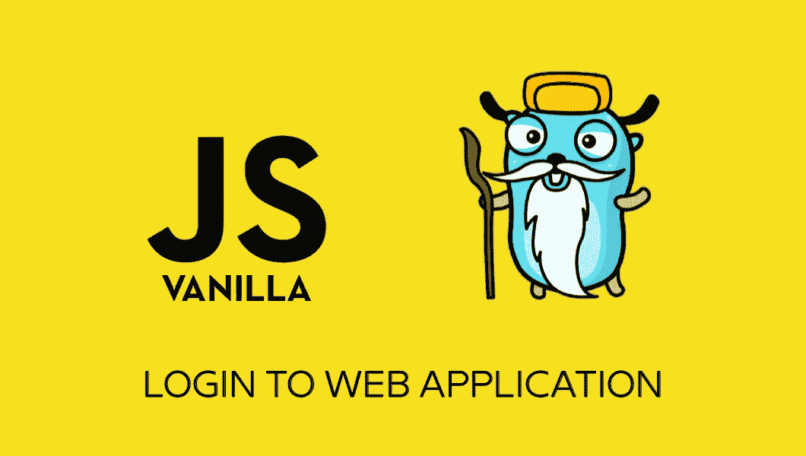
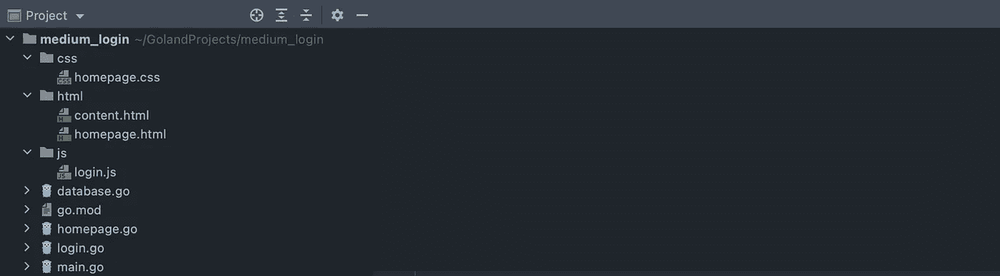
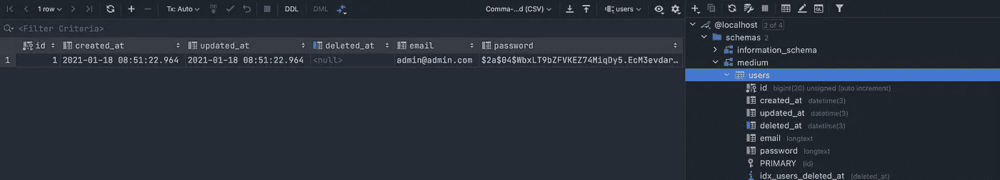
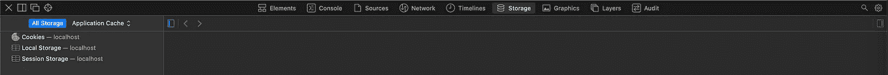
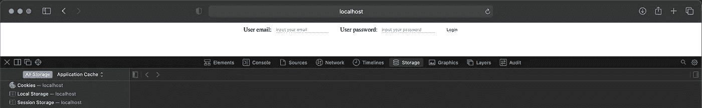
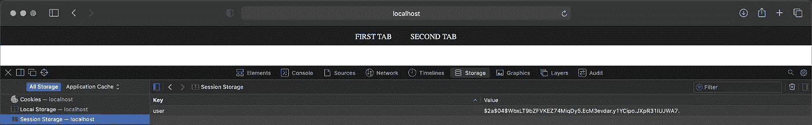

# 如何使用 JS 前端和 Go 后端创建 web 应用程序登录

> 原文：<https://itnext.io/how-to-create-web-application-login-with-js-frontend-and-go-backend-f6709056ee2?source=collection_archive---------2----------------------->

## 数据库通信的完整示例



由 Renee French 创建的原始地鼠图像，使用由 Maria Letta 创建的地鼠图像

本文将向您展示一种处理 web 应用程序登录的技术。

有许多不同的方法，如何处理这个问题，那么你为什么会选择读这一个呢？

**这篇文章是给你的，如果……**

*   …您是一名围棋开发者，或者正在考虑从围棋开始
*   …你是一名 web 开发人员，希望看到另一种做事方式
*   …你喜欢成为一名 web 开发人员，并且正处于学习阶段
*   …您正在寻找一个快速且易于理解的解决方案
*   …您正在寻找一个完整的登录解决方案:前端、后端和数据库通信

**本文使用两种主要语言:** Javascript 用于前端，Go 用于后端。所有代码都是用 Goland IDE 写的。Docker 将用于运行一个 MariaDB 数据库。

要阅读更多关于 Javascript 组合的内容，请点击这里。

[](https://medium.com/swlh/create-go-service-the-easy-way-de827d7f07cf) [## 以简单的方式创建 Go 服务

### 适用于 Windows、Linux、MacOS 和 Docker

medium.com](https://medium.com/swlh/create-go-service-the-easy-way-de827d7f07cf) 

# 创建项目

打开 Goland 并使用 Go 模块创建新项目。将其命名为 **medium_login** 并创建三个新目录 **: css、html 和 js。**创建适当的文件，如屏幕截图所示。



在 Docker 中启动 mariadb 数据库。

```
docker run --name mariadb -e MYSQL_ROOT_PASSWORD=password -p 3306:3306 -v mariadb_data:/var/lib/mysql -d mariadb:latest
```

## 后端的基础

切换到 **main.go** 并用下面的代码更新这个文件。这段代码在本文开头的链接中有适当的描述。快速:这段代码将启动一个 web 服务器，作为一个服务，在`http://localhost`为**homepage.html**服务。

**有三个特殊的东西:**两个数据库连接变量(稍后会详细介绍)、函数`CheckDatabase()`和一个用于检查登录的端点:`router.POST(“/check_login”, checkLogin)`。

现在切换到**主页，进入**并在下面插入代码。这个功能`homepage()`只是服务于**homepage.html**文件。

## 最基本的，在前端

切换到 **homepage.css** 并用一些样式更新这个文件。

然后切换到**homepage.html**，用下面的代码更新文件。

这里有两件值得注意的事情:`<div>`带有`id=”content”`和`visibility: hidden`样式参数。

这个`content`将在用户成功登录到应用程序后用正确的 html 更新，这个`visibility`将被 se 到`visible`。开始使用`hidden`的原因是为了**防止在重新加载页面时**闪烁。

现在用下面的代码更新 content.html。成功登录后，该代码将用`id=”content”`替换`<div>`。

如果你想知道更多关于这个*内容技术*的信息，请查看这个链接。

[](https://medium.com/swlh/how-to-create-spa-with-less-than-20-lines-of-javascript-code-814d1556dd9a) [## 如何用不到 20 行 Javascript 代码创建 SPA

### 使用 Go 作为后端

medium.com](https://medium.com/swlh/how-to-create-spa-with-less-than-20-lines-of-javascript-code-814d1556dd9a) 

## 添加数据库功能

切换到**数据库。转到**并在下面添加代码。这段代码需要更多解释。这个文件中的主要函数是`CheckDatabase()`。你已经在 **main.go** 看到了。

该功能主要做三件事:

*   函数检查 MariaDB 实例的可用性
*   函数检查名为`medium`的数据库
*   对名为`User`的表进行函数检查
*   函数使用散列密码`54321`创建用户`admin`

你可以浏览代码，看看它在做什么，每一部分都用适当的打印到控制台来描述，所以你可以在运行时看到，正在运行的是什么。

***边注:*** *当我们在创建新的数据库时，需要连接到已经存在的数据库，在本例中就是 mysql。这就是****main . go****中有两个连接字符串的原因。*

运行代码后(不是现在)，您可以检查数据库。创建了包含一个默认用户的适当表格，如下图所示。



## 添加前端功能

切换到 **homepage.js** ，用下面的代码更新。前四行是用来访问项目的，我们需要:两个输入字段，一个按钮和我们讨论过的`content`。

我们将使用会话存储来存储关于用户登录的信息。你可以在你的开发者工具中找到这个会话存储，就像下面的截图，这里暂时没有存储任何东西。



在这四个变量添加代码之后，当它寻找一个名为`“user”`的条目时，就检查这个会话存储。

如果什么都没有找到，我们打开可见性，用户就会尝试登录。如果发现了某些东西，则通过使用`verifyUser()`函数将这些东西发送到后端进行验证。

这个`verifyUser()`函数也作为监听器添加到我们唯一的按钮中。代码如下。

现在来看那个`verifyUser()`函数。这个函数从页面获取所有必要的数据:来自这两个输入字段的数据和来自那个会话存储的数据。然后它通过请求`/check_login`发送这些数据。

**可能会发生三种情况:**

*   用户已验证。我们将存储会话设置为适当的数据，最重要的是，我们用下载的数据更改内容
*   用户未经验证。我们只将信息打印到控制台(在现实世界中，将这些信息提供给用户会更好)
*   沟通有问题。我们只能通过将它打印到控制台来处理这个错误

## 添加后端功能

切换到 **login.go** 并在下面添加代码。这是我们这里最长的一段代码，原因很简单:我们想要处理所有可能的选项和错误。

导入适当的模块后，您会看到这里有两个结构。第一个用于传入数据(这些数据在 **homepage.js** 中)，第二个用于传出数据。

然后我们得到了一个名为 **checkLogin()** 的长函数。这个函数首先尝试对来自浏览器的数据进行编码。如果出现错误，我们会记录错误并将此信息发送回浏览器。

然后我们检查`data.UserSessionStorage.`

**如果有什么东西**，那就意味着这个东西已经存储在 sessionStorage 中了。在这种情况下，我们将这些数据与数据库进行比较。两种结果:匹配或不匹配。

**如果没有**，表示用户第一次打开该页面。然后代码用数据库检查`UserEmail`和`UserPassword`。同样，两种结果:匹配或不匹配。

在这两种情况下，我们都将适当的信息发送回页面。

对于密码操作，我们使用的是 Go 内置的`crypto`模块。对于数据库通信，我们使用的是`gorm`模块。

# 最后试验

我们完了。运行程序(别忘了设置成包模式)，在 [http://localhost](http://localhost) 打开浏览器。在第一次运行时，您将看到会话存储为空，页面要求您登录。



如果你尝试输入一些随机的东西，你会看到——在后台——程序在做什么。在这种情况下，用户不匹配。也不应该。

```
Verifying user started for sds:dsds:
Session storage empty
Password/email not empty
2021/01/18 09:53:27 crypto/bcrypt: hashedSecret too short to be a bcrypted password
User does not match
```

但是如果你用密码`54321`输入正确的`admin@admin.com`，你会看到一些不同的东西。这次用户匹配。这是应该的。

```
Verifying user started for [admin@admin.com](mailto:admin@admin.com):54321:
Session storage empty
Password/email not empty
User matches
```

当然，你放入我们的**content.html**文件中的内容都会改变。此外，该会话存储现在是**而不是**空的。



# 附加说明

如果您刷新页面，您将看到您仍处于登录状态。

如果你在这个标签页中访问了其他地方，比如 www.google.com 的，然后返回，你会看到你仍然处于登录状态。

原因很简单:会话存储保存该特定选项卡的信息，直到该选项卡被关闭。

尝试在新标签页中打开网页。您将再次被要求输入用户名和密码，因为该选项卡的会话存储中没有保存任何内容。

# 摘要

如果你阅读，使用和测试它，你知道…

*   知道，如何在 Go 中构建 web 服务器
*   知道如何根据请求从后端动态下载内容
*   知道如何用用户登录来更新你的应用程序
*   知道，如何在后端验证用户数据
*   知道如何直接从代码中创建数据库、表格和表格数据

[](https://github.com/petrjahoda/medium_login) [## petrjahoda/medium_login

### 在 GitHub 上创建一个帐户，为 petrjahoda/medium_login 的开发做出贡献。

github.com](https://github.com/petrjahoda/medium_login)