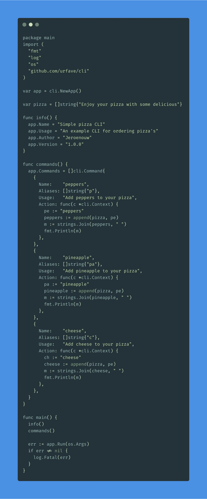

# 如何使用 Golang 创建自己的 CLI

> 原文：<https://itnext.io/how-to-create-your-own-cli-with-golang-3c50727ac608?source=collection_archive---------1----------------------->

## 用 Golang 制作命令行界面的介绍


安娜斯塔西娅·耶尔马兹在 [Unsplash](https://unsplash.com?utm_source=medium&utm_medium=referral) 拍摄的照片

在本文中，我将解释如何用 Golang 创建一个基本的命令行界面(CLI)。我们将制作一个小型的 pizza CLI，在阅读完这篇文章后，你将会知道如何自己创建一个自定义 CLI。

## 先决条件

*   对于这个演示，我使用了:go 版本 1.11。

## 让我们开始创建代码

用名为`main.go`的文件创建一个文件夹，并在命令行中运行:

```
go get github.com/urfave/cli
```

现在我们在全球范围内安装了一个知名的[包](https://github.com/urfave/cli)来轻松地用 Golang 制作 CLI。这会节省我们很多时间。

在您的`main.go`中，让我们从 CLI 包中实例化一个`NewApp`，并通过调用`Run`方法使其能够运行。如果出现问题，我们还希望记录一个错误:

```
var app = cli.NewApp()func main() {
  err := app.Run(os.Args)
  if err != nil {
    log.Fatal(err)
  }
}
```

这足以让您的 CLI 工作，但没有任何选项。我们还需要一些关于 CLI 的基本信息。在`main`函数之上，制作另一个名为`info`的函数，并添加一些细节:

```
func info() {
  app.Name = "Simple pizza CLI"
  app.Usage = "An example CLI for ordering pizza's"
  app.Author = "Jeroenouw" 
  app.Version = "1.0.0"
}
```

接下来，我们将定义一个包含基本句子的新字符串数组，我们将在使用一些自定义命令运行 CLI 后扩展该数组。请将下一个放在`info`功能上方:

```
var pizza = []string{"Enjoy your pizza with some delicious"}
```

要完成 Golang CLI，我们需要做的最后一件事是添加一些自定义命令，我们创建了一个名为`commands`的新函数:

```
func commands() {
  app.Commands = []cli.Command{
    {
      Name:    "peppers",
      Aliases: []string{"p"},
      Usage:   "Add peppers to your pizza",
      Action: func(c *cli.Context) { 
        pe := "peppers"
        peppers := append(pizza, pe)
        m := strings.Join(peppers, " ")
        fmt.Println(m)
      },
    },
    {
      Name:    "pineapple",
      Aliases: []string{"pa"},
      Usage:   "Add pineapple to your pizza",
      Action: func(c *cli.Context) { 
        pa := "pineapple"
        pineapple := append(pizza, pa)
        m := strings.Join(pineapple, " ")
        fmt.Println(m)
      },
    },
    {
      Name:    "cheese",
      Aliases: []string{"c"},
      Usage:   "Add cheese to your pizza",
      Action: func(c *cli.Context) { 
        ch := "cheese"
        cheese := append(pizza, ch)
        m := strings.Join(cheese, " ")
        fmt.Println(m)
      },
    },
  }
}
```

在`commands`函数中，我们从导入的 CLI 包中调用`Commands`方法。然后，我们创建一个包含 3 个对象的命令数组；我们的自定义命令。

我们定义了一个`Name`、`Aliases`、`Usage`和一个`Action`。在这个包中有更多的选项可以探索，我们正在使用的只是最常见的。

*   作为`Name`你将设置命令名，在这种情况下，为你的比萨饼浇头。
*   我们创建了一个字符串数组，它可以包含我们命令的一个或多个别名。
*   对于`Usage`,我们简要描述了该命令的作用，因此我们可以在`help`概述中看到。
*   在`Action`中，我们提供了将要执行的代码。在本例中，我们将浇头添加到比萨饼字符串数组中。然后把它变成一个字符串。

## 本地使用

要构建我们的 CLI，请运行:

```
go build main.go
```

此后，您可以运行以下两个现有命令:

```
./main --help
./main --version
```

通过运行`./main — help`我们的输出现在看起来像这样:

```
NAME:
   Simple pizza CLI - An example CLI for ordering pizza'sUSAGE:
   main [global options] command [command options] [arguments...]VERSION:
   1.0.0AUTHOR:
   JeroenouwCOMMANDS:
     peppers, p     Add peppers to your pizza
     pineapple, pa  Add pineapple to your pizza
     cheese, c      Add cheese to your pizza
     help, h        Shows a list of commands or help for one commandGLOBAL OPTIONS:
   --help, -h     show help
   --version, -v  print the version
```

我们的自定义选项可以用全名来调用:

```
./main peppers
./main cheese
./main pineapple
```

或者使用缩写别名:

```
./main p
./main c
./main pa
```

`./main pa`的输出将是这样的:

```
Enjoy your pizza with some delicious pineapple
```

这只是一个非常基本的命令行界面，你可以做更多的事情。但是现在你知道基本的了。

## 全球使用

1.  运行`go build main.go`后，可执行文件“main”被创建

2.跑`cp main /usr/**local**/bin`

3.要测试:`main peppers`

这可以在全球范围内运行(归功于 [Melody Anoni](https://medium.com/u/dc4c5ebeb5ea?source=post_page-----3c50727ac608--------------------------------)

## 最终代码(main.go)



## 感谢您的阅读！我的 [Github](https://github.com/jeroenouw/) 。如果你觉得这篇文章有用，可以考虑看看我的其他文章:

[](https://levelup.gitconnected.com/10-advanced-aws-s3-questions-for-an-interview-with-answers-40316c8eb8ba) [## AWS S3 面试的 10 个高级问题及答案

### 检查您的候选人是否能够回答这些关于 AWS S3(简单存储服务)的问题

levelup.gitconnected.com](https://levelup.gitconnected.com/10-advanced-aws-s3-questions-for-an-interview-with-answers-40316c8eb8ba) [](https://medium.com/@jeroenouw/how-to-create-your-own-typescript-cli-with-node-js-1faf7095ef89) [## 如何使用 Node.js 创建自己的 TypeScript CLI

### 根据这个指南，准备好学习制作一个简单的“披萨”CLI 吧

medium.com](https://medium.com/@jeroenouw/how-to-create-your-own-typescript-cli-with-node-js-1faf7095ef89) [](https://medium.com/coinmonks/solidity-smart-contract-anatomy-fb8bfb72e7ec) [## 可靠智能合同剖析

### 今天，我将向你解释一个样本 Solidity 智能合同的剖析。本文将就此作一简要说明…

medium.com](https://medium.com/coinmonks/solidity-smart-contract-anatomy-fb8bfb72e7ec)