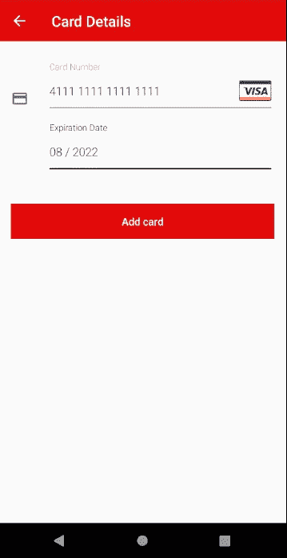

# 如何在 React Native 中自定义 Braintree dropin UI

> 原文：<https://itnext.io/how-to-customise-the-braintree-dropin-ui-in-react-native-846364727dff?source=collection_archive---------4----------------------->

保罗·费尔伯鲍尔在 [Unsplash](https://unsplash.com?utm_source=medium&utm_medium=referral) 上的照片

React Native 是一个可靠、切实的解决方案，可以快速开发应用程序，因为 90–95%的代码将跨平台共享。

今天我们要谈论的是不可分享的东西。

在最近的 React Native 项目中，我们决定使用 Braintree 插件 UI 集成来处理支付，当您使用 Braintree 时，这是一个轻松的胜利。这是一个由 braintree 提供的伟大的库(然后由 [wgltony](https://github.com/wgltony/react-native-braintree-dropin-ui) 移植到 React Native ),以节省开发者构建他们自己的支付集成的需要。按照 wgltony 的 github repo 上的步骤，很容易为 React Native 进行设置和工作。在 React Native 上使用这种集成的唯一缺点是很难定制它的 UI。为了做到这一点，您必须深入研究本机代码。

# 安卓方面

要定制 Android Braintree 插件 UI 的外观，您必须覆盖 Braintree 在您自己的 styles.xml 中定义的样式。[这里的](https://github.com/braintree/braintree-android-drop-in/blob/master/Drop-In/src/main/res/values/styles.xml)是您可以覆盖的样式列表。为此，您需要将样式复制到 styles.xml 中，这可以在 android/app/src/res/values 目录中找到。如果没有，那么您必须根据本指南创建一个。例如，如果你想在“添加卡片”活动中加入一些应用程序的风格，你可以通过以下方式实现:

我们的应用程序的风格是一个红色的应用程序栏，白色的标题和按钮的文本不全是大写。然而，要给按钮重新着色，你必须覆盖布伦特里定义的颜色。在您的 Android/app/src/RES/values/colors . XML 中包含以下内容:

这一点在 [braintree android github](https://github.com/braintree/braintree-android-drop-in/issues/154) 的几期文章中都有提及。

该代码产生了这样的布局:

# iOS 怎么样？

围绕如何定制 iOS braintree 插件 UI 的[文档](https://developers.braintreepayments.com/guides/drop-in/customization/ios/v4)比 Android 的更加完整，但仍然值得浏览一遍。您可以在 iOS 上自定义许多属性，包括:

*   文本颜色
*   覆盖背景色
*   导航文本颜色
*   表单的背景色
*   导航栏的背景色

[这里有一个](https://github.com/braintree/braintree-ios-drop-in/blob/master/BraintreeUIKit/Public/BTUIKAppearance.h)列表，你可以在 iOS 中编辑不同的属性。您可以在初始化 braintree UI 之前设置这些属性。下面的代码片段看起来与上面的 android 版本类似:

总而言之，braintree 插件 UI 是一个用于处理支付的简单工具。定制它相当简单，但是在 react-native 上定制它时需要一些本地知识。

【https://www.brightec.co.uk】最初发表于**。**