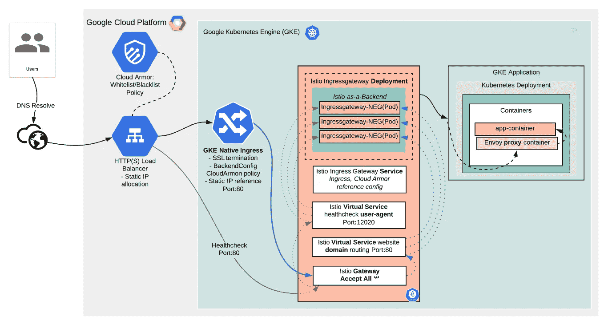
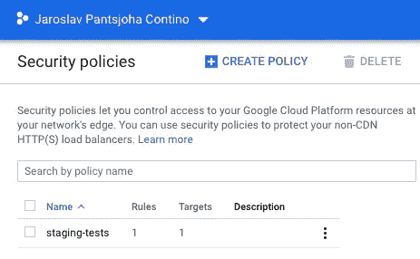
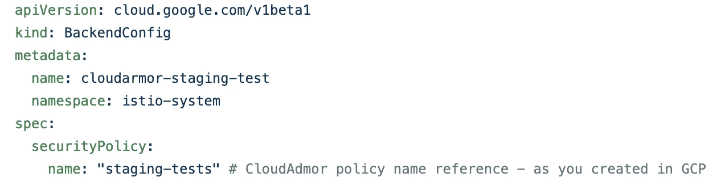
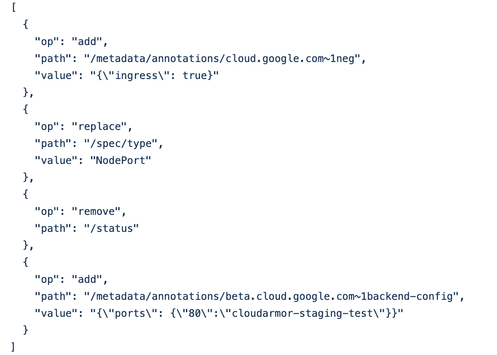
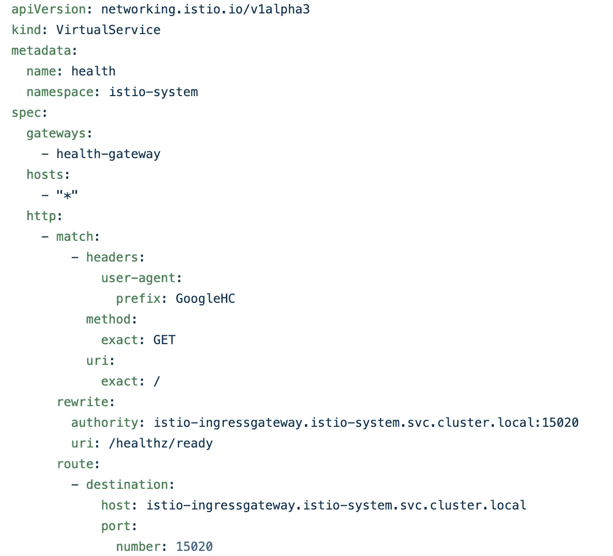
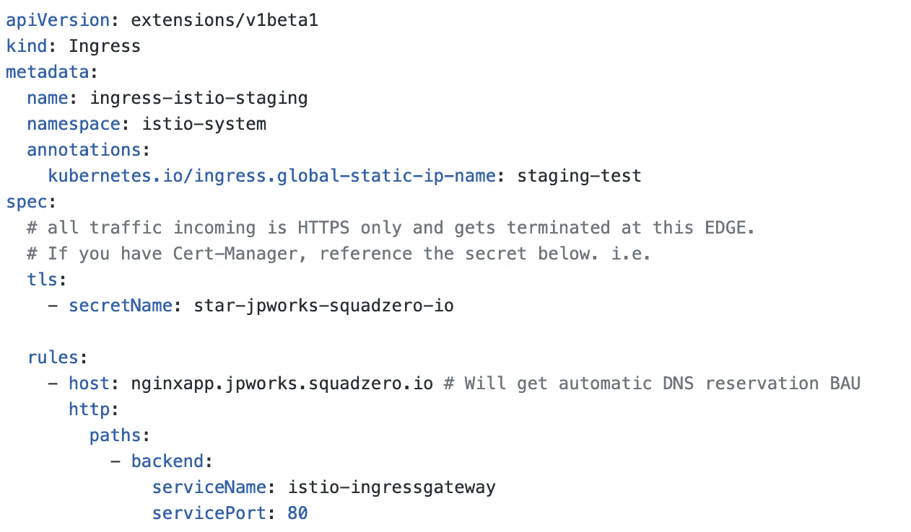
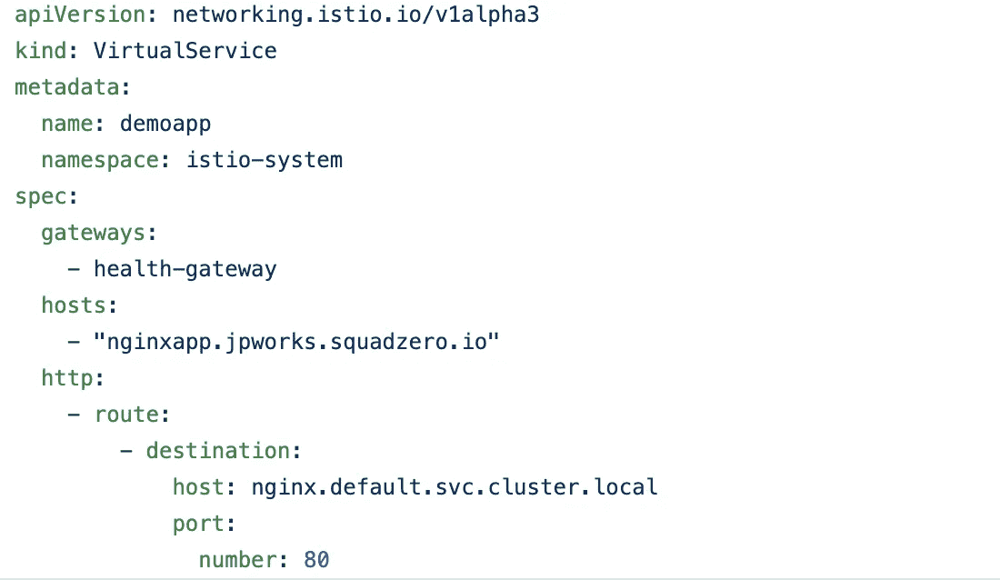
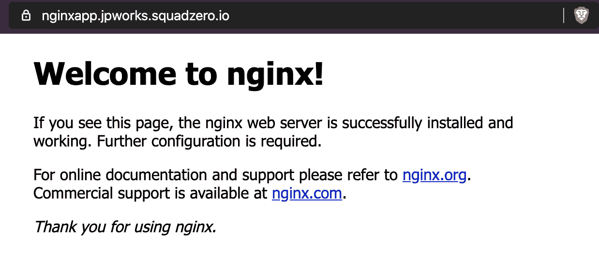

# 操作方法:GCP GKE 托管 Istio 附加服务的 Google Cloud Armor DDOS 防护

> 原文：<https://itnext.io/how-to-ddos-protection-with-google-cloud-armor-for-gcp-gke-managed-istio-add-on-service-e29d42ffdb18?source=collection_archive---------2----------------------->

我在之前的[博文中确实提到过“`part deux'`即将到来——代理入口 SSL 证书集成的老式方式(无 SDS)](https://medium.com/contino-engineering/istio-proxy-ingress-ssl-certificate-integration-the-old-fashioned-way-no-sds-d4a740f48cdf)——所以就在这里。

起初，你用容器和`this is it!`工作，然后你发现了 Kubernetes 的新世界，然后`this`又变成了`it`。现在，添加 Istio 服务网格的“类固醇”,我们正在将整个系统端到端地与谷歌云集成，试图拼凑出我们如何才能做到两全其美。很简单，对吧？

好吧，剧透一下，这很管用。喝杯咖啡，这会很有趣的，我保证。

# HTTP(S)负载平衡器 GKE 入口+ Istio (NEG) + SSL 管理器集成

因为这是一个跨越多个特性和产品的相当复杂的集成，所以让我们包括一些相关的关键字，以便更容易地发现，正如我们所谈到的；
- HTTP(S)负载均衡器
- GKE GCE 入口控制器
-用于 GKE(GCE)入口控制器的 Backend config
-cloud armor+用于 Istio (NEG)的 WAF 保护
-作为 HTTP(S)后端的 Istio Ingressgatway 集成
-Istio Ingres gateway+virtual service；运行状况检查和应用流量路由

我们的目标是在 GKE 集群上配置 Istio Ingressgateway(托管或非托管),作为 Google HTTP(S)负载平衡器的后端(NEG)。
通过这样做，我们能够从 [BackendConfig](https://cloud.google.com/kubernetes-engine/docs/concepts/backendconfig) 配置特性中受益，其中一个特性允许我们在边缘启用[ClourArmor](https://cloud.google.com/armor/)Google security 附加产品，该产品提供企业 DDoS 防御。

**这种完全集成将使这种设置具有:**

*   GCE 负载平衡器(非 Istio 入口网关)的完全 SSL 端接
*   任播 IP
*   完整的 Istio Mesh 具有集成、数据包路由、流量控制和发布管理功能
*   云装甲支持、DDoS 防护+ WAF 特性
*   云身份感知代理
*   更多信息，请再次参见 [Backendconfig](https://cloud.google.com/kubernetes-engine/docs/concepts/backendconfig)

这需要配置 HTTP(s)负载平衡器并配置 Istio 以通过 GKE (gce)入口接受流量，以及相关的 [BackendConfig](https://cloud.google.com/kubernetes-engine/docs/concepts/backendconfig)
除了 CloudArmor 功能，还有其他额外的好处，因为您可以使用 BackendConfig 来配置 HTTP(S)负载平衡的这些功能:

- [云 CDN](https://cloud.google.com/kubernetes-engine/docs/how-to/cdn-backendconfig)
- [身份感知代理(IAP)](https://cloud.google.com/iap/docs/enabling-kubernetes-howto)
- [超时、连接清空超时、会话关联](https://cloud.google.com/kubernetes-engine/docs/how-to/configure-backend-service)

这不同于默认的 Istio 服务网格模型实现，后者提供了`service`类型，而不是传统的`ingress`。



一个有效的双重过滤，双重安全设置，在每个独立的层工作。

一旦你考虑到 Istio 服务网格，`Ingress`类型就不再是 Istio 的 BAU 选项。Istio 入口网关服务实际上是一个`LoadBalancer`类型的`service`。
这可以和经典的`HorizontalPodAutoscaler` 一起在 BAU 工作，但是，这导致了谷歌控制台内不兼容的服务供应，因此像**云装甲/WAF、IAP** 这样的附加产品是不可能的。

**通过 5 个“简单”步骤实现操作目标的行动清单:**

*   创建启用了云运行和 Istio 的 GKE 集群
*   创建一个 Istio 虚拟服务来处理运行状况检查请求
*   修改 Istio 入口网关的 Kubernetes 服务对象，以便它可以由 Kubernetes 入口对象公开
*   通过创建 Kubernetes 入口对象来配置 HTTP(S)负载平衡
*   部署一个示例 Nginx 服务来验证解决方案。

这是应得的荣誉——这个实现的灵感来自 Google 文档中关于使用 Istio 和 CloudRun 实现 HTTP(S)负载平衡器的内容

# 深入了解它们辉煌细节的每一步

*   启用 **HttpLoadBalancing** 和 **Istio 附加组件**来配置您的 GKE 集群
*   [部署 DNS 管理器](https://medium.com/contino-engineering/how-to-kubernetes-application-deployment-with-dns-management-ddf63b559b67)——像以前的帖子一样，消除 DNS 管理的辛劳。也因为我们可以。
*   [SSL 管理器—如何指导部署 cert-manager](https://medium.com/contino-engineering/how-to-automatic-ssl-certificate-management-for-your-kubernetes-application-deployment-94b64dfc9114) ，并使用 ACME DNS 验证来加密 CA 以颁发证书

将 GKE 入口配置为与 Istio Ingres Gateway 一起工作，作为 NEG 后端+ BackendConfig，代理到 Istio 入口网关 pod、NEGs Healtchecks。然后，另一个虚拟服务映射到达我们的演示 Nginx 应用程序:

*   保留静态 IP —因为应该是相关的
*   配置云防护策略——任何“阻止我的 IP”试验都可以



*   “BackendConfig”中的上述引用



*   修补 Istio Ingressgateway 服务，使其对本次配置更新更加友好。值得指出的是，`service`将从`loadbalancer`类型变成`NodePort`类型。



复制粘贴 JSON

```
[  {    "op": "add",    "path": "/metadata/annotations/cloud.google.com~1neg",    "value": "{\"ingress\": true}"  },  {    "op": "replace",    "path": "/spec/type",    "value": "NodePort"  },  {    "op": "remove",    "path": "/status"  },  {    "op": "add",    "path": "/metadata/annotations/beta.cloud.google.com~1backend-config",    "value": "{\"ports\": {\"80\":\"cloudarmor-staging-test\"}}"  }]
```

*   配置 VirtualService 来调整和接受 LB **健康检查**对 NEG(Istio Ingres gateway PODs)的调用。如果没有这个 HTTP(S ),负载平衡器将永远无法正常运行，因此不会有流量转发到后端——Istio Ingres gateway 作为我们的 NEGs



HTTP(S)负载平衡器必须将 NEG 标记为就绪—这是 Istio Ingressgateway Pod

*   如果相关，使用 TLS 机密配置(GCE)入口。您可以在下面参考它，因为**证书管理器**和**外部 dns** 应该在您的集群上运行，保留 dns 条目并在必要时颁发证书。



默认后端为 istio-Ingres gateway。

*   部署 Nginx 演示服务进行测试

`kubectl run nginx --image=nginx && k expose deploy/nginx --name nginx --type ClusterIP --port 80 --target-port 80`

*   创建一个单独的 VirtualService，将域请求路由到专用的 Nginx 演示服务。



另一个虚拟服务路由配置，基于主机将流量重定向到我提供的虚拟 **nginx** 服务- >部署

3.将自己的 IP 地址列入黑名单，测试[云装甲策略](https://cloud.google.com/armor/docs/configure-security-policies)！



希望你喜欢这个。喜欢读书吗？

**喜欢，鼓掌，一起分享这篇帖子！**

加入对话。**# Kubernetes-users**[Kubernetes slack group](https://kubernetes.slack.com/?redir=%2Fmessages%2Fkubernetes-users%2F)见

**PS** 在 **Contino** 有很多激动人心的 Kubernetes 项目正在进行。如果您正在寻找最新最棒的基础设施堆栈，或者正在寻找挑战，请联系我们！我们正在招聘，寻找各个层次的聪明人。在 **Contino** ，我们自豪地为中型企业和大型企业提供最佳实践云转型项目。

地方官

# 顺便说一下，👏🏻*鼓掌*👏🏻如果你喜欢这篇文章，请举手(高达 50 倍)。它鼓励我继续写作，并帮助其他人找到它:)