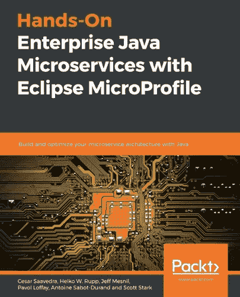

# 如何在 MicroProfile Rest-Client 中处理 4xx 响应

> 原文：<https://itnext.io/how-to-deal-with-4xx-5xx-responses-in-microprofile-rest-client-2e16559f542?source=collection_archive---------1----------------------->

Eclipse 微文件 [Rest 客户端](https://github.com/eclipse/microprofile-rest-client)是一款非常酷的软件。[我想我甚至在](/authentication-with-microprofile-rest-client-d1e9da774f70)之前提到过😀。其中一个很酷的特性是你不必处理底层的 http 处理。


但是有时你想实际处理 http 的本质——特别是处理传达语义的不同状态代码。默认的处理是，对于每一个代码≥ 400，抛出一个 *WebApplicationException* ，只是告诉你调用没有成功，并没有进一步区分。

## 自定义异常映射器的帮助

幸运的是，我们不需要求助于基本的 HttpClient 来解决这个问题，而是可以使用一个强大的特性，即自定义 ResponseExceptionMappers。让我们先看看一个示例实现，然后看看如何将它应用到您的代码中。这建立在我上一篇文章的[代码之上。](/authentication-with-microprofile-rest-client-d1e9da774f70)

```
**@Priority**(4000)                                            // ***(1)***
public class **MyMapper** implements 
             ResponseExceptionMapper<RuntimeException> {   // ***(2)*** @Override
  public RuntimeException toThrowable(Response response) {
    int status = response.getStatus();                     // ***(3)***

    String msg = getBody(response); // see below

    RuntimeException re ;
    switch (status) {
      case **412**: re = new ValidationException(msg);         // ***(4)***
      break;
      default:
        re = new WebApplicationException(status);          // ***(5)***
    }
    return re;
  }
```

1.  告诉其他客户优先级。如果多个映射器匹配，则采用优先级最低的映射器
2.  我们的类需要实现 ResponseExceptionMapper 接口
3.  我们可以从响应中检索状态代码
4.  并使用它来分派不同类型的异常
5.  对于所有其他代码，我们使用默认值

如果我们调用的服务器在主体中返回一个响应，我们希望知道它并在异常中提供它。这可以通过以下方式实现:

```
private String getBody(Response response) {
  ByteArrayInputStream is = (ByteArrayInputStream) response.getEntity();
  byte[] bytes = new byte[is.available()];
  is.read(bytes,0,is.available());
  String body = new String(bytes);
  return body;
}
```

现在我们有了映射器功能，我们需要告诉 rest 客户机何时应该应用它。为此，我们将映射器注册到我们希望使用它的接口:

```
@RegisterRestClient
**@RegisterProvider**(value = **MyMapper.class**,
                  priority = 50)
public interface **VerifyEngine** {
```

只需在接口上添加一个 *@RegisterProvider* 注释就大功告成了。如果远程服务器现在响应代码 412，您将得到一个 ValidationException，您可以使用它:

```
@Inject
@RestClient
VerifyEngine engine;[...]try {
  **engine.verify**(policy);
}
catch (ValidationException ve) {
  // Deal with a 412 response
}
catch (Exception e) {
  // Deal with other cases
}
```

# 更多？

如果你想了解更多关于 Eclipse MicroProfile 的知识，可以看看我也是合著者的书“ [**用 Eclipse MicroProfile**](https://www.packtpub.com/web-development/hands-on-enterprise-java-microservices-with-eclipse-microprofile) 动手操作企业 Java 微服务”。

