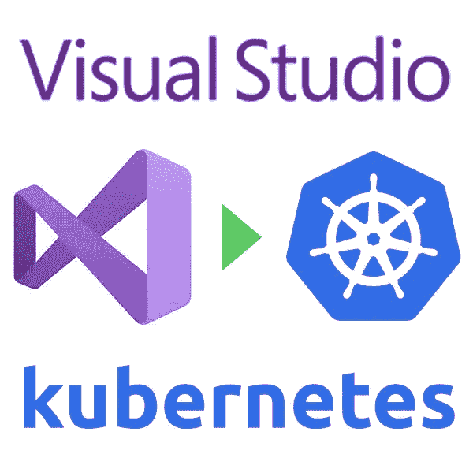
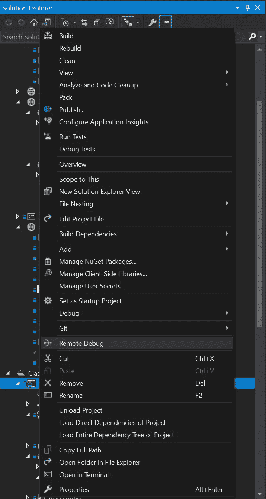
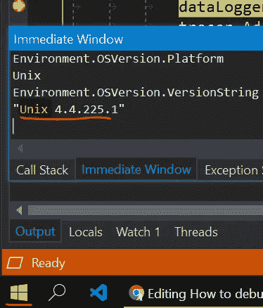
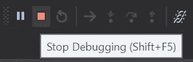

# 如何从 Visual Studio 2019 调试 Kubernetes 中的 ASP.NET 核心？

> 原文：<https://itnext.io/how-to-debug-asp-net-core-in-kubernetes-from-visual-studio-2019-1e9d16099d99?source=collection_archive---------1----------------------->

由于最初的[帖子](https://pavel-agarkov.medium.com/debugging-asp-net-core-app-running-in-kubernetes-minikube-from-visual-studio-2017-on-windows-6671ddc23d93)已经过时，这里是 VS2019 的新帖子



# 准备工作站

对于本教程，我们需要:

*   [kubectl](https://kubernetes.io/docs/tasks/tools/install-kubectl/#install-on-windows-using-chocolatey-or-scoop) -安装并配置为访问集群
*   Visual Studio 2019

这是假设您已经有一个 kubernetes 集群、一个 docker 映像构建管道和一个将 dotnet 应用程序发布到该集群的方法。

# 准备 docker 图像

为了远程调试 dotnet 应用程序，我们还需要一个远程调试器。可以按需安装，但我更喜欢在 docker 映像构建期间这样做:

```
RUN apt-get update \
    && apt-get install -y --no-install-recommends unzip \
    && rm -rf /var/lib/apt/lists/* \
    && curl -sSL [https://aka.ms/getvsdbgsh](https://aka.ms/getvsdbgsh) | \
       bash /dev/stdin -v latest -l /vsdbg
```

你可以在我之前的[文章](/debugging-asp-net-core-in-kubernetes-from-vscode-294a728031e6)中阅读如何有条件地只为开发环境做这件事。

我们还需要在调试配置中构建我们的应用程序。比如像这样:

```
RUN dotnet publish -c Debug
```

# 准备 Visual Studio

为了让 monorepos 和团队更方便，我做了一个 Visual Studio 扩展:

*   将`launch.json`复制到`bin`目录
*   替换`launch.json`中的环境变量
*   在`launch.json`中用绝对路径替换相对路径
*   开始远程调试

为了继续，我们需要安装这个[扩展](https://marketplace.visualstudio.com/items?itemName=xpasza.RemoteDebugLauncher)并重启 Visual Studio。

[](https://marketplace.visualstudio.com/items?itemName=xpasza.RemoteDebugLauncher) [## 远程调试启动器- Visual Studio 市场

### Visual Studio 的扩展-远程调试器启动器

marketplace.visualstudio.com](https://marketplace.visualstudio.com/items?itemName=xpasza.RemoteDebugLauncher) 

# 准备项目

用下面的内容创建一个新文件`kube-debug.sh`,并把它放在根解决方案文件夹中，这样我们可以在我们所有的项目中重用它:

接下来在项目的`Properties`文件夹中创建`launch.json`文件，其内容如下，稍后将被调试:

这个文件也可以放在项目文件夹中，甚至放在根解决方案文件夹中，但是我希望它和默认的`launchSettings.json`放在同一个地方——因为它们本质上非常相似。希望它们能在未来的版本中合并…

这里的`%SolutionRootForBash%`将被替换为根解决方案文件夹路径，但是因为我们使用了`bash`，所以它也将`\`替换为`/`。但是如果你喜欢`powershell`，那么你将需要`%SolutionRoot%`。你可以在我之前的[文章](https://medium.com/@pavel.agarkov/debugging-asp-net-core-app-running-in-kubernetes-minikube-from-visual-studio-2017-on-windows-6671ddc23d93)的`powershell`中找到类似的脚本。检查源代码[代码](https://github.com/pavel-agarkov/RemoteDebugLauncherExtension/blob/6c70a8363cc3a727b9e3fba12a4929d56eb25ceb/RemoteDebugLauncher/LaunchCommand.cs#L97-L101)以找到更多替换。

这里的`app.kubernetes.io/name=my-app-name`和`my-app-namespace`应替换为当前应用的真实值。对于`--selector`，我们可以使用部署规范中的匹配标签。

⚠:我们已经准备好开始调试了，但是首先不要忘记为`livenessProbe`增加`timeoutSeconds`或者完全禁用它。否则，每当我们在断点处暂停时，kubernetes 就会重启应用程序。

# 开始调试

要开始调试，只需在项目上下文菜单中选择**远程调试**:



这里，我们正在从 Windows 调试一个运行在 kubernetes 集群中的应用程序:



# ⚠警告⚠

按下🟥 **停止调试(Shift+F5)** 将关闭集群中运行的应用！k8s 会重启，但还是…



要真正停止调试，我们需要使用❌ **分离所有**来代替！

