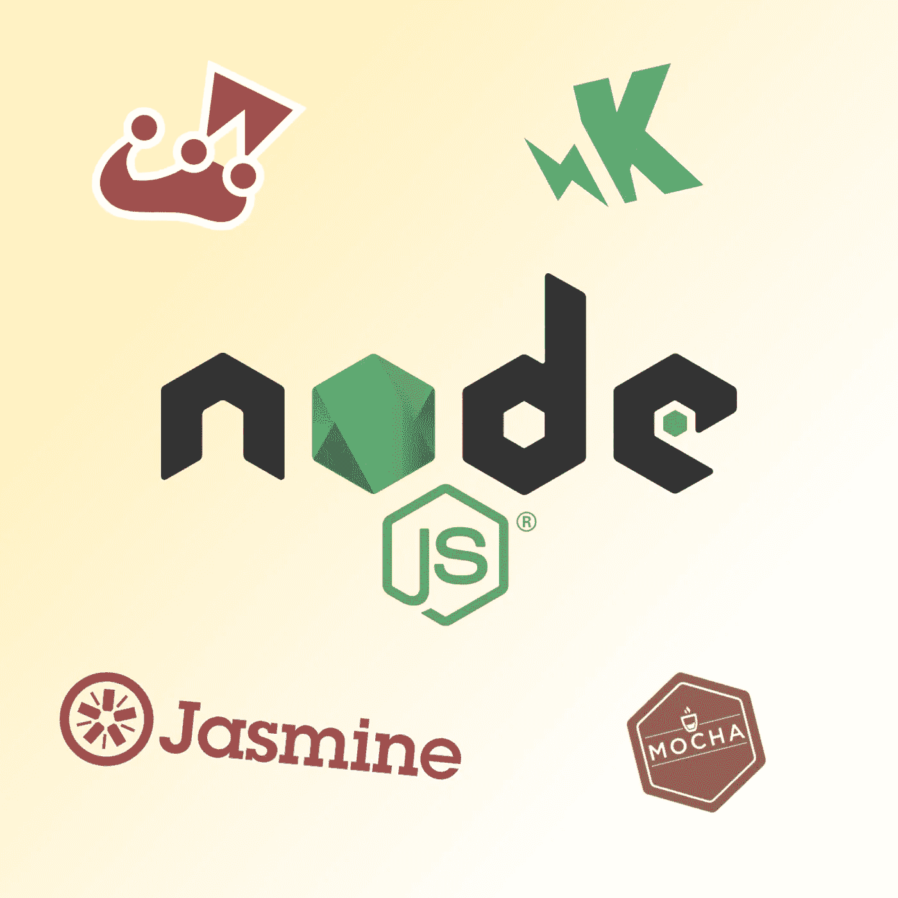
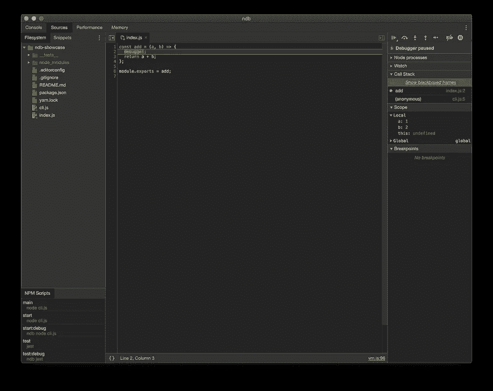
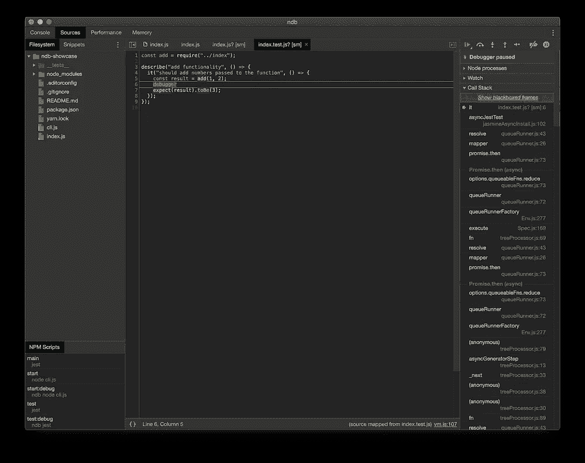

# 如何调试 JavaScript 应用和测试(Jest，Mocha，Jasmine，Karma)

> 原文：<https://itnext.io/how-to-debug-javascript-applications-and-tests-9718fe610f7d?source=collection_archive---------9----------------------->

在商业世界中，有许多遗留的 JavaScript 应用程序。尽管客户端应用程序是 JavaScript 中的常见用例，但近年来，越来越多的 Node.js 应用程序正在被构建。

我们在这里遇到的问题是，应用程序构建得非常复杂，因此很难调试。谁没有开发过这个用 Node.js 编写的巨型遗留单片主应用程序，它是公司的核心？Express、Sequelize、中间件无处不在和意大利面条代码。加入一些 MongoDB，到处做些讨厌的事情，你就知道你的企业项目环境了。

测试这些东西是相当困难的，因为它们可能有许多抽象和副作用。所以编写测试是理解代码行为的第一步，但实际上理解代码的行为和它应该做什么是第一步。大多数情况下，企业会编写关于如何做事情的文档，但你知道，总是有太聪明的工程师为了达到这个目标而在抽象上做一些粗糙的抽象，所以对于不熟悉代码的开发人员来说，代码不是真正可以理解的。

那么，一个新的开发人员编写测试几乎是不可能的，因为他/她可能不理解业务案例，但更糟糕的是，他/她可能甚至不理解代码在做什么。为了理解这一点，开发人员将编写一个调试语句。在 JavaScript 中，这通常看起来像:

所以我们在这里得到的是命令行中的视觉反馈。命令行或多或少是这里调试代码的 UI。但实际上，命令行从来不是为调试而设计的。此外，这种调试适用于简单的代码片段，没有很多副作用，但是当您进入复杂的 if-else 结构或具有很多副作用和条件的代码，而您不想一直调试这些代码时(想象一下，如果状态 x 和 y 发生，然后向我展示结果)，那么这种技术可能会非常糟糕。

总的来说，JavaScript 为此提供了一个解决方案。就是`debugger`关键词。在你的程序中设置断点，基本上就是一个关键字。断点是您的应用程序代码将停止运行以便您可以检查它的一个步骤。这类似于一个程序的视频播放，您只需在播放过程中停止视频，以检查该特定视频中发生的动作周围的不同事情。您可以在此找到关于调试器语句的更多资源:

*   [https://www . ECMA-international . org/ECMA-262/6.0/# sec-debugger-statement](https://www.ecma-international.org/ecma-262/6.0/#sec-debugger-statement)
*   [https://developer . Mozilla . org/en-US/docs/Web/JavaScript/Reference/Statements/debugger](https://developer.mozilla.org/en-US/docs/Web/JavaScript/Reference/Statements/debugger)

ECMAScript 官方文档中的一段重要引文如下:

> [……]如果调试器不存在或不活动，此语句没有明显效果。

使用`node index.js`运行应用程序时就是这种情况。这或多或少是 Node.js 运行的生产环境，因为 Node.js 很聪明，它没有为应用程序附加调试器。这主要是性能增益造成的。运行调试器总是会影响应用程序的性能，因为应用程序必须绑定到调试器才能启用变量监视、堆栈跟踪框架或断点等功能。当然，这是一个繁重的操作，会降低应用程序的速度。

要在运行 Node.js 应用程序时启用调试器，只需用`--inspect`参数启动它。这将在`127.0.01:9229`上公开 Node.js 应用程序的一个端点。端点基本上实现了一个调试器规范。有不同的调试器，如 [node-inspect](https://github.com/nodejs/node-inspect) 、 [Chrome dev tools](https://github.com/ChromeDevTools/devtools-frontend) 等等，你也可以在这里找到:[https://nodejs . org/de/docs/guides/debugging-getting-started/](https://nodejs.org/de/docs/guides/debugging-getting-started/)。附加调试器通常是至少一次的手动过程，对于一些结构不良的应用程序来说，这可能会变得相当棘手。这也是为什么你几乎看不到有人真正使用调试器的原因🤷对于一点点调试来说，设置太难了，所以大多数人更喜欢使用简单的`console.log`而不是附加调试器。在客户端应用程序中，这可能会有所不同，因为 Chrome 和 Firefox 有自己的开发工具，能够调试并自动连接到网站的 JavaScript 代码。但是在 Node.js 应用程序中，您必须以另一种“模式”运行应用程序。但是对于这些问题，有一个解决方案叫做`ndb`。

> ndb 是 Node.js 的改进调试体验，由 Chrome DevTools 启用—[ndb 的 GitHub 库描述](https://github.com/GoogleChromeLabs/ndb)

使用`ndb`相当容易。您唯一要做的就是安装它，然后用`ndb yarn start`运行您的 Node.js 应用程序。`ndb`建议全球安装。您可以通过以下方式做到这一点:

否则，您也可以添加`ndb`作为 devDependency，并创建一个 Node.js 脚本命令来启动带有前缀`ndb`的应用程序。

到目前为止，我们只是专注于启动一个附带调试器或 ndb 的成熟 Node.js 应用程序，但`ndb`变得非常强大，因为您可以将其附加到基本上每个 Node.js 进程。例如，当测试你的应用程序时，你可以使用`ndb yarn test`来调用你的测试命令。因为这些测试是在 Node.js 环境中执行的，所以您将拥有完整的调试器选项。我准备了一个简单的 Node.js 应用程序，可以在这里找到:

 [## IGE ligel/nd b-展示区

### 展示如何轻松调试 Node.js 应用程序的项目

github.com](https://github.com/igeligel/ndb-showcase) 

这个项目只是在 index.js 文件中公开了一个模块，并导出了一个名为`add`的函数，它接受两个参数并将它们相加。该功能也包含在`__tests__`目录中的测试中。看起来奇怪的是，`debugger`语句仍然包含在 JavaScript 文件中。*不要在生产级代码*中这样做。这只是为了展示。这个项目中的`package.json`文件创建了开发人员可以运行的四个脚本:

如果您运行`start`或`start:debug`，它将运行“CLI”示例，否则，您可以使用`test`或`test:debug`来运行测试。一个命令和一个附加了`:debug`后缀的命令之间的唯一区别是用普通命令运行`ndb`。当运行这些时，它会打开一个 Chrome 开发工具的 Chrome 窗口。如果用`debugger`语句设置了断点，应用程序实际上会在这些语句处停止。例子可以在下面的截图中看到:

Chrome 开发工具示例

你可以看到你有正常的 Chrome 开发工具功能，而没有设置很多样板文件，这使得`ndb`超级棒。它使开发人员更容易进行调试，并减少了实际使用适当调试器的障碍。

这里最有用的特性可能是变量检查。你可以将鼠标悬停在变量上并查看值，而不用将它们放入`console.log`语句中，更好的是，你可以检查可能有副作用的变量。超级牛逼。Chrome 开发团队在本视频中展示了更多功能:

调试 JavaScript — Chrome DevTools 101

这就是人们如何轻松调试 Node.js 应用程序的方法。请使用`ndb`，向您的同事展示并分享这篇文章。

> 开发者❤️调试器

> 感谢你阅读这篇文章。你摇滚*🤘*
> 
> 也可以查看我的其他博客文章，比如 JavaScript 中的[函数参数](https://medium.com/@kevin_peters/function-parameters-in-javascript-clean-code-4caac109159b)、[通过一个真实的例子](https://medium.com/@kevin_peters/learn-how-to-refactor-vue-js-single-file-components-on-a-real-world-example-501b3952ae49)或[Python 的自动格式化器](https://medium.com/3yourmind/auto-formatters-for-python-8925065f9505)了解如何重构 Vue.js 单个文件组件。
> 
> 如果你有任何反馈或者想给这篇文章添加一些东西，请在这里评论。您也可以在 [twitter](https://twitter.com/kevinpeters_) 上关注我，或者访问我的[个人网站](https://www.kevinpeters.net/)来了解我的博客文章和许多其他内容。