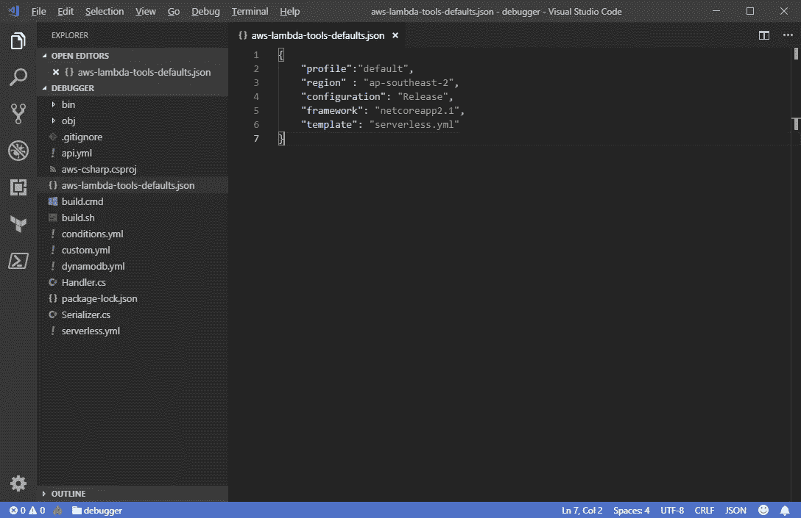
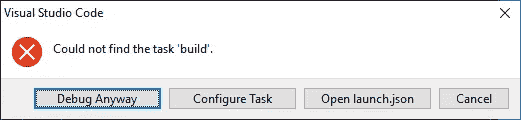
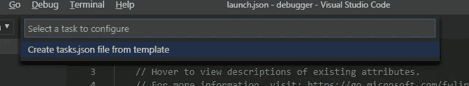
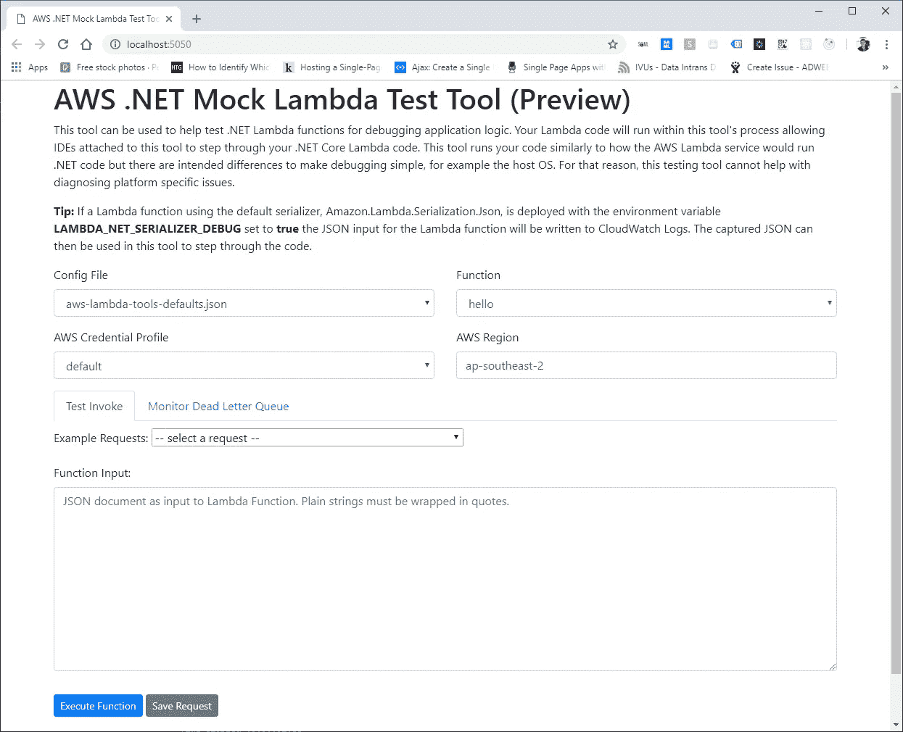
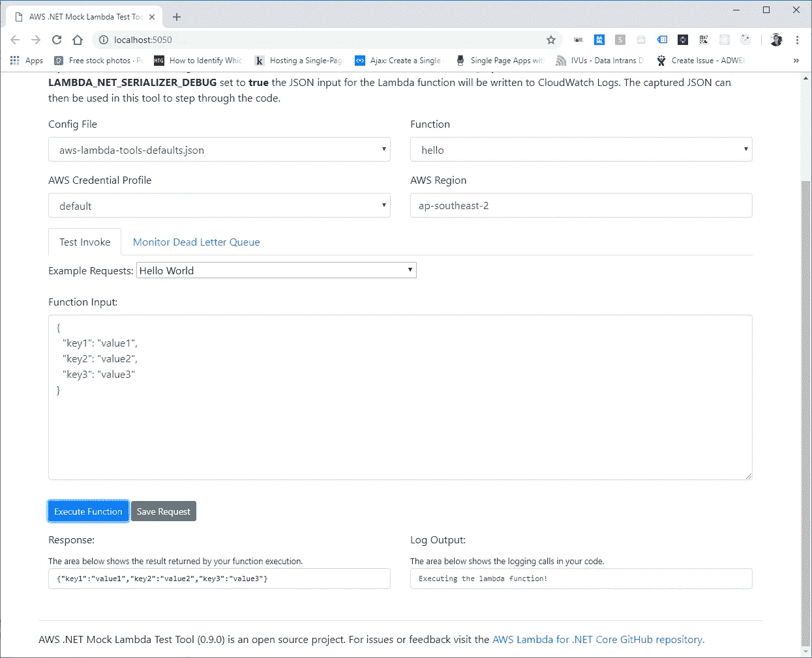
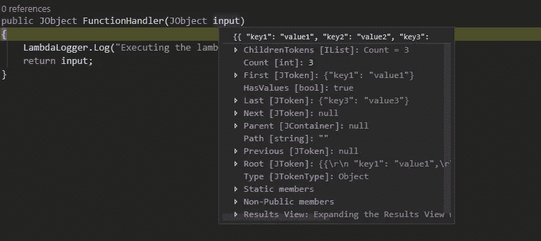

# 如何调试。NET Core Lambda 使用无服务器框架在本地运行

> 原文：<https://itnext.io/how-to-debug-net-core-lambda-functions-locally-with-the-serverless-framework-dd1670bc22e2?source=collection_archive---------0----------------------->


大多数开发人员都知道，在试图识别代码中出现的令人难以置信的问题时，调试是可以使生活变得容易得多的任务之一。一段时间以来，无服务器框架已经能够 [*本地调用用 NodeJS、Python、Java 和 Ruby 编写的*](https://serverless.com/framework/docs/providers/aws/cli-reference/invoke-local/) Lambda 函数，或者使用 [*无服务器离线*](https://github.com/dherault/serverless-offline) 插件(以及许多变体，如 Python 的插件)本地运行它们。迄今为止，这似乎是极其困难的。NET 核心开发人员做的。我自己和我所知道的其他开发人员。NET 已经求助于仅仅将所有事情记录到控制台，构建和部署 AWS 来查看哪里出错了。

现在事情发生了变化，作为 [AWS 的](https://github.com/aws/aws-lambda-dotnet/tree/master/Tools/LambdaTestTool) [0.9.0](https://github.com/aws/aws-lambda-dotnet/pull/364) 版本的一部分。NET Mock Lambda 测试工具您现在可以调试您的。NET Core Lambda 函数是在无服务器框架中创建的——让我向您展示如何实现！

## 安装工具

其中一些步骤基于工具本身提供的设置指南，我还将设置 Visual Studio 代码，这是我用来开发的工具。NET Lambda 函数— Visual Studio 和 JetBrains Rider 支持也是可用的。

这些工具可以通过运行*点网工具安装命令*来安装——记住这是一个全局工具，需要包含参数-g:

```
dotnet tool install -g Amazon.Lambda.TestTool-2.1
```

## 设置和配置您的项目

我将从我们自己的无服务器框架模板中创建一个示例项目，尽管您可以向任何无服务器框架项目添加调试。

```
sls create --template-url [https://github.com/effectivedigital/serverless-templates/tree/master/combined](https://github.com/effectivedigital/serverless-templates/tree/master/combined) --path debugger
```

在项目的根目录下，创建一个名为*“AWS-lambda-tools-defaults . JSON”*的文件，并使用下面的对象填充它。如果您在本地使用不同的 IAM 概要文件和区域来连接到项目的 AWS，请确保更新概要文件和区域。我们使用 [saml2aws](https://github.com/Versent/saml2aws) 对我们所有的 aws 帐户进行身份验证，并让它将凭证保存到默认配置文件中。

```
{  
    "profile":"default",
    "region" : "ap-southeast-2",
    "configuration": "Release",
    "framework": "netcoreapp2.1",
    "template": "serverless.yml"
}
```



aws-lambda-tools-defaults.json 的一个例子

接下来，您需要向 Visual Studio 代码添加调试配置:

1.  导航到*调试*界面
2.  在播放符号旁边的下拉菜单中，选择*“添加配置”*项，并选择*。网核*为环境。
3.  一个名为*“launch . JSON”*的文件将会打开，删除文件中的所有内容，并用下面的内容填充它。

```
{
    // Use IntelliSense to learn about possible attributes.
    // Hover to view descriptions of existing attributes.
    // For more information, visit: [https://go.microsoft.com/fwlink/?linkid=830387](https://go.microsoft.com/fwlink/?linkid=830387)
    "version": "0.2.0",
    "configurations": [    
        {
            "name": ".NET Core Launch (console)",
            "type": "coreclr",
            "request": "launch",
            "preLaunchTask": "build",
            "program": "C:/Users/${env:USERNAME}/.dotnet/tools/dotnet-lambda-test-tool-2.1.exe",
            "args": [],
            "cwd": "${workspaceFolder}",
            "console": "internalConsole",
            "stopAtEntry": false,
            "internalConsoleOptions": "openOnSessionStart"
        },
        {
            "name": ".NET Core Attach",
            "type": "coreclr",
            "request": "attach",
            "processId": "${command:pickProcess}"
        }
    ]
}
```

*注意:对于 Mac 用户，使用程序路径:/Users/ <用户名> /。dotnet/tools/。store/Amazon . lambda . test tool-2.1/0 . 9 . 0/Amazon . lambda . test tool-2.1/0 . 9 . 0/tools/netcoreapp2.1/any/Amazon。Lambda.TestTool.dll*

单击 debug 按钮——应该会出现一个错误提示，指出找不到任务“build”。



第一次调试时出错。

点击*“配置任务”*按钮，选择从模板创建 tasks.json，选择。列表中的. NET 核心模板。



tasks.json 文件应该如下所示:

```
{
    // See [https://go.microsoft.com/fwlink/?LinkId=733558](https://go.microsoft.com/fwlink/?LinkId=733558)
    // for the documentation about the tasks.json format
    "version": "2.0.0",
    "tasks": [
        {
            "label": "build",
            "command": "dotnet build",
            "type": "shell",
            "group": "build",
            "presentation": {
                "reveal": "always"
            },
            "problemMatcher": "$msCompile"
        }
    ]
}
```

现在，再次单击调试按钮，假设一切都成功，那么 *AWS。NET Mock Lambda 测试工具*窗口应该会启动并填充所有字段:



我的 Lambda 函数非常简单，它只返回事件输入，并向控制台记录一条消息:



我甚至可以在 Visual Studio 代码中添加断点，并检查断点处发生了什么，根据断点的位置，您可以像使用传统的。网络应用程序:



你有它，调试。NET 核心 Lambda 函数在本地工作正常！

# 摘要

在我看来，这改变了一切。NET 世界中的无服务器计算，应该会看到采用 [*的最佳运行时*](https://read.acloud.guru/comparing-aws-lambda-performance-of-node-js-python-java-c-and-go-29c1163c2581) 显著增加。我发现该工具的主要缺点是，每次重新运行调试过程时，都会启动一个新窗口，这需要您一次又一次地输入事件——这里的优点是您可以保存自定义请求。