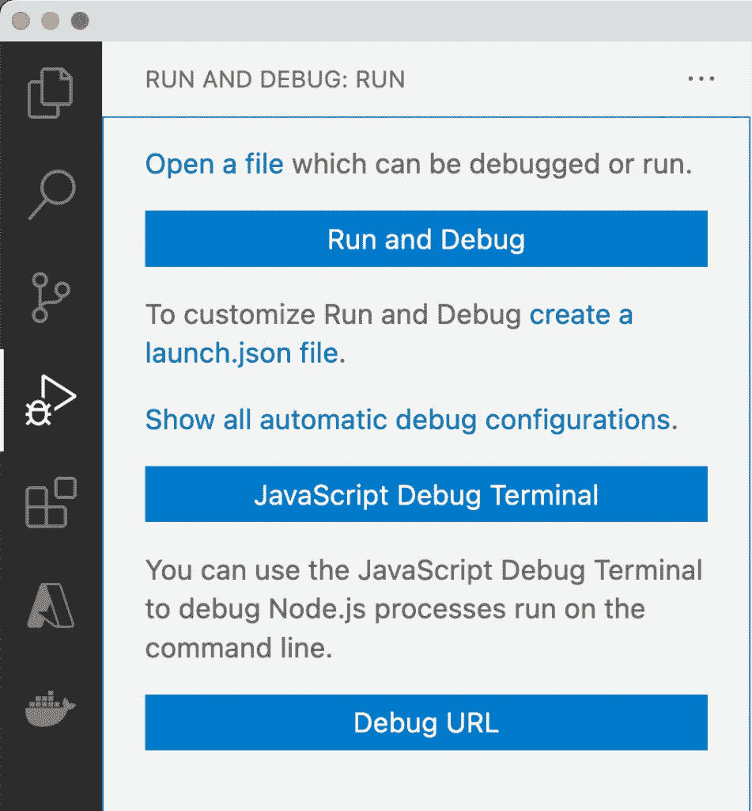
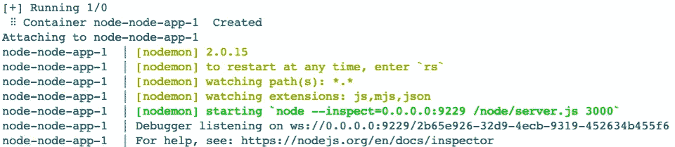

# 如何在 Docker 内部调试节点 JS？

> 原文：<https://itnext.io/how-to-debug-node-js-inside-docker-8f9be8abdbb4?source=collection_archive---------1----------------------->

## 调试 docker 容器


在 docker 中调试 node.js

# 什么是调试器？

对于任何开发人员来说，调试器都是最好的朋友。用调试器很容易发现软件中的错误。

可以添加一个断点来暂停执行。其次，还可以在断点处添加逻辑来暂停执行。例如，考虑一个有 1000 次迭代的`for`循环。当迭代计数达到 100 以上时，执行应该停止。为此，在`for`循环上放置一个断点。接下来，添加当迭代次数超过 100 时停止执行的逻辑。

除了暂停程序，调试器还显示内存分配。例如，暂停执行将显示在任何给定点消耗的内存。

# 什么是远程调试器？

调试通常在本地主机上完成。远程做就叫远程调试:)。也就是说，如果你调试运行在远程主机上的软件，这叫做远程调试。这是有帮助的，原因有很多。

首先，人们可以在本地调试软件。考虑一个软件在云上的场景。它可以部署在开发、UAT 或生产环境中。现在问题发生在云上，而不是本地主机上。在这种情况下，连接到云并将调试器附加到进程会非常有帮助。人们可以一行一行地执行软件来评估问题并修复它。

其次，当软件在容器中运行时，远程调试也很有用。假设一个项目正在 Docker 内部运行。人们不能直接运行项目并通过调试器连接到它。相反，docker 容器应该公开它的容器端口。其次，远程调试器需要配置来连接 docker 容器内部的项目。

Docker 有助于创建可移植的容器，这些容器可以快速、轻松地部署在各种机器上。这些容器可以在您的 Windows、Mac 和 Linux 上本地运行。此外，像 AWS 或 Azure 这样的主流云系统也支持开箱即用。如果你想学习更多的 Docker 基础知识，并且需要 Docker CLI 的备忘单，[这里的](https://betterprogramming.pub/a-beginners-cheat-sheet-for-docker-f5024fd6c17f)是一篇关于它的介绍性文章。

在本文中，我们将设置一个 NodeJS 项目在 docker 容器中运行。我们还将为项目设置一个远程调试。

如果你喜欢这篇文章，请[关注我](https://arjav-dave.medium.com/)，并在我的个人资料中查看其他如此精彩的文章。

# 设置项目

# 先决条件

在我们继续之前，系统应该已经安装了 docker 桌面和 VS 代码。除此之外，没有其他要求。

对于那些仓促的，我已经把源代码作为一个资源库。你可以点击查看[。](https://github.com/shenanigan/docker-node-debug)

# 创建项目文件

我们将创建一个非常简单的 express Node JS 项目。在打开一个特定的 URL 时，它将简单地返回一个静态 JSON 字符串。为此，我们将创建一个名为`server.js`的文件，这是我们项目的入口点。

用以下内容创建一个`server.js`文件:

```
const server = require("express")();
server.listen(3000, async () => { });
server.get("/node-app", async (_, response) => {
    response.json({ "node": "app" });
});
```

`server.js`文件说明`display {“node”: “app”}`在浏览器中打开`[http://localhost:3000/node-app](http://localhost:3000/node-app)`网址。

其次，我们需要一个`package.json`文件来配置项目并添加依赖项。为此，创建一个包含以下内容的`package.json`文件:

```
{
    "name": "node-app",
    "dependencies": {
        "express": "^4.17.1"
    }
}
```

运行`npm install` 命令在本地安装依赖项。这将在项目目录中创建一个`node_modules`。

即使我们将在一个容器中运行项目，也需要安装依赖项。这是必需的，因为我们将把当前的项目目录映射到一个容器项目目录。下面解释了如何这样做:

# 作为 Docker 容器运行

需要一个 docker 文件来作为 docker 容器运行项目。创建一个包含以下内容的 Dockerfile 文件:

这里，项目被设置为作为一个简单的节点服务器运行，不允许任何断点。容器将在容器内的节点目录外运行项目。 [nodemon](https://nodemon.io/) 全局安装在容器中。需要它来观察目录中的任何文件变化。下面详细解释。

只有在部署到生产时才需要`RUN npm install`命令。我们将使用 Docker Compose 将容器的`/node`目录映射到本地主机上的当前项目目录(下一节)。但是当应用程序部署在容器上时，它需要自己安装依赖项。

# Docker 忽略

Docker ignore 特性与 git ignore 非常相似。`.gitignore`不跟踪其中提到的文件或文件夹。同样，我们也不希望在容器中复制不必要的文件，这样会占用空间。

在我们的例子中，我们不想将`node_modules`文件夹复制到容器中。为此，在项目目录中创建一个包含以下内容的`.dockerignore`文件:

```
node_modules/
```

# Docker 撰写

Docker Compose 是用一个命令构建和运行 Docker 容器的非常有用的方法。同时运行多个容器也很有帮助。这是我们使用 docker compose 而不是 plain docker 的原因之一。要了解更多关于 docker compose 和如何运行多个容器的信息，请访问文章[使用 Docker Compose 运行多个容器](https://betterprogramming.pub/run-multiple-containers-with-docker-compose-9297957f7a3c)。

现在，让我们创建一个`docker-compose.yml`文件来添加更多的配置。创建 docker-compose.yml 文件后，将以下内容添加到该文件中:

docker-compose.yml

下面逐点解释`docker-compose.yml`文件。

1.  指向我们当前构建项目的目录。
2.  使用 nodemon 运行项目，因为如果本地目录中有任何更改，我们希望使用更改在 docker 中重新启动项目。Nodemon 是一个实用程序，它将监视源代码中的任何变化，并自动重启服务器。
3.  使用[卷](https://docs.docker.com/storage/volumes/)将我们当前的目录绑定到`/node`目录。
4.  除了公开和绑定服务器的 3000 端口之外，还要公开 9229 端口以附加调试器。

> U se 以上 docker-compose.yml 文件仅供调试使用。

上面的`docker-compose.yml`暴露了调试口。此外，它还监视容器内的任何文件更改(这是不会发生的)。最后，它将容器的体积映射到项目目录。

对于生产，创建一个包含以下内容的新文件`docker-compose-prod.yml`:

```
version: '3.4'
services:
  node-app:
    build: .
    command: node /node/server.js 3000
    ports:
      - "3000:3000"
```

它只是运行项目并公开`3000`端口。我们使用多个 docker 合成文件来管理不同的环境。查看下面的运行项目部分，了解如何基于不同的 docker 合成文件运行项目。

在运行项目之前，我们仍然需要配置调试器以连接到容器。

# 配置远程调试器

首先，检查您的项目中是否创建了`launch.json`文件。`launch.json`定义了我们可以运行调试的不同类型的配置。如果没有创建，请访问 VS 代码左侧的运行和调试选项卡，如下图所示:



运行和调试选项卡

点击文本，创建一个`launch.json`文件。在您继续之前，它会询问应用程序的类型。选择 Node.js。它将在您的项目中创建一个新的`launch.json`文件，并添加一个默认的 Node.js 配置。

因为我们不打算在本地运行节点应用程序，所以继续删除那个配置。相反，用以下内容替换`launch.json`文件:

添加的配置非常简单明了。基本上，我们要求调试器连接到端口号为`9229`的远程主机。我们还要求调试器在与主机断开连接时重新启动。默认情况下，调试器尝试在`[http://localhost:9229/](http://localhost:9229/)`连接。但是项目托管在 docker 的`/node`目录中。为了映射`/node`，使用了`remoteRoot`属性。

# 运行项目

差不多就是这样！现在，如果您运行`docker compose up`，您的项目将开始运行。第一次运行时，它将下载 node slim SDK 的一些层，然后在 docker 容器中安装 nodemon。但是，后续运行会快得多。运行`docker compose up`将在您的终端中显示以下输出:



码头工人排版

为了附加调试器，从运行和调试选项卡运行 Docker:附加到节点任务。调试器现在将附加到 docker 容器的`/node`目录中。接下来，在您的`server.js`文件的第 4 行放置一个断点，即`response.json({ “super”: “app1” });`。最后，打开你的浏览器，点击`[http://localhost:3000](http://localhost:3000.)` [。](http://localhost:3000.)断点将被命中，执行将停止。

对于生产，我们需要使用 1 文件。为此，我们需要在 docker 命令中提到文件名。执行以下命令，像在生产环境中一样运行项目:

```
docker compose -f docker-compose-prod.yml up
```

使用上面的命令，调试器不能附加到容器，因为我们没有公开任何调试点。

# 源代码

这里是我们创建的项目的最终源代码的链接。

# 结论

调试是开发中最好的事情之一。当我们能够远程调试时，这是最棒的。远程调试使我们不仅可以连接到运行在云上的代码，还可以连接到本地运行的 docker 容器。

我希望你喜欢这篇文章。请随意查看我的其他文章:

*   [Docker:简介和备忘单](https://betterprogramming.pub/a-beginners-cheat-sheet-for-docker-f5024fd6c17f)
*   [用 Docker 编写运行多个容器](https://betterprogramming.pub/run-multiple-containers-with-docker-compose-9297957f7a3c)
*   [使用 Azure 管道为 Android 设置 CI/CD](https://www.daveops.co.in/post/how-to-setup-ci-cd-pipelines-for-android-with-azure-devops)