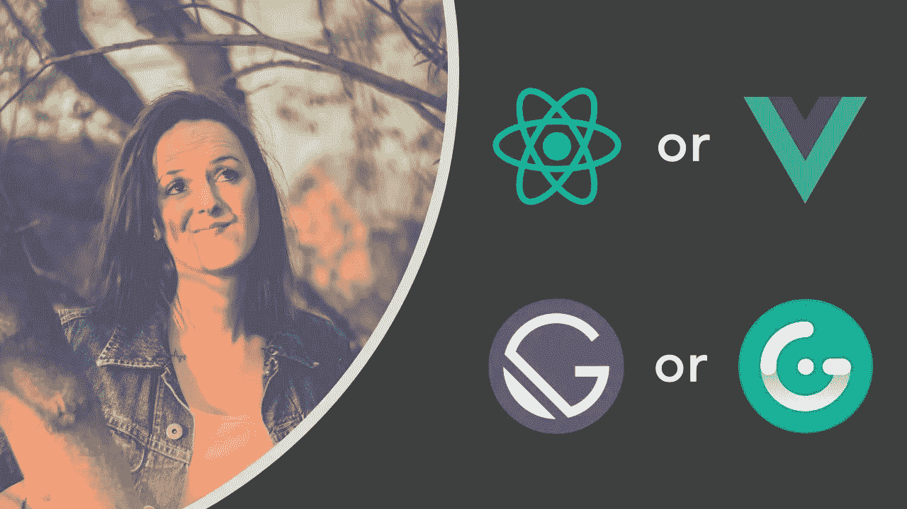
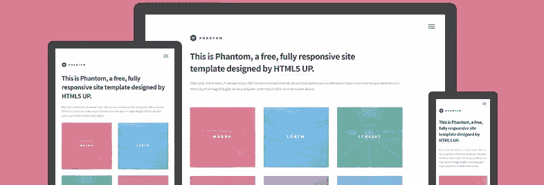
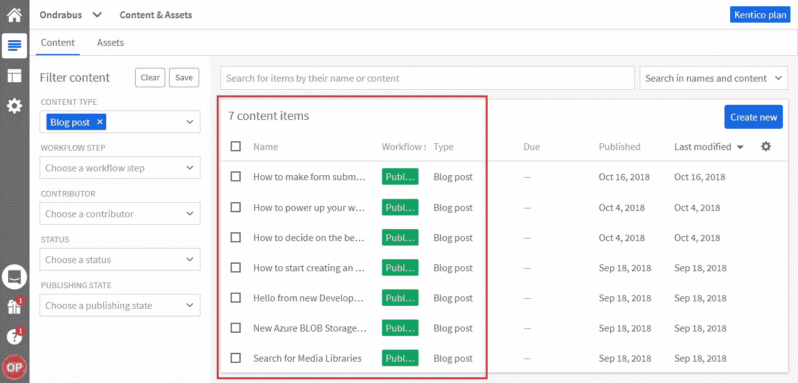
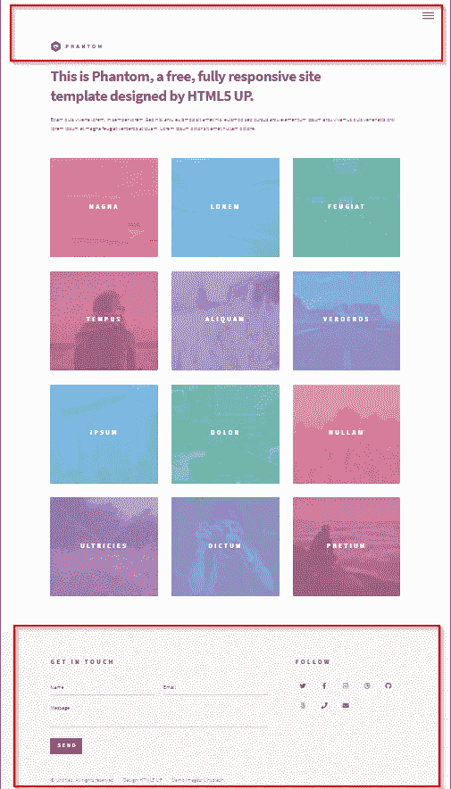
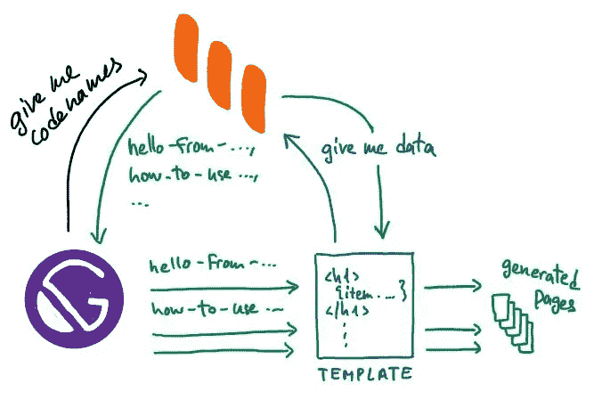
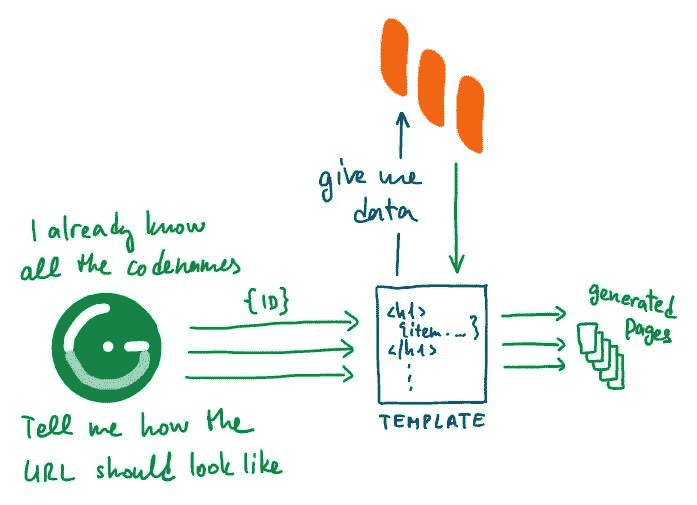

# 构建静态站点时，如何在 React 和 Vue 之间做出决定

> 原文：<https://itnext.io/how-to-decide-between-react-and-vue-when-building-a-static-site-9fd4673fc19b?source=collection_archive---------7----------------------->



在本文中，我将从多个角度比较两个领先的 JS 框架——React 和 vue . JS——包括学习曲线、性能、社区规模以及雇主的兴趣。

我还将解释使用各自的静态站点生成器 Gatsby 和 Gridsome 构建静态站点之间的区别。

# Jamstack 一直是 JavaScript 吗？

如果你是 Jamstack 的新手，只需知道它不是一个产品或框架，而是一种构建网站的方式。Jamstack 代表 JavaScript、API 和标记。Jamstack 网站的关键在于它不依赖于 web 服务器。用 JavaScript 框架构建的静态站点是 Jamstack，但用。NET、PHP 和其他平台。栈名中的 JavaScript 指向静态站点部署后的动态功能。

JavaScript 是 Jamstack 最流行的平台，因为它易于使用。你可以在几小时内建立并运行一个网站。而且几乎每个人都懂一点 JavaScript，这使得初学者的入门门槛很低。

# React or Vue.js

React、Vue.js 和 Angular 组成了最流行的 JavaScript 框架的三巨头。出于本文的目的，我将重点放在 React 和 Vue.js 上，因为 Angular 的学习曲线很陡，它通常更适合喜欢 TypeScript 和面向对象编程的大型项目和团队。

让我们看看 React 与 Vue.js 相比如何，以及它们在每个类别中可以获得多少分:

# 学习曲线

从 React 开始，您需要理解 JSX，构建系统，并具备以前的 JavaScript 知识。Vue.js 不需要这些，只需要一点 JavaScript 知识来理解语法。

获胜者: **Vue.js**

# 证明文件

Vue.js 的文档比 React 的更简单明了。

获胜者: **Vue.js**

# 表演

React 和 Vue.js 的性能都差不多。Vue.js 大概是一半大小。然而，与其他网站资源相比，这一事实本身不应成为决定性因素。

获胜者:**平局**

# 社区规模

React 和 Vue.js 都有庞大的社区，拥有类似数量的明星、贡献者和 GitHub repos 的观察者。

赢家:**平手**

# 缩放比例

两家公司都准备扩大规模。Vue.js 更适合按比例缩小。

赢家:**平手**

# 雇主的兴趣

虽然两者都有许多工作机会，但 React 在全球范围内正经历着雇主更高的兴趣。

胜利者:**做出反应**

你看，没有明显的赢家，Vue.js 以 5:4 领先，但比分如此接近，我认为这是平局。你会发现开发人员对 React 和 Vue.js 都充满热情。许多人喜欢并使用这两者。就像汽车一样。如果你学会开奥迪，你也能开奔驰。

# 盖茨比 vs. Gridsome 比赛

Gatsby 和 Gridsome 分别是 React 和 Vue.js 的静态站点生成器。我肯定你在某个地方听说过第一个。Gatsby 已经成为 SSGs 之王，因为它已经存在了很长时间，并且目标反应开发者。

Vue.js 比 React 年轻，所以 Gridsome 也比盖茨比年轻。盖茨比的领先优势使其在与 Gridsome 的特色战中取得了决定性的优势。但是当我们开始使用它们来构建同一个网站时，它们是如何比较的呢？



这是 Phantom，一个我从 HTML5UP.net[得到的免费 HTML 网页模板。它在主页上包含一个文章列表，并且每篇文章都有自己的专用页面。静态站点的完美简单用例。](https://html5up.net)

我将使用的内容来自我用于个人网站的[无头 CMS Kentico Kontent](http://bit.ly/38aGvfn) 。然而，这些天我对外发布了我的大部分博客文章，所以如果你看到一些旧的，不要惊讶。



# 初始化空白网站

使用静态站点生成器构建新站点的第一步是获得一个初始站点。通常有许多初学者可供选择，最好的选择是从你喜欢的获取内容的方式开始。在我的例子中，内容的来源是一个[无头 CMS](http://bit.ly/38aGvfn) 。

## 盖茨比（姓）

在谷歌上搜索“Gatsby Kontent starter”会把我带到 starter 的 GitHub 库。我需要克隆这个库并安装软件包:

```
git clone [https://github.com/Kentico/gatsby-starter-kontent](https://github.com/Kentico/gatsby-starter-kontent)
cd gatsby-starter-kontent
npm i
```

通过运行`gatsby develop`，我可以在网络浏览器中访问该网站。

## 网格体

就像 Gatsby 一样，也有一个特定于 Kontent 的示例站点，但是它功能齐全。我宁愿使用空白的 Gridsome 安装:

```
npm i --global @gridsome/cli
gridsome create gridsome-starter-kontent
cd gridsome-starter-kontent
```

通过运行`gridsome develop`，一个美好的*你好，世界！*站点显示。

# 添加源插件

我正在使用 REST API 提供的[无头 CMS](http://bit.ly/38aGvfn) 中的数据。静态站点生成器需要一个插件来下载数据并将它们转换成本地 GraphQL 节点。

## 盖茨比（姓）

我安装了一个已经包含 Kentico Kontent [源代码插件](https://bit.ly/39TifPO)的入门网站。我只需要更改`gatsby-config.js`中的*项目 Id* :

`918ba95f-885b-0045-a463-650b22e1196a`

当我现在尝试使用`gatsby develop`运行网站时，它会失败，并出现一些 GraphQL 错误。这是意料之中的，我更改了 *projectId，*，现在网站收到的数据与页面要求的完全不同。我们以后会改变的。

## 网格体

由于我安装了一个空白的 Gridsome 项目，我需要使用 npm 安装 [Kontent 插件](https://github.com/CMeeg/gridsome-source-kentico-kontent):

```
npm install @meeg/gridsome-source-kentico-kontent
```

我还需要将包含我的*项目 Id* 的插件添加到`gridsome.config.js`:

```
plugins: [
  {
    use: '@meeg/gridsome-source-kentico-kontent',
    options: {
      deliveryClientConfig: {
        projectId: process.env.KENTICO_KONTENT_PROJECT_ID
      }
    }
  }
 ]
```

该网站仍将以同样的方式工作，因为其索引页没有绑定到任何数据源。

# 添加样式和图像

最初的 web 模板 Phantom 包含一些样式表和图像。让我们来看看如何添加它们。

## 盖茨比（姓）

对于前端资产，在项目的根目录下，我可以创建一个文件夹并将其命名为 *static* 。Gatsby 会简单地将该文件夹的所有内容复制到最终版本中。

对于样式表，最好的方法是直接将其导入到组件和页面中。所以幻影模板的 *css* 文件夹的内容将进入 *src/css* 。

准备好所有的样式表后，我需要更改导入 Gatsby 站点布局的样式。布局是在`src/components/layout.js`中定义的，包含下面一行，我应该删除:

```
import './layout.css';
```

我需要添加以下几行:

```
import '../css/fontawesome-all.min.css';
import '../css/main.css';
```

最后一步是调整 CSS 文件中引用资源的路径。这些是典型的字体和背景图片。对我来说，它的字体很棒:

```
...
src:url(../webfonts/fa-brands-400.eot);
...
```

字体文件将被自动拷贝到最终版本，因此它们的路径会相应地改变:

```
...
src:url(/assets/webfonts/fa-brands-400.eot);
...
```

我运行*替换所有*../webfonts/"到“/assets/webfonts/”。

## 网格体

静态资产的文件夹 *static* 已经在项目根中，所以我可以直接复制粘贴资产。

为了确保 Gridsome 将样式添加到布局中，我需要将以下代码添加到特殊文件`main.js`中:

```
head.link.push({
    rel: 'stylesheet',
    href: '/assets/css/fontawesome-all.min.css'
})

head.link.push({
    rel: 'stylesheet',
    href: '/assets/css/main.css'
})
```

由于样式和字体都放在同一个*静态*文件夹中，我不需要更新字体文件的路径。

# 调整布局

一旦样式就位，我需要调整布局和内容页面的 HTML。布局是所有页面都相同的页面部分。



我通常创建布局的方式是从模板中复制并粘贴 HTML 代码到`<body>`和`</body>`标签之间。然后，我删除了每个页面应该呈现其内容的代码。

## 盖茨比（姓）

默认布局在`src/components/layout.js`中。我们在导入 CSS 时已经偶然发现了这个文件。

我用模板中的 HTML 替换了 StaticQuery 的呈现部分中的所有代码:

```
<StaticQuery
     query={...}
     render={(data) => (*HTML code from the template*)}
></StaticQuery>
```

盖茨比要求 JSX，但我粘贴了 HTML，所以我需要做一些修改。最重要的一个就是把所有的`class="*"`属性都改成`className="*"`。HTML 注释也需要删除。

幻影模板有一个`<div id="wrapper">`元素，它环绕整个页面，但在最后包含一些脚本导入。Gatsby 需要单个根元素，所以我必须使用另一个包装元素，`<div>`或`<React.Fragment>`。

然后我需要用`{children}`替换子页面将呈现其内容的 HTML。在这种情况下，它是在`<footer>`之前的`<div id="main">`和`</div>`之间的代码。如果你按照我的步骤做，不要只是删除代码，把它放到剪贴板上，因为下一步你会用到它。

## 网格体

默认布局在`src/layouts/Default.vue`中。它是一个 Vue.js 组件，因此有三个部分:

在布局中，我只需要标记，所以我将 HTML 从模板复制粘贴到`<template>`部分。就在`<footer>`之前的`<div id="main">`和`</div>`之间的中间部分需要替换，就像 Gatsby 一样，带有一个`<slot />`标签。

# 添加静态页面

幻影模板中唯一真正静态的页面是索引。它包含一个博客文章列表，并带有链接到它们的 URL。

## 盖茨比（姓）

使用 Kontent source 插件获取博客文章数据的 GraphQL 查询如下所示:

```
allKontentItemBlogPost {
   edges {
     node {
       system {
         codename
       }
       elements {
         title {
           value
         }
         teaser {
           value
         }
         image_url {
           value
         }
         image {
           value {
             url
           }
         }
       }
     }
}
```

注意`codename`；我将用它作为博客文章的 URL。

索引页的代码在`src/pages/index.js`文件中。有一个常量`query`保存 GraphQL 查询。页面的代码在常量索引中，也是默认的`export`。我在上一节中删除的 HTML 代码放在这里的`return`表达式中。

现在，我需要动态生成`<section class="tiles">`和`</section>`之间的标记。JSX 允许我们将 JavaScript 和 HTML 结合起来，所以我使用了`map`函数来这样做:

```
const items = data.allKontentItemBlogPost.edges.map(({node:item}, index) => 
     <article className={`style${index}`}>
       <span className="image">
         
       </span>
       <a href={`/blog/${item.system.codename}`}>
         <h2>{item.elements.title.value}</h2>
         <div className="content" dangerouslySetInnerHTML={{__html: item.elements.teaser.value}}>
         </div>
       </a>
     </article>
)
```

`<article>`需要递增的类名(style1，style2，style3)，所以我也使用映射函数的`index`变量来正确地生成 CSS。每篇博文的目标链接都是`/blog/{codename}`。

## Gridsome

索引页面在`src/pages/Index.vue`中实现，包含两个部分——模板和脚本。对于我的用例，我不需要`<script>`部分，但是我需要用 GraphQL 查询添加一个页面查询部分，从无头 CMS 收集数据:

```
<page-query>
 query {
   allBlogPost {
     edges {
       node {
         path
         imageUrl
         image {
           URL
         }
         teaser
         title
       }
     }
   }
 }
</page-query>
```

你看数据的结构和盖茨比有点不同。这是因为每个源插件对待数据的方式不同。

`<template>`标签中的标记与幻影模板相同，除了我呈现博客文章列表的部分。Vue.js 允许我指定 HTML，并使用绑定属性来生成尽可能多的迭代。

```
<section class="tiles">
   <article v-for="(item, index) in $page.allBlogPost.edges" :key="item.node.codename" :class="`style${index}`">
     <span class="image">
       
     </span>
     <a :href="`${item.node.path}`">
       <h2>{{ item.node.title }}</h2>
       <div class="content" v-html="item.node.teaser">
       </div>
     </a>
   </article>
</section>
```

你注意到链接中的`item.node.path`了吗？不应该有`/blog/{item.node.codename}`吗？干得好！我将在下一节解释我们实际生成页面的地方。

# 基于内容生成静态页面

这是我需要基于来自无头 CMS 的模板和数据集生成页面的最有趣的部分。我还需要指定这些网页的网址。

## 盖茨比（姓）

我将用于生成页面的模板与之前编辑的页面具有相同的结构。因此，我将`index.js`文件复制粘贴到*模板*文件夹中，并将其重命名为`blog.js`。



模板接收它应该呈现的项目的代码名。它需要实现自己的 GraphQL 查询，以获取附加数据，如标题、图像和内容:

```
query projectReferenceQuery($codename: String!) {
       kontentItemBlogPost(system: {codename: {eq: $codename}}) {
         elements {
           title {
             value
           }
           image_url {
             value
           }
           teaser {
             value
           }
           image {
             value {
               url
             }
           }
         }
         system {
           codename
         }
       }
}
```

现在只剩下一点额外的逻辑和标记:

```
const item = data.kontentItemBlogPost;

 let imageUrl = item.elements.imageUrl;
 if (!imageUrl && item.elements.image.value.length > 0)
 {
   imageUrl = item.elements.image.value[0].url;
 }

 return (
     <Layout>
       <div id="main">
         <div class="inner">
           <h1>{item.elements.title.value}</h1>
           <span class="image main"></span>
           <div dangerouslySetInnerHTML={{__html: item.elements.teaser.value}}></div>
         </div>
       </div>
     </Layout>
);
```

一旦模板准备好了，我需要在`gatsby-node.js`文件中添加一些代码，负责获取代码名和生成页面。在 GraphQL 查询中，我得到了所有博客文章的代码名，随后调用了`createPage`函数，该函数指定了盖茨比应该在哪个路径上以及使用哪个模板生成每一页。

```
 exports.createPages = ({ graphql, actions }) => {
   const { createPage } = actions;
   return new Promise((resolve) => {
     graphql(`
     {
       allKontentItemBlogPost {
         edges {
           node {
             system {
               codename
             }
           }
         }
       }
     }
     `).then(result => {
         result.data.allKontentItemBlogPost.edges.forEach(({node}) => {
           createPage({
             path: `blog/${node.system.codename}`,
             component: path.resolve(`./src/templates/blog.js`),
             context: {
               // Data passed to context is available in page queries as GraphQL variables.
               codename: node.system.codename
             },
           });
         })
         resolve();
     });
   });
 };
```

## Gridsome

模板的创建方式与页面相同。Gridsome 使用 id 的概念。每个内容项都有一个唯一的标识符，您可以使用它进行查询。



因此，我将要构建的模板从获取特定博客帖子数据的页面查询开始:

```
 <page-query>
 query MyQuery ($id:ID!) {
   blogPost (id: $id)
   {
     codename
     imageUrl
     image {
       url
     }
     teaser
     title
   }
 }
 </page-query>
```

模板的标记如下所示:

```
 <template>
   <Layout>
     <div id="main">
       <div class="inner">
         <h1>{{$page.blogPost.title}}</h1>
         <span class="image main"></span>
         <div v-html="$page.blogPost.teaser"></div>
       </div>
     </div>
   </Layout>
 </template>
```

现在真正的魔法来了。Gridsome 不像 Gatsby，它只满足了你的一半，不需要你自己构建页面创建逻辑。我刚刚为其创建了一个模板的内容类型叫做 BlogPost。Gridsome 知道这一点，所以只要模板以相同的方式命名，我只需要在`gridsome.config.js`文件中指定网址结构:

```
 module.exports = {
   ...
   templates: {
     BlogPost: '/blog/:codename'
   }
 }
```

通过指定 URL，Gridsome 将使用`path`变量增强所有 BlogPost 内容项，该变量将被缩短并调整以满足 URL 要求。您应该将其用于项目中的所有链接。如果你在你的代码中使用`/blog/{codename}`的话，你会引用不存在的页面。

# 谁是赢家？

在本文中，我试图向您展示使用不同的框架构建一个静态站点是多么的相似。废话，告诉我哪一个已经更好了？！

我个人更喜欢 Vue.js 和 Gridsome。两者在我心中都有特殊的位置，因为它们如此直观和直接。我喜欢他们的文件。当我开始使用静态站点生成器时，它对我帮助很大。

另一方面，盖茨比赢得了功能之战，我将它更多地用于需要高级功能的客户项目，比如图像预加载、多种语言、复杂的表格等等。为盖茨比从[无头 CMS Kentico Kontent](http://bit.ly/38aGvfn) 获取数据的[源插件](https://bit.ly/39TifPO)也更先进。

我不会说一个比另一个好。两者都很棒。如果你需要挑选一个，试着在它们上面建立一个样本站点，并且相信你的直觉。

*原为发表于*[*https://kontent . ai*](https://kontent.ai/blog/react-or-vue-gatsby-or-gridsome)*。*