# 如何从 Kubernetes 节点中删除窗格

> 原文：<https://itnext.io/how-to-delete-pods-from-a-kubernetes-node-756231f1ae5f?source=collection_archive---------0----------------------->

## …并避免停机！

在本文中，我们将通过使用运行在 AKS (Azure Kubernetes 服务)上的集群的例子来演示如何从 Kubernetes (K8S)节点中删除 pod。从节点中删除 pod 通常需要手动缩小集群，以便在需要从特定节点中删除 pod 时进行故障排除，或者在需要维护时完全清除节点中的 pod。


照片由[张秀坤·吕克曼](https://unsplash.com/@exdigy?utm_source=unsplash&utm_medium=referral&utm_content=creditCopyText)在 [Unsplash](https://unsplash.com/s/photos/container?utm_source=unsplash&utm_medium=referral&utm_content=creditCopyText) 上拍摄

## 从节点中删除所有窗格

要从特定节点删除所有 pod，首先，检索集群中节点的名称，然后检索 pod 的名称。您可以使用`-o wide`选项显示更多信息。

```
kubectl get nodes -o wide
```

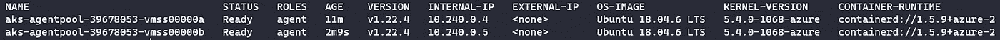

```
kubectl get pods -o wide
```

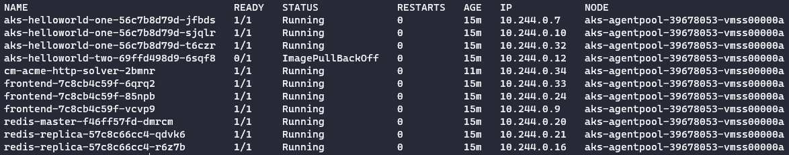

在上面的例子中，我有 2 个节点运行在我的 AKS 集群中，有 11 个 pod，都运行在 1 个节点上。如果该节点有问题，我可能希望删除该节点上的所有 pod，并让它们在另一个节点上运行。

一旦它们被确认为可以安全移除，您就可以使用`kubectl drain`命令从节点上移除 pod。`drain`命令将把 pod 从节点中驱逐出去，并将它们调度到另一个空闲节点上。

```
kubectl drain aks-agentpool-39678053-vmss00000a
```

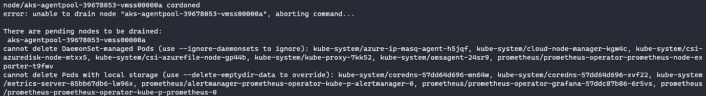

这里我看到了几个错误:

*   无法删除 DaemonSet 管理的窗格(使用—ignore-daemon set 忽略)
*   无法删除具有本地存储的窗格(使用-delete-empty dir-data 进行覆盖)

```
kubectl drain aks-agentpool-39678053-vmss00000a --ignore-daemonsets --delete-emptydir-data
```

这个`drain`命令将首先`cordon`这个节点。这可以确保在您准备删除或维护节点时，不会有新的单元被安排到该节点。如果愿意，您可以使用`kubectl cordon`命令手动封锁节点。随着 pod 的移动，日志将被传输到控制台。

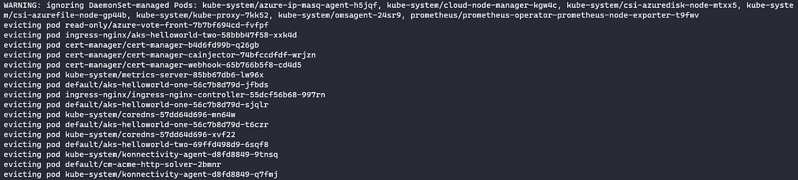

完成后，我可以验证我的 pods 现在正在我的另一个名为 aks-agent pool-39678053-vmss 00000**b**的节点上运行。

```
kubectl get pods -o wide
```

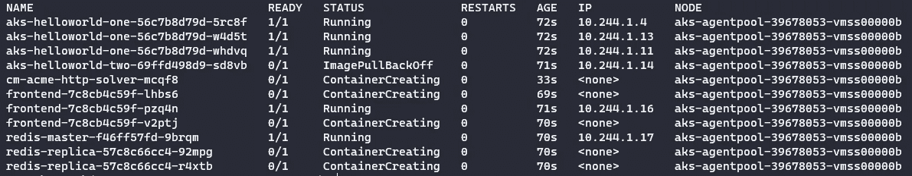

一旦您完成了节点上的故障排除或维护工作，您可以使用`kubectl uncordon`使其再次可用于调度窗格。如果不这样做，您将在节点的状态下看到 *SchedulingDisabled* ，这意味着不能在其上放置任何 pod。

```
kubectl get nodes -o wide
```

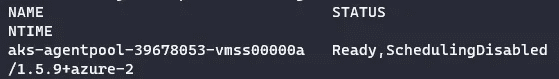

```
kubectl uncordon aks-agentpool-39678053-vmss00000a
```


现在状态显示为*就绪:*

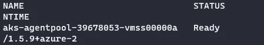

如果需要，我现在可以从节点 aks-agent pool-39678053-vmss 00000 b 中排出 pod，并且它们将被安全地调度回 aks-agent pool-39678053-vmss 00000 a。

## 错误“无法驱逐 pod，因为这会违反 pod 的中断预算”。

使用`kubectl drain`命令时，您可能会注意到一个错误:

> 无法驱逐 pod，因为这会违反 pod 的中断预算。

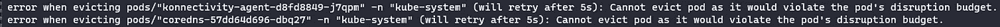

pod 中断预算是一种确保 pod 可用性以防止意外移除的方法。在 [kubernetes.io 文档](https://kubernetes.io/docs/concepts/workloads/pods/disruptions/#pod-disruption-budgets)中有如下描述:

> 作为应用程序所有者，您可以为每个应用程序创建一个 podisruptionbudget(PDB)。PDB 限制了因自愿中断而同时停机的复制应用程序单元的数量。例如，基于仲裁的应用程序希望确保运行的副本数量永远不会低于仲裁所需的数量。web 前端可能希望确保为负载提供服务的副本数量永远不会低于总数的某个百分比。

可以使用以下命令查看 Pod 中断预算:

```
kubectl get poddisruptionbudget -A
```

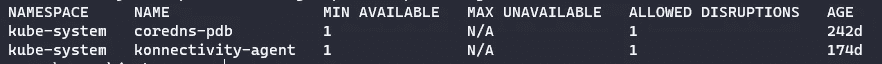

也可以删除它们:

```
kubectl delete poddisruptionbudget <pod name>
```

您会注意到，尽管显示了错误，但重试会在可配置的超时时间内自动发生，在我的例子中，pod 在一段时间后成功移动，因为一旦 pod 在另一个节点上出现，可用的 min 就是 1(与配置的 PDB 相同)，并且它能够从我正在清空的节点中删除。

## 删除单个窗格

您可以使用`kubectl delete pod`命令简单地删除 pod:

```
kubectl delete pod aks-helloworld-two-69ffd498d9-sfg7t
```


这将导致调度程序使用不同的名称重新创建 pod。

```
kubectl get pods
```


如果您想保证 pod 不会出现在同一个节点上，请先封锁该节点，然后再删除 pod。

## 缩放豆荚的数量

如果出于应用程序可用性的目的，您需要始终运行最小数量的 pod，则可能有必要在删除 pod 之前增加节点上正在运行的 pod 的数量。例如，可能始终需要 3 个 pod，因此您可以在删除一个之前扩展到 4 个正在运行的 pod。如果你的 pod 由 StatefulSet 控制，这不是一个选项，但是，如果它们由 ReplicaSet 或 Deployment 控制，你可以使用`kubectl scale`命令来实现。

查看我当前的部署

```
kubectl get deployments
```

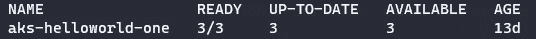

在这里，我有一个包含 3 个单元的部署。

```
kubectl scale deployment aks-helloworld-one --replicas=4
```


检查正在运行的 pod 的数量:

```
kubectl get pods
```

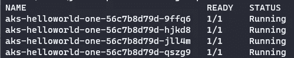

我现在可以删除一个单元，然后缩减到 3 个复制副本，以维持 3 个运行单元的要求。

```
kubectl delete pod aks-helloworld-one-56c7b8d79d-9ffq6
```

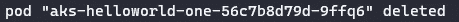

```
kubectl scale deployment aks-helloworld-one --replicas=3
```


## 强制 pod 删除

强制删除不会等待来自 *kubelet* 的确认，即 Pod 已被终止。如果 pod 是对其 pod 具有粘性标识的 *StatefulSet* 的一部分，这意味着具有相同名称的另一个 pod 可能试图被复制并并行运行，从而导致应用程序出现问题。因此，除非使用`kubectl delete pods`的正常删除失败，否则不推荐使用该选项。

```
kubectl delete pods <pod name> --grace-period=0 --force
```

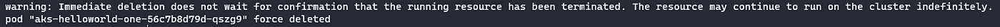

如果 pod 停留在*未知*状态，运行以下命令将其从集群中删除:

```
kubectl patch pod <pod name> -p '{"metadata":{"finalizers":null}}'
```

## 摘要

只需使用`kubectl delete pod`命令即可删除 pod。然而，挑战通常是维持应用程序正常运行时间和避免服务中断。要做到这一点，您可以使用`kubectl drain`命令，在 pod 被删除之前，在另一个节点上优雅地启动它们。您还应该考虑 *pod 中断预算*配置以避免错误，并考虑在删除它们之前适当扩展 pod 的数量。

想要更多 Kubernetes 内容？查看我在 K8S 上的其他文章[这里](https://jackwesleyroper.medium.com/kubernetes-k8s-related-articles-index-54718769e390)！

干杯！🍻

[](https://www.buymeacoffee.com/jackwesleyroper) [## Jack Roper 正在 Azure、Azure DevOps、Terraform、Kubernetes 和 Cloud tech 上写博客！

### 希望我的博客能帮到你，你会喜欢它的内容！我真的很喜欢写技术内容和分享…

www.buymeacoffee.com](https://www.buymeacoffee.com/jackwesleyroper) 

*最初发表于*[*space lift . io*](https://spacelift.io/)*。*