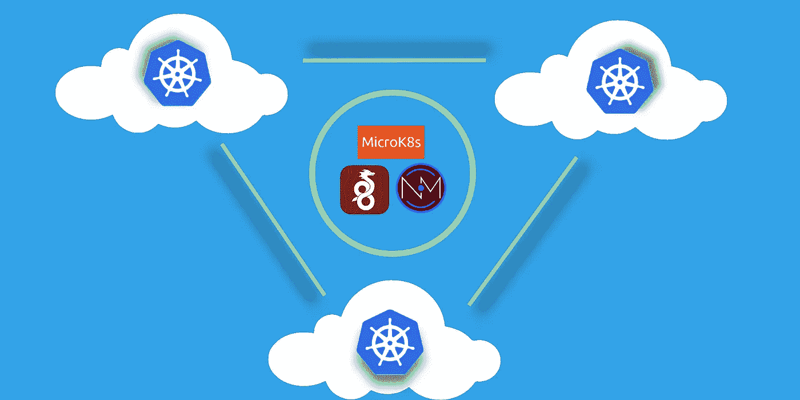
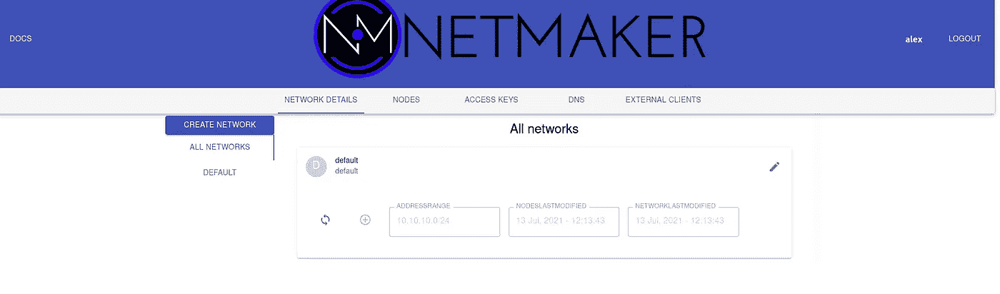
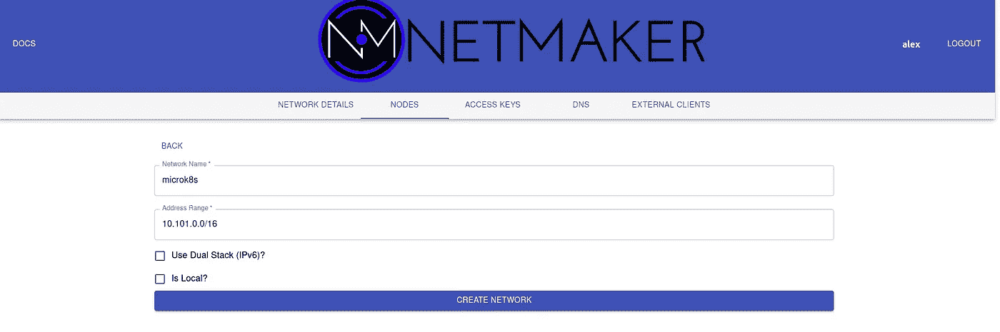
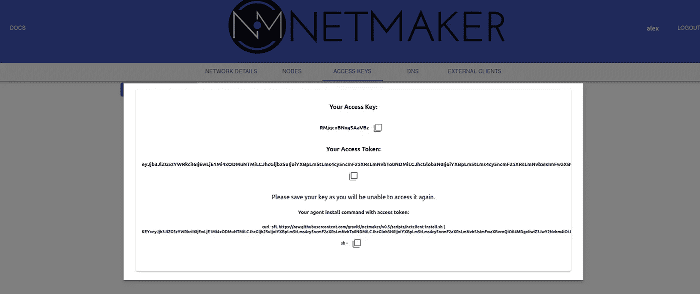
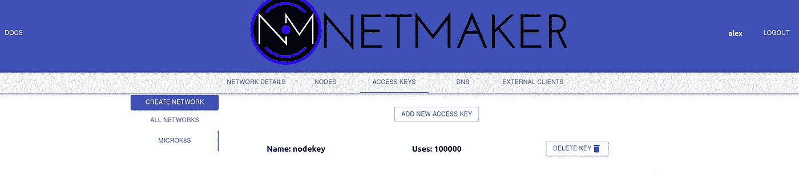
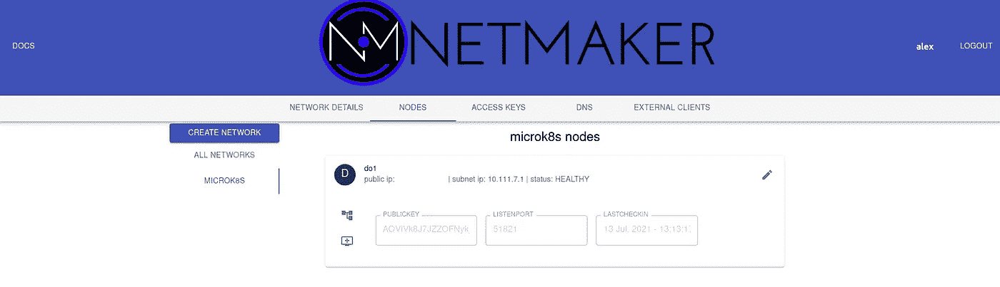
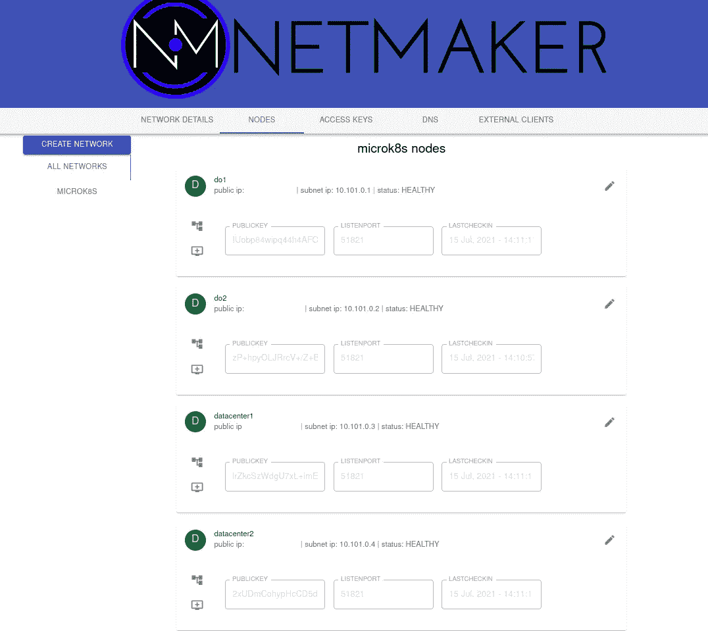
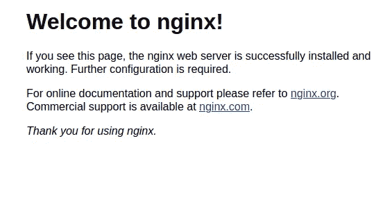
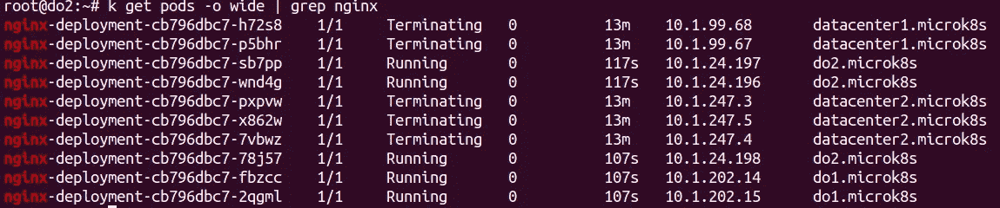

# 如何部署内置灾难恢复的跨云 Kubernetes 集群

> 原文：<https://itnext.io/how-to-deploy-a-cross-cloud-kubernetes-cluster-with-built-in-disaster-recovery-bbce27fcc9d7?source=collection_archive---------0----------------------->



本文解释了如何运行跨越混合云环境的单个 Kubernetes 集群，使其具有故障恢复能力。它将解释为什么这是必要的，以及如何使用 MicroK8s、WireGuard 和 Netmaker 实现这种架构。好了，准备好了吗？

Kubernetes 很难，但你知道什么更难吗？多云、多集群的 Kubernetes，这是在生产中运行 Kubernetes 时不可避免要面对的问题。

通常，对于任何生产设置，您都将部署两个集群，最少需要**个集群:一个作为实时环境，另一个用于故障转移(灾难恢复)。这可能会让你怀疑:**

“为什么我需要两个集群来处理灾难恢复？我还以为 Kubernetes 有分布式架构呢？”

正确！Kubernetes 分发！它分布在单个数据中心/区域内。除此之外……没有那么多。

通常，为了拥有“高度可用”的基础设施，您最终会部署两个(或更多)集群，此外，您还必须部署自动化工具来在集群之间移动和复制应用程序，以及某种机制来处理集群停机时的故障转移。听起来很有趣，对吧？

请继续关注我，我们将通过一种不那么痛苦的方式来处理灾难恢复(以及混合工作负载)，这种方法不需要额外的工具，并且可以通过**单集群**来执行。

# 分布式集群——MicroK8s 和 Netmaker

有三个限制通常会阻止您跨环境使用单个集群:

1.  **Etcd:** 它是你的集群的大脑，不能容忍延迟。在地理位置分散的环境中运行它是有问题的。
2.  **联网:**集群节点需要能够直接且安全地相互通信。
3.  **延迟:**高延迟对于企业应用来说是不可接受的。如果基于微服务的应用程序跨越多个环境，您最终可能会获得次优的性能。

**我们可以用 MicroK8s 和 Netmaker 解决这三个问题:**

1.  **Etcd:** Etcd 是 Kubernetes 的默认数据存储，但不是唯一的选项。MicroK8s 默认运行 Dqlite。Dqlite 是延迟容忍的，允许您在不中断集群的情况下运行相距很远的主节点。
2.  **联网:** Netmaker 易于与 Kubernetes 集成，并通过 WireGuard 创建扁平、安全的网络，供节点进行通话。
3.  **延迟:** Netmaker 是目前最快的虚拟网络平台之一，因为它使用内核 WireGuard，对网络性能的影响可以忽略不计(与 OpenVPN 等选项不同)。此外，我们可以使用 Kubernetes 的内置放置策略将应用程序分组到同一数据中心的节点上，从而消除跨云延迟问题。

所以，现在我们有了答案。通过运行 MicroK8s 和 Netmaker，您可以消除复杂的传统多集群部署。您可以用更少的工作和更简单的架构获得相同的结果。

说够了，让我们付诸行动吧！

# 设置我们的环境

我们将使用三种环境。这确保了如果任何一个环境发生故障，我们的主人仍然可以形成共识。

*你会注意到，未来我们不会区分大师和工人。这是因为在 MicroK8s 中，每个节点都有一个控制平面的副本，所以真的没有区别。*

**我们的集群布局**

```
Data Center: **2 Nodes** (datacenter1, datacenter2)DigitalOcean (region 1): **1 Node** (do1)DigitalOcean (region 2): **1 Node** (do2)
```

我们有两个数据中心节点和两个云节点，可用于故障转移。

我们使用 DigitalOcean 作为云节点，因为它们的带宽成本最低。根据云提供商的不同，数据传输成本会快速增加。DigitalOcean 的带宽价格非常合理，您应该能够运行您的集群，而不会产生额外的成本。

**我们所有的节点都在运行 Ubuntu 20.04，每个节点都应该在运行本教程之前安装 WireGuard** **。**

```
apt install wireguard wireguard-tools
```

# 节点 1:种子

SSH 到您的第一个节点，它将充当您的集群的“种子”,因为它将设置 Netmaker 并建立将在其他节点上运行的网络。这个节点应该是**可公开访问的。**我们使用的是 **do1** :

```
ssh root@do1
snap install microk8s --classic
microk8s enable dns ingress storage
```

**你会注意到我们使用的是内置的 MicroK8s 存储。对于生产设置，您可能需要更健壮的东西，比如 openebs，另一个 MicroK8s 插件。*

接下来，确保您设置了通配符 DNS 来指向这台机器。例如，在 Route53 中，您可以为*.kube.mydomain.com 创建一条记录，指向这台机器的公共 IP。

完成后，让我们设置一些证书:

```
microk8s kubectl create namespace cert-managermicrok8s kubectl apply --validate=false -f https://github.com/jetstack/cert-manager/releases/download/v0.14.2/cert-manager.yaml
```

然后创建并应用以下 clusterissuer.yaml，用您的电子邮件替换 EMAIL_ADDRESS 占位符:

```
apiVersion: cert-manager.io/v1alpha2
kind: ClusterIssuer
metadata:
  name: letsencrypt-prod
  namespace: cert-manager
spec:
  acme:
    # The ACME server URL
    server: [https://acme-v02.api.letsencrypt.org/directory](https://acme-v02.api.letsencrypt.org/directory)
    # Email address used for ACME registration
    email: EMAIL_ADDRESS
    # Name of a secret used to store the ACME account private key
    privateKeySecretRef:
      name: letsencrypt-prod
    # Enable the HTTP-01 challenge provider
    solvers:
    - http01:
        ingress:
          class: public 
```

证书管理器将需要几分钟的时间变得可用，因此在完成上述步骤后，此命令不会立即成功:

```
microk8s kubectl apply -f clusterissuer.yaml
```

现在，我们准备部署 Netmaker。首先，获取模板:

```
wget [https://raw.githubusercontent.com/gravitl/netmaker/develop/kube/netmaker-template.yaml](https://raw.githubusercontent.com/gravitl/netmaker/develop/kube/netmaker-template.yaml)
```

接下来，插入您希望 Netmaker 拥有的域。这必须是您在上面设置的 DNS 的子域，例如，如果您的外部负载平衡器指向*.kube.mydomain.com，您可以选择 nm.kube.mydomain.com。该模板将在顶部添加以下子域:dashboard.nm.kube.mydomain.com，api.nm.kube.mydomain.com 和 grpc.nm.kube.mydomain.com。

```
sed -i ‘s/NETMAKER_BASE_DOMAIN/<your base domain>/g’ netmaker-template.yaml
```

现在，安装 Netmaker！

```
microk8s kubectl create ns nmmicrok8s kubectl config set-context --current --namespace=nmmicrok8s kubectl apply -f netmaker-template.yaml -n nm
```

大约需要 3 分钟，所有的豆荚才会出现。一旦它们启动，就转到仪表板(“microk8s kubectl get ingress”以找到域):

```
microk8s kubectl get ingress nm-ui-ingress-nginx
```

创建用户并登录。您将看到一个默认网络:



删除这个(进入编辑→删除)创建一个新的，我们称之为 microk8s。确保 IP 范围不与 microk8s 重叠。我们给我们的 10.101.0.0/16:



现在我们需要一个密钥来让我们的节点安全地连接到这个网络。单击“访问密钥”，生成一个新密钥(给它一个高的使用次数，例如 1000)，然后单击“创建”。确保将该值复制并保存在您的访问令牌下。这只会出现一次。



这就是我们在 Netmaker 服务器中需要做的所有事情。现在我们可以用 **netclient** 设置我们的节点，这个代理处理每台机器上的网络。

**但是首先，一个 MicroK8s 警告！**为了正常运行，MicroK8s 要求节点主机名可以互相访问。例如，如果您登录到您的机器并看到 root@mymachine，那么 mymachine 应该是一个可从其他机器解析的地址。如果我们正确设置了主机名，Netmaker 会处理这个问题。

节点主机名的格式应该是 nodename.networkname。因为我们的节点在 microk8s 网络上，所以每个**主机名的格式都必须是<节点名> .microk8s** 。

在我们的“种子节点”上，让我们将主机名设置为 **do1.microk8s** 。这样我们就知道它是一个数字海洋节点。

```
hostnamectl set-hostname do1.microk8s
```

**好了，现在我们准备部署网络客户端:**

```
wget [https://github.com/gravitl/netmaker/releases/download/v0.5.11/netclient](https://github.com/gravitl/netmaker/releases/download/v0.5.5/netclient) && chmod +x netclient./netclient join -t <YOUR_TOKEN> --dns off --daemon off --name $(hostname | sed -e s/.microk8s//)
```

您现在应该有了 **nm-microk8s** 接口:

```
wg show**#example output**
#interface: nm-microk8s
#  public key: AQViVk8J7JZkjlzsV/xFZKqmrQfNGkUygnJ/lU=
#  private key: (hidden)
#  listening port: 51821
```

我们可以将 netclient 部署为 systemd 守护进程，但是我们将使用集群守护进程来管理我们的 netclient。这使我们能够使用 Kubernetes 处理网络变更和升级。

```
wget [https://raw.githubusercontent.com/gravitl/netmaker/develop/kube/netclient-template.yaml](https://raw.githubusercontent.com/gravitl/netmaker/develop/kube/netclient-template.yaml)sed -i ‘s/ACCESS_TOKEN_VALUE/< your access token value>/g’ netclient-template.yamlmicrok8s kubectl apply -f netclient-template.yaml
```

这个守护进程接管网络客户端的管理，并执行“登记”。

如果一切顺利，您应该会看到类似如下的日志:

```
root@do1:~# microk8s kubectl logs netclient-<id>
2021/07/13 17:11:16 attempting to join microk8s at grpc.nm.k8s.gravitl.com:443
2021/07/13 17:11:16 node created on remote server...updating configs
2021/07/13 17:11:16 retrieving remote peers
2021/07/13 17:11:16 starting wireguard
2021/07/13 17:11:16 joined microk8s
Checking into server at grpc.nm.k8s.gravitl.com:443
Checking to see if public addresses have changed
Local Address has changed from  to 210.97.150.30
Updating address
2021/07/13 17:11:16 using SSL
Authenticating with GRPC Server
Authenticated
Checking In.
Checked in.
```

该节点现在也应该在 UI 中可见。



# 节点 2 到 X

对于所有后续节点，我们的任务很简单。在每个节点上运行这些步骤(一次一个，不要并行)，并保持耐心:您不希望在任何前面的步骤有时间完成处理之前就匆忙完成这些步骤。

**0。更改主机名**

在加入节点上，运行:

```
hostnamectl set-hostname <nodename>.microk8s
```

1.  **加入网络**

使用在种子节点上使用的**相同命令和键**安装 netclient 并加入网络:

```
wget [https://github.com/gravitl/netmaker/releases/download/v0.5.11/netclient](https://github.com/gravitl/netmaker/releases/download/v0.5.5/netclient) && chmod +x netclient./netclient join -t <YOUR_TOKEN> --daemon off --dns off --name $(hostname | sed -e s/.microk8s//)
```

用 **wg show** 确认节点已经加入网络:

```
**root@datacenter2:~# wg show**
interface: nm-microk8s
  public key: 2xUDmCohypHcCD5dZukhhA8r6BGWN879J8vIhrcwSHg=
  private key: (hidden)
  listening port: 51821peer: lrZkcSzWdgasgegaimEYnrr5CgopcEAIP8m3Q1M7+hiM=
  endpoint: 192.168.88.151:51821
  allowed ips: 10.101.0.3/32
  latest handshake: 41 seconds ago
  transfer: 736 B received, 2.53 KiB sent
  persistent keepalive: every 20 secondspeer: IUobp84wipq44aFGP0SLuRhdSsDWvcxvBFefeRCE=
  endpoint: 210.97.150.30:51821
  allowed ips: 10.101.0.1/32
  latest handshake: 57 seconds ago
  transfer: 128.45 MiB received, 9.03 MiB sent
  persistent keepalive: every 20 seconds
```

**2。生成加入命令**

在“种子”节点上，运行 **microk8s add-node。**复制包含 Netmaker 创建的私有 IP 地址的命令:

```
root@do1:~# microk8s add-node
From the node you wish to join to this cluster, run the following:
microk8s join 209.97.147.27:25000/14e3a77f1584cb42323f39ce8ece0852/be5e4c7be0c6If the node you are adding is not reachable through the default interface you can use one of the following:microk8s join 210.97.150.27:25000/14e3a77f1584bc42323f39ce8ece0852/be5e4c7eb0c6 microk8s join 10.17.0.5:25000/14e3a77f1584bc42323f39ce8ece0852/be5e4c7eb0c6
 microk8s join 10.108.0.2:25000/14e3a77f1584bc42323f39ce8ece0852/be5e4c7eb0c6
 **microk8s join 10.101.0.1:25000/14e3a77f1584bc42323f39ce8ece0852/be5e4c7eb0c6**
```

**3。加入集群**

在加入节点上:

```
microk8s join 10.101.0.1:25000/14e3a77f1584bc42323f39ce8ece0852/be5e4c7eb0c6
```

等待节点加入网络。下面是一些要运行的命令，它们将帮助您确定节点是否正常:

**microk8s kubectl get 节点:**应该显示处于就绪状态的节点

**micro k8s ku bectl get pods-A:**所有的 pods 都应该在运行

**micro k8s logs netclient-<id>:**获取本节点上 net client 的日志

# **对要添加到集群中的每个节点重复步骤 0 到 3。耐心点。等待每个节点加入网络和集群，然后继续下一步/机器。**

在此过程结束时，您的集群和 Netmaker 实例应该如下所示:

```
root@do1:~/kube# microk8s kubectl get nodes -o wide
NAME                   STATUS    VERSION   INTERNAL-IP   EXTERNAL-IP 
do2.microk8s           Ready     v1.21.1-3+ba   10.101.0.2   <none>        
datacenter1.microk8s   Ready     v1.21.1-3+ba   10.101.0.3    <none>        
do1.microk8s           Ready     v1.21.1-3+ba   10.101.0.1    <none>        
datacenter2.microk8s   Ready     v1.21.1-3+ba   10.101.0.4    <none> 
```



恭喜你！您有一个跨云 Kubernetes 集群，如果环境出现故障，它将转移工作负载。

# 灾难恢复测试

现在我们已经设置好了集群，我们可以测试一个灾难恢复场景，看看它是如何运行的。让我们设置一个在数据中心运行的应用程序。首先，添加一些节点标签，以便我们知道哪个节点是哪个节点:

```
microk8s kubectl label nodes do1.microk8s do2.microk8s location=cloudmicrok8s kubectl label nodes datacenter1.microk8s datacenter2.microk8s location=onprem
```

现在，我们将在数据中心部署一个 Nginx 应用程序:

```
wget [https://raw.githubusercontent.com/gravitl/netmaker/develop/kube/example/nginx-example.yaml](https://raw.githubusercontent.com/gravitl/netmaker/develop/kube/example/nginx-example.yaml)#BASE_DOMAIN should be your wildcard, ex: app.example.com#template will add a subdomain, ex: nginx.app.example.comsed -i ‘s/BASE_DOMAIN/<your base domain>/g’ nginx-example.yamlmicrok8s kubectl apply -f nginx-example.yaml
```

运行“get pods”以查看数据中心中的所有实例都在运行。这是由于部署中的“节点关联性”标签。它与标签为 **location=onprem** 的节点有密切关系。

```
root@do1:~# k get po -o wide | grep nginx
nginx-deployment-cb796dbc7-h72s8    1/1     Running   0          2m53s   10.1.99.68       datacenter1.microk8s   <none>           <none>
nginx-deployment-cb796dbc7-p5bhr    1/1     Running   0          2m53s   10.1.99.67       datacenter1.microk8s   <none>           <none>
nginx-deployment-cb796dbc7-pxpvw    1/1     Running   0          2m53s   10.1.247.3       datacenter2.microk8s   <none>           <none>
nginx-deployment-cb796dbc7-7vbwz    1/1     Running   0          2m53s   10.1.247.4       datacenter2.microk8s   <none>           <none>
nginx-deployment-cb796dbc7-x862w    1/1     Running   0          2m53s   10.1.247.5       datacenter2.microk8s   <none>           <none>
```

转到入口的域，您应该会看到 Nginx 欢迎屏幕:



# 模拟故障

在这种情况下，模拟失败相当容易。让我们关闭数据中心节点:

```
root@datacenter2:~# microk8s stoproot@datacenter1:~# microk8s stop
```

群集需要一段时间才能意识到节点缺失。默认情况下，Kubernetes 会在节点处于“未就绪”状态后等待 5 分钟，然后才开始重新调度 pod。

对于正常运行时间至关重要的场景，您可以更改参数以使其更快地发生。

检查节点状态:

```
root@do2:~# k get nodes
NAME                   STATUS     ROLES    AGE    VERSION
do2.microk8s           Ready      <none>   77m    v1.21.1-3+ba118484dd39df
do1.microk8s           Ready      <none>   106m   v1.21.1-3+ba118484dd39df
datacenter1.microk8s   NotReady   <none>   62m    v1.21.1-3+ba118484dd39df
datacenter2.microk8s   NotReady   <none>   40m    v1.21.1-3+ba118484dd39df
```

最终，您应该看到旧的 pod 终止，新的 pod 在云节点上调度:



和以前一样，我们的网页完好无损:


因此，在没有多个集群或自定义自动化的情况下，我们成功地设置了一个能够为我们处理灾难恢复的集群！

# 结论

我们在这里学到了什么？

1.  像灾难恢复这样的场景过去需要多集群部署
2.  多集群模型不是绝对必要的
3.  您可以使用单个集群启用多集群模式
4.  启用这些模式需要像 MicroK8s 和 Netmaker 这样的工具

这种方法支持许多其他用例。例如，您可以将应用程序突发到云中，将节点部署到边缘，或者使用单个节点访问云环境中的资源。我们在这里展示了其中一些模式[。](/8-use-cases-for-kubernetes-over-vpn-unlocking-multicloud-flexibility-3958dab2219f)

在部署这种系统时，还需要考虑许多陷阱。网络可能会变得很复杂，我们没有讨论什么会出错，如何修复它，或者如何优化这个系统。

如果你有兴趣了解更多，查看下面的一些资源，或者发邮件给 info@gravitl.com。

# **资源**

[](https://github.com/gravitl/netmaker) [## gravitl/netmaker

### 通过安全、快速的专用网络将任何计算机连接在一起，并从一个中心管理多个网络…

github.com](https://github.com/gravitl/netmaker) [](https://microk8s.io) [## MicroK8s -面向开发人员、edge 和物联网的零运营 Kubernetes | MicroK8s

### 面向开发人员、云、集群、工作站、边缘和物联网的低运营成本、最小生产量 Kubernetes。为…选择平台

microk8s.io](https://microk8s.io) 

[https://gravitl.com/netmaker](https://gravitl.com/netmaker)

[https://www.wireguard.com](https://www.wireguard.com/)

*WireGuard 和 WireGuard 徽标是 Jason A. Donenfeld 的注册商标。*