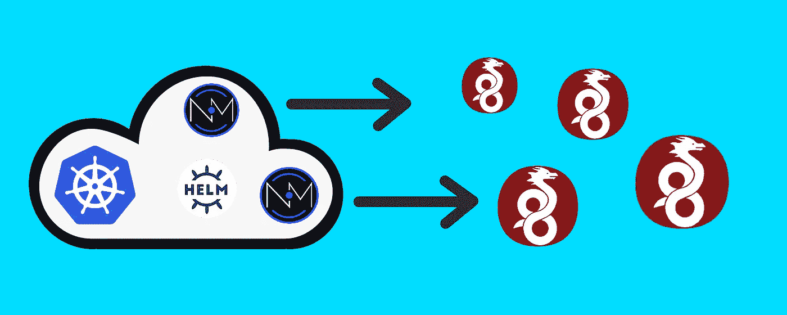

# 如何在 Kubernetes 上部署高可用的 WireGuard 网络管理服务器

> 原文：<https://itnext.io/how-to-deploy-a-highly-available-wireguard-network-management-server-on-kubernetes-294e23c7abcb?source=collection_archive---------0----------------------->



在本文中，我们将讨论 WireGuard *以及将 WireGuard* *投入生产的问题。然后我们将介绍 Netmaker，一个让您的 WireGuard* *管理高度可用的平台。最后，我们将简要介绍如何在 Kubernetes 上以 HA 模式部署 Netmaker。*

WireGuard 太棒了。它小巧、安全、速度极快。它问世的那天，让 OpenVPN 和 ZeroTier [看起来像恐龙。](https://restoreprivacy.com/vpn/wireguard-vs-openvpn/)

WireGuard 支持跨多云、edge、[和 Kubernetes](/8-use-cases-for-kubernetes-over-vpn-unlocking-multicloud-flexibility-3958dab2219f) 的尖端网络模式。我的主要问题是，为什么不是每个企业都已经将它用于他们的企业 VPN 和覆盖网络？

一个问题就是知识差距。WireGuard 比旧的 VPN 技术更容易学习，但它仍然是新的，人们喜欢坚持他们所知道的。

一个更重要的问题是大规模管理基于 WireGuard 的网络的复杂性。如果您通过 WireGuard 创建了一个包含 100 台机器的平面(点对点)虚拟网络，您需要负责管理所有 100 台机器的配置。每当任何一台机器的端点、端口或密钥改变时，或者每当一台机器被添加到网络中或从网络中移除时，所有机器上的所有配置都必须被更新。

因此，大规模管理 WireGuard 虚拟网络需要某种形式的自动化。不幸的是，到目前为止，生态系统还没有跟上。工具的出现使 WireGuard 管理变得更加容易，但它们往往处于开发周期的早期，这将我们带到了最后一个问题。

虽然存在许多工具来管理 WireGuard 自动化，但它们往往缺乏大型企业所寻求的稳定性。如果您使用服务器来管理您的网络，它最好是可靠、稳定和高度可用的。这导致企业使用 Ansible、Terraform 和 Puppet 等工具建立自己的定制自动化形式。虽然肯定可行，但如果有一个高可用性的 WireGuard 自动化工具就更好了。

输入[造网者](https://github.com/gravitl/netmaker)。Netmaker 是一个用于创建和管理基于 WireGuard 的虚拟网络的平台。Netmaker 的服务器管理认证并保存机器的配置。Netmaker 的客户端(netclient)在本地拉取和推送 WireGuard 的配置更新。最终结果是一个基于 WireGuard 的虚拟网络，当任何对等体发生任何变化时，它将自动更新。

企业需要为他们的网络微调参数，这就是为什么 Netmaker 的服务器能够远程管理广泛的参数，包括 MTU、密钥、ip 地址、DNS 等等。它还允许您处理不同类型的网络拓扑，包括全网状、站点到站点、入口、出口和中继。如果你需要 Netmaker 的介绍，你可以看看这个[演练](/getting-started-with-netmaker-a-wireguard-virtual-networking-platform-3d563fbd87f0)。

这样一个系统的关键是服务器。Netmaker v0.8.4 提供了管理高可用性服务器的更新，这样您的客户端就不会失去连接。V0.8.4 还引入了对 PostgreSQL 的支持，以最大限度地提高数据库的可靠性。

最后，v0.8.4 为 Kubernetes 引入了[掌舵图](https://github.com/gravitl/netmaker-helm)，以简化 HA 部署。这些图表创建了一个负载平衡的多实例服务器，由 HA PostgreSQL 集群提供支持。

我们现在要做一个快速演练，在 Kubernetes 上部署 HA Netmaker。

# 要求

## 舵

如果你通过 helm 安装…你将需要 helm。我们推荐[头盔 3](https://helm.sh/docs/intro/quickstart/) 。

## 进入

Netmaker 需要带有 TLS 的入口才能安全运行。通过 Helm 部署 Netmaker 时，默认情况下将禁用入口。这是因为在 Kubernetes 上，ingress 有多种形式，通常自己设置 ingress 更好。

要使 Netmaker 自动部署 Ingress，您必须具备以下条件:

cert-Manger for automated TLS Certificates:Helm chart 寻找一个“ClusterIssuer ”,并使用它来生成证书。

Nginx 或 Traefik 入口控制器:舵图可以为 Nginx 或 Traefik 生成入口对象。

如果您对部署 ingress 有其他要求，您应该禁用 ingress 并在安装后部署它。

## 节点

默认情况下，Netmaker 需要 3 个工作节点来运行 HA。这是因为每个实例都需要管理节点级的虚拟接口。

对于那些节点级接口，helm 图表还将创建 10 个节点端口。这听起来很多，但它是针对 WireGuard 接口的，这些接口是加密的。该数字可以根据需要进行修改。

## 许可

Netmaker 服务器需要 NET_ADMIN 权限来部署接口。此外，init 容器在机器上设置 ip 转发，这需要在特权模式下运行。

还建议在每个节点的内核上安装 WireGuard。如果是这样，可以在服务器上启用内核模式，这样会快很多。默认情况下，这是禁用的，以减少对节点级访问的需求，这意味着 WireGuard 将在服务器上以用户空间模式运行。

## 降低要求(客户端模式=关闭)

如果关闭了客户端模式，Netmaker 可以在没有任何节点端口或主机权限(NET_ADMIN，privileged)的情况下运行。在这种情况下，服务器上没有 WireGuard，它只是一个配置服务器。这也意味着您可以在相同的节点上运行任意多的服务器实例。

# 安装

假设您已经满足了所有的需求，让我们看两个在 Kubernetes 上部署 Netmaker 的例子。但是首先，确保在本地添加 helm repo:

```
helm repo add netmaker https://gravitl.github.io/netmaker-helm/
helm repo update
```

# 完全安装(理想)

以下是 Netmaker 的“完整安装”,列出了所有选项:

```
helm install netmaker/netmaker --generate-name 
--set wireguard.kernel=true
--set baseDomain=nm.example.com
--set replicas=3
--set ingress.enabled=true
--set ingress.className=nginx
--set ingress.tls.issuerName=letsencrypt-prod  
--set dns.enabled=true 
--set dns.clusterIP=10.245.75.75
--set dns.RWX.storageClassName=nfs 
--set postgresql-ha.postgresql.replicaCount=2
```

这个“helm install”命令将使用内核 WireGuard 安装 Netmaker。Helm 将部署服务器的 3 个副本，这意味着它预计有 3 个工作节点可用，并且必须在所有 3 个节点上安装内核 WireGuard。

通过将“nginx”设置为入口类别来启用入口。它将寻找名为“letsencrypt-prod”的 ClusterIssuer 来生成 TLS 证书。它将使用以下路由进入:

api.nm.example.com

grpc.nm.example.com

dashboard.nm.example.com

DNS 已启用，这意味着我们需要指定 DNS 要使用的 clusterIP(从服务 IP 范围中)。这也意味着我们需要一个 RWX 存储类。

最后，Bitnami 的 Postgresql-HA 图表将部署两个副本作为后备数据库。

这是你能得到的最完整的安装。

# **基础安装(最低)**

```
helm install netmaker/netmaker --generate-name 
--set baseDomain=nm.example2.com
```

下面将安装带有用户空间 WireGuard、无 DNS 和无入口的 Netmaker。Netmaker 仍然需要 Ingress 才能运行，并且您必须指定基本域。安装后，您必须为以下各项设置有效的入口路由:

api.nm2.example.com

grpc.nm2.example.com

dashboard.nm2.example.com

需要特别注意的是，gRPC 路由需要 http2。不同的入口控制器对使用 gRPC 有不同的考虑，所以请确保您了解您的提供商需要什么。

# 结论

使用 Helm chart 安装 Netmaker 后，您将拥有一个高度可用的 WireGuard 管理服务器。服务器本身可以为您的网络执行许多功能，例如充当出口和入口网关，或者为您的节点中继流量。

下一步，我们推荐[Netmaker](/getting-started-with-netmaker-a-wireguard-virtual-networking-platform-3d563fbd87f0)入门指南。有关更多信息，请查看我们关于使用 Netmaker 管理 WireGuard 网络的其他教程:

[网商文档(入门)](https://docs.netmaker.org/getting-started.html)

[多集群网络](/multi-cluster-kubernetes-networking-with-netmaker-bfa4e22eb2fb)

[安全地访问资源](https://afeiszli.medium.com/how-to-enable-secure-access-to-your-hosted-services-using-netmaker-and-wireguard-1b3282d4b7aa)

[站点到站点/网关联网](https://www.youtube.com/watch?v=krCKBJhwwDk)

**免责声明:** [WireGuard](https://wireguard.com/) 是 Jason A. Donenfeld 的注册商标。