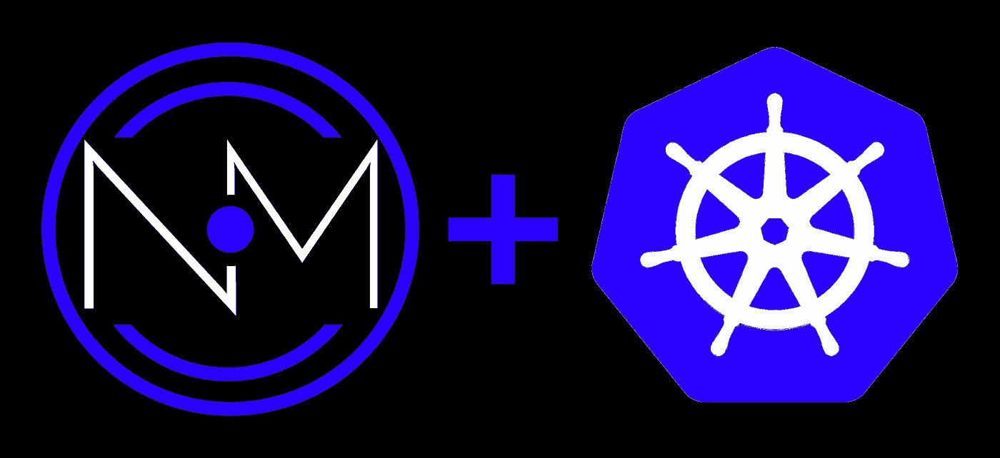
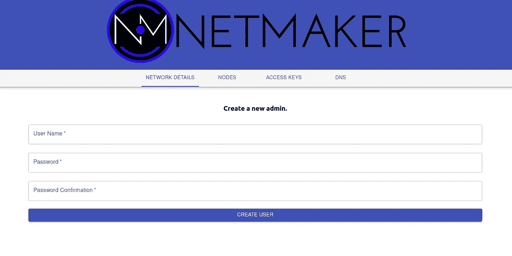
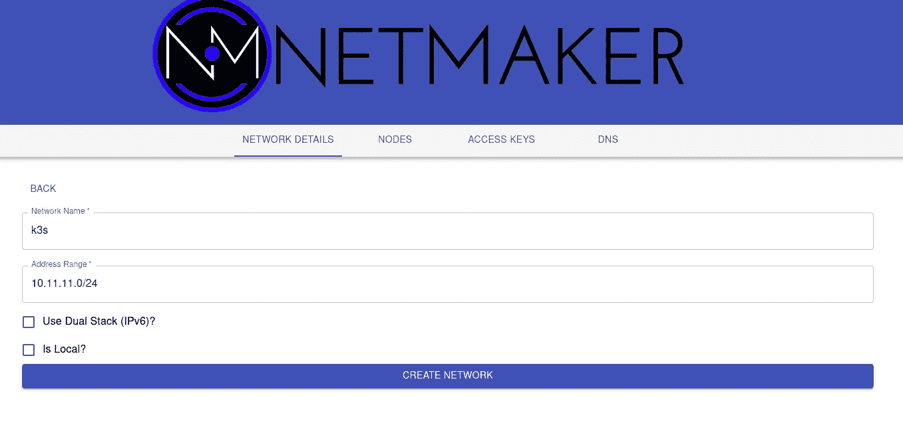
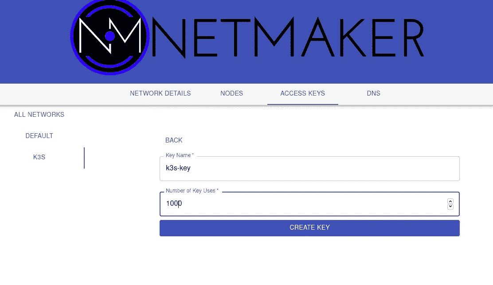
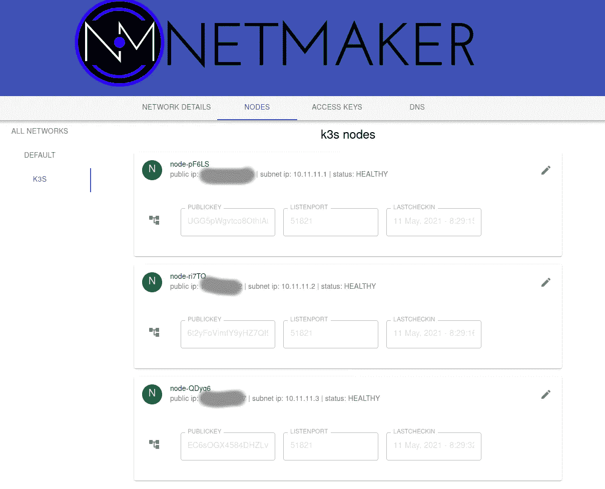
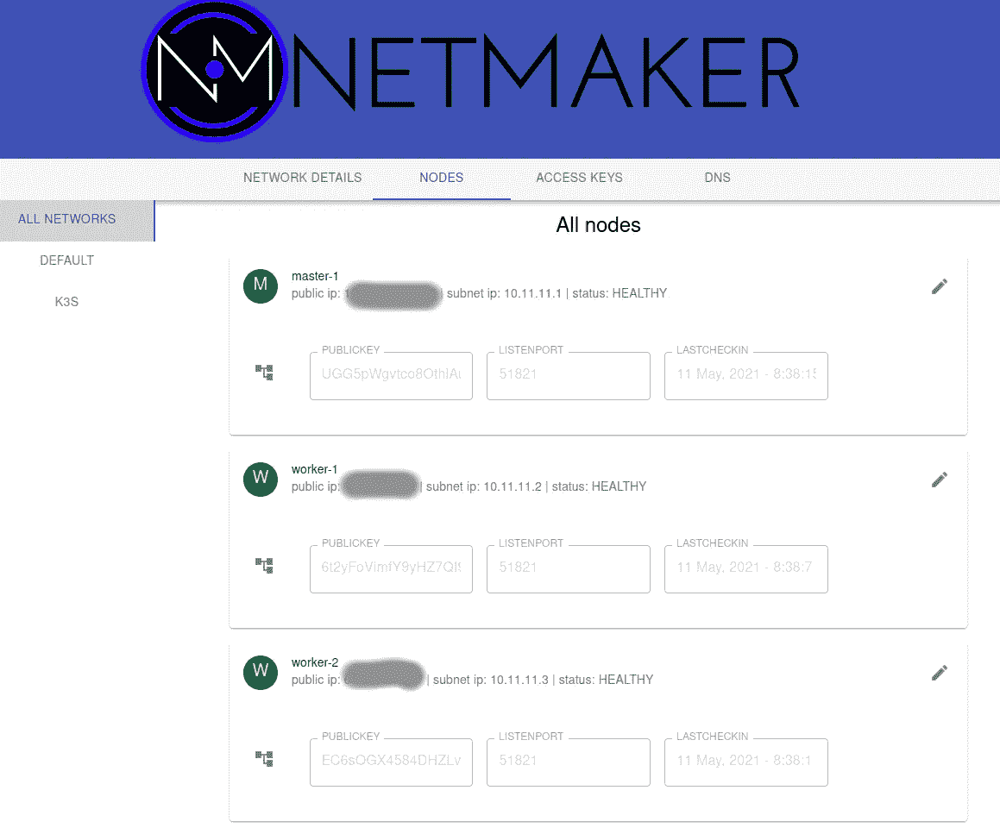
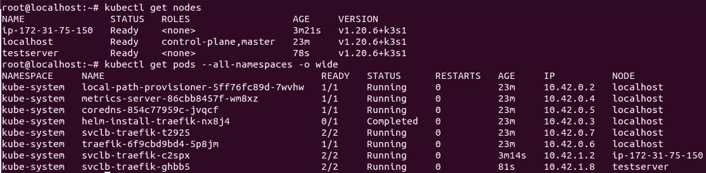
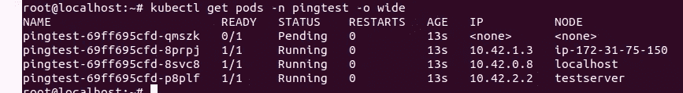
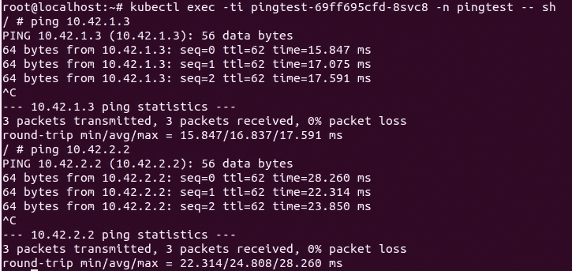

# 如何使用 k3s 和 WireGuard 跨多个云部署单个 Kubernetes 集群

> 原文：<https://itnext.io/how-to-deploy-a-single-kubernetes-cluster-across-multiple-clouds-using-k3s-and-wireguard-a5ae176a6e81?source=collection_archive---------1----------------------->

Kubernetes 已经够难的了，现在你的老板让你把你的应用从 AWS 迁移到 Azure，把你的后端和前端拆分在公共和私有数据中心，同时部署到六个不同的环境。

在你决定辞去你全新的 DevOps 工作之前，让我们看看我们是否能以一种更简单的方式来设置它。

环顾四周，您会发现有许多工具可以跨环境管理多个 Kubernetes 集群，其中许多甚至可以帮助您部署应用程序。然而，这都提出了一个重要的问题:为什么要运行多个 Kubernetes 集群？

Kubernetes 是一个控制平面加上受管理的工作节点。为什么不能将这些工作节点部署到不同的环境中，然后一劳永逸呢？

您通常会听到两种答案:

1.  你不能这样做，因为有延迟。
2.  出于安全考虑，你不能这么做。

好吧，我在这里告诉你，你可以做到这一点，这比你想象的要容易。

# **解决方案**

**1。你不能这样做，因为有延迟。**好吧，我们就继续使用 [k3s](https://rancher.com/docs/k3s/latest/en/) 。Kubernetes 的延迟问题是由于 E [tcd](https://etcd.io/docs/v3.3/op-guide/hardware/) 造成的，它对低性能环境很敏感。K3s 允许您使用没有这个问题的 SQL。另一种方法可能是让您的主服务器位于同一位置，同时分散工作人员。如果你对 Etcd 的延迟不耐受有不同的建议/解决方案，请在评论中发表。

**2。出于安全考虑，你不能这么做。**我们将在[铁丝网](https://www.wireguard.com/)上运行这个。WireGuard 棒极了。您可以在这里[了解更多信息](https://www.techradar.com/vpn/what-is-wireguard)，但总而言之，我们可以在所有节点之间创建加密隧道，以确保流量安全，同时最大限度地减少对延迟的影响。

然而，在#2 中有一个小问题。对于极少数保持不变的机器，您可以只手动配置 WireGuard。

然而，对于较大的或动态的网络，WireGuard 很快就变成了 PITA，无法自动管理和配置。假设我们想要动态地在集群中添加和删除节点。我们可能需要第三方工具。

有许多工具可以简化 WireGuard 管理，但我们将使用 [Netmaker](https://github.com/gravitl/netmaker) 。为什么？部分原因是因为是我写的！但是对于这个用例，它也工作得很好。然而，如果你不喜欢它，你可以使用[基洛](https://github.com/squat/kilo)、[虫洞](https://github.com/gravitational/wormhole)、 [Ansible 脚本](https://github.com/mawalu/wireguard-private-networking)，或者外面几十个 wire guard 配置管理器工具中的一个[。或者，手动设置即可。Arch 有好的](https://awesomeopensource.com/projects/wireguard)[文档](https://wiki.archlinux.org/title/WireGuard)。

好了，准备好开始了吗？

**顺便说一句，如果你更喜欢视觉学习，你也可以跟随这个** [**YouTube 教程**](https://youtu.be/z2jvlFVU3dw) **。**

# **设置**

几个小提示:我正试图保持这个简短和甜蜜。因此，我们不会设置 DNS、存储或高可用性。所有这些都很容易在我们正在部署的基础上进行设置，但是我们将在以后的文章中进行讨论。这仅用于演示目的，不应在生产中运行。

给自己弄几个云虚拟机。在哪里并不重要，他们只需要公共 IP。在我的配置中，我有一个 Linode、两个 AWS EC2 和一台家庭网络上的机器。三个将充当集群，一个将运行 Netmaker。

那么，让我们设置我们的节点。在每台机器上，安装 Ubuntu 20.04。如果你喜欢其他的操作系统，一堆其他的操作系统也可以工作，但是我们推荐基于 systemd 的 linux(愤怒地把你的电脑扔出窗外)。

**在每个集群节点上，安装 wireguard 工具。(例如安装电线保护工具)**

**在 Netmaker 虚拟机上，安装 docker 和 docker-compose:**

1.  [码头工人](https://docs.docker.com/engine/install/ubuntu/)
2.  [docker-compose](https://docs.docker.com/compose/install/)

此外，确保在 Netmaker 虚拟机上打开端口 80、8081 和 50051。

# **第 1 部分:Netmaker 安装/ WireGuard 设置**

我们首先需要的是一个平面的、安全的网络，供我们的集群节点进行通信。我们将创建一个“虚拟”子网 10.11.11.0/24，并将我们的节点添加到其中。

`ssh root@netmaker-vm`

`wget -O docker-compose.yml [https://raw.githubusercontent.com/gravitl/netmaker/master/docker-compose.nodns.yml](https://raw.githubusercontent.com/gravitl/netmaker/master/docker-compose.nodns.yml)`

`sed -i ‘s/your-backend/< Your VM IP Address Here >/g’ docker-compose.yml`

sudo docker-撰写 up -d

就是这样！现在转到 EC2 实例的 IP，我们应该得到 Netmaker 的 UI。

创建一个用户并使用它登录。

现在，让我们制作一个名为 k3s 的网络。只需点击左上角的“创建网络”。我们将其命名为 k3s，地址范围为 10.11.11.0/24

完美。现在我们准备设置我们的节点。首先，点击“访问密钥”，选择您的网络(k3s)并创建一个密钥。名称并不重要，但我们将称它为 k3s-key，并给它 1000 次使用。嘿，你永远不知道，这可能会成为一个大集群。点击创建并复制信息，**特别是安装脚本。(curl -sfL … | KEY=… sh -)**

现在是时候在集群虚拟机上部署 netclient 了。SSH 到每个 Ubuntu 虚拟机，并运行以下命令。

**在运行之前，确保您已经安装了 wireguard-tools 包。**

1.`which wg-quick`

2.`sudo su -`

3.`curl -sfL [https://raw.githubusercontent.com/gravitl/netmaker/v0.3/scripts/netclient-install.sh](https://raw.githubusercontent.com/gravitl/netmaker/v0.3/scripts/netclient-install.sh) | KEY=<YOUR ACCESS KEY FROM NETMAKER> sh -`

现在，快速查看 WireGuard 应该可以显示情况是否良好:

`wg show`

如果 wg show 显示了每个节点上的界面，你应该就不错了！UI 中的最后一项检查。应该是这样的。您应该看到所有的节点，它们应该是绿色的。

看起来不错。如果你愿意的话，可以随意修改这些名字，使之更合理。我在改变我的来匹配我的布局。

您可以使用此过程将任意数量的节点添加到您的集群中，但是现在，让我们继续。

# **第二部分:K3S 安装**

SSH 到将成为您的主节点的节点，并运行以下命令:

`sudo su -`

`ip a`

你应该会在`nm-k3s`下面看到一个地址。用那个地址。如果您首先通过 Netmaker 在主服务器上安装了 WireGuard，它应该是 10.11.11.1。如果没有，请在下面的脚本中用您的地址替换。

`curl -sfL [https://get.k3s.io](https://get.k3s.io) | INSTALL_K3S_EXEC=”server --node-ip 10.11.11.1 --node-external-ip 10.11.11.1 --flannel-iface nm-k3s” sh -`

让烘烤大约 5 分钟。

`systemctl status k3s.`

`kubectl get nodes`

`kubectl get pods --all-namespaces`

假设一切正常，所有的 pod 都在运行，您就可以部署工人了。但是首先，从服务器获取节点密钥:

`cat /var/lib/rancher/k3s/server/node-token`

好了，现在，在您的每个工作节点上运行以下命令:

`sudo su -`

`ip a`

获取私有 ip 地址并运行以下命令，用服务器的输出`cat /var/lib/rancher/k3s/server/node-token`替换< TOKEN VAL >，用来自`ip a`的 IP 地址替换 10.11.11.X，用主私有 IP 地址替换`[10.11.11.MASTER](https://10.70.0.1:6443)`(例如 10.11.11.1)。

`curl -sfL [https://get.k3s.io](https://get.k3s.io) | INSTALL_K3S_EXEC=”agent --server [https://10.11.11.MASTER:6443](https://10.70.0.1:6443) --token < TOKEN VAL > --node-ip 10.11.11.X --node-external-ip 10.11.11.X --flannel-iface nm-k3s” sh -`

`systemctl status k3s-agent`

回到主界面，让我们看看事情是怎样的:

`sudo kubectl get nodes`

`sudo kubectl get pods --all-namespaces -o wide`

如果您的所有节点都显示出来，并且您已经在这些节点上运行了 pod，那么您就一切就绪了！

现在，让我们确保这是真正的工作。我们的节点运行了，但是我们的 pod 和服务能跨云工作吗？让我们找出答案。

# **第 4 部分:测试**

部署 pingtest。这些只是安装了“ping”的简单容器( [Calico](https://docs.projectcalico.org/getting-started/kubernetes/hardway/test-networking) 也有这方面的指南)。

创建 pingtest.yaml

https://pastebin.com/BSqLnP57[YAML](https://pastebin.com/BSqLnP57)

`kubectl create namespace pingtest`

`kubectl apply -f pingtest.yaml`

kubectl get pods -n pingtest -o wide

很好，我们在所有 3 个节点上运行了 3 个 pod。如果您的 pingtest pods 比 nodes 多，那么额外的 pods 将会被挂起(如上)，这对这个测试来说是没问题的。

现在，进入其中一个 pod，ping 另一个 pod IP:

太好了！我们可以 ping 不同云中运行的 pod。最后一次测试的时间到了。我们的**服务网络**能跨云工作吗？让我们部署一个 nginx 服务器，前面有一个负载均衡服务。

https://pastebin.com/ttadjjDA:[YAML](https://pastebin.com/ttadjjDA)

`kubectl create namespace nginx`

`kubectl apply -f nginx.yaml -n nginx`

现在，exec 返回到 pingtest pod，该 pod 运行在与 nginx pods 不同的主机上，并尝试使用集群服务名获取 index.html

`kubectl exec -ti pingtest-69ff695cfd-8svc8 -n pingtest -- sh`

`wget nginx.nginx.svc.cluster.local`

如果您能够检索到文档，那么恭喜您，您已经为跨云 Kubernete 集群做好了准备！

# 结论

那还不算太糟，是吗？我们使用 K3S 和 WireGuard 创建了一个跨越多个云的单一 Kubernetes 集群。如果我们想向它添加更多的节点，过程非常简单。只需在节点上运行 Netmaker 安装脚本和 K3S 安装脚本。

我们还可以做很多事情，比如设置多个主服务器的高可用性，添加入口，以及创建分布式存储。

此外，现在我们有了一个运行在多个云中的集群，我们可以使用许多新的部署模式。我们可以运行混合云应用程序，我们可以在云之间移动应用程序，以及许多其他事情。

我们还可以用一种特殊的方式部署 Netmaker，这样在集群启动后，它就成为集群的一部分，不再需要额外的虚拟机。

然而，这些都是未来文章的主题。这只是设置跨云集群的一个简单介绍。现在，祝你好运！让我知道你在评论中遇到的任何问题。

如果你有兴趣讨论你的业务模式，你可以通过 info@gravitl.com 或 https://gravitl.com/book.联系