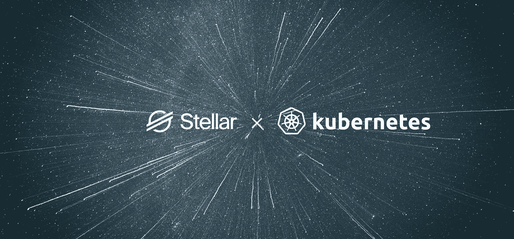

# 如何使用 Helm 在 Kubernetes 上部署恒星验证器

> 原文：<https://itnext.io/how-to-deploy-a-stellar-validator-on-kubernetes-with-helm-a111e5dfe437?source=collection_archive---------2----------------------->

作者:安德烈·高卢和 T2 托德·卡普兰。



# 介绍

在本文接下来的部分中，我们将指导开发人员完成建立一个 [Stellar](https://www.stellar.org) 验证器节点的过程，该节点可以加入 [Stellar Testnet](https://www.stellar.org/developers/guides/concepts/test-net.html) 。我们将演示使用 [Helm](https://helm.sh/) 将这些服务部署到 [Kubernetes](https://kubernetes.io/) (这里:IBM Cloud 和 Google Cloud)的步骤，以及一些基本示例来验证系统是否成功地与网络同步。随着业界对令牌和 Stellar 的强烈兴趣，我们希望这些掌舵图可以加快您的部署。

# 恒星背景

Stellar 是一个开源的分散支付网络。该协议支持数字货币和法定货币，并允许任何一对货币之间的跨境交易。Stellar 由两个关键服务组成:

*   **Stellar Core:** 分布式 Stellar 网络由运行 Stellar Core 软件的服务器组成。这些服务器由不同的个人和实体维护。Stellar Core 维护分类账的本地副本并验证交易，然后将这些交易应用于上一个分类账以形成下一个分类账。为了与其他节点达成全球共识，Stellar Core 运行 Stellar 共识协议(SCP)。
*   **Stellar Horizon:** 用于查询账本和与网络交互 Horizon 提供了 RESTful API。它允许您提交交易、检查帐户状态以及订阅事件流。

# 部署选项

Stellar 社区一直忙于创建简单的方法来将 Stellar Core 和 Horizon 整合到您自己的基础架构中。我们遇到的两个最常见的部署是 [Stellar Quickstart Docker 映像](https://hub.docker.com/r/stellar/quickstart)和 [SatoshiPay 的 Docker 映像和 Docker 组合配置](https://github.com/satoshipay/docker-stellar-horizon)。无论您是希望运行一个本地 Stellar 节点进行单元测试(Stellar Quickstart 在这里很棒)还是希望建立一个演示或测试环境(SatoshiPay 的 Docker Compose 版本在这里很棒),都有可以在几分钟内部署的部署选项。但是，在简化生产级云基础架构的部署方面存在差距。SatoshiPay 已经将 Kubernetes 用于其恒星基础设施一年多了，由于许多主要的云提供商支持 Kubernetes，SatoshiPay 将其基于 [Helm 的 Kubernetes 基础设施代码](https://github.com/satoshipay/stellar-helm-charts/)作为开源代码发布，并与 IBM 合作测试和改进在其他云上的部署:

[](https://github.com/satoshipay/stellar-helm-charts) [## Satoshi pay/恒星舵图

### 恒星应用的舵轮图(核心、地平线、Friendbot、...)-satoshipay/恒星舵图

github.com](https://github.com/satoshipay/stellar-helm-charts) 

本文中的例子已经在 IBM Cloud 中的 Kubernetes 集群上进行了测试。同一个舵图表为 SatoshiPay 在谷歌云中的全部验证器节点提供动力。

# 为什么是赫尔姆？

Helm 是 Kubernetes 部署的一个包管理器。在 Helm 的术语中，一个包被称为图表。要开始使用 Helm 并安装 Helm 图表，您需要下载 Helm CLI 并将集群端组件 *Tiller* 安装到现有的 Kubernetes 集群中。出于本文的目的，我们假设您已经有了一个现有的 Kubernetes 集群。

# 准备 Kubernetes 集群

## 安装舵

在安装 Helm 之前，集群需要一些基本的 RBAC 安全设置。Helm 文档提供了有关 RBAC([https://helm.sh/docs/rbac/](https://helm.sh/docs/rbac/))的更多详细信息，但为了简单起见，我们将提供一个基本服务帐户和群集角色绑定，以允许 Helm CLI 与目标群集交互。一旦 RBAC 配置完成，我们就可以下载最新版本的 Helm 并初始化服务器组件 Helm Tiller。

```
## Set up Helm security
$ kubectl --namespace kube-system create serviceaccount tiller
$ kubectl create clusterrolebinding tiller-cluster-rule \
    --clusterrole=cluster-admin \
    --serviceaccount=kube-system:tiller$ kubectl --namespace kube-system patch deploy tiller-deploy \
    -p '{"spec":{"template":{"spec":{"serviceAccount":"tiller"}}}}'## Get helm
$ curl -L [https://git.io/get_helm.sh](https://git.io/get_helm.sh) | bash## Initialize Helm (installs Tiller in the cluster)
$ helm init --service-account tiller
```

## 特定于云的集群初始化

您正在使用的集群可能需要一些特定于运行集群的位置和方式的初始化。一个典型的任务是创建存储类，以便磁盘可以自动配置所需的属性，或者设置入口控制器以公开 HTTP 端点。我们在这里为存储类提供了两个示例:

*   [IBM 云块存储类](https://gist.github.com/andrenarchy/c72016d3620a5bf1849b283ddd140646)
*   [谷歌云 SSD 存储类](https://gist.github.com/andrenarchy/699f471e28cea3142c7e5d5ca092fd6b)

# 安装恒星核心

## 生成节点种子

恒星核心需要为每个恒星核心节点生成一个节点种子。要生成我们将被用作节点种子的秘密，只需运行此命令，并在稍后安装 Stellar Core helm 图表时提供此种子。

```
$ docker run --rm -it --entrypoint '' \
    satoshipay/stellar-core \
    stellar-core gen-seed
```

输出将如下所示:

```
Secret seed: SBH2ZIGO5DHNAPJTDAXA74JARGTHXG3YBY5A3VBXZX44VGHQ6QMWDDI7
Public: GD5PNS22BMZOKUAPELTRUH5E5P4Q4NEZHFRBJ6V6X7HJZSMPTB6GNT3Q
```

## 获取舵图

为了保持简单，我们将通过克隆一个现有的 GitHub repo 来快速启动。

```
$ git clone [https://github.com/satoshipay/stellar-helm-charts.git](https://github.com/satoshipay/stellar-helm-charts.git)
```

在此报告中，有一组舵图和默认测试网值可用于推动 Stellar Core 和 Horizon 的部署。

## 获取依赖关系

现在你已经初始化了头盔，并正确配置了 RBAC，我们将安装核心恒星头盔图。Stellar Core 依赖于 PostgreSQL，这在 Helm chart `requirements.yaml`中声明。Helm 将确定需要部署的子图表，并在安装父图表之前安装这些依赖关系。

安装舵图及其要求的步骤如下:

```
# Download chart dependency (postgresql)
$ helm repo update
$ helm dependency update stellar-core
```

## 安装时间

```
# Use the node seed that you generated
$ NODE_SEED=SBH2ZIGO5DHNAPJTDAXA74JARGTHXG3YBY5A3VBXZX44VGHQ6QMWDDI7# Install Stellar Core and dependency (postgresql)
$ helm install \
    --namespace stellar-testnet \
    --name stellar-core \
    --set nodeSeed=$NODE_SEED \
    --values stellar-core.testnet.values.yaml \
    stellar-core
```

您会注意到，在 Helm install 命令中，我们指定了一个表示 Testnet 配置的值文件。为了加入测试网络，Stellar Core 需要了解测试网络中现有的已知对等体，如何加入 Stellar Consensus 协议，以及在哪里检索历史测试网络数据。

## 验证恒星核心已同步

验证您的 Stellar 节点是否同步的最简单方法是查看 Stellar Core 的 pod 日志。恒星核心舱的名字是动态的，但是有一个基于舵表名称的明确的前缀(恒星核心)。在我们的本地部署中，我们将演示要查看的内容以及我们有一个同步节点的指示器。

首先查看活动日志(在本例中，pod 是`stellar-core-5d4db749cb-95zl`):

```
$ kubectl -n stellar-testnet get pods
NAME                           READY  STATUS   RESTARTS   AGE
stellar-core-5d4db749cb-95fzl  1/1    Running  4          57m
stellar-core-postgresql-0      1/1    Running  0          56m
```

然后查看 pod 的日志:

```
$ kubectl -n stellar-testnet logs stellar-core-5d4db749cb-95fzl
```

一旦`validated`属性为`true`，您的节点将参与 SCP 并验证事务。

```
2019-05-30T18:47:44.111 GBN6Y [Ledger INFO] Got consensus: [seq=591360, prev=74a7a5, txs=5, ops=78, sv: [ txH: c90a05, ct: 1559242064, upgrades: [ ] ]]
2019-05-30T18:47:44.112 GBN6Y [Tx INFO] applying ledger 591360 (txs:5, ops:78)
2019-05-30T18:47:44.169 GBN6Y [Ledger INFO] Closed ledger: [seq=591360, hash=949c36]
2019-05-30T18:47:50.861 GBN6Y [Herder INFO] Quorum information for 591359 : {"agree":3,"delayed":0,"disagree":0,"fail_at":1,"hash":"1e8826","missing":1,"phase":"EXTERNALIZE",**"validated":true**}
```

# 安装恒星地平线

一旦我们有了同步的恒星核心节点，我们就准备好安装地平线服务。与 Stellar Core 类似，Horizon 也对 PostgreSQL 有依赖性。在更新 Helm repo 和获取 Helm chart 的依赖关系方面，这些命令非常相似。您会注意到，在这一步中，我们再次定义了一个值文件，它覆盖了舵图中定义的默认设置。我们还提供了一个覆盖集合，使用`--set`选项来配置入口(入口是前门代理，对于每个集群都是唯一的)。在`values.yaml`中，我们配置现有 Stellar Core 安装的位置以及 Stellar Core 使用的 PostgreSQL 数据库。

## 获取依赖关系

```
$ helm repo update
$ helm dependency update stellar-horizon
helm install \
  --namespace stellar-testnet \
  --name stellar-horizon \
  --set ingress.enabled=true \
  --set ingress.hosts[0].name="stellar-satoshipay.us-south.containers.appdomain.cloud" \
  --set ingress.hosts[0].tlsSecret="stellar-satoshipay" \
  --set service.port=8000 \
  --values stellar-horizon.testnet.values.yaml \
  stellar-horizon
```

## 验证 Horizon 是否已准备好处理请求

Stellar Horizon 服务利用 Kubernetes 探测(活跃度和就绪度)。你可以在 [Kubernetes 文档](https://kubernetes.io/docs/tasks/configure-pod-container/configure-liveness-readiness-probes/)中了解更多。现在，我们将简单地检查豆荚被认为准备好了。一旦我们准备好恒星地平线吊舱，我们可以再次扫描日志，以确定我们是否准备好了。

```
$ kubectl -n stellar-testnet get pods
NAME                             READY   STATUS   RESTARTS  AGE
stellar-core-5d4db749cb-95fzl    1/1     Running  4         67m
stellar-core-postgresql-0        1/1     Running  0         66m
stellar-horizon-58df4489fd-t6r8z 1/1     Running  3         67m
stellar-horizon-postgresql-0     1/1     Running  0         3h14m
```

现在，使用以下命令检查 Horizon 的日志:

```
$ kubectl -n stellar-testnet logs stellar-horizon-58df4489fd-t6r8z
```

如果接收了分类帐，则日志将类似于以下内容:

```
time="2019-05-30T19:08:16.458Z" level=info msg="Ingesting ledgers..." first_ledger=591587 last_ledger=591587 pid=1 service=ingest
time="2019-05-30T19:08:16.474Z" level=info msg="Finished ingesting ledgers" duration=0.015715012 first_ledger=591587 last_ledger=591587 pid=1 service=ingest
```

到目前为止，我们已经完成了系统准备就绪的验证工作。值得一提的是，我们还有两个 PostgreSQL 数据库正在运行。如果您看到数据库没有运行，您可能遇到了存储权限问题或错误的存储类。我们发现，在尝试使用 Horizon 做任何事情之前，确保 Stellar Core 完全启动并已同步是一个绝对的要求。

# 与地平线互动

在我们确认我们已经加入了 Stellar 网络之后，我们可以用 Friendbot 运行一个简单的测试来演示在 Stellar Testnet 上创建的帐户可以通过我们的 Stellar 节点访问。[恒星实验室](https://www.stellar.org/laboratory/#account-creator?network=test)为生成密钥对和资助测试网络账户提供了一个很好的网络界面。


一旦密钥对生成，帐户获得 10，000 流明的资金，我们现在可以验证我们的恒星节点同步网络产生的新分类帐。

出于演示的目的，我们可以直接访问恒星视界服务器的根 URL(这里:`http://stellar-satoshipay.us-south.containers.appdomain.cloud/`)。使用用 Friendbot 创建的公钥，我们现在可以验证帐户已经被创建(这里:`http://stellar-satoshipay.us-south.containers.appdomain.cloud/accounts/GA344BMFZOU3GSPKGRDQ7UY6TX5GKOFGLBCGEWMDMV62MTAQCFRUD6CA`)，并且还可以验证帐户余额是 10，000 流明。

# 关于作者

[安德烈·高卢](https://medium.com/u/22611cde22cf?source=post_page-----a111e5dfe437--------------------------------)([@安德烈·纳西](https://twitter.com/andrenarchy))是 [SatoshiPay](https://satoshipay.io) 的研究员，维护着他们遍布全球的全恒星验证器节点。他拥有数学博士学位，是合作研究平台 [PaperHive](https://paperhive.org) 的首席执行官。

[Todd kap linger](https://medium.com/u/b6a063a267d2?source=post_page-----a111e5dfe437--------------------------------)([@ tod kap](https://twitter.com/todkap))是一位技术娴熟的创新者，擅长交付复杂的云软件架构、工程和开发，拥有招募和建立强大技术组织的丰富经验。凭借 20 多年的软件工程经验，他领导了云、移动和 Web 领域的开发，最近还领导了使用 Stellar 的数字令牌的开发。在 IBM 工作了 18 年后，他最近加入了 NCR。

## 参考

这篇文章的摘录来自[维基百科](https://en.wikipedia.org/wiki/Stellar_(payment_network))、[恒星发展基金会](https://www.stellar.org)和 [SatoshiPay 博客](https://medium.com/@SatoshiPay/stellar-network-growth-and-decentralisation-e99c52ade798)。