# 如何使用 Netmaker 为 AWS 远程访问部署 WireGuard VPN

> 原文：<https://itnext.io/how-to-deploy-a-wireguard-vpn-for-aws-remote-access-with-netmaker-a3b8d0f59af2?source=collection_archive---------1----------------------->

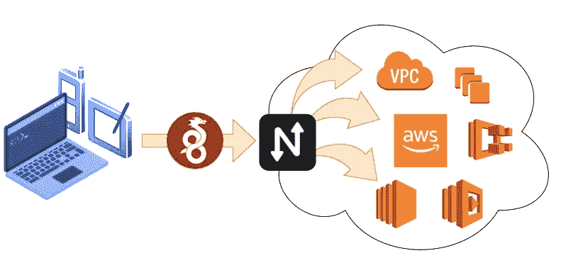

AWS 有大量的 VPN 工具:AWS 客户端 VPN、AWS 直接连接和 AWS 站点到站点，仅举几例。[你可以在这里看到完整的列表](https://docs.aws.amazon.com/whitepapers/latest/aws-vpc-connectivity-options/introduction.html)。

那么为什么要在 AWS 上设置自己的 VPN 呢？我也想知道同样的事情，但是我们的很多用户都在 AWS 上使用 Netmaker。我问他们为什么，主要有三个原因:**成本、可配置性、wire guard**T4。

我们的大多数用户都对使用 WireGuard 作为他们的 VPN 感兴趣，因为它快速、高效、先进。AWS 目前对此没有任何选择。如果你想用 WireGuard，你需要自己卷。

此外，AWS 解决方案不太容易定制。它们往往是为某些用例量身定制的。如果您需要定制您的 VPN，同样，您可能需要第三方解决方案。

最后，AWS 工具可能非常昂贵！有时推出自己的解决方案在财务上很有意义。

今天，我们将在用户中设置一个常见的用例:使用 WireGuard 远程访问 AWS。我们通过 Netmaker 实现这一点，这是一个用于自动化 WireGuard 网络的强大虚拟网络平台。

我们将分三步进行设置:

1.  部署 Netmaker
2.  为远程访问配置 Netmaker
3.  通过 WireGuard 测试对私有资源的访问

# 部署 Netmaker

我们要做的第一件事是部署一个 Lightsail VPS 来托管 Netmaker。您也可以轻松地使用 EC2 实例，所以您可以自己选择。

## **1。创建一台具有以下规格的机器:**

*   Ubuntu 20.04
*   至少 1GB 内存和 1 个 CPU
*   部署在您想要到达的专用网络中

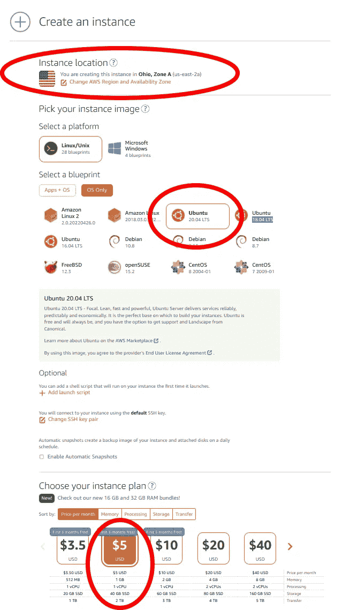

## 2.配置网络规则

部署实例后，将静态 IP 连接到服务器:

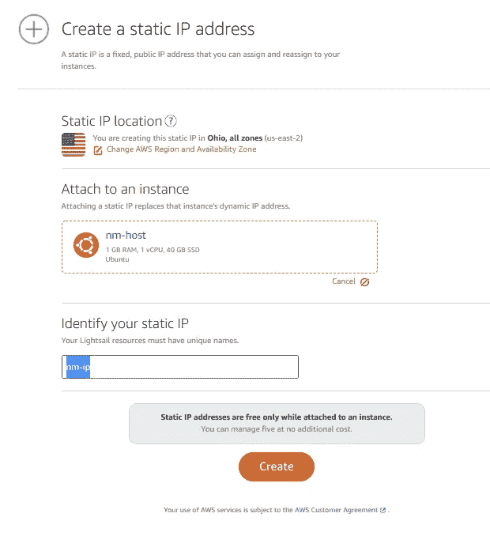

接下来，转到您的实例并设置防火墙。您需要端口 443 (tcp)和 51821–51825(UDP)。您可以删除端口 80(默认情况下启用):


## 3.安装 Netmaker

通过 SSH 连接到您的主机。您需要为服务器设置一个**域**。如果您没有或者不在乎，可以使用快速安装脚本:

```
wget -qO - https://raw.githubusercontent.com/gravitl/netmaker/master/scripts/nm-quick.sh | sudo bash
```

**否则，如果您想使用自己的域，** [**遵循这些指令**](https://docs.netmaker.org/quick-start.html) **。**

# 配置 Netmaker

成功安装 Netmaker 后，请转到仪表板 URL，并为 VPC 访问配置您的服务器。首先，创建一个管理员用户，并登录:

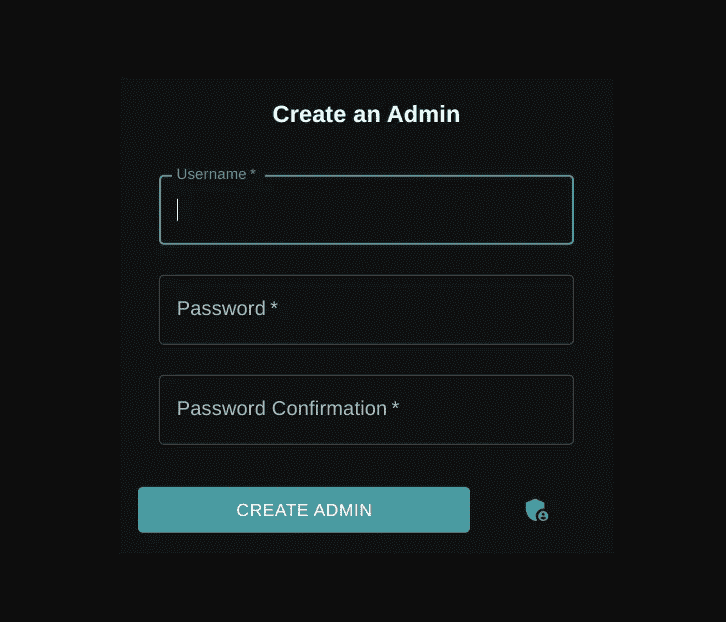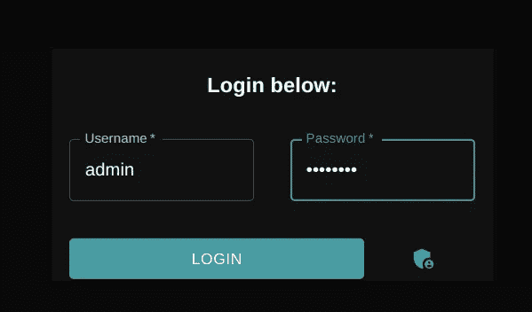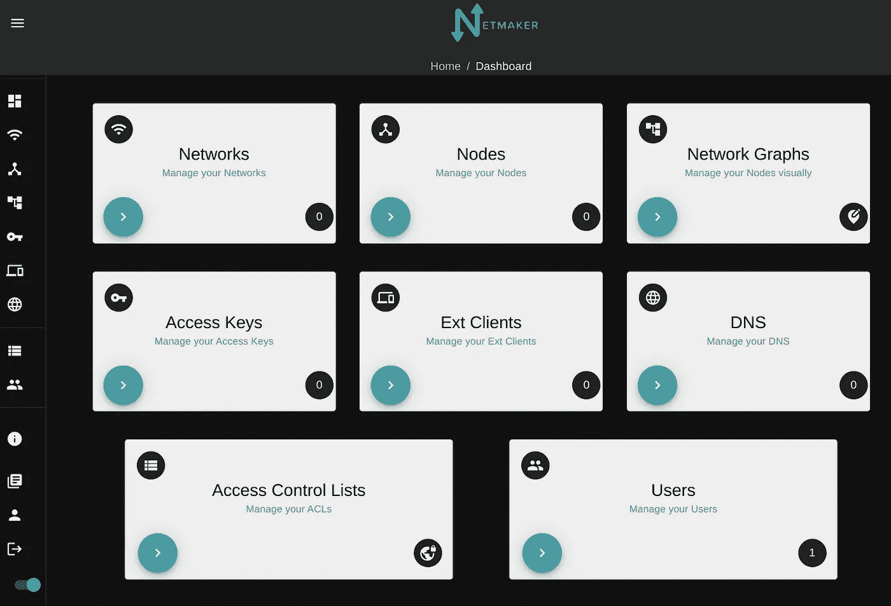

接下来，创建一个网络。这是 VPN 网络，与 VPC 无关。它可以有您想要的任何私有地址范围，只要它不与实例上的 VPC /私有地址空间重叠。最好进行如下配置:

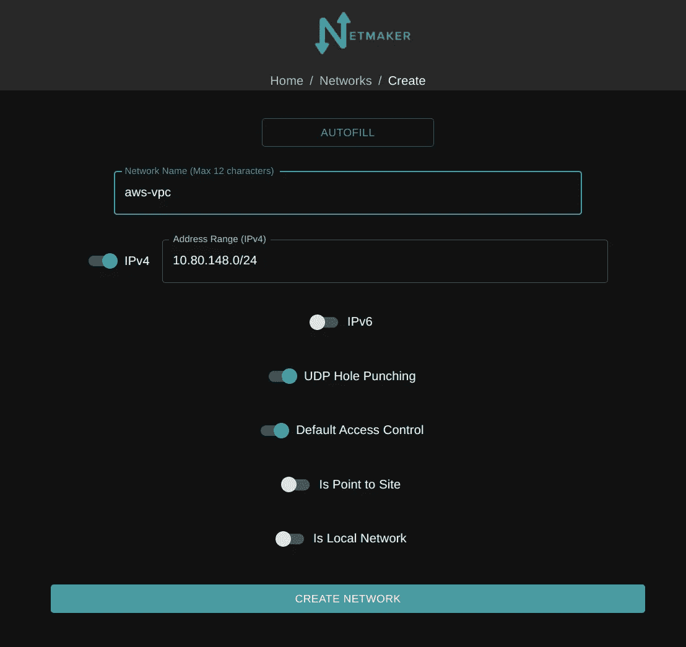

一旦你的网络创建完毕，点击它。您将看到网络中的单个节点， **netmaker-1** 。这是服务器。我们将把它配置为**入站**设备(入口)和**出站**流量(出口)的“网关”。

对于入站设备，单击按钮“创建入口网关”:

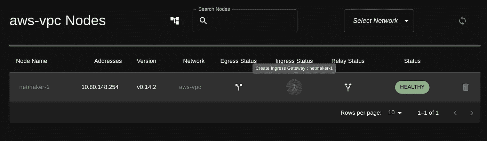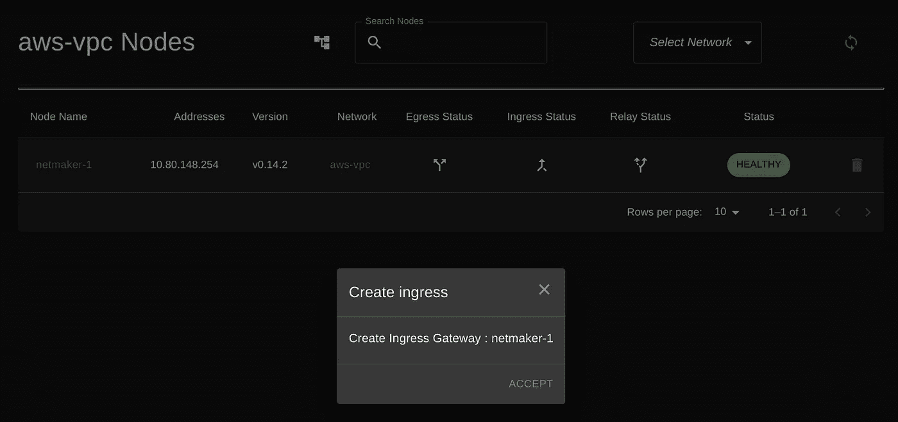

接下来，我们将把您的服务器配置为专用网络的“出口网关”。这可能有点棘手。您需要检查您的 AWS 设置，以确定哪个私有地址空间(子网)是正确的。您还需要知道使用哪个接口。为此，在服务器主机的命令行上，键入: **"ip a"** ，并查找对应于专用网络的地址。

例如，在我们的例子中，私有网络是 **172.26.0.0/16** (我们的 Lightsail VPS 的私有地址范围)**。**当我们在本地查看使用“ip a”的接口时，我们看到在接口 **eth0** 上有一个对应的地址 172.26.14.8，所以这是正确的接口。

***作者注:*** *虽然这超出了本教程的范围，但是您也可以将一个“节点”部署到 VPC 或专用网络中，并将其设置为“出口网关”如果您无法将 Netmaker 部署到目标环境中，或者如果您需要访问多个专用网络范围，这将非常有用。*

知道接口和子网后，您可以单击“创建出口网关”，并输入信息:

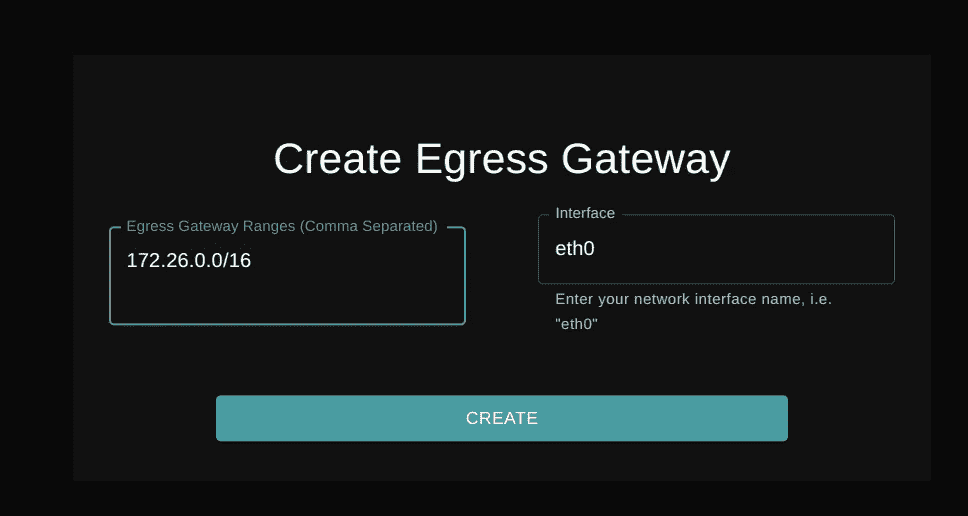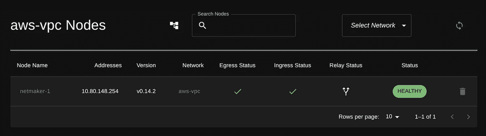

您的服务器现在可以用于远程访问了。剩下要做的就是创建一个客户端，以便在笔记本电脑或手机等设备上使用。转到“外部客户端”并生成一个新的客户端配置文件。这只是一个简单的 WireGuard 配置文件，可以附加到任何运行 WireGuard 的机器上。

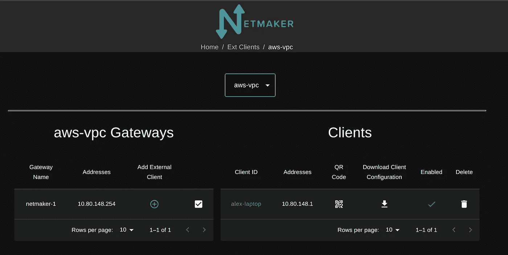

# 测试 WireGuard 访问

要使用配置文件，我们必须在设备上安装 WireGuard。如果是手机，你只需扫描 WireGuard 应用程序生成的二维码即可获得访问权限。如果是笔记本电脑，您可以下载配置文件并使用 wg-quick 运行它:

```
wg-quick up ~/Downloads/alex-laptop.conf
```

对于这个例子，我已经使用 Lightsail 部署了一个 Wordpress 服务器。默认情况下，Lightsail VPS 获得一个公共端点。你不能移除公共端点，但是你*可以*禁用到达它的能力。只需从打开的端口移除 443 和 80:

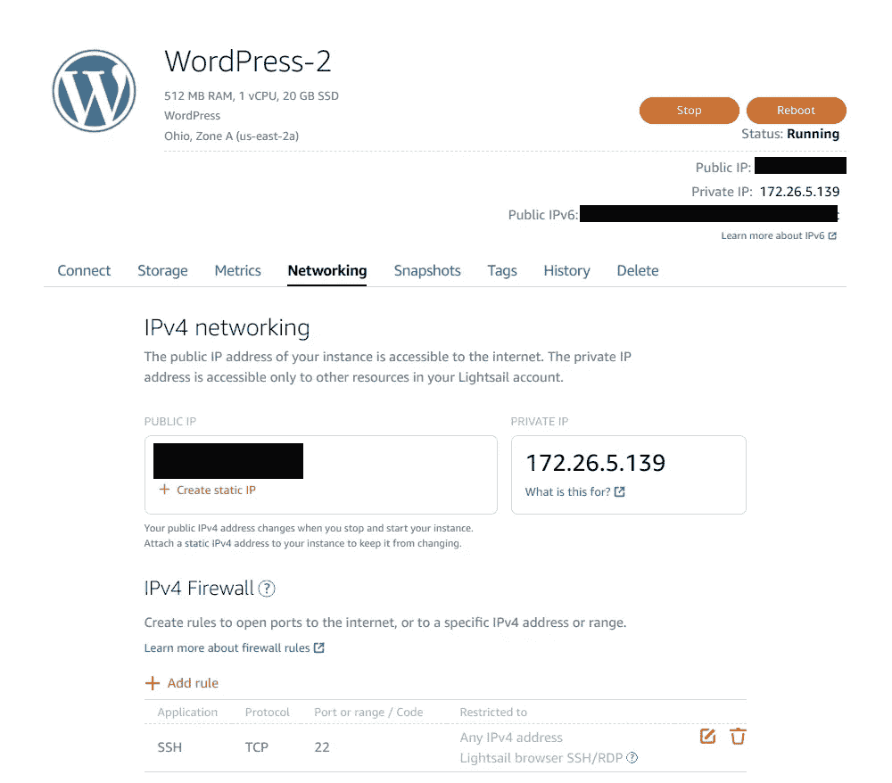

现在只能从私有地址访问该服务器。

我在本地设置了 WireGuard，进入我的浏览器，然后*瞧*！

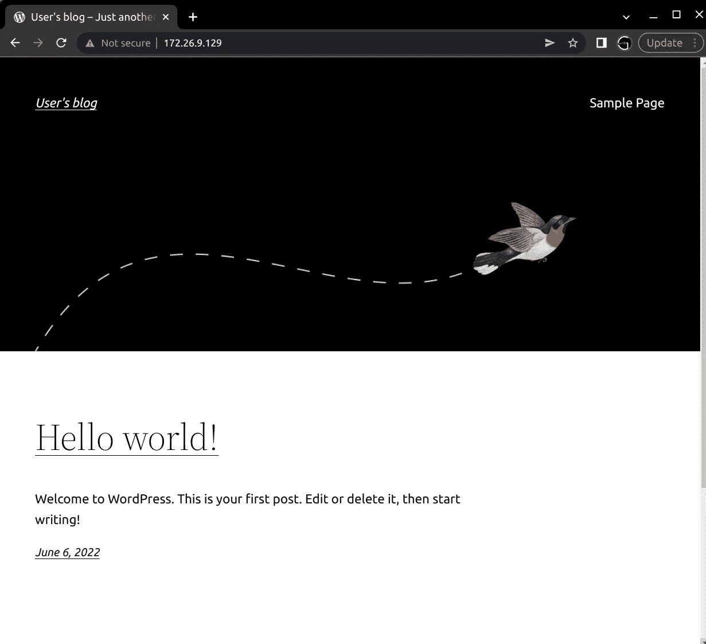

如果我关闭 WireGuard(使用 wg-quick down)或尝试访问公共端点，网站将无法访问。

我们的 Netmaker 服务器正式成为我们专用 AWS 网络的 VPN 网关。

# 结论

我们现在已经通过 Netmaker 使用 WireGuard VPN 设置了对 AWS 资源的远程访问。

您可以做类似的事情来访问 AWS 中的几乎任何资源。

Netmaker 是一个强大的工具，并且是高度可配置的。如果您希望到达多个地址空间(例如，不同区域中的 VPC)，您可以在每个环境中部署一个节点，并将其配置为“出口网关”，就像我们上面所做的那样。关于部署节点的更多信息(我们在本教程中没有涉及到)请看这里:[https://docs.netmaker.org/netclient.html](https://docs.netmaker.org/netclient.html)

***免责声明:****[*wire guard*](https://wireguard.com/)*是 Jason A. Donenfeld 的注册商标。**