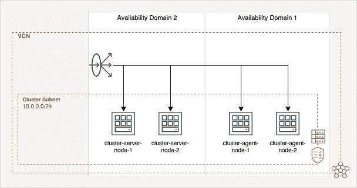

# 如何在 Oracle 云基础架构上部署始终免费的 K3s 集群

> 原文：<https://itnext.io/how-to-deploy-an-always-free-k3s-cluster-on-the-oracle-cloud-infrastructure-4aed6d6d8604?source=collection_archive---------2----------------------->


照片由 [Niklas9416](https://pixabay.com/de/users/niklas9416-4093236/) 从 [Pixabay](https://pixabay.com/de/photos/hamburg-hafen-schiff-container-6849995/) 拍摄

Kubernetes 现在几乎可以在每个现代公司找到，这就是为什么对教程和培训的兴趣增长强劲。他们中的大多数人在学习过程中都面临着这样的问题，即他们希望在不花费很高成本的情况下将所学的知识应用到自己的服务中。通常有两种方法可以做到这一点，要么在自己的硬件上建立自托管集群，要么使用云基础设施。在大多数情况下，这两种方法都要花不少钱。这正是本文的切入点，它解释了如何在 Oracle 云基础架构(OCI)的永久免费资源上全自动部署 4 节点 K3s 集群。

这个项目中使用的所有资源都可以在我的 [Gitlab 资源库](https://github.com/r0b2g1t/k3s-cluster-on-oracle-cloud-infrastructure)中找到，并且可以用于这个目的。

# 体系结构

集群基础设施基于四个节点，两个服务器节点和两个代理节点用于您的工作负载。负载平衡器将流量分配到端口 443 上的节点。服务器节点位于可用性域 2 (AD-2)中，代理节点在 AD-1 中创建。它们由 [Terraform](https://www.terraform.io) 提供，并将自动安装 [k3os](https://k3os.io) ，k3os 会自行设置集群。集群使用存储解决方案 [Longhorn](https://longhorn.io/) ，它将使用 OCI 实例的块存储，并在它们之间共享 Kubernetes 卷。下图概述了基础设施。



# 配置

首先，您需要设置一些 OCI 平台提供商所需的环境变量。 [Oracle 云基础设施文档](https://docs.oracle.com/en-us/iaas/developer-tutorials/tutorials/tf-provider/01-summary.htm)很好地概述了 id 和信息的位置，并解释了如何设置 Terraform。

```
export TF_VAR_compartment_id="<COMPARTMENT_ID>"
export TF_VAR_region="<REGION_NAME>"
export TF_VAR_tenancy_ocid="<TENANCY_OICD>"
export TF_VAR_user_ocid="<USER_OICD>"
export TF_VAR_fingerprint="<RSA_FINGERPRINT>"
export TF_VAR_private_key_path="<PATH_TO_YOUR_PRIVATE_KEY>"
export TF_VAR_ssh_authorized_keys='["<SSH_PUBLIC_KEY>"]'
```

# 部署

部署是一个简单的过程。首先，从 Terraform init 开始:

```
terraform init
```

其次，您必须通过以下命令创建一个地形平面图:

```
terraform plan -out .tfplan
```

最后应用计划:

```
terraform apply ".tfplan"
```

几分钟后，OCI 实例创建完毕，集群启动并运行。并且能够通过 SSH 连接到您的服务器 node-1 来获取 kube-config。

```
scp rancher@<SERVER_NODE_1_PUBLIC_IP>:/etc/rancher/k3s/k3s.yaml ~/.kube/config
```

现在您可以使用`kubectl`来管理您的集群并检查节点:

```
kubectl get nodes
```

# 长角牛装置

最后，您必须通过`kubectl`或`helm`方法的以下命令来部署 [Longhorn](https://longhorn.io/) 分布式块存储:

方法一通过`kubectl`:

```
kubectl apply -f [https://raw.githubusercontent.com/longhorn/longhorn/v1.2.3/deploy/longhorn.yaml](https://raw.githubusercontent.com/longhorn/longhorn/v1.2.3/deploy/longhorn.yaml)
```

`helm`的方法 2:你可以在`services`文件夹中找到一个包含所有命令的 shell 脚本，它可以同时运行以下所有命令。

```
helm repo add longhorn https://charts.longhorn.io
helm repo update
kubectl create namespace longhorn-system
helm install longhorn longhorn/longhorn --namespace longhorn-system
```

此外，对于这两种方法，您都必须删除作为默认置备程序的本地路径，并将 Longhorn 设置为默认路径:

```
kubectl patch storageclass local-path -p '{"metadata": {"annotations":{"storageclass.kubernetes.io/is-default-class":"false"}}}'
kubectl patch storageclass longhorn -p '{"metadata": {"annotations":{"storageclass.kubernetes.io/is-default-class":"true"}}}'
```

检查长角牛`storageclass`:

```
kubectl get storageclass
```

几分钟后，所有 pod 都处于运行状态，您可以通过将端口转发到您的计算机来连接到 Longhorn UI:

```
kubectl port-forward deployment/longhorn-ui 8000:8000 -n longhorn-system
```

使用这个 URL 访问接口:`http://127.0.0.1:8000`。

# 通过“让我们加密”自动创建证书

为了传播您的服务，强烈建议使用 SSL 加密。在这种情况下，您必须为您的所有服务部署证书，这些服务应该可以在 internet 上访问。为了满足这个需求，您可以使用`services\cert-manager`文件夹中的`[cert-manager](https://cert-manager.io/)`部署。

首先，你必须执行`cert-manager.sh`或以下命令:

```
helm repo add jetstack https://charts.jetstack.io
helm repo updatehelm install \
  cert-manager jetstack/cert-manager \
  --namespace cert-manager \
  --create-namespace \
  --version v1.7.1 \
  --set installCRDs=true
```

其次，通过编辑添加一个集群发布者，并通过用您的电子邮件地址和域替换它来部署`cluster_issuer.yaml` 文件:

```
...
spec:
  acme:
    email: <your_email>@<your-domain>.<tld> # replace
...
```

最后，当您部署服务时，您必须添加入口资源。您可以使用示例文件`ingress_example.yaml`并为您的服务编辑它:

```
...
spec:
  rules:
  - host: <subdomain>.<your-domain>.<tld>                # replace
    http:
      paths:
      - path: /
        backend:
          serviceName: <service-name>                    # replace
          servicePort: 80
  tls:
  - hosts:
    - <subdomain>.<your-domain>.<tld>                    # replace
    secretName: <subdomain>-<your-domain>-<tld>-prod-tls # replace
...
```

每个服务都需要完成最后一步。在这个部署步骤中，cert-manager 将处理通信，让我们加密证书并将其添加到您的服务入口资源中。

# 结论

该部署表明，在 Oracle 云基础设施上部署免费资源相当容易，并使每个感兴趣的人都能够在自己的 4 节点 Kubernetes 集群上部署自己的服务和共享存储。在另一篇文章中，我计划深入讨论集群的维护。

# 链接

*Gitlab 资源库:*[https://github . com/r0 B2 G1 t/k3s-cluster-on-Oracle-cloud-infra structure](https://github.com/r0b2g1t/k3s-cluster-on-oracle-cloud-infrastructure)

*K3os:*https://K3os . io

*K3s:*https://K3s . io

*terra form:*[https://www . terra form . io](https://www.terraform.io/)