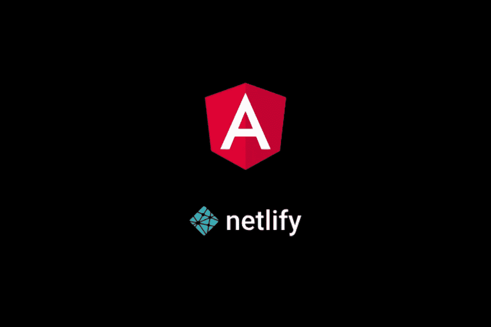
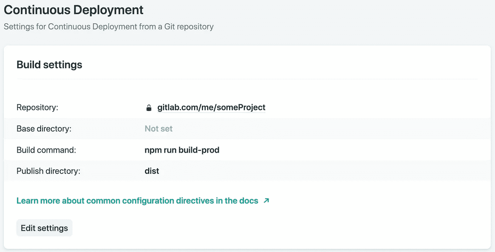

# 如何将 Angular app 部署到 Netlify

> 原文：<https://itnext.io/how-to-deploy-an-angular-app-to-netlify-6db8c3d133e5?source=collection_archive---------3----------------------->



## 使用 Netlify 轻松部署 Angular 应用程序

**Angular** 是创建企业级 web 应用程序的好选择。当我在寻找一个好的托管服务时，我偶然发现了 [**Netlify**](https://medium.com/u/5250f9d9bd2f?source=post_page-----6db8c3d133e5--------------------------------) 。但是 Netlify 不仅仅是这样:它是一个自动化现代 web 项目的伟大平台，结合了全球部署、持续集成和自动 HTTPS。

在本教程中，我想向您展示如何将 Angular 应用程序部署到 Netlify。我们还希望我们的路由是 HTML5 兼容的，在我们的路由中不使用任何散列，这也产生了更好的 URL。一般来说，如果您有一个使用 React 或 Vue.js 等其他框架的单页面应用程序，大多数步骤也适用。



在 Netlify 上配置的构建设置

## 如何用 Netlify 部署 Angular app

1.  **在** [**网上开户**](https://www.netlify.com/pricing/) 。你可以选择启动计划。
2.  **使用 [Angular CLI](https://cli.angular.io/) 创建一个角度项目**(如果您还没有)。
3.  在导出路线以使用 HTML5 历史 API 时，确保 [**useHash 为 false**](https://angular.io/api/router/RouterModule#forRoot) 。默认情况下，它是 false:只是不提供值。
4.  **创建一个**[**_ 重定向**](https://www.netlify.com/docs/redirects/) **文件**。您还需要**将 _redirects 文件添加到 angular.json** 中的 *assets* 部分，以便 angular 在构建您的应用程序时包含它，以便 Netlify 可以检测到它。否则，浏览器刷新将不起作用。如果您使用 React 或 Vue.js 等使用路由的其他框架，也需要这个文件。
5.  在 Netlify 上，**配置需要部署的项目**。 [Netlify 与 GitHub、GitLab、Bitbucket](https://www.netlify.com/docs/authentication-providers/) 整合的很好。
6.  在 Netlify 上，你应该**指定构建命令**。您应该在生产模式下构建您的应用程序，以获得最佳性能和最小的包大小。在 Angular 中，你使用[提前(AOT)编译器](http://Hey Werner! Eine Frage zu https://leanix.atlassian.net/browse/INVT-1889 - wie nennen wir das Category in der UI? Bleibt es bei "Subtype" so wie wir das bisher gemacht hatten oder nennen wir das in der UI jetzt auch "Category"?) : **ng build — prod — aot** 。

## Netlify 上单页应用程序的 Sample _redirects 文件

```
# Rewrite all requests to any file that doesn’t already exist to the index page, where router can handle it.
**/* /index.html 200**
```

## 更新:ng 部署

Angular 团队引入了一个名为 [**ng deploy**](https://angular.io/cli/deploy) 的新命令，用于使用 Angular CLI 部署应用。有一个[Angular Builder for Netlif](https://www.netlify.com/blog/2019/09/17/using-the-angular-builder-for-netlify/)y，您可以使用它直接从 Angular CLI 部署您的 Angular 应用程序。本文中描述的方法仍然有效，但是您现在有了更多的灵活性。

## 结论

感谢阅读这篇文章。正如你所看到的，部署一个应用程序——无论是使用 Angular、React 还是静态网页——使用 Netlify 都是一件容易的事情。我只展示了一小部分 Netlify 可以做的事情，我非常喜欢它。您如何部署您的 web 应用程序？你在用 Netlify 吗？请在评论中告诉我。