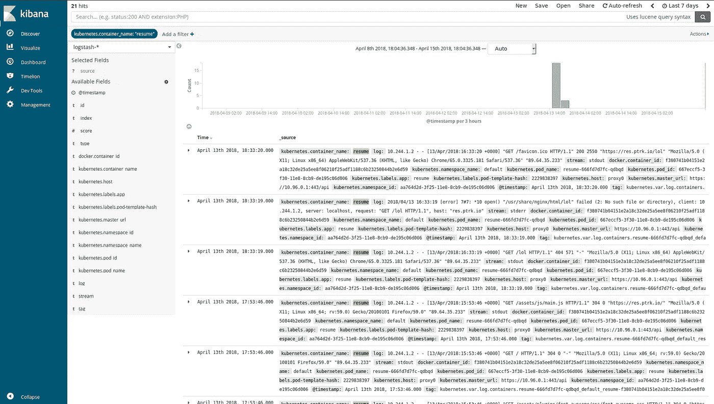

# 如何将 EFK 堆栈部署到 Kubernetes

> 原文：<https://itnext.io/how-to-deploy-an-efk-stack-to-kubernetes-d1179a56fee8?source=collection_archive---------3----------------------->

你可能听说过麋鹿( [Elasticsearch](https://www.elastic.co/products/elasticsearch) 、 [Logstash](https://www.elastic.co/products/logstash) 、 [Kibana](https://www.elastic.co/products/kibana) )。EFK 是同一个堆栈，我们用 [Fluentd](https://www.fluentd.org/) 替换 Logstash。
那么为什么要用 Fluentd 代替 Logstash 呢？

首先，Fluentd 现在由[云本地计算基金会](https://cncf.io/)托管，该基金会也托管 [Kubernetes](https://kubernetes.io/) 。此外，我发现它很容易配置，有很多插件，它的内存占用很低。

我们也可以用 [Fluent Bit](https://fluentbit.io/) 代替 Fluentd，它是一个更轻的日志转发器，但功能比第一个少。

# 它是如何工作的

一张图胜过千言万语，所以这里有一个简单的图式。


基本上每个 Fluentd 容器读取`/var/lib/docker`来获取节点上每个容器的日志并发送给 Elasticsearch。最后，当我们访问 Kibana 时，它向 Elasticsearch 请求日志。

# 为什么

你可能会问自己为什么要设置这样一个堆栈？我可以运行`docker logs ...`，那里有我的日志。

是的，你可以。然而，如果你有几个副本，你必须仔细检查每一个容器才能找到你想要的。在这里，您可以一次浏览所有日志。
此外，使用 Kibana，您可以创建仪表板和非常漂亮的可视化效果。

看一看:


> *出自*[【elastic.co】T21](https://www.elastic.co/)

另一个有趣的地方是日志的操作。使用 Fluentd，您可以非常轻松地过滤、修改和备份您的日志。但是我们会在另一篇文章中讨论这个问题。

介绍够了，让我们建立这个堆栈！

# 弹性搜索

> *Elasticsearch 是一个分布式 RESTful 搜索和分析引擎，能够解决越来越多的用例。作为弹性堆栈的核心，它集中存储您的数据，因此您可以发现预期的数据，发现意外的数据。*

在 E*K 栈中，我们使用 Elasticsearch 来存储和搜索 Fluentd 转发的日志。要将它部署到我们的 Kubernetes 集群中，我们可以使用 GitHub 仓库的[pires](https://github.com/pires/):[pires/Kubernetes-elastic search-cluster](https://github.com/pires/kubernetes-elasticsearch-cluster)

您可以修改`es-master.yaml`、`es-client.yaml`和`es-data.yaml`中的值，以改变副本的数量、名称等。

> *默认情况下，* `*ES_JAVA_OPTS*` *设置为* `*-Xms256m -Xmx256m*` *。这是一个非常低的值，但许多用户，即 minikube 用户，都遇到过由于主机内存不足而导致 pod 被杀死的问题。您可以在该存储库中可用的部署描述符中对此进行更改。* [README.md](https://github.com/pires/kubernetes-elasticsearch-cluster/blob/master/README.md)

还建议将存储器从`emptyDir`更改为您选择的存储器，以获得数据的持久存储。

设置好文件后，您可以运行:

```
$ kubectl -n logging create -f es-discovery-svc.yaml
$ kubectl -n logging create -f es-svc.yaml
$ kubectl -n logging create -f es-master.yaml
$ kubectl -n logging rollout status -f es-master.yaml
$ kubectl -n logging create -f es-client.yaml
$ kubectl -n logging rollout status -f es-client.yaml
$ kubectl -n logging create -f es-data.yaml
$ kubectl -n logging rollout status -f es-data.yaml
```

> *注意:我将在* `*logging*` *命名空间中运行 EFK 堆栈，使用* `*kubectl create ns logging*` *来创建它。*

按照 [pires 说明](https://github.com/pires/kubernetes-elasticsearch-cluster/blob/master/README.md#access-the-service)检查您的 Elasticsearch 是否启动并运行。

如果一切正常，我们现在可以设置 Fluentd(或 Fluent Bit)！

# 流体 d

> *Fluentd 是一个开源的数据收集器，它可以让您统一数据收集和使用，以便更好地使用和理解数据。* [https://www.fluentd.org/architecture](https://www.fluentd.org/architecture)

Fluentd 可以直接在主机上运行，也可以在 Docker 容器中运行。这里我们将使用一个`DaemonSet`来确保 Fluentd 在每个节点上运行。代码来自[fluent/fluentd-kubernetes-daemonset](https://github.com/fluent/fluentd-kubernetes-daemonset)。

如果您在集群上启用了 RBAC(我希望您已经启用了)，请检查[fluentd-daemonset-elastic search-RBAC . YAML](https://github.com/fluent/fluentd-kubernetes-daemonset/blob/master/fluentd-daemonset-elasticsearch-rbac.yaml)的`ClusterRole`、`ClusterRoleBinding`和`ServiceAccount`。

不要忘记将名称空间更改为部署 Elasticsearch 时使用的名称空间，它应该是相同的。
然后我们可以应用`DaemonSet`:

```
apiVersion: apps/v1
kind: DaemonSet
metadata:
  name: fluentd
  namespace: logging
  labels:
    component: fluentd-logging
    version: v1
    kubernetes.io/cluster-service: "true"
spec:
  selector:
    matchLabels:
      component: fluentd-logging
  template:
    metadata:
      labels:
        component: fluentd-logging
        version: v1
        kubernetes.io/cluster-service: "true"
    spec:
      serviceAccount: fluentd # if you have RBAC enabled
      serviceAccountName: fluentd # if you have RBAC enabled
      tolerations:
      - key: node-role.kubernetes.io/master
        effect: NoSchedule
      containers:
      - name: fluentd
        image: fluent/fluentd-kubernetes-daemonset:elasticsearch
        env:
          - name:  FLUENT_ELASTICSEARCH_HOST
            value: "elasticsearch" # the name of the previous es-svc.yml 
          - name:  FLUENT_ELASTICSEARCH_PORT
            value: "9200" # port of the previous es-svc.yml
          - name: FLUENT_ELASTICSEARCH_SCHEME
            value: "http"
        resources:
          limits:
            memory: 200Mi
          requests:
            cpu: 100m
            memory: 200Mi
        volumeMounts:
        - name: varlog
          mountPath: /var/log
        - name: varlibdockercontainers
          mountPath: /var/lib/docker/containers
          readOnly: true
      terminationGracePeriodSeconds: 30
      volumes:
      - name: varlog
        hostPath:
          path: /var/log
      - name: varlibdockercontainers
        hostPath:
          path: /var/lib/docker/containers
```

# 流畅位

我们将使用[fluent/fluent-bit-kubernetes-logging](https://github.com/fluent/fluent-bit-kubernetes-logging)的代码。
至于 Fluentd，如果你使用 RBAC，用以下命令创建`ClusterRole`、`ClusterRoleBinding`和`ServiceAccount`:

```
$ kubectl create -f https://raw.githubusercontent.com/fluent/fluent-bit-kubernetes-logging/master/fluent-bit-service-account.yaml
$ kubectl create -f https://raw.githubusercontent.com/fluent/fluent-bit-kubernetes-logging/master/fluent-bit-role.yaml
$ kubectl create -f https://raw.githubusercontent.com/fluent/fluent-bit-kubernetes-logging/master/fluent-bit-role-binding.yaml
```

我们还需要为配置创建一个`ConfigMap`。您可以修改[这个](https://github.com/fluent/fluent-bit-kubernetes-logging/blob/master/output/elasticsearch/fluent-bit-configmap.yaml)并应用它，或者使用默认的:

```
$ kubectl create -f https://raw.githubusercontent.com/fluent/fluent-bit-kubernetes-logging/master/output/elasticsearch/fluent-bit-configmap.yaml
```

一旦应用了`ConfigMap`，下面是`DaemonSet`的代码:

```
apiVersion: apps/v1
kind: DaemonSet
metadata:
  name: fluent-bit
  namespace: logging
  labels:
    component: fluent-bit-logging
    version: v1
    kubernetes.io/cluster-service: "true"
spec:
  selector:
    matchLabels:
      component: fluent-bit-logging
  template:
    metadata:
      labels:
        component: fluent-bit-logging
        version: v1
        kubernetes.io/cluster-service: "true"
    spec:
      containers:
      - name: fluent-bit
        image: fluent/fluent-bit:0.12.17
        env:
        - name: FLUENT_ELASTICSEARCH_HOST
          value: "elasticsearch" # the name of the previous es-svc.yml 
        - name: FLUENT_ELASTICSEARCH_PORT
          value: "9200" # the port of the previous es-svc.yml 
        volumeMounts:
        - name: varlog
          mountPath: /var/log
        - name: varlibdockercontainers
          mountPath: /var/lib/docker/containers
          readOnly: true
        - name: fluent-bit-config
          mountPath: /fluent-bit/etc/
      terminationGracePeriodSeconds: 10
      volumes:
      - name: varlog
        hostPath:
          path: /var/log
      - name: varlibdockercontainers
        hostPath:
          path: /var/lib/docker/containers
      - name: fluent-bit-config
        configMap:
          name: fluent-bit-config # name of the previously created ConfigMap
      serviceAccountName: fluent-bit
      tolerations:
      - key: node-role.kubernetes.io/master
        operator: Exists
        effect: NoSchedule
```

# 基巴纳

一旦你有了一些进入 Elasticsearch 的日志，我们可以像 Kibana 一样添加一个工具来探索和分析它们。

> *Kibana 可让您可视化您的 Elasticsearch 数据并浏览 Elastic Stack。*

所以我们将部署 Kibana 作为部署。我们将使用 6.2 OSS 版本，因为它没有启用 X-Pack。(如果想要 X-Pack，当然可以调整镜像名)。

```
apiVersion: apps/v1
kind: Deployment
metadata:
  namespace: logging
  name: kibana
  labels:
    component: kibana
spec:
  replicas: 1
  selector:
    matchLabels:
     component: kibana
  template:
    metadata:
      labels:
        component: kibana
    spec:
      containers:
      - name: kibana
        image: docker.elastic.co/kibana/kibana-oss:6.2.2
        env:
        - name: CLUSTER_NAME
          value: myesdb # name of the Elasticsearch cluster defined in the first part
        resources:
          limits:
            cpu: 1000m
          requests:
            cpu: 100m
        ports:
        - containerPort: 5601
          name: http
```

当 pod 启动并运行时，我们可以通过一个`Service`和一个`Ingress`来访问它:

```
apiVersion: v1
kind: Service
metadata:
  namespace: logging
  name: kibana
  labels:
    component: kibana
spec:
  selector:
    component: kibana
  ports:
  - name: http
    port: 5601
---
apiVersion: extensions/v1beta1
kind: Ingress
metadata:
  namespace: logging
  name: kibana
  annotations:
    kubernetes.io/ingress.class: traefik
    ingress.kubernetes.io/auth-type: "basic"
    ingress.kubernetes.io/auth-secret: kibana-basic-auth
spec:
  rules:
  - host: "<your-url>"
    http:
      paths:
      - path: /
        backend:
          serviceName: kibana
          servicePort: http
```

为了用用户/密码保护 Kibana，我们将使用 [Traefik](https://traefik.io/) 作为入口控制器。
创造的秘密:

```
$ htpasswd -c ./auth <your-user>
$ kubectl -n logging create secret generic kibana-basic-auth --from-file auth
$ rm auth
```

当您第一次访问 Kibana 时，您需要配置您的第一个索引。
如果您没有更改 Fluentd 的默认配置，则索引名称/模式为`logstash-YYYY-MM-DD`。通过使用`logstash-*`，您可以使用通配符来捕获所有以 *logstash-* 开头的索引。

现在你有一个功能 EFK 堆栈！



在下一部分中，我们将深入研究 Fluentd 和 Kibana 的配置。

> *感谢*[*@ jmaitrehenry*](https://jmaitrehenry.ca/)*对本帖的反馈。*

*原载于 2018 年 4 月 16 日*[*blog . ptrk . io*](https://blog.ptrk.io/how-to-deploy-an-efk-stack-to-kubernetes/)*。*