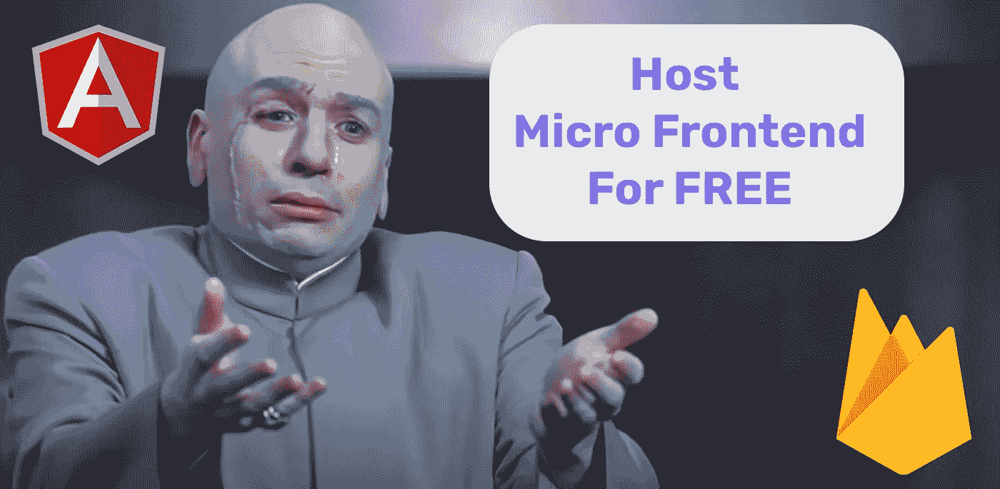
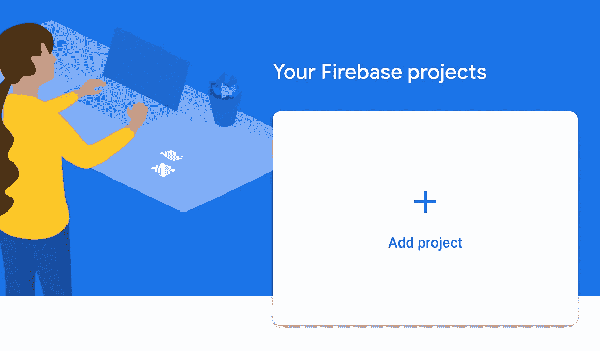
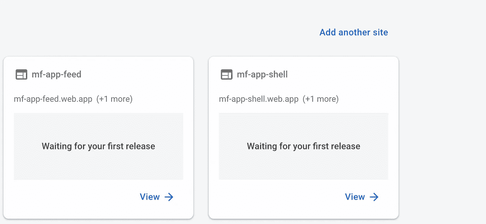

# 如何使用 Firebase 免费部署和托管角🅰️微前端🔥

> 原文：<https://itnext.io/how-to-deploy-and-host-angular-%EF%B8%8F-micro-frontend-for-free-using-firebase-6e675b511a4?source=collection_archive---------4----------------------->

## 一个关于如何部署和托管一个微前端应用程序的教程免费和零压力。



# 内容

*   [**简介**](#47a3)
*   [**设置 Firebase 项目**](#157a)
*   [**配置微前端并部署到 Firebase**](#e05d)
*   [**托管微前端应用链接**](#cac5)
*   [**结论**](#e782)
*   [**了解更多**](#be86)

# 介绍

在上一篇文章中，我们构建了带有状态共享的 Angular 微前端应用程序。在检查第一部分之前不要移动。您可以在此处找到实现:

[](/building-angular-micro-frontend-with-ngrx-state-sharing-and-nx-cli-7e9af10ebd03) [## 🔥利用 NgRx 状态共享和 NX cli 构建角度微前端

### 如何在几乎不编码的情况下构建健壮的微前端架构；)

itnext.io](/building-angular-micro-frontend-with-ngrx-state-sharing-and-nx-cli-7e9af10ebd03) 

我们将以它为基础，在 firebase 中免费部署和托管应用程序。首先，我们需要创建一个 firebase 项目，然后我们将添加两个站点: **shell** 和 **gallery** ，最后，我们将在 firebase 中进行部署和托管。这将是容易和快速的，100%满意的保证。激动吗？我们走吧！😁

# 设置 Firebase 项目

如果你还没有这个应用，那就在本地克隆它。

```
git clone [https://github.com/Vitashev/mf-app.git](https://github.com/Vitashev/mf-app.git)
cd mf-app
```

然后转到 [**firebase 控制台**](https://console.firebase.google.com/) 并创建一个项目:



可以和 repository 一样命名: **mf-app** 。


这里选择默认的 google analytics 配置，这一步并不重要:


完成后，去 Firebase 托管并创建两个网站 **mf-app-feed** 和 **mf-app-gallery。**



它将创建免费的域名，在我们的情况下——**MF-app-feed . web . app**和**MF-app-gallery . web . app .**，如果你愿意，你可以链接到你的个人域名。

这就是我们从 Firebase 需要的一切，剩下的就是在本地配置我们的微前端应用程序。

# 配置微前端并部署到 Firebase

在我们配置我们的应用程序之前，我们需要将我们的本地环境与 Firebase 链接起来。首先，让我们安装 Firebase 依赖项:

```
npm i -g firebase-tools
```

并授权 Firebase:

```
firebase login
```

在项目根文件夹`mf-app`中初始化 Firebase 托管。

```
firebase init hosting
```

在控制台提示符下，选择`use existing project`，然后多次按下`Enter`，直到创建两个文件`.firebaserc`和`firebase.json`。

在`.firebaserc`我们说对于项目`mf-app-1ccff`我们有两个目标主机 **mf-app-shell** 和 **mf-app-gallery。shell** 和 **gallery** —是 firebase 的别名，我们可以直接调用它们来引用我们的网站。

在`firebase.json`中，我们定义了 firebase 用来部署的位置源。当我们运行一个构建时，我们将在`dist/apps/shell`和`dist/apps/gallery`中创建一个包。

此时，我们已经有足够的资源来部署我们的全部，让我们在`package.json`中创建我们的部署命令并运行它。

```
"scripts": {
    "deploy": "nx run shell:build  && nx run gallery:build && firebase deploy --only hosting"
}
```

触发`build`和`deploy`。

```
npm run deploy
```

就是这样，享受结果吧！🎉

# 托管微前端应用程序链接

 [## 壳

mf-app-shell.web.app](https://mf-app-shell.web.app/) 

# 结论

希望你在部署和托管 micro frontend 应用程序时有一个如丝般平滑的体验。如果我们能募集到 1000 英镑👏claps，我会发表一篇文章，介绍如何在合并 Pull 请求时配置钩子来自动运行部署。如果你学到了新东西，别忘了跟着鼓掌。

[](https://easy-web.medium.com/subscribe) [## 每当维塔利·舍甫琴科发表文章时，就收到一封电子邮件。

### 每当维塔利·舍甫琴科发表文章时，就收到一封电子邮件。通过注册，您将创建一个中型帐户，如果您还没有…

easy-web.medium.com](https://easy-web.medium.com/subscribe) [](https://easy-web.medium.com/membership) [## 通过我的推荐链接加入 Medium 维塔利·舍甫琴科

### 作为一个媒体会员，你的会员费的一部分会给你阅读的作家，你可以完全接触到每一个故事…

easy-web.medium.com](https://easy-web.medium.com/membership) 

# 了解更多信息

[](/building-beautiful-tiktok-clone-with-angular-and-micro-frontend-part-1-bdd189425695) [## 🔥建造一个漂亮的抖音克隆体，有棱角和微前端

### 第 1 部分:不再有丑陋的教程，只有美丽的，真实世界的例子，通过构建抖音学习微前端

itnext.io](/building-beautiful-tiktok-clone-with-angular-and-micro-frontend-part-1-bdd189425695) [](/how-micro-frontend-changes-the-future-of-angular-bb4deb2cfdad) [## 🔥微前端如何改变 Angular 的未来？

### 让我们看看为什么 Angular 最适合微前端

itnext.io](/how-micro-frontend-changes-the-future-of-angular-bb4deb2cfdad) [](/frontend-interview-cheatsheet-that-helped-me-to-get-offer-on-amazon-and-linkedin-cba9584e33c7) [## 🔥帮助我获得亚马逊和 LinkedIn 录用通知的前端面试备忘单

### 如果你正在准备一个前端面试，想快速更新你的领域知识，这个备忘单将…

itnext.io](/frontend-interview-cheatsheet-that-helped-me-to-get-offer-on-amazon-and-linkedin-cba9584e33c7)