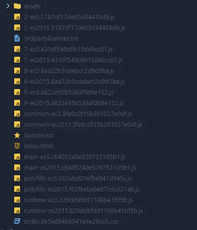
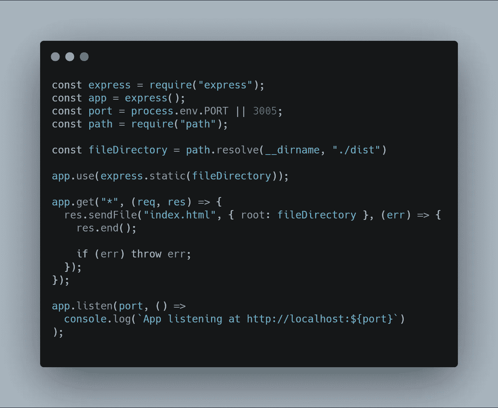

# 如何在生产中部署 Angular app—CPAS 新协议

> 原文：<https://itnext.io/how-to-deploy-angular-app-in-production-cpas-2-affb711d18fc?source=collection_archive---------1----------------------->


# 序

> *最近，我决定做一个名为****CAPS——常见问题及解决方案*** *的系列故事，在其中我将向你展示如何解决编码中最常见的问题。可以在这里* *看到本系列第一篇* [*。*](/remove-elements-from-an-array-recursively-cpas-1-856cc44613c5)

如果您是 Angular 部署环境的新手，并且对于如何让其他人使用这种类型的应用程序感到非常困惑，那么本文就是为您准备的。这也适用于 Angular、React 或任何其他基于框架的应用程序，它们依赖于内部路由器。

# 误解

一个常见的误解是需要 NodeJS 服务器来部署应用程序。

前端代码运行在浏览器上，浏览器只理解 HMTL、CSS 和 JavaScript。一旦您运行 build 命令，您的代码就会变成这样。

如果您在 Angular 项目文件夹中运行`ng build --prod`，您将在 **dist** 文件夹中只看到 JavaScript、CSS 和 HTML 文件。



ng build 命令在生产中的输出

现在这些只是简单的静态文件，您可以像任何普通的静态网站一样实现应用程序。您需要注意的唯一部分是，应用程序有一个内部路由器，所有请求都必须发送到这个路由器。

# 部署

在接下来的示例中，我们将了解如何在两个最常见的解决方案上部署这些代码:

*   在 VPS 上的 Nginx 下
*   在像 Heroku 这样的 PaaS 上

## NGINX

在下面的文件夹中，用这个内容为你的应用程序创建一个新文件。

`$ cd /etc/nginx/sites-available && nano my-website`

**我的网站**

```
server {
 root *path_to_the_app_folder/dist*;
 index index.html;
 server_name *application_domain.com*;
 location / {
    try_files $uri $uri/ /index.html;
 }
}
```

通过这一行，我们让 Nginx 只服务于**index.html**文件，而不管我们**application _ domain . com .**的 **URL**

```
try_files $uri $uri/ /index.html;
```

例如:

*   https://application _ domain . com->将提供 index.html 文件
*   https://application _ domain . com/my-route-->仍将服务于 index.html

Nginx 只会从**站点启用的**文件夹中接管配置。这就是为什么我们需要使用以下命令为我们的文件创建一个符号链接:

```
$ sudo ln -s /etc/nginx/sites-available/my-website /etc/nginx/sites-enabled/
```

最后，用这个命令验证您的配置是否正确

```
$ sudo nginx -t
```

并重新启动 Nginx 服务。

```
$ sudo systemctl restart nginx
```

## 赫罗库

要在 Heroku 上部署它，我们需要创建一个应用服务器来服务我们的静态文件。为此，我们可以使用任何与 Heroku 兼容的后端语言。出于演示的目的，我们将使用 NodeJS。

> 这在第一个例子中是不必要的，因为 Nginx 是一个 web 服务器，也能够提供静态文件。实际上，就服务静态文件的性能而言，它是最好的。

像往常一样使用 **express** 在项目的根目录下创建一个新的服务器，并将其设置为只发送 index.html 的**文件**。****

**server.js**



[此处代码](https://carbon.now.sh/?bg=rgba(171%2C%20184%2C%20195%2C%201)&t=seti&wt=none&l=javascript&ds=true&dsyoff=20px&dsblur=68px&wc=true&wa=true&pv=56px&ph=56px&ln=false&fl=1&fm=Hack&fs=14px&lh=133%25&si=false&es=2x&wm=false&code=const%2520express%2520%253D%2520require(%2522express%2522)%253B%250Aconst%2520app%2520%253D%2520express()%253B%250Aconst%2520port%2520%253D%2520process.env.PORT%2520%257C%257C%25203005%253B%250Aconst%2520path%2520%253D%2520require(%2522path%2522)%253B%250A%250Aconst%2520fileDirectory%2520%253D%2520path.resolve(__dirname%252C%2520%2522.%252Fdist%2522)%250A%250Aapp.use(express.static(fileDirectory))%253B%250A%250Aapp.get(%2522*%2522%252C%2520(req%252C%2520res)%2520%253D%253E%2520%257B%250A%2520%2520res.sendFile(%2522index.html%2522%252C%2520%257B%2520root%253A%2520fileDirectory%2520%257D%252C%2520(err)%2520%253D%253E%2520%257B%250A%2520%2520%2520%2520res.end()%253B%250A%250A%2520%2520%2520%2520if%2520(err)%2520throw%2520err%253B%250A%2520%2520%257D)%253B%250A%257D)%253B%250A%250Aapp.listen(port%252C%2520()%2520%253D%253E%250A%2520%2520console.log(%2560App%2520listening%2520at%2520http%253A%252F%252Flocalhost%253A%2524%257Bport%257D%2560)%250A)%253B%250A)

为了与 Heroku 兼容，创建一个名为 **Procfile** 的文件，并添加start 命令。

```
web: node server.js
```

所以，就这样了！通过这种配置，您可以在 Nginx 和 Heroku 上部署任何 web 应用程序。请记住，您需要将所有请求发送到 index.html，这样它们就可以被应用程序的内部路由器解析。