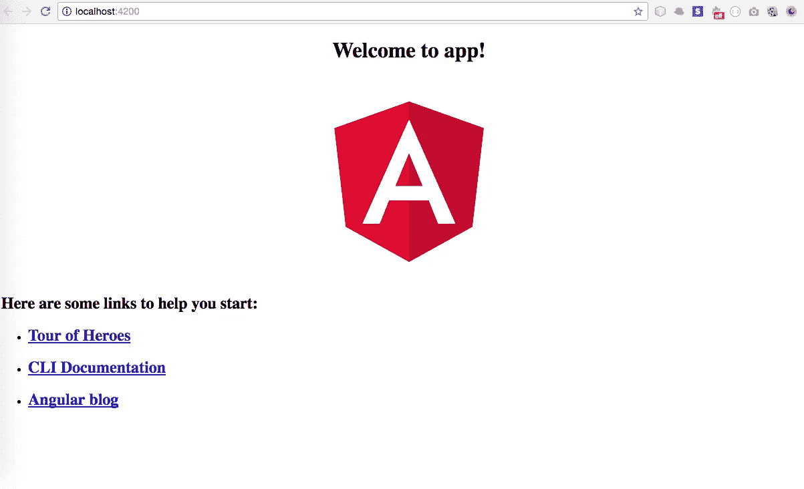
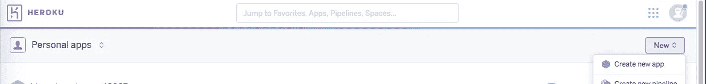
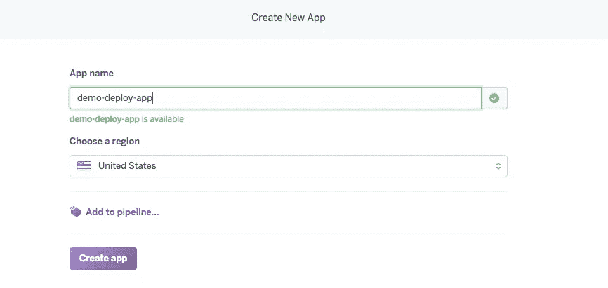
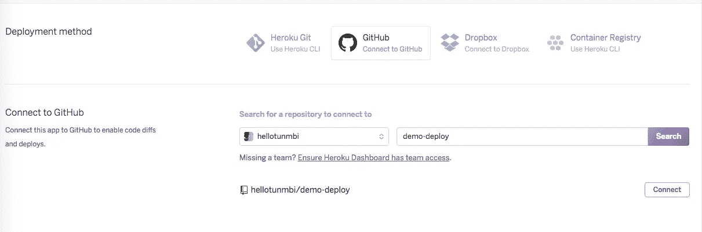
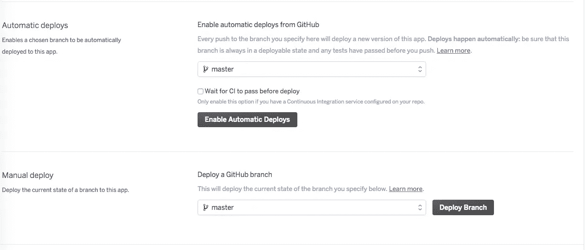
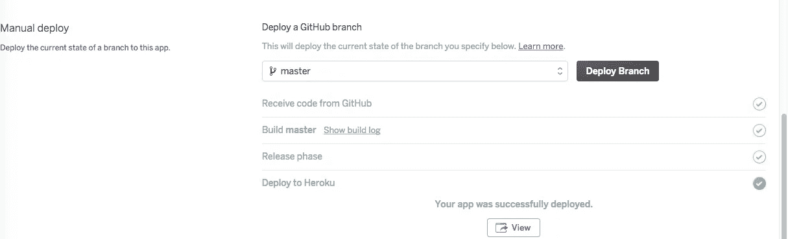
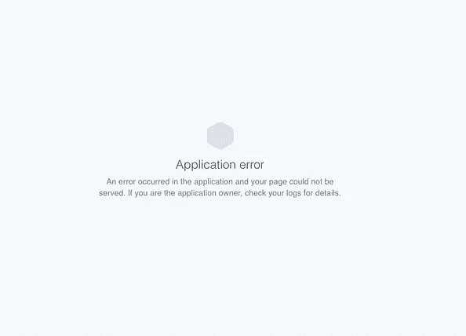
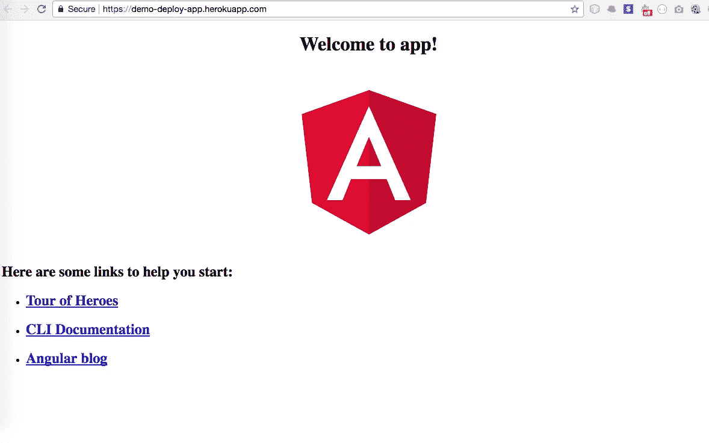

# 如何将 Angular 应用程序部署到 Heroku

> 原文：<https://itnext.io/how-to-deploy-angular-application-to-heroku-1d56e09c5147?source=collection_archive---------0----------------------->


在你尝试之前，它总是“看起来”很容易。在 heroku 上部署了其他应用后，我最近在部署 Angular 4 时遇到了一系列挑战，但我最终度过了难关。所以我写信来详细解释我是如何做的。

本文将向您展示如何将 Angular 2/4 应用程序轻松部署到 Heroku，更重要的是，避免常见的陷阱。

这不是帮助你学习 Angular 的教程。我们假设您已经完成了开发并准备好部署。然而，我们将从开始和部署设置基本的角度项目。本教程将涵盖:

*   创建基本角度项目
*   设置从 GitHub 到 Heroku 的自动部署
*   在 Heroku 服务器上部署 Angular 应用程序

## 设置您的角度应用

利用 Angular CLI，通过运行以下命令设置一个新项目:

`ng new demo-deploy`

由此，我们的应用程序将被命名为`demo-deploy`。留出几分钟时间来设置新项目和安装 npm 软件包。

**启动应用**

将目录更改为新项目，并使用下面的命令启动它。默认情况下，这将在端口 4200 上的新浏览器中打开。即 [http://localhost:4200。](http://localhost:4200.)

`cd demo-deploy
ng serve`



Angular app 欢迎您

我们的基本 angular 应用程序已经准备就绪，正在本地运行。让我们推到 github

## 创建其 GitHub repo 和 Push

在这里，我们将创建一个新的 github 存储库，并将我们的应用程序推送到这个存储库中。

*   登录 github 并创建新的存储库。不需要用自述文件初始化存储库
*   在您的终端/CMD 中打开新标签。或者按 Ctrl+C 停止运行 app。然后运行以下命令:

`git remote add origin <new_github_repository_url>
git add .
git commit -m "initial commit"
git push -u origin master`

现在我们的 app 在 github 上。

## 设置从 GitHub 到 Heroku 的自动部署

这一步的好处是，一旦你对你的 github 库做了修改，它会自动将修改推送到 heroku 上的代码库中，然后在网上生效。这意味着，你只需要把你的修改推送到 github，就完成了。

如果你还没有账户，在 heroku 网站上创建一个。它是免费的。登录您的仪表盘并创建一个新应用程序。



在 heroku 上创建新的应用程序



点击**创建应用**

在**部署**菜单中，在**部署方式**下，选择 **GitHub** 。如果您还没有这样做，它会要求您登录您的 github 帐户，这样它就可以连接到它。

输入 GitHub 库的名称，点击**搜索**。一旦回购显示如下，点击**连接**。维奥拉。



呃，等等。还有两个简单的步骤。

1.  在自动部署下，选择主分支，然后单击启用自动部署。

2.在手动部署下，单击部署分支。这是把我们的新代码推给 heroku。



好了，我们真的完成了这个阶段。这可能需要一点时间，但完成后会向您显示成功部署的消息，如下所示:



如果单击查看，将会打开一个新选项卡，但不会显示您的应用程序。接下来的一系列步骤将指导您配置和旋转 angular 应用程序。

# 配置您的 Angular 应用程序以在 Heroku 上正确部署

以下是生产就绪的步骤，可以轻松、正确地部署您的应用程序，不会出现任何问题。

## 确保您拥有最新版本的 angular cli 和 angular 编译器 cli。

通过在终端中运行以下命令，将它们安装到您的应用程序中:

`npm install @angular/cli@latest @angular/compiler-cli --save-dev`

在您的 package.json 中，复制

`"@angular/cli”: “1.4.9”,
"@angular/compiler-cli": "^4.4.6",`

从依赖到依赖

## 在 package.json 中创建安装后脚本

在“脚本”下，添加一个“heroku-postinstall”命令，如下所示:

```
"heroku-postbuild": "ng build"
```

这告诉 Heroku 使用提前(AOT)编译器构建应用程序，并使其可以投入生产。这将创建一个`dist`文件夹，我们应用程序的所有 html 和 javascript 转换版本将从这里启动。

## 添加节点和 NPM 引擎

您需要添加 Heroku 将用来运行您的应用程序的节点和 NPM 引擎。最好是，它应该与您机器上的版本相同。因此，运行`node -v`和`npm -v`来获得正确的版本，并将其包含在 package.json 文件中，如下所示:

## 将类型脚本复制到依赖项。

将`"typescript": "~2.3.3"`从 devDependencies 复制到 Dependencies，以通知 Heroku 使用什么类型的脚本版本。

## 安装增强的解决方案 3.3.0

运行命令`npm install enhanced-resolve@3.3.0 --save-dev`

## 安装服务器以运行您的应用程序

在本地，我们从终端运行`ng serve`，在本地浏览器上运行我们的应用。但是我们需要设置一个 Express 服务器来运行我们的生产就绪应用程序(从创建的 dist 文件夹中),以确保轻量级和快速加载。

通过运行以下命令安装 Express server:

`npm install express path --save`

在应用程序的根目录下创建一个 server.js 文件，并粘贴以下代码。

## 更改开始命令

在 package.json 中，将“start”命令改为`node server.js`，这样它就变成了:

`"start": "node server.js"`

下面是完整的 package.json 的样子。您的包可能包含更多内容，具体取决于您的应用程序特定的包。

将更改推送到 GitHub:

`git add .
git commit -m "updates to deploy to heroku"
git push`

此时，Heroku 上的应用程序将自动从 GitHub 获取更改并自我更新。

此外，它会检查您的 package.json 并安装软件包。

它将运行 postinstall，然后，`node server.js`启动您的应用程序。

您可以检查 Activity 选项卡并打开构建日志来查看它实际上是如何运行的。

你不应该遇到任何问题。我写这篇文章的时候也坚持了下来。

维奥拉。！我们的 Angular 应用程序已经准备好并投入使用！



谢谢你一直坚持到现在。

你可以在 [Twitter](https://twitter.com/hellotunmbi) 或 Medium 上关注我。

说茄子！…如果您遇到任何问题或想要建议更好的方法，请在下面评论。

[](https://www.buymeacoffee.com/hellotunmbi)