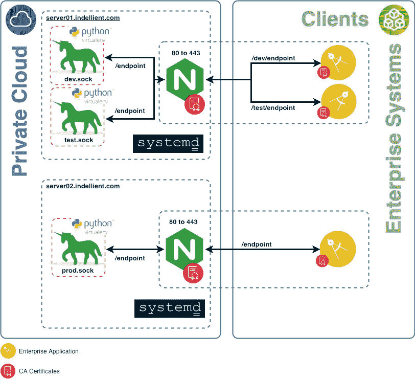

# 如何在共享实例中在 Nginx 后面部署 Gunicorn

> 原文：<https://itnext.io/how-to-deploy-gunicorn-behind-nginx-in-a-shared-instance-f336d2ba4519?source=collection_archive---------2----------------------->


## TL；速度三角形定位法(dead reckoning)

尽管我更喜欢用 Kubernetes 和 Containers 来构建一个系统，但有时产品所有者的需求并不符合要求，我们必须适应使用期望的技术，并利用我们可用的工具从中提取最佳效果。按照下面的说明，学习如何使用 Nginx、Gunicorn 和 Systemd 在 2 个虚拟机中为 Flask API 部署 3 个环境。在我的下一篇文章中，我将讨论如何实现自动化。

一年多以来，我作为 Indellient 的一名[软件开发人员，一直致力于实现在我们客户的 Kubernetes 平台上部署和管理应用程序的解决方案。这些解决方案需要“提升和转移”计划来将现有的应用程序容器化，在此基础上添加 CI/CD 和应用程序生命周期管理。](https://www.indellient.com/)

用于这些计划的工具以及经过认证的 Kubernetes 平台有 Docker、Artifactory、Github 和 TravisCI 等。

Kubernetes 是一个强大的工具。我很喜欢它让开发团队能够按照 DevOps 的文化和共享责任模型生活。

> 禁止:它在我的机器上工作…

然而，并非所有都是鲜花，在这种情况下，产品所有者的要求与该公司的 Kubernetes 平台产品不兼容。这从支持水平到预算限制各不相同。

客户选择在公司的私有云上使用 2 个云实例，我们应该使用现有的工具使其正常工作并为自动化做好准备。

# 要求

1.  私有云中的 2 个 Ubuntu 16.04 LTS 虚拟机
2.  创建 3 个环境(开发、UAT 和生产)
3.  没有容器:(
4.  现有企业系统
5.  使用 Python 3 的 Flask API
6.  加密通信:HTTPS

# 这些问题

1.  我们如何分别验证不同环境的变更？即代码和依赖关系。
2.  我们将如何提供烧瓶 API？
3.  我们如何在一个虚拟机中隔离两个环境，并为自动化做好一切准备，而无需在每个部署中进行大量手动配置？
4.  最后，我们如何保护与现有系统的连接？

# 解决方案

因为每个问题都有可能是已经完全或部分解决的问题，所以我们卷起袖子继续研究阶段。我们在 Python 世界中找到了一系列常见的实践来解决我们的部分问题，并将它们合并到解决方案中。

1.  Github 上的 3 个长寿分支:`master`、`staging`、`dev`
2.  Python 虚拟人:`app-env-dev`、`app-env-test`和`app-env-prod`
3.  Gunicorn 将 Flask API 作为 systemd 服务。
4.  Nginx:反向代理、api 网关和证书验证

# 建筑



# 我们是如何做到的

接下来的步骤都是从您的云实例中完成的，应该在那里安装和配置组件。

## 获取代码

对于这一部分，您的存储库中应该有 Flask 应用程序(这里用`App`表示)，Flask 和 Gunicorn 被定义为`requirements.txt`中的依赖项。

为`DEV`(开发)和`TEST`(登台)创建目录。

1.  `$ mkdir ~/DEV`
2.  `$ cd ~/DEV`
3.  `$ git clone [https://github.com/App](https://github.com/App)`
4.  `$ git checkout dev`

现在这个位置映射了您的`dev`分支。这个想法是，一个简单的`git pull`就足以带来变化并为测试进行部署。

## 安装 Python 的 virtualenv

每个环境都应该有自己的 Python 虚拟环境。这样做的原因是:它使得对依赖关系的更改在根据声明的需求更新的环境中是可测试的。类似于 Docker 将应用程序环境包装在映像中的做法。相比之下，#2 是你的 Docker `FROM`(“干净”的房间)，而#4 是你的环境设置。这个想法

1.  `$ sudo apt-get install virtualenv`
2.  `$ sudo virtualenv -p python3 /opt/app-env-dev`
3.  `$ source /opt/app-env-dev/bin/activate`
4.  `(app-env-dev)$ pip install -r ~/DEV/App/requirements.txt`
5.  `(app-env-dev)$ deactivate`

## 安装 Nginx

Nginx 将是我们的反向代理和 API 网关，根据前缀 URL: `/dev`和`/test`重写到达不同环境的请求。

1.  `$ sudo apt-get install nginx`
2.  `$ sudo systemctl status nginx`

## 创建 systemd 服务来运行 Gunicorn

每个环境还将通过自己的 Python virtualenv 运行自己的 Gunicorn 服务，并绑定到不同的 unix 套接字。

1.  `$ sudo /etc/systemd/system/app-api-dev.service`

```
[Unit]
Description=Gunicorn instance to serve app-api
After=network.target

[Service]
User=admin
Group=www-data
WorkingDirectory=/home/admin/DEV/App/src/web
Environment="PATH=/opt/app-env-dev/bin"
ExecStart=/opt/app-env-dev/bin/gunicorn --log-level debug --worker-class=gthread --threads=5 --bind unix:/opt/app-env-sock/dev.sock --access-logfile /var/log/gunicorn/dev/gunicorn_access.log -m 007 wsgi:app

[Install]
WantedBy=multi-user.target
```

## 配置 Nginx

1.  `$ sudo vi /etc/nginx/sites-available/api-gateway`

```
server {
    listen 80;
    server_name app-api.com;
    return 301 https://$server_name$request_uri;
}

server {
    listen 443 ssl;
    ssl_certificate /opt/ssl/crt.pem;
    ssl_certificate_key /opt/ssl/key.pem;

    server_name app-api.com; location /dev {
        include proxy_params;
        rewrite ^/dev/(.*) /$1  break;
        proxy_pass http://unix:/opt/app-env-sock/dev.sock;
    } #Add here location for /test environment}
```

请注意，我们在`/opt/ssl`下有`crt.pem`和`key.pem`，并将位置传递给 Nginx，它将负责:

1.  将进入`:80`的任何流量重定向到`:443`
2.  根据客户端的请求验证 SSL 证书
3.  重写传入请求 URI 以移除环境前缀并转发到相关联的 Unix 套接字。

我们现在应该让 Nginx 在共享环境中服务 API 网关。

`$ sudo ln -s /etc/nginx/sites-available/api-gateway /etc/nginx/sites-enabled`

## 启动服务

现在一切就绪，我们可以开始并启用服务了。

1.  `$ sudo systemctl start app-api-dev`:启动 Gunicorn 开发环境
2.  `$ sudo systemctl enable app-api-dev`:在虚拟机启动时启动 Gunicorn 开发环境
3.  `$ sudo systemctl status app-api-dev`:验证服务状态
4.  `$ sudo systemctl restart nginx`:重启 Nginx。

# 结论

虽然从应用程序开发的角度来看，使用 Kubernetes 和 Docker containers 更有意义，但有时我们需要接受需求，并应用我们最好的知识来提供可行的解决方案，并为自动化做好准备。

在下一篇文章中，我们将深入探讨如何使用 TravisCI 增强 Git 流程并自动化测试和部署该解决方案。