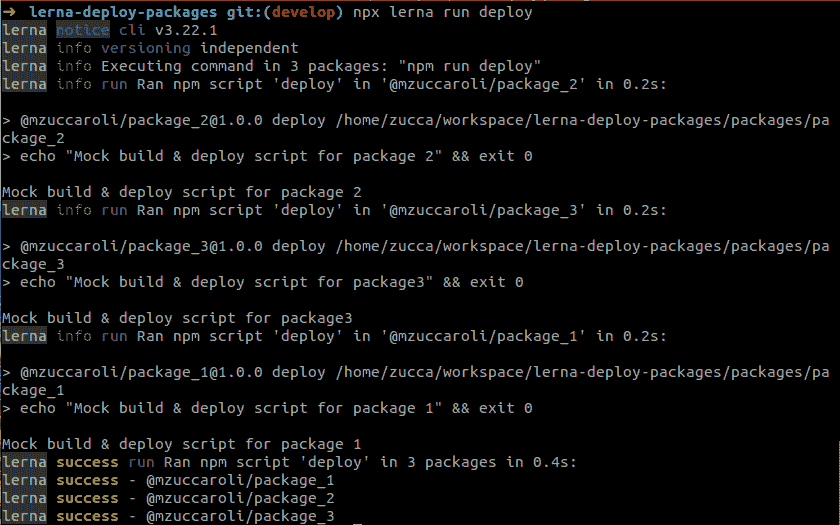
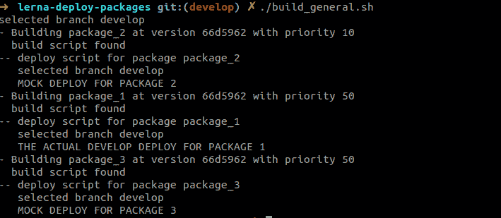

# 如何在 Lerna Monorepo 中仅部署已更改的包

> 原文：<https://itnext.io/how-to-deploy-only-changed-packages-in-a-lerna-monorepo-7e5fb234b32a?source=collection_archive---------2----------------------->

## 处理包含多个包的 monorepo 的部署阶段的两种方法

一个 **monorepo** 是一种软件开发策略，其中许多项目的**代码存储在同一个存储库中**，而 **Lerna** 是一个库，它提供工具来管理 monorepo 中包含的包。


有很多关于使用 Monorepos 的利与弊的讨论，在这篇文章中我不会讨论这些，但是我会解释**我是如何和我的同事**、**一起解决关于部署 monorepo** 中包含的包的问题的。

# 参考知识库

我将在本文中作为示例使用的 lerna 基础项目位于:[**https://github.com/mzuccaroli/lerna-deploy-packages**，](https://github.com/mzuccaroli/lerna-deploy-packages,)它是一个简单的 Lerna 存储库，由“lerna init”命令生成，包含三个由“lerna create”命令生成的包。有关创建 Lerna 回购的更多信息，请参见:[https://github.com/lerna/lerna](https://github.com/lerna/lerna)

# 问题是

如果你正在处理一个复杂的项目，涉及**微服务**，我认为 monorepos 非常棒。有了 monorepo，我解决了许多开发中的问题，但也出现了一些新问题:

1.  在开发了一个功能之后，这可能会涉及到对多个微服务的修改，我想轻松地**只部署修改后的包。**
2.  当我部署多个 Lerna 包时，很可能在同一个 Monorepo 中一些包依赖于其他包，所以我想**控制包的构建和部署优先级**

与我的同事一起，我们为这些问题找出了两个可能的解决方案:第一个简单的方案完全基于 Lerna 特性，第二个相当“老派”,通过 bash 脚本解决问题。

# 解决方案一:Lerna 命令


Lerna 本身提供了一个解决方案，它很容易应用，但不容易在文档中找到，也不容易在工作示例中看到。

这个解决方案的唯一问题是，您需要在您的构建/部署机器上安装 lerna，对于大型项目，lerna bootstrap 命令可能会非常慢。如果您的管道系统支持启动 lerna 和 npm 命令，这就是您的解决方案。

# 仅部署已更改的包

你需要知道的唯一命令是“ [lerna run](https://github.com/lerna/lerna/tree/master/commands/run#readme) ”，它只是**在每个包含该脚本的包**中运行一个 npm 脚本。

因此，如果您在执行部署的包的 package.json 中放置一个“部署”脚本，您可以通过运行以下命令调用所有脚本:

```
$ npx lerna run deploy
```

对于只为修改的包运行脚本，只需运行

```
$ npx lerna run deploy — since HEAD~1
```

**这将“自动地”检测在最后的“~N”次提交中哪些包被改变了**，如果你使用一个像 git flow 这样的好的分支系统，合并提交将准确地识别被改变的包。

运行此命令要求 lerna 可用，并且程序包已准备好部署，以便您可以创建一个安装 lerna 的迷你脚本，并为您的管道安装所有 repo 依赖项:

# 确定包装顺序

假设我们有一些[示例包](https://github.com/mzuccaroli/lerna-deploy-packages/tree/main/packages) : package_1 是一个与 package_2 有一些耦合的微服务，微服务之间的这种“耦合”情况并不理想，但有时会发生，因此我们需要一个解决方案。

如果两个包都被修改，您必须在构建和部署 package_1 之前构建和部署 package_2。

Lerna 提供了一个有点“黑”的解决方案:**只需将 package_2 放入 package_1 的 devDependencies 中** : Lerna 会自动检测包的依赖关系，并按照正确的顺序构建。

您可以尝试使用示例 repo:对包进行一些修改，然后运行。/build_lerna.sh:您可以注意到，package_2 的部署脚本是在 package_1 之前调用的。



# 解决方案二:Bash 脚本

如果**您的部署管道没有准备好启动 Lerna 和 npm 命令**,您可以依赖传统的 bash/git 组合。这相当“老派”，需要创建和维护小 bash 脚本，但是非常**可移植**并且没有要求(除了 git)。所以**不需要在部署环境**中安装 lerna。

# 仅部署已更改的包

让我们创建一个 bash 脚本，它将检查修改的包并为每个包启动一个构建脚本，[在示例 repo](https://github.com/mzuccaroli/lerna-deploy-packages/blob/main/build_general.sh) 中提供了该脚本的一个现成版本。

该脚本的主要步骤是:

## 获取已修改文件的列表

## 根据文件列表确定哪些包被更改

## 为每个包启动 build.sh 脚本

## 软件包脚本

记住，这个解决方案假设每个包都有一个**。包/ *包名*文件夹中的/build.sh** 脚本。[根据作为参数传递给的分支来处理不同部署阶段的示例](https://github.com/mzuccaroli/lerna-deploy-packages/blob/main/packages/package_1/build.sh)可以是:

# 确定包装顺序

这是我为解决包优先级问题而应用的一个小技巧:只需在 package.json 文件中添加一个可选的"**构建优先级**"字段，所有没有指定优先级的包都将采用默认值(例如。50)然后在运行单个构建之前按优先级排序包:

包 _ 2/包. json:

```
...
“build_priority”: 10
...
```

build_general.sh

这不是一个非常优雅的解决方案，但**完成工作**，如果你有任何更好的想法，请告诉我！

现在您可以运行您的 *build_general.sh* 脚本，输出应该是这样的:



请记住，您可以在[参考资源库](https://github.com/mzuccaroli/lerna-deploy-packages):[https://github.com/mzuccaroli/lerna-deploy-packages.](https://github.com/mzuccaroli/lerna-deploy-packages.)中下载包含构建脚本和演示包的工作示例

# 关于文章的注释

本文和参考示例的灵感来自于**生产中运行的真实项目**。本文的代码不是“hello world”演示，而是支持大型项目的真实代码。它并不完美，但是这两个不同的解决方案在一年多的时间里为项目提供了一个健壮的部署系统。