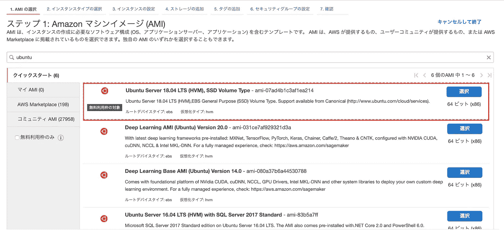

# 如何在 AWS EC2 + Ubuntu + Nginx + Passenger 上部署 Rails 5.2

> 原文：<https://itnext.io/how-to-deploy-rails-5-2-on-aws-ec2-ubuntu-nginx-passenger-cd842c1c35ee?source=collection_archive---------1----------------------->


在本文中，我将详细说明如何在 AWS EC2、Ubuntu、Nginx 和 Passenger 上部署 Rails 5.2 应用程序。

如果一切顺利，需要 1-2 小时。

# 环境

*   Ruby 2.5.1
*   虚拟机 1.29.7
*   Rails 5.2
*   AMS EC2
*   Ubuntu 18.04 LTS 20180814

# 1.设置 EC2 Ubuntu

访问 AWS EC2 控制台页面并创建一个新的 EC2 实例。

选择“Ubuntu Server 18.04 LTS”。



仅供参考，定价与亚马逊 Linux 相同:
[Ubuntu 18.04 LTS —仿生](https://aws.amazon.com/marketplace/pp/B07CQ33QKV?qid=1547771989724&sr=0-2&ref_=srh_res_product_image)

启动后，通过 ssh 登录到 EC2。

注意:默认用户名是“ubuntu”。

```
$ ssh -p 22 -i ~/.ssh/[YOUR_KEY] ubuntu@[YOUR_IP_ADDRESS]
```

# 2.安装 Ruby

接下来，在 Ubuntu 中安装 Ruby。

## 系统配置

```
$ sudo apt-get update
$ sudo apt-get install -y curl gnupg build-essential
```

## RVM 构型

```
$ sudo apt-get install gnupg2 -y
$ curl -sSL [https://get.rvm.io](https://get.rvm.io) | bash -s stable — ruby=2.5.1
$ sudo gpg2 — keyserver hkp://pool.sks-keyservers.net — recv-keys 409B6B1796C275462A1703113804BB82D39DC0E3 7D2BAF1CF37B13E2069D6956105BD0E739499BDB
$ curl -sSL [https://get.rvm.io](https://get.rvm.io) | sudo bash -s stable
$ sudo usermod -a -G rvm ‘YOUR_USER_NAME’
```

重新登录到 EC2，以应用上述配置。

```
$ exit
$ ssh -p 22 -i ~/.ssh/[YOUR_KEY] ubuntu@[YOUR_IP_ADDRESS]
$ rvm -v
rvm 1.29.7 (latest) by Michal Papis, Piotr Kuczynski, Wayne E. Seguin [[https://rvm.io](https://rvm.io)]
```

## Ruby 配置

安装 Ruby secifying 一个您想要全局使用的特定版本，并将其设置为默认版本。

```
$ rvm install ruby 2.5.1
$ rvm — default use ruby 2.5.1
```

## 安装捆扎机

```
$ gem install bundler — no-rdoc — no-ri
```

## 安装 Node.js

```
$ sudo apt-get install -y nodejs &&
> sudo ln -sf /usr/bin/nodejs /usr/local/bin/node
```

# 3.设置乘客和 Nginx

## 安装乘客包

```
$ sudo apt-get install -y dirmngr gnupg
$ sudo apt-key adv — keyserver hkp://keyserver.ubuntu.com:80 — recv-keys 561F9B9CAC40B2F7
$ sudo apt-get install -y apt-transport-https ca-certificates $ sudo sh -c ‘echo deb [https://oss-binaries.phusionpassenger.com/apt/passenger](https://oss-binaries.phusionpassenger.com/apt/passenger) bionic main > /etc/apt/sources.list.d/passenger.list’
$ sudo apt-get update $ sudo apt-get install -y libnginx-mod-http-passenger
$ sudo apt-get install -y libnginx-mod-http-passenger
```

## 激活乘客 Nginx

确认配置文件的路径，并添加链接。

```
$ if [ ! -f /etc/nginx/modules-enabled/50-mod-http-passenger.conf ]; then sudo ln -s /usr/share/nginx/modules-available/mod-http-passenger.load /etc/nginx/modules-enabled/50-mod-http-passenger.conf ; fi
$ sudo ls /etc/nginx/conf.d/mod-http-passenger.conf
```

执行完上述命令后，重新启动 Nginx。

```
$ sudo apt install nginx-core
$ sudo service nginx restart
```

## 确认安装

确保乘客已经成功安装。

```
$ sudo /usr/bin/passenger-config validate-install
What would you like to validate?
Use <space> to select.
If the menu doesn’t display correctly, press ‘!’‣ ⬢ Passenger itself
 ⬡ Apache— — — — — — — — — — — — — — — — — — — — — — — — — — — — — — — — — — — — -
* Checking whether this Passenger install is in PATH… ✓
* Checking whether there are no other Passenger installations… ✓Everything looks good. :-)
```

另外，确认 Nginx 是否启动了乘客。

```
$ sudo /usr/sbin/passenger-memory-stats
Version: 6.0.1
Date : 2019–01–17 21:25:01 +0000
 — — — — — Nginx processes — — — — — -
PID PPID VMSize Private Name
 — — — — — — — — — — — — — — — — — — — 
14759 1 141.1 MB 0.4 MB nginx: master process /usr/sbin/nginx -g daemon on; master_process on;
14762 14759 143.7 MB 0.7 MB nginx: worker process
### Processes: 2
### Total private dirty RSS: 1.02 MB— — — Passenger processes — — -
PID VMSize Private Name
 — — — — — — — — — — — — — — — -
14738 389.2 MB 2.3 MB Passenger watchdog
14748 673.0 MB 3.2 MB Passenger core
### Processes: 2
### Total private dirty RSS: 5.51 MB
```

如果 Nginx 和 Passenger 都在运行，一切都很好。

## 定期更新

Nginx 和 Passenger 都通过 APT 定期更新。因此，最好使用以下命令定期更新它们。

```
$ sudo apt-get update
$ sudo apt-get upgrade
```

# 4.部署 Rails 应用

## 要预安装的软件

安装 Git。

```
$ sudo apt-get install -y git
```

安装 MySQL。

```
$ sudo apt-get install mysql-server mysql-client
$ sudo apt-get install libmysqlclient-dev
```

如果你的应用程序需要，安装 Yarn。

```
$ curl -sS [https://dl.yarnpkg.com/debian/pubkey.gpg](https://dl.yarnpkg.com/debian/pubkey.gpg) | sudo apt-key add -
$ echo “deb [https://dl.yarnpkg.com/debian/](https://dl.yarnpkg.com/debian/) stable main” | sudo tee /etc/apt/sources.list.d/yarn.list
$ sudo apt-get update && sudo apt-get install yarn
```

## 导轨配置

用 Git 克隆你的应用。

```
$ cd /var/www
$ sudo git clone [YOUR_GIT_URL]
$ sudo chown [YOUR_USER_NAME] -R [APP_REPOSITORY]
```

使用以下命令设置您的应用程序。

编写在“config.master.key”中执行“rails new”时生成的代码。

```
$ cd [APP_REPOSITORY]
$ vim config/master.key
$ bundle install — deployment — without development test
$ bundle exec rake db:create RAILS_ENV=production
$ bundle exec rake assets:precompile RAILS_ENV=production
```

增强配置文件的安全级别。

```
$ chmod 700 config db
$ chmod 600 config/database.yml config/master.key
```

**“丑化::错误”发生？**

当执行“rake assets:precompile”时，可能会发生以下错误。

```
Uglifier::Error: Unexpected token: punc ({). To use ES6 syntax, harmony mode must be enabled with Uglifier.new(:harmony => true)
```

它可以通过如下编辑“config/environments/production . Rb”来解决。

```
# config.assets.js_compressor = :uglifier 
config.assets.js_compressor = Uglifier.new(harmony: true) 
```

## Nginx 配置

获取 Ruby 的路径。

```
$ passenger-config about ruby-command
passenger-config was invoked through the following Ruby interpreter:
 Command: /usr/local/rvm/gems/ruby-2.5.1/wrappers/ruby
 Version: ruby 2.5.1p57 (2018–03–29 revision 63029) [x86_64-linux]
 To use in Apache: PassengerRuby /usr/local/rvm/gems/ruby-2.5.1/wrappers/ruby
 To use in Nginx : passenger_ruby /usr/local/rvm/gems/ruby-2.5.1/wrappers/ruby
 To use with Standalone: /usr/local/rvm/gems/ruby-2.5.1/wrappers/ruby /usr/bin/passenger start
```

路径“/usr/local/rvm/gems/RUBY-2 . 5 . 1/wrappers/RUBY”后面用做*【YOUR _ RUBY _ PATH】*。

创建应用程序配置文件。

```
$ sudo vim /etc/nginx/sites-enabled/[APP_REPOSITORY].conf
```

将设置写入文件，如下所示。

*【YOUR _ RUBY _ PATH】*就是上面说的 RUBY 路径。

```
# /etc/nginx/sites-enabled/[APP_REPOSITORY].conf
server {
  listen 80;
  server_name [YOUR_DOMAIN]; # Tell Nginx and Passenger where your app’s ‘public’ directory is
  root /var/www/[APP_REPOSITORY]/public; # Turn on Passenger
  passenger_enabled on;
  passenger_ruby [YOUR_RUBY_PATH];
}
```

重新启动 Nginx，检查它是否工作。

```
$ sudo service nginx restart
$ curl [http://[YOUR_DOMAIN](/[YOUR_DOMAIN)]
```

如果根 HTML 代码显示正确，就可以了。

你的 Rails 应用已经准备好了！

# **需要做成 HTTPS 吗？**

了解更多:
[如何用 Let's Encrypt 制作 EC2 + Ubuntu + Nginx +乘客 HTTPS](https://medium.com/@keisuke.inaba.cpa/how-to-make-ec2-ubuntu-nginx-passenger-https-with-lets-encrypt-dcb08c2e6c4b)

# 需要架设行动索？

了解更多:
" [如何在生产中设置 Rails 5 动作电缆](https://medium.com/@keisuke.inaba.cpa/how-to-set-up-rails-5-action-cable-in-production-a003fc374e1d)

# 来源

*   [在亚马逊网络服务上发布服务器](https://www.phusionpassenger.com/library/walkthroughs/deploy/ruby/aws/nginx/oss/launch_server.html)
*   [Ubuntu —安装 GPG 2](https://blog.programster.org/ubuntu-install-gpg-2)
*   [安装|纱线](https://yarnpkg.com/lang/en/docs/install/#debian-stable)
*   [缺省生成的 config/initializer/assets . Rb 可能导致 assets:precompile for production](https://github.com/rails/rails/issues/33477)中的错误