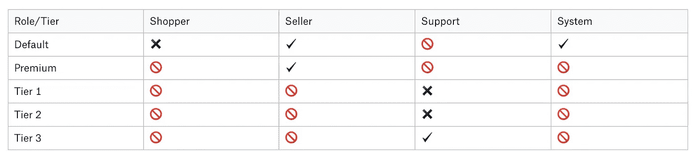

# 如何设计权限框架

> 原文：<https://itnext.io/how-to-design-a-permissions-framework-7c054a009c52?source=collection_archive---------1----------------------->

我通常以一些个人轶事开始我的帖子，解释我所写的背景以及我是如何产生这个想法的。我可能会对这一个做同样的事情，但是事实是我写它是因为我有❤️权限。我不知道他们为什么对我有如此大的魔力，但事实就是如此，我对权限感到兴奋。用户角色，检查谁被允许在什么时候做什么，并确保它们一起工作是最好的乐趣！


照片由[你好我是尼克](https://unsplash.com/@helloimnik?utm_source=unsplash&utm_medium=referral&utm_content=creditCopyText)在 [Unsplash](https://unsplash.com/s/photos/no--lego?utm_source=unsplash&utm_medium=referral&utm_content=creditCopyText)

你可能不会分享我的兴奋，我想这没关系，但是权限是几乎所有应用程序的基本构建块之一。我将在这里展示的权限框架可以从简单开始，并随着你的发展而发展，所以你可以确定你*会需要它，并且它绝对值得你从一开始就设置它。*

# 最好征求同意

从最基本的意义上来说，权限是关于决定应用程序的当前用户能做什么或不能做什么。他们可以编辑这个项目还是只查看它？允许他们访问该页面吗？他们能不能改变这个设置？

**看情况**

有时在权限和业务逻辑之间有一个灰色区域。假设你正在创建一个市场应用程序，卖家只能发布 10 个待售商品，除非他们选择高级访问。是否允许过帐第 10 个项目？不会。但它被阻止是因为权限还是因为业务逻辑？让我们检查一下:

我的经验是，在不直接改变用户权限的情况下，特定用户的答案是否总是相同的。权限是一个元问题；如果答案根据应用程序中的状态变化*而变化，这是一个好迹象，表明这是一个业务逻辑问题。*

因此，如果我们回头看看 10 个项目的限制，用户可以发布一个项目 10 次，但不是第 11 次。这里面肯定有商业逻辑，不能仅凭身份来判定。


马库斯·斯皮斯克在 [Unsplash](https://unsplash.com/s/photos/lego?utm_source=unsplash&utm_medium=referral&utm_content=creditCopyText) 上拍摄的照片

**启用与允许**

我将把由身份控制的动作称为“允许的”，而不是由业务逻辑控制的“启用的”动作。UI 结果可能是相同的，但是有一个共同的术语是有用的。这篇文章的其余部分将讨论如何确定一个动作是否被*允许*，任何应该被*启用的事情*应该由你的业务逻辑来处理，而不是通用交叉关注权限框架的一部分。

# 权限类别

我们可以将权限分为几个类别:

**基于角色的**

检查您是否拥有执行某些操作的正确角色。例如，在我们的 marketplace 应用程序中，卖家可以发布待售商品，但买家只能购买。客户服务代表可以查看用户看到的任何内容，但不能编辑任何内容。

**基于层级的**

有些功能可能只对付费用户开放，例如，张贴 10 件以上待售商品的选项。高级客户可能有更多的选择，例如定制广告或其他特殊功能。

**特征标志**

有些功能可能是 A/B 测试过的，或者是逐步推出的，并且只对某些用户可用，基于一些任意的标志。例如，我们可能会推出一个新功能，允许上传一个帖子的视频，但不会一次向所有人开放。

**基于上下文的**

有些动作通常是允许的，但是基于身份和当前上下文。例如，你可能是一个有权编辑待售商品的卖家，但你只能编辑自己的*商品，而不能编辑其他人的*商品。

**边缘案例/自定义逻辑**

在现实世界中，总会有一些奇怪的东西不太适合权限框架，所以我们必须允许在*非常罕见的*情况下使用自定义逻辑。


[伊内斯·皮门特尔](https://unsplash.com/@deadqueenines?utm_source=unsplash&utm_medium=referral&utm_content=creditCopyText)在 [Unsplash](https://unsplash.com/s/photos/excited--lego?utm_source=unsplash&utm_medium=referral&utm_content=creditCopyText) 拍摄的照片

# 高级别:我们将如何做到这一点？

高级方案很简单:通过检查每个*权限类别*，每个动作将*知道当前用户是否允许该动作。*

您可能会考虑按类别而不是按操作对权限进行分组，但根据我的经验，添加功能的频率要比向系统添加层或角色的频率高得多，所以当您添加单个功能时，您最终将不得不在许多不同的地方添加它的权限。这更难阅读和理解，也更难复制粘贴。有时，您只是希望某个功能与“另一个操作”具有相同的权限，将所有权限组合在一个操作下会使复制它们更容易。

**基于层/角色的逻辑**

层/角色通常可以以各种方式组合，以指定确切的用户类型。尝试将其建模为一个矩阵是很有诱惑力的，其中为层和角色的交集指定了权限:

✔ -允许✖ -不允许🚫-无效组合



如您所见，矩阵中的大多数单元都不是有效的组合。在代码中，这造成了大量的开销和混乱，迫使您处理不应该出现的选项。

此时，您可能会决定创建一个类似如下的层次结构:

```
PERMISSIONS = { RoleEnum.Shopper : { TierEnum.Default : False, }, RoleEnum.Seller : { TierEnum.DefaultSeller: True, TierEnum.PremiumSeller: True, }, RoleEnum.Support : { TierEnum.TierOne: False, TierEnum.TierTwo: False, TierEnum.TierThree: True, }, RoleEnum.System: { TierEnum.Default : True, }}
```

这可以工作，但它更难阅读，它迫使我们为没有像购物者和系统这样的层的用户设置一个默认层，并且我们仍然必须处理无效的情况。

在某些情况下，您可能会发现矩阵或层级结构是不可避免的，但作为最佳实践，我建议将层级和角色整合为一个单一的*用户类型*，并将其用作您的权限密钥:

```
PERMISSIONS = { UserType.Shopper : False, UserType.Seller : True, UserType.Seller_Premium: True, UserType.Support_TierOne: False, UserType.Support_TierTwo: False, UserType.Support_TierThree: True, UserType.System: True,}
```

**特征标志**

因为这个权限框架假设每个动作有一个类定义，所以您只能设置一个`FEATURE_FLAG`。在这种粒度下，多个特性标志没有意义，因为如果启用了一个特性标志而没有启用另一个，您必须应用自定义逻辑来决定该做什么。希望如果你坚持通过这个框架检查你的所有权限，你就不必处理这样的特例，但是如果你绝对必须的话——使用定制逻辑选项(我稍后会给出一个例子)。

**基于上下文的**

基于上下文的权限接近自定义逻辑，但由于它们经常出现，我们可能希望为常见用例添加一些内置支持。确切的场景取决于您的系统，并且可以根据需要添加。

注意不要添加太多这样的元素，因为它们会使 action 类变得复杂，并且会增加创建新动作的开销。

对于这个例子，我将处理一个这样的常见场景——仅当上下文用户与代理用户相同时才允许操作。


照片由詹姆斯·庞德在 Unsplash 上拍摄

# 集体诉讼

我们的权限框架的基本组件是一个基类，它保存了权限检查的默认逻辑。我会称之为 Action，因为这是一个好名字，作为额外的奖励，你可以在你的代码中有一个非常小的集体诉讼(在我看来，这是完全值得的)。让我们看看目前为止我们得到了什么:

```
Permissions = namedtuple("Permissions"  ["allowed","check_same_user"])class Action(object):
  PERMISSIONS = {
    # I'd go with naming the tuple values explicitly in 
    # production code Permissions(allowed = False, check_same_user =
    # False) but this margin is too narrow to contain UserType.Shopper : Permissions(False, False),
    UserType.Seller : Permissions(False, False),
    UserType.Seller_Premium: Permissions(False, False),
    UserType.Support_TierOne: Permissions(False, False),
    UserType.Support_TierTwo: Permissions(False, False),
    UserType.Support_TierThree: Permissions(False, False),
    UserType.System: Permissions(False, False),
  } FEATURE_FLAG = None def allowed(self, user, context):
    return (PERMISSIONS[user.user_type].allowed and
            self._is_feature_flag_enabled(user, context) and
            self._check_same_user(user, context)) def _is_feature_flag_enabled(self, user, context):
    return (FEATURE_FLAG is not None and
            feature_flags.is_on(user, context, FEATURE_FLAG)) def _check_same_user(self, user, context):
    if not PERMISSIONS[user.user_type].check_same_user:
      return True
    return user.id == context.user_id
```

默认逻辑检查对于用户的类型*和* *是否允许该动作，如果*设置了特征标志，并且在*和*上是否应该是同一用户并且实际上是同一用户。

从安全角度来看，任何动作的默认权限是*不允许*。否则，如果你忘记处理某个案例，它就会对所有人开放，这是一个巨大的安全漏洞。这就是为什么要求用户匹配所有指定条件是更安全的方法，也可能更符合业务规则。

有人访问他们不应该访问的东西的潜在损害比被阻止访问甚至像登录或计费这样的关键组件要高得多。第一种情况可能会导致严重的安全漏洞，而且很难恢复。第二个是暂时的挫折，无论多么痛苦。

为实际动作构建的子类应该覆盖`PERMISSIONS`和`FEATURE_FLAG`值，以满足它们的特定需求。

> **匿名用户**
> 
> 您可能已经注意到，我没有处理用户没有角色的选项，因为他们没有登录到应用程序。至少，登录页面必须支持匿名用户，并且您可能有其他允许匿名用户访问的界面。我不想让示例代码变得太复杂，所以我将只概述解决方案，并继续忽略这种情况:
> 
> 为了处理匿名用户，我建议将`UserType.Anonymous`添加到您的权限框架中，并使用[空对象模式](https://en.wikipedia.org/wiki/Null_object_pattern)返回一个“空”用户，当不存在时，将 user_type 设置为`UserType.Anonymous`。这样，您可以避免在代码中显式处理匿名用户场景，他们就像任何其他用户一样被对待。

**示例:查看/编辑项目**

如果我们返回到我们的市场示例应用程序，我们希望允许应用程序的用户查看待售商品。所有用户都可以查看项目，因此`PERMISSIONS`都被设置为`True`，没有进一步的限制。

```
class ViewItemAction(Action): PERMISSIONS = {
    UserType.Shopper : Permissions(True, False),
    UserType.Seller : Permissions(True, False),
    UserType.Seller_Premium: Permissions(True, False),
    UserType.Support_TierOne: Permissions(True, False),
    UserType.Support_TierTwo: Permissions(True, False),
    UserType.Support_TierThree: Permissions(True, False),
    UserType.System: Permissions(True, False),
  }
```

然而，只有卖家才可以编辑物品，而且只有在物品属于他们的情况下。因此，我们将为购物者设置权限为`False`，并且只允许卖家编辑他们自己的商品。我们还将允许支持代理编辑项目，但只能从`TierTwo`开始。然而，由于支持代理不是销售人员，我们不应该检查基于上下文的“相同用户”权限。

```
class EditItemAction(Action):PERMISSIONS = {
    UserType.Shopper : Permissions(False, False),
    UserType.Seller : Permissions(True, True),
    UserType.Seller_Premium: Permissions(True, True),
    UserType.Support_TierOne: Permissions(False, False),
    UserType.Support_TierTwo: Permissions(True, False),
    UserType.Support_TierThree: Permissions(True, False),
    UserType.System: Permissions(True, False),
  }
```

如果我们要推出一个新的编辑体验，我们可以用一个如下所示的特性标志来作为入口:

```
class EditListingExperimentAction(Action):PERMISSIONS = {
    UserType.Shopper : Permissions(False, False),
    UserType.Seller : Permissions(True, True),
    UserType.Seller_Premium: Permissions(True, True),
    UserType.Support_TierOne: Permissions(False, False),
    UserType.Support_TierTwo: Permissions(True, False),
    UserType.Support_TierThree: Permissions(True, False),
    UserType.System: Permissions(True, False),
  }FEATURE_FLAG = "edit_listing_experiment"
```

**自定义逻辑**

每隔一段时间，你就会有一个不完全符合这些检查的行为。您的特性可能依赖于两个特性标志，或者您可能需要检查一些关于用户的非常具体的东西。在那些情况下(希望很少)，您可以通过覆盖允许的方法来实现自己的逻辑:

```
class Action(object): def allowed(self, user, context):
    return self._my_custom_check(user, context)
```

# 明确的，不是多余的

您可能会注意到`ViewItemAction`和`EditItemAction`都定义了所有 7 种用户类型和权限值。这似乎是多余的，你可以让一个泛型`ViewAction`和`EditAction`继承它们的值，只覆盖需要不同处理的内容。


照片由 Unsplash 上的 Adam van den Brink 拍摄

然而，对于每一个“规则的例外”，你都必须开始一个新的继承分支，并且你很快就会发现你的继承树变得支离破碎，增加了代码的复杂性和混乱。当读取代码或调试时，您必须沿着继承树向上查看谁允许什么，这使得这个过程更加困难。

显式还有其他优势:老实说，我们作为软件工程师做的很大一部分是复制粘贴代码。如果您只覆盖了一些值，下一个工程师将会复制粘贴一个类似的操作，而对从父类继承的其他值没有任何可见性。这些继承的价值观对他们的行为来说可能是错误的，但他们甚至不知道它们的存在和必须被处理。

> 最近，我参与开发了一个具有权限/身份衍生的特性。我们的主要问题之一是提高对新功能的认识，这必须考虑到它。Linters 和 monitoring 非常有效，但是必须显式指定该场景的行为会迫使开发人员在开发过程的早期就考虑到这一点。

根据您的语言能力和您构建类的方式，您应该通过在编译时使用单元测试或 linter 进行验证来确保每个类明确指定所有权限值。

# 正在检查权限

> 警告:这个部分是非常伪代码

是我们的接口，用于执行一个动作的许可需要被验证的地方。权限检查往往会在代码中激增，因为开发人员有理由担心他们的代码会被滥用。但是在大多数情况下，只在三个地方需要权限检查:

**前端**

以确定是否应该显示/启用 UI 元素。权限值可以是元素属性的一部分:

```
if (props.editAllowed) {  
  return <MyButton />
}
```

或者它可以是一个反映服务器端动作结构的单独的公共框架:

```
if (EditItemAction.allowed()) {
  return <MyButton />
}
```

**端点接入**

在允许访问 API 端点之前，您应该验证用户有这样做的权限。最简单的方法是在您的端点上定义一个 decorator，它检查权限并在用户没有权限时返回 403(禁止)错误。

```
def allowed(action_class):
  def function_wrapper(func):
    if (not action_class.allowed(global_get_current_user())):
      raise PermissionDeniedException()

    func()

  return function_wrapper@allowed(ViewItemAction)
def view_item(...):
  my_endpoint_logic()
```

**持续性**

在执行任何不可逆的操作(比如将实体保存到数据库)之前，您应该再次检查您的用户是否拥有正确的权限。这里的想法是，如果有人从受错误操作保护的端点给你打电话，这是最后一道防线:

```
@allowed(EditItemAction)
def save_item(user, item):
  _save_item_to_database(item)
```

使用装饰器还有一个额外的好处，那就是非常清晰可见地声明哪些权限是执行该操作所必需的。

# 权限带来更多乐趣

对于这个例子，我在代码中为每个动作使用了硬编码的权限，但这可以通过数据库中的条目轻松完成，这些条目可以实时修改以阻止或向用户开放功能。

对于 B2B 应用程序，如果您的客户愿意，您甚至可以允许他们为每个操作设置自己的自定义权限。多酷啊。

感谢您读到这里！我知道每个应用程序都是独一无二的，但是我希望我在这里展示的框架能够帮助你以安全和可扩展的方式设计你的权限。