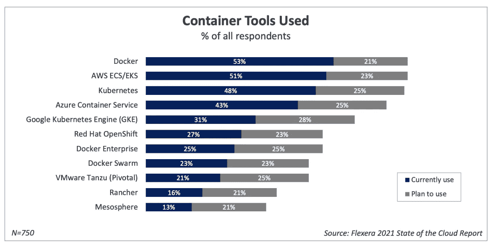
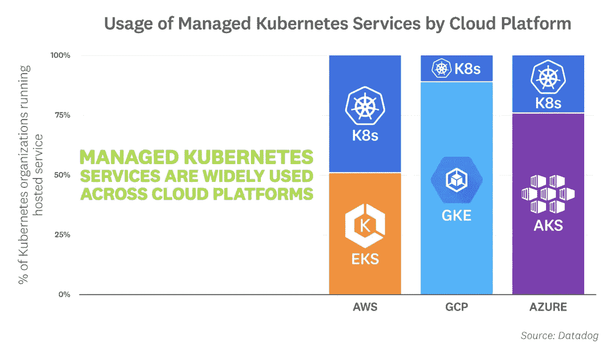
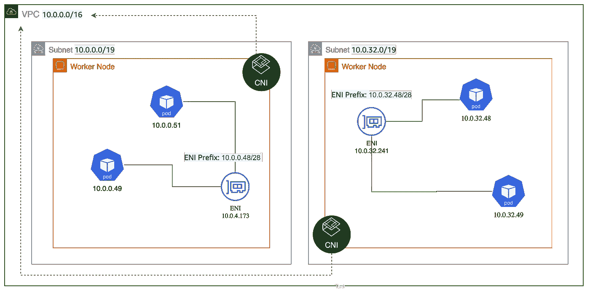
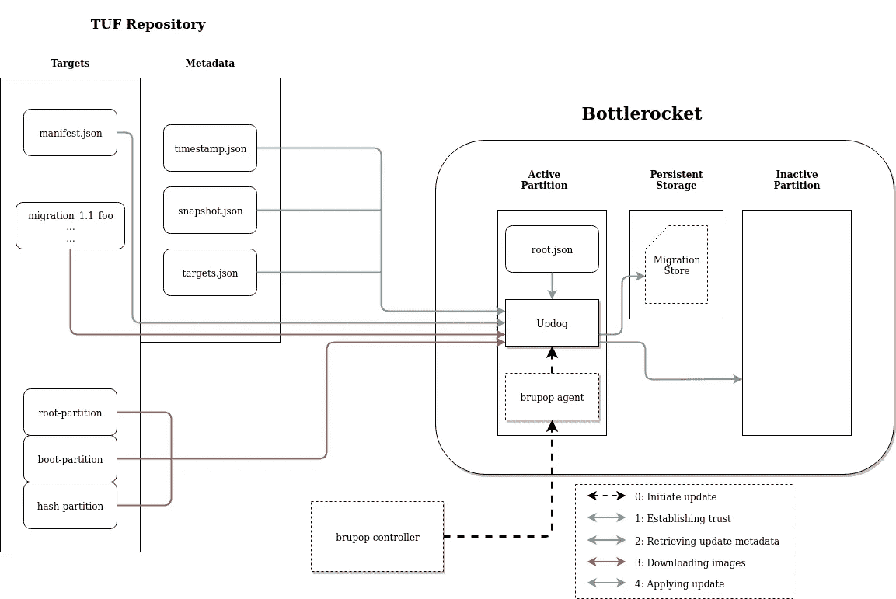

# 如何设计和配置生产就绪型 EKS 集群

> 原文：<https://itnext.io/how-to-design-and-provision-a-production-ready-eks-cluster-f24156ac29b2?source=collection_archive---------0----------------------->

使用 Terraform、Helm 和其他开源工具在 AWS 上创建和配置生产级 Kubernetes 集群的全面指南。


图片来源: [Pixabay](https://pixabay.com/illustrations/digitization-transformation-earth-5231610/)

根据 [Flexera 的 2021 年云状态报告](https://info.flexera.com/CM-REPORT-State-of-the-Cloud)，AWS 领先于容器编排市场份额，51%的受访者使用亚马逊 EKS 和 ECS，相比之下，AKS 为 43%，GKE 为 31%。



图片来源: [Flexera](https://info.flexera.com/CM-REPORT-State-of-the-Cloud)

Flexera 没有分享 ECS 与 EKS 使用之间的准确细分，但根据 Datadog 最新的[容器报告](https://www.datadoghq.com/container-report/)，就主要云平台提供的托管 Kubernetes 服务而言，EKS 的使用是最低的。



图片来源:[数据狗](https://www.datadoghq.com/container-report/)

尽管这些调查结果可能基于样本量有所偏差，但有趣的是，它与我在 EKS 的经历相吻合。AWS 将 ECS、ECR、Fargate 和 EKS 归入一个单独的*容器*产品中，并且在 Kubernetes 的特定功能方面往往落后于 AKS 和 GKE，例如对最新 Kubernetes 版本的支持、beta 功能(例如垂直 pod 自动缩放器、自定义 kubelet 参数)和管理选项(例如节点自动修复、自动升级、仪表板)。

尽管有这些缺点，鉴于 AWS 在更广泛的云市场的主导地位，许多组织将选择 EKS 作为首选的托管 Kubernetes 提供商。如果您希望设计和配置生产级 EKS 集群，下面是我在复杂的 EKS 生态系统中遇到的一些常见问题和解决方法。

*注:有关托管 Kubernetes 产品的更详细比较，请参见* [*托管 Kubernetes 2021*](https://medium.com/geekculture/state-of-managed-kubernetes-2021-43e8a4ca0207) *的状态。*

# 出发点

部署 EKS 有两种流行的方式: [eksctl](https://eksctl.io/) 和 Terraform。eksctl 是一个由 [Weaveworks](https://www.weave.works/) 管理的开源工具，它利用 CloudFormation 来引导和配置 EKS。如果你的工作流已经围绕云形成，eksctl 可能是一个很好的开始，因为 AWS 有很好的[研讨会记录了这种情况](https://www.eksworkshop.com/030_eksctl/)。但是，如果您正在寻找一种更传统的 IaC 方法，使用 Terraform 将是一种更好的方法。

对于 Terraform，AWS 和 Gruntwork 都提供了基础架构和入门模板:

*   [使用 Terraform 供应生产就绪的亚马逊 EKS 集群](https://docs.aws.amazon.com/prescriptive-guidance/latest/containers-provision-eks-clusters-terraform/welcome.html)
*   [如何在 AWS 上部署生产级 Kubernetes 集群](https://gruntwork.io/guides/kubernetes/how-to-deploy-production-grade-kubernetes-cluster-aws/#what-is-kubernetes)

就我个人而言，我使用的是官方的 AWS EKS 模块，所以这里显示的例子将指向那些文档，但是可以修改为与其他 Terraform 模板一起工作。

# 当心 EKS 耗尽 IP 地址

在部署 EKS 集群之前，首先要考虑的是 VPC 设计和选择容器网络接口(CNI)。默认情况下，EKS 运行自动气象站 CNI，这是为了兼容其他自动气象站服务，如 VPC 流量日志。由于这种设计选择，每个 pod 都从子网中分配了一个 IP 地址。这意味着，不仅您的微服务会消耗 IP 地址，AWS 管理的其他 helper pods(例如 aws-node、coredns、kube-proxy)以及日志聚合器、监控代理和节点特定工具(例如 spot termination handler、更新代理)等作为 daemonsets 部署的常用工具也会消耗 IP 地址。使这个问题更加复杂的是，每个实例类型都有一个根据网络接口的最大数量和每个接口的私有 IP 地址分配的最大 IP 数量。换句话说，如果您的集群使用小型实例类型，您将很快达到这个限制。



图片来源: [AWS 博客](https://aws.amazon.com/blogs/containers/amazon-vpc-cni-increases-pods-per-node-limits/)

那么，可以做些什么来缓解这个问题呢？

1.  利用[二级 CIDR 范围](https://www.eksworkshop.com/beginner/160_advanced-networking/secondary_cidr/) (100.64.0.0/10 和 198.19.0.0/16)扩展 VPC 网络
2.  [在集群创建时启用 IPv6](https://docs.aws.amazon.com/eks/latest/userguide/cni-ipv6.html)
3.  [在 AWS CNI 1.9.0+](https://docs.aws.amazon.com/eks/latest/userguide/cni-increase-ip-addresses.html) 上设置 *ENABLE_PREFIX_DELEGATION* 为真。这将添加/28 个 IPv4 地址前缀。
4.  使用不同的 CNI，如[印花布、法兰绒、织物或纤毛](https://platform9.com/blog/the-ultimate-guide-to-using-calico-flannel-weave-and-cilium/)

上面列出的前三个解决方案属于 AWS 领域，所以如果您想确保获得 AWS 的全面支持，这可能是一个很好的前进方向。另一方面，其他 CNI 确实提供其他功能，如 eBPF、WireGuard 加密和网络策略支持。

# 使用瓶盖

类似于谷歌的容器优化操作系统，AWS 提供了 [Bottlerocket](https://github.com/bottlerocket-os/bottlerocket/blob/develop/QUICKSTART-EKS.md) ，这是一个基于 Linux 的操作系统，旨在托管容器。由于 Bottlerocket 只包含运行容器所需的组件，它的攻击面[比默认的 Amazon Linux 2 AMI 的攻击面](https://github.com/bottlerocket-os/bottlerocket/blob/develop/SECURITY_FEATURES.md)要小。

Bottlerocket 最好的特性之一是自动安全更新。它遵循“更新框架”(TUF)，通过自动回滚安全地更新 Bottlerocket 的版本。这减少了每隔几周为所有底层节点更新 AMI 的必要工作。

请注意，默认情况下，Bottlerocket 使用两个存储卷:

*   根设备`/dev/xvda`拥有主动和被动[分区集](https://github.com/bottlerocket-os/bottlerocket#updates-1)。它还包含 bootloader、用于验证[不可变根文件系统](https://github.com/bottlerocket-os/bottlerocket/blob/develop/SECURITY_FEATURES.md#immutable-rootfs-backed-by-dm-verity)的 dm-verity 哈希树，以及 Bottlerocket API 的数据存储。
*   数据设备`/dev/xvdb`用作容器映像、[主机容器](https://github.com/bottlerocket-os/bottlerocket#Custom-host-containers)和[引导容器](https://github.com/bottlerocket-os/bottlerocket#Bootstrap-containers-settings)的持久存储。

如果您需要更改这些参数中的任何一个，请相应地设置这些值，例如:

```
additional_ebs_volumes = [{
  block_device_name = "/dev/xvdb"
  volume_size       = "100"
  encrypted         = true
}]
```



图片来源:[瓶身](https://github.com/bottlerocket-os/bottlerocket/tree/develop/sources/updater)

如果出于某种原因，Bottlerocket 对您的用例不起作用，请安装 [SSM 代理](https://docs.aws.amazon.com/systems-manager/latest/userguide/sysman-install-ssm-agent.html)和[检查员](https://docs.aws.amazon.com/inspector/v1/userguide/inspector_agents-on-linux.html)来保护您的 AMI。确保也将`AmazonSSMMangedInstanceCore`角色附加到节点上:

```
workers_additional_policies = ["arn:aws:iam::aws:policy/AmazonSSMManagedInstanceCore"]ORself_managed_node_group_defaults = {
  ...
  iam_role_additional_policies = ["arn:aws:iam::aws:policy/AmazonSSMManagedInstanceCore"]
}
```

# 明智地使用 EKS 插件

直到最近，EKS 用户不得不自行管理 Kubernetes 组件，如`kube-proxy`、`core-dns`和 VPC·CNI。对于任何 1.18 或更高版本的 EKS 集群，亚马逊现在为每个组件提供一个托管版本，以确保最新的安全补丁和漏洞修复通过 AWS 的验证。

对于新的集群，选择使用`kube-proxy`和`core-dns`插件，除非你预计`core-dns`配置会有很大变化。至于 VPC·CNI，答案将取决于上面做出的修改或设计决定(即使用 AWS VPC·CNI 与开源替代方案)。还有 EBS CSI 驱动程序插件，但它只在预览版中可用，所以我会等到它在未来的版本中正式发布。

# 加密 etcd 和 EBS 卷

默认情况下，Kubernetes 秘密不加密地存储在主节点上的`etcd`中。EKS 提供了使用 KMS 来启用 Kubernetes 秘密的信封加密的选项，但这很容易被忽略。在 EKS 模块中配置`cluster_encryption_config`模块:

```
cluster_encryption_config = [{    
  provider_key_arn = aws_kms_key.eks.arn    
  resources        = ["secrets"]  
}]
```

并相应地创建 [KMS 资源](https://github.com/terraform-aws-modules/terraform-aws-eks/blob/master/examples/eks_managed_node_group/main.tf#L392-L460):

```
resource "aws_kms_key" "eks" {
  description             = "EKS Secret Encryption Key"
  deletion_window_in_days = 7
  enable_key_rotation     = true tags = local.tags
}resource "aws_kms_key" "ebs" {
  description             = "Customer managed key to encrypt EKS managed node group volumes"
  deletion_window_in_days = 7
  policy                  = data.aws_iam_policy_document.ebs.json
}# This policy is required for the KMS key used for EKS root volumes, so the cluster is allowed to enc/dec/attach encrypted EBS volumes
data "aws_iam_policy_document" "ebs" {
  # Copy of default KMS policy that lets you manage it
  statement {
    sid       = "Enable IAM User Permissions"
    actions   = ["kms:*"]
    resources = ["*"]principals {
      type        = "AWS"
      identifiers = ["arn:aws:iam::${data.aws_caller_identity.current.account_id}:root"]
    }
  }# Required for EKS
  statement {
    sid = "Allow service-linked role use of the CMK"
    actions = [
      "kms:Encrypt",
      "kms:Decrypt",
      "kms:ReEncrypt*",
      "kms:GenerateDataKey*",
      "kms:DescribeKey"
    ]
    resources = ["*"]principals {
      type = "AWS"
      identifiers = [
        "arn:aws:iam::${data.aws_caller_identity.current.account_id}:role/aws-service-role/autoscaling.amazonaws.com/AWSServiceRoleForAutoScaling", # required for the ASG to manage encrypted volumes for nodes
        module.eks.cluster_iam_role_arn,                                                                                                            # required for the cluster / persistentvolume-controller to create encrypted PVCs
      ]
    }
  }statement {
    sid       = "Allow attachment of persistent resources"
    actions   = ["kms:CreateGrant"]
    resources = ["*"]principals {
      type = "AWS"
      identifiers = [
        "arn:aws:iam::${data.aws_caller_identity.current.account_id}:role/aws-service-role/autoscaling.amazonaws.com/AWSServiceRoleForAutoScaling", # required for the ASG to manage encrypted volumes for nodes
        module.eks.cluster_iam_role_arn,                                                                                                            # required for the cluster / persistentvolume-controller to create encrypted PVCs
      ]
    }condition {
      test     = "Bool"
      variable = "kms:GrantIsForAWSResource"
      values   = ["true"]
    }
  }
}
```

要配置 EBS 卷以使用 KMS，您还需要在 Kubernetes 中创建新的 StorageClass 对象，并配置您用上面的 Terraform 代码创建的`kmsKeyId`。您还可以将这个新的存储类作为默认类，以确保通过永久卷声明配置的新 EBS 卷将始终被加密。

# 考虑手动管理 aws-auth

EKS 模块的一个已知问题是，它在同一个模块中使用了 AWS 提供者和 Kubernetes 提供者。当 EKS 集群的凭证未知或正在更新时，由于 Terraform [无法可靠地支持在单个计划/应用中使用一个提供者来配置另一个提供者](https://www.terraform.io/language/providers/configuration)，这就带来了挑战。当集群配置改变时(例如[在创建后启用秘密加密](https://github.com/hashicorp/terraform-provider-kubernetes/issues/1182))，用户经常遇到这个问题，Terraform 认为它丢失了集群的凭证。

有两种解决方法:

1.  在应用更改之前，从状态中删除 Kubernetes 资源(即`terraform state rm module.eks.kubernetes_config_map.aws_auth`然后`terraform plan`)
2.  在 EKS 模块中设置`manage_aws_auth = false`，在 Terraform 之外管理 configmap(这里看模块如何管理这个[)。](https://github.com/terraform-aws-modules/terraform-aws-eks/blob/a26c9fd0c9c880d5b99c438ad620e91dda957e10/aws_auth.tf#L65-L93)

# 适当配置集群自动缩放

不像 GKE，EKS 没有集群自动缩放器(也许这将成为一个 EKS 管理的插件)。使用服务帐户的 OIDC 联合身份验证和 [IAM 角色](https://docs.aws.amazon.com/eks/latest/userguide/iam-roles-for-service-accounts.html)来部署集群 autoscaler，自动发现功能已打开，标记由 EKS Terraform 模块配置。

在底层，cluster autoscaler 利用 Amazon EC2 自动扩展组来管理每个节点组，这意味着它受到 ASG 面临的相同限制。例如，由于 EBS 卷是特定于区域的，因此对于 EBS 卷支持的状态集，群集自动缩放的简单部署可能不会在所需的可用性区域中触发扩展事件。为了减轻这种情况，请确保使用以下内容配置集群自动缩放器:

*   `balance-similar-node-groups=true`
*   在不同可用性区域中配置的节点组

另一种解决方案是使用 [Karpenter](https://karpenter.sh/) ，其工作方式类似于 [GKE 自动驾驶的动态节点供应流程](https://cloud.google.com/kubernetes-engine/docs/concepts/autopilot-overview)。要深入了解 Karpenter，请查看:

[](/karpenter-open-source-high-performance-kubernetes-cluster-autoscaler-d56e3ab06aae) [## Karpenter:开源、高性能的 Kubernetes 集群自动缩放器

### 根据 AWS，kubernetes-native cluster auto scaler 现在已经可以生产了。

itnext.io](/karpenter-open-source-high-performance-kubernetes-cluster-autoscaler-d56e3ab06aae) 

# 利用开源工具

不幸的是，无论是 Terraform 还是 AWS 都没有提供一种方法来自动地对 EKS 集群中的底层实例进行变更。这意味着每次 AMI 需要更新或者 Kubernetes 版本需要升级时，所有的节点都需要手工清空和更新。通过 Terraform 实现这种行为的一种方法可能涉及创建一个新的节点组，并编写一个脚本来清空旧的节点组并缩小它们的规模。另一种选择是使用由 Gruntwork 团队维护的 `[kubergrunt](https://github.com/gruntwork-io/kubergrunt#deploy)` [工具](https://github.com/gruntwork-io/kubergrunt#deploy)的`[deploy](https://github.com/gruntwork-io/kubergrunt#deploy)` [功能。这将自动创建新的节点组，隔离和清空旧的节点，并删除旧的工作节点。](https://github.com/gruntwork-io/kubergrunt#deploy)

对于其他有助于 EKS 管理的开源工具，请查看“[更好地开发 Kubernetes 的有用工具](https://yitaek.medium.com/useful-tools-for-better-kubernetes-development-87820c2b9435)”:

[](https://yitaek.medium.com/useful-tools-for-better-kubernetes-development-87820c2b9435) [## 更好地开发 Kubernetes 的有用工具

### 一系列出色的 Kubernetes 工具和项目，用于部署、保护和监控您的 Kubernetes 集群。

yitaek.medium.com](https://yitaek.medium.com/useful-tools-for-better-kubernetes-development-87820c2b9435) 

# 最终注释

近年来，EKS 取得了巨大的进展，使 EKS 集群创建和管理的顺利经验。在托管功能方面，它仍然落后于 GKE 和 AKS，但通过对现有工具包进行一些小的调整，人们可以轻松地组装一个生产级集群。如果在大规模操作 EKS 的过程中，我遗漏了其他的技巧和诀窍，请在下面评论。