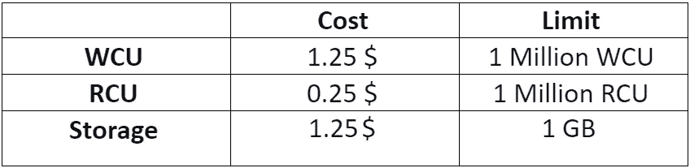
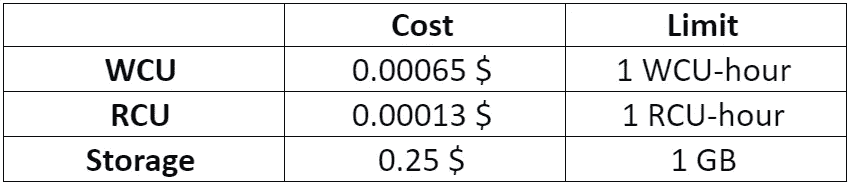

# 如何设计 DynamoDB 表——核心概念和最佳实践

> 原文：<https://itnext.io/how-to-design-dynamodb-tables-core-concepts-best-practices-62db14167874?source=collection_archive---------4----------------------->

如果您正在寻求对 DynamoDB 数据库及其重要组件的理解，如表、定价模型、项目、属性、主键和排序键，本文将满足您的需求。

亚历山德罗·埃尔贝塔在 [Unsplash](https://unsplash.com?utm_source=medium&utm_medium=referral) 上拍摄的照片

根据 AWS 的官方文档，DynamoDB 被定义为无服务器、可伸缩、企业级的数据库。对于无服务器，这意味着数据库可以根据需求自动调整其容量。它允许每天成功执行数万亿次请求。除此之外，DynamoDB 数据库还确保了一致且可预测的性能。

由于其大规模能力、低延迟和高吞吐量，DynamoDb 经常被推荐用于实时场景，如游戏记分牌和聊天应用程序。

# **了解基础知识**

DynamoDB 将数据存储在其**宽列**和**键值**结构中。宽列意味着一个列不需要像在关系数据库中那样跨越所有的行。Key-value 表示指定属性的标识 id。

如果你对数据库的复杂性感到困惑，不要担心。参见下面的例子，用简单的术语理解所有这些技术术语。

下表显示了 DynamoDB 数据库。请注意以下方面

教师示例表

*   最左边的部分是包含行键的键空间，行键代表唯一标识符。行关键字包括学生、教师和管理。
*   键值为 Teachers 和 Administration 的项不分别包含 Department 和 Name 属性，因为每一列都不必像关系数据库那样跨越所有行。
*   每一列保存三样东西:名称、属性值和时间戳— *到* *允许识别最近更新/插入的数据*。
*   具有键值 Students 的列的名称为:联系号码，值为 12345–567，时间戳为 1579098574。

# **DynamoDB 提供的吞吐量**

这是 DynamoDB 的棘手之处之一，您必须了解并预测应用程序的工作负载，以便通过配置表的容量单位来配置所提供的吞吐量。

DynamoDB 数据库有以下两种容量单位:

## **读取容量单位**

从表中读取数据的 API 调用称为读取请求。它们包括:

**强烈一致**

此请求返回最新的数据以及所有以前成功的写请求。

**最终一致**

该请求可能不会返回最近的数据，并且包含一些旧数据。但是，重复调用可能会允许您访问新数据。

**事务性**

事务性请求允许用户执行复杂的业务操作，包括同时更新、删除或添加一组项目。

请参考下表，了解每秒读取高达 4KB 的每个读取请求所需的容量单位:

*   **1 强烈一致=** 1 RCU
*   **2 最终一致=** 1 RCU
*   1 事务性= 2 RCU

让我们看一些场景，以便更好地理解如何计算读取容量单位。

**场景 1:每秒 10 次非常一致的读取，每次 4kb**

*我们需要 10 * 4 KB / 4 KB = 10 个 RCU*

**场景 2:每秒 16 次最终一致读取，每次 12kb**

我们需要(16 / 2) * ( 12 / 4 ) = 24 RCU

**场景 3:每秒 10 次非常一致的读取，每次 6kb**

*我们需要 10 * 8 KB / 4 = 20 RCU(我们必须将 6 KB 四舍五入到 8 KB)*

> 总而言之，最终一致的读取请求是有益的，并且是默认设置。

## **写容量单位**

将数据写入表的 API 调用称为写请求。它们包括:

**标准写法**

使用标准写入每秒写入 1 KB 数据会消耗 1 个写入容量单位。

**事务性写**

要每秒进行一次高达 1 KB 的事务性写入，需要 2 个写容量单元。

让我们再看一些场景，但这次是如何计算写容量单位。

*   场景 1:我们每秒写 10 个对象，每个 2 KB。

我们需要 2 * 10 = 20 WCU

**·场景 2:我们每秒编写 6 个对象，每个 4.5 KB**

*我们需要 6 * 5 = 30 个 WCU (4.5 被四舍五入到高位 KB)*

**·场景 3:我们每分钟写 120 个对象，每个 2kb**

我们需要 120 / 60 * 2 = 4 WCU

> 放心吧！AWS 很棒，它们提供了(一种更昂贵的)方法来避免你必须做这些计算，但无论如何，理解这些概念是很重要的。🤘

# **dynamo db 的定价模型**

既然您已经了解了请求和容量单位，那么就该研究数据库的定价模型了。有两种模式，如下所示:

## **按需模式**

按需容量模型允许用户根据请求付费。它会根据请求的数量自动调整数据库的容量。

**按需模式的特征**

按需定价模型具有以下特点:

*   读/写函数对空表不收费，而只存储。
*   对于新表来说，这是一种有用的方法。
*   此型号没有最小容量。

**定价**

该模型的定价方面如下:

*按需定价模式*

> 我总是为新表打开按需模型，尤其是新的解决方案，因为我不是一个向导或类似🧙的东西🔮

## **供应模型**

供应模型允许用户按容量单位付费。该模型使用自动缩放，并指定每秒的读写次数。这种模式比按需模式相对便宜。

**供应模型的特性**

供应模型的区别包括:

*   与按需模式相比，它的成本相对较低。
*   调配模型允许设置最大容量的选项。
*   这个模型具有自动缩放的特性🙇🏻

**定价**

该模型的定价方面如下:

供应定价模型

注意:在调配的型号中，空闲层包括 25GB 存储以及每个 25 个 rcu 和 wcu。

## **如何避免供应的吞吐量错误**

如果我们超过了 RCU 或 WCU，我们会得到***provisionedthroughputexceedexceptions！***

**原因**

**热键(或热分区):**一个分区键被多次读取，例如一个流行项目。

**超大物品:**记住，RCU 和 WCU 取决于物品的大小。

**解决方案**🤩

遇到异常时**指数回退**(已经在 SDK 中)。

**尽可能分发分区键**。

如果 RCU 出现问题，我们可以使用 **DynamoDB 加速器(DAX)** — *这可能是我们第一次尝试用最少的代码/表重新设计工作来避免热分区问题。*

到目前为止，您已经了解了 DynamoDB 的基础和结构，是时候深入了解更多细节了。

# **有哪些属性和物品？**

项目是一组属性。为了便于理解，它们是关系数据库中的行和记录。属性是关系数据库中的字段或列。

参考教师的示例表，学生、教师和管理是项目。而姓名、联系电话和部门是属性。

有一点要记住，属性最多可以有 255 个字符。然而，这些项目的最大大小可以是 400KB。

有一点要记住，属性最多可以有 255 个字符。然而，这些项目的最大大小可以是 400KB。

## **主要 API 调用**

让我们快速看一下 DynamoDB 中一些已知的和最常用的 API 调用。

**PutItem**

用户可以使用该调用将单个项目写入表中。如果新项目拥有与现有项目相同的主键，它将替换后者。

**更新项目**

顾名思义，这个调用允许更新表中的项目。它还在不修改或替换现有项目的情况下添加项目。

**删除项目**

它允许从表中删除单个项目。如果用户对 DeleteItem 进行 API 调用，而该项并不存在，那么它将消耗一个写容量单位。

**查询**

使用=运算符返回基于分区键(哈希键)值的项目，还使用=、、= >、Between、Begin 运算符对键值(范围键)进行排序。对于大量数据(1 MB)，应该对结果集应用分页。

**扫描**🤮

扫描整个 DynamoDB 表，然后过滤掉消耗大量 RCU 的客户端应用程序上的数据，此外可能会导致非常缓慢的操作，这取决于工作负载和用例。

> 通过使用正确的分区和排序键设计表，并在其上添加二级索引，可以很容易地避免扫描。

附注:对于 PutItem 和 UpdateItem 调用，新项和旧项的差异决定了写容量单位的消耗。

## **分区键**

DynamoDB 数据库中的一个强制属性是分区键。它也被称为哈希键。除此之外，每个分区键必须是唯一的，因为它是项目标识的来源。

## **分类键**

仅具有分区键不允许大范围的聚合功能，因为它仅作为唯一标识符的来源。因此，为了增加聚合的功能，添加了排序键。

注意:如果数据库既有分类键又有分区键，那么两者的组合应该是唯一的。

## **分区和排序键的组合**

分区键允许你访问一个项目。但是，如果您想要访问不同功能的项目范围，如`greather than`、`less than`、`begin with`等，您需要将分类键与分区键结合使用。

总而言之，我们已经按照承诺解释了 DynamoDB 的基本概念和结构。我们相信，现在您已经理解了 DynamoDB 数据库的核心。

# **数据建模最佳实践**

关于如何设计表，如何选择索引，如何开始设计过程，有太多的东西需要探索，这可能是一系列文章的主题。但是为了指导你的旅程，我会给你一些很棒的参考资料。

我喜欢这篇文章，因为它深入介绍了一些真实世界的用例，比如如何选择键。

 [## 选择正确的 DynamoDB 分区键| Amazon Web Services

### 这篇博客文章涵盖了为设计一个应用程序选择正确的分区键的重要考虑因素和策略

aws.amazon.com](https://aws.amazon.com/blogs/database/choosing-the-right-dynamodb-partition-key/) 

DynamoDB 数据建模过程的下一步自然是理解什么是**二级索引**，并阅读一些关于它的通用指南。

下一个是完美的，因为它涵盖了基础知识，并为您提供了一个有用的通用指南集。

 [## DynamoDB 中二级索引的一般准则

### Amazon DynamoDB 支持两种类型的二级索引:全局二级索引——一种带有分区键的索引和一个

docs.aws.amazon.com](https://docs.aws.amazon.com/amazondynamodb/latest/developerguide/bp-indexes-general.html) 

理解关于**稀疏索引**的概念以及如何利用它们。

 [## 利用稀疏索引

### 对于表中的任何项，DynamoDB 只在索引排序键值出现在…

docs.aws.amazon.com](https://docs.aws.amazon.com/amazondynamodb/latest/developerguide/bp-indexes-general-sparse-indexes.html) 

额外收获:关于二级索引的更高级的阅读。

 [## DynamoDB 辅助索引的最佳实践

### DynamoDB 已经迅速成为开发人员构建无服务器和云原生应用程序的首选数据库。它…

www.trek10.com](https://www.trek10.com/blog/best-practices-for-secondary-indexes-with-dynamodb) 

# 下一步是什么？

现在您已经了解了 DynamoDB 的基础知识，是时候实际使用它来理解它的实际应用了。此外，如果您的内部学习者想要了解更多，请深入了解现有的数据类型和二级索引。

如果你仍然对 DynamoDB 感到困惑，也许第二次阅读是关键！*数据库快乐！*