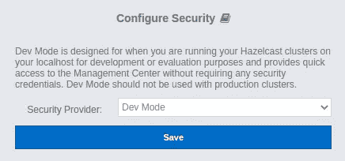
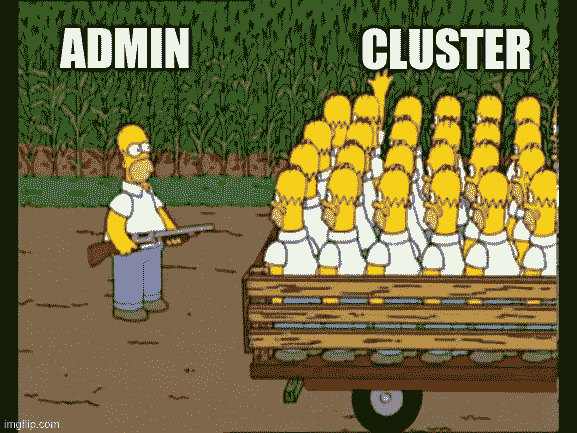
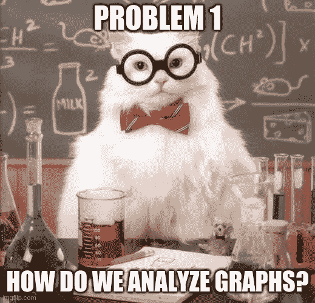
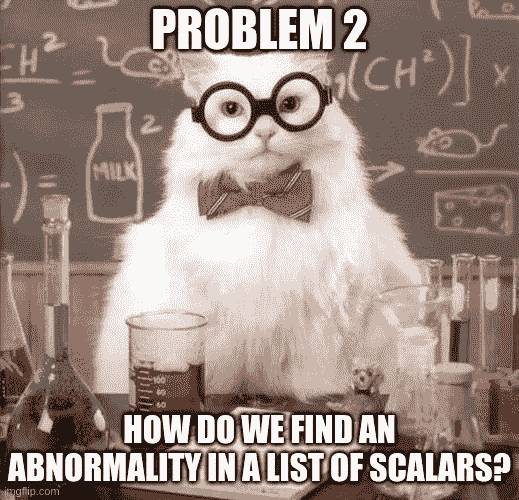
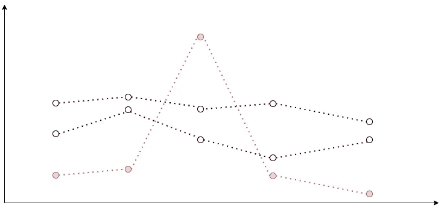
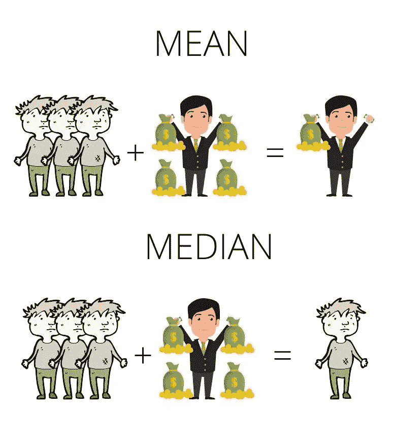
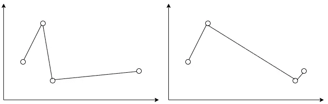
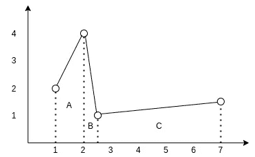
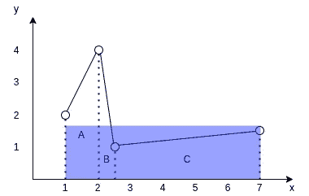
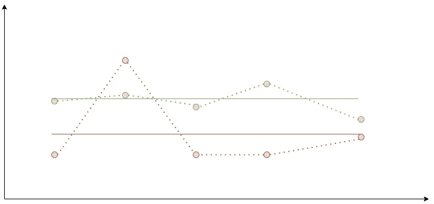

# 如何显示大量指标并保持头脑清醒

> 原文：<https://itnext.io/how-to-display-a-gazillion-of-metrics-and-keep-your-sanity-592b3a3ff8f7?source=collection_archive---------7----------------------->


>我现在有了一个闪亮的新博客。阅读这篇文章的最新更新[https://blog . goncharov . page/how-to-display-a-gazillion-of-metrics-and-keep-your-sanity](https://blog.goncharov.page/how-to-display-a-gazillion-of-metrics-and-keep-your-sanity)

大规模等于分布式。分布式等于不可避免的复杂性。运行时的复杂性等于大量的监控。在 Hazelcast，做好分布式系统是我们的生计。这意味着我们别无选择，只能成为收集各种指标的忠实粉丝，以保护用户信任我们的数据。

在 Management Center 4.2020.08 中，我们彻底改变了将指标数据从集群成员传输到管理中心的模式、存储方式以及显示方式。在这篇文章中，我们将讨论三和弦的后半部分。

我们将讨论当您希望一次显示所有数据，但您的用户只有有限数量的显示器和一双眼睛时该怎么办。我们将推测用户在查看一个监控 web 应用程序的图表时，他们实际上想要看到什么。我们将讨论过滤数据的不同方法，以及平均值、中值和定积分如何发挥它们的关键作用。

# **4.2020.08！4.2020.08!4.2020.08!我们为什么如此兴奋？**

该版本基于三大支柱:

1.  面向开发人员的增强型 UX

2.与 Jet 管理中心的统一

3.新公制引擎

**第一支柱。面向开发者的增强 UX。**


我们热爱开发者，厌恶不必要的复杂 ui。你可能知道，Hazelcast 管理中心支持[众多的安全提供商](https://docs.hazelcast.org/docs/management-center/latest/manual/html/index.html#authentication-options)。在 4.2020.08 之前，默认选择是使用基于用户名/密码的身份验证，我们称之为“默认”身份验证。我们很高兴为您提供“开发模式”安全提供商！



在内部，我们称之为“只需点击保存”安全提供者。去吧[自己试试](https://hub.docker.com/r/hazelcast/management-center/)。我们渴望[收到您的回复](https://slack.hazelcast.com/)！

**支柱 2。与喷气机管理中心的统一。**

喷气机是什么鬼东西？它是一个构建在 Hazelcast 内存数据网格之上的速度极快的分布式计算平台。你可以在这里了解更多。以前，Jet 有自己的管理中心，但现在没有了。一个 Hazelcast —一个管理中心！

**支柱 3。新公制发动机。**

从一开始，我们就使用“推送”模型从集群中收集指标数据。这里用“收集”这个词甚至不完全正确。收集是一个积极的过程。我们收到了来自集群的指标数据。每个节点都必须知道管理中心的地址，并将其度量数据推送到该地址。

在 4.2020.08 中，我们试图扭转这种模式，开始轮询集群成员的度量数据！这是一个巨大的变化，但我们没有止步于此。以下是新的主要指标相关特性列表:

1.“投票”模式而不是“推送”模式。

2.在 [RocksDB](https://rocksdb.org/) 之上实现的时序数据的新指标存储。

3.[普罗米修斯](https://prometheus.io/)公制数据输出器。

3.一个新的可定制的 UI 小部件，用于显示指标数据。

话虽如此，让我们更深入地剖析这个小部件，以及我们在创建它时面临的问题。

# **小工具**

**用户想看什么，为什么要看**

监控的目的是什么？有人可能会说，关键在于为高层管理人员提供漂亮的图表和包含统计数据的多页报告。玩笑归玩笑。监控的真正目的是什么？为什么我们要盯着这些图表看呢？最终目标是尽早发现异常。为什么？因为任何异常都是潜在问题的先兆。



说到一般的监控，我们通常指的是时间序列数据(按时间顺序排列的数据点列表，在我们的例子中，它们作为`{ time:number；值:number }[]`)。说到分布式系统的监控，我们通常会提到多个时间序列。多个时间序列会导致多个问题。

**问题 1。我们如何分析图形？**



我们有一些数据点。我们使用有趣或不太有趣的插值方法来绘制连续的线，这些线类似于离散数据背后的原始连续真实世界数据。我们如何发现那里的异常？

我们可以分析图表:

1.单独地

2.作为一个团体

对于单个分析，我们已经有了包含标量值的数据点。比较标量即使不简单，至少也是可行的。

对于组分析，我们必须以某种方式为每个时间序列计算出时间序列中的单个标量，并比较结果标量。根据业务需要，有无数种可能性可以进行计算。我们将在下面的应用中讨论其中的一小部分。

正如我们所看到的，对于这两种分析方法，我们最终都会得到一个标量列表，我们需要以某种方式进行比较。

**问题二。我们如何在标量列表中发现异常？**



一般来说，我们有 4 种方式来描述异常:

1.我们可以定义一个被认为正常的 a 值范围。如果有任何东西超出了这个范围，那就是不正常的。例如，我们可以说`[-42，42]'是我们的正常范围。那么‘7’将被认为是正常的，而‘43’将是不正常的。

2.我们可以定义常态的谓词。如果一个值满足谓词，则认为它是正常的。否则就是不正常。例如，我们可以说所有的整数奇数值都是正常范围。那么‘7’将被认为是正常的，而‘7.5’或‘42’将是不正常的。

3.我们可以定义一个被认为是异常的 a 值范围。如果有任何东西超出范围，那就是正常的。基本上是对#1 的否定。

4.我们可以为反常定义一个谓词。如果一个值满足谓词，那么它被认为是异常的。否则，很正常。基本上是对#2 的否定。

我们还可以在不同的阶段使用不同的方法(如上所列)反复检测异常，将它们链接起来。例如，我们可以只考虑属于`[0，42]'的异常的整数奇数值。

除了少数例外，谓词对于分析潜在的无限列表最有意义，因为它们通常需要有限的处理能力和内存。

范围不是那么简单的。范围可以是:

1.静态

2.动态的

静态范围是恒定的预定义范围，当新的指标数据进入时不会改变。比方说，我们有一个 30 台机器的集群。每台机器都有 16 GB 的内存。知道了平均预期负载，我们可以将已用 RAM 的正常范围确定为`[1.6 GB，14.4 GB]`(从 10%到 90%)。这将是一个静态范围的完美例子。它不取决于机器的数量或月亮的相位。

对于某些指标，在某些条件下，我们可以事先定义一个正常值范围，而无需分析指标数据本身。比方说，我们有一个 30 台机器的集群。每台机器都有 16 GB 的内存。知道了预期的负载，我们可以将已用 RAM 的正常范围确定为`[1.6 GB，14.4 GB]`(从 10%到 90%)。

然而，并不是所有的指标都有一个通用的预定义的可能值范围，这对任何系统都有意义。对于这些度量，我们必须通过与它们的对等体进行比较来评估它们，即处理整个标量列表以定义正常范围，然后再次处理该列表以识别异常范围。我们可以看到，这里的复杂性至少与列表的大小成线性关系。

因此，我们看到可以通过两种方式识别异常:

1.完全地

2.相对地

绝对异常检测更容易理解和实现。它通常还需要较少的处理能力，因为它不需要动态范围计算。它可以用于潜在的无限标量列表。但是，它的应用范围有限，因为不是所有的指标都有一个恒定的预定义的指标范围。

相对异常检测更加复杂。它需要动态范围计算，因此只能用于有限的标量列表。但是，它可以应用于集群中的任何指标。

绝对异常检测要求用户对系统有深入的了解，以定义正常/异常范围。相比之下，相对异常检测允许用户容易地识别任何节点上的任何度量是否显著偏离平均聚类值，而无需系统的先验知识，或者无需系统的正常参考范围的专家知识。

**问题 3。我们如何显示异常？**


比方说，我们有 100 个时间序列。我们发现其中 20 个异常。我们如何展示它们？

我们可以显示所有的 100 个图表，并以某种方式标记出 20 个异常的图表。例如，我们可以对它们进行颜色编码，但是你会愿意浏览 100 张图表吗？我当然不会。我严重怀疑任何活着的人能理解这种混乱。

我们只能显示 20 个异常的。但是我们不知道什么是正常的。我们确定异常的基准是什么？

我们是否应该显示 20 个异常值，并额外绘制一个图表，显示计算出的正常参考值？是也不是！是的，因为这是正确的原则。我们应该显示异常线和参考正常线。不，因为 20 张图还是太多了，难以理解。关于一个人可以同时关注多少项目的各种研究显示，从 3 到 7-9 的范围内有不同的结果。由于最终数字因研究不同而异，所以在任何地方都仍然是个位数。这意味着“20”仍然不够好。我们如何从“20”变成一位数？

之前，我们说我们可以迭代地检测异常。为什么我们不把这个想法应用到这里呢？一旦我们检测到异常标量的初始列表，我们可以根据它们与参考正常标量的偏差按升序对它们进行排序，只留下偏差最大的那些。

我们自己做了一点试验后，认为 4 是个好数字。因此，对于单个指标，我们决定显示多达 3 个异常图形以及参考正常图形。

**滤镜**

Hazelcast 星团可能有数百个成员。这意味着对于每一个指标，我们都有数百个时间序列。我们无法全部展示。不可避免地，我们必须以某种方式帮助我们的用户发现异常并过滤掉结果图。

从管理中心“4.2020.08”开始，我们为用户提供了 6 种不同的过滤器:

1.峰值 Top 3

2.峰值底部 3

3.平均前 3 名

4.平均底部 3

5.极端值

6.手动选择

**手动选择**


先说最无聊的一个——手动选择。它允许用户从集群成员列表中选择几个成员来查看度量数据。我们的前端只接收那些成员的数据。小菜一碟。

**峰顶 3/峰底 3**



你还记得我们要做什么来分析时间序列吗？我们必须为每个时间序列计算一个标量值。当你想到一种计算方法时，首先想到的事情之一就是取函数的绝对最大值。

假设每个数据点都是“{ time:number；value: number } `，实现很简单:

```
const timeSeriesResScalar = Max.max(timeSeries.map(({ value }) => value))
```

之后，我们按照计算出的标量对多个时间序列进行降序排序，并取前 3 个时间序列。我们称这种过滤器为“峰顶 3”。对于“峰底 3 ”,我们将“Math.max”替换为“Math.min ”,但想法是相同的。

我们不使用这种方法计算任何平均聚类值(参考正常值),将最终的正态性判断留给管理员。然而，如果有强烈的需求，我们可能会开始这样做。

你注意到峰值滤波器有什么问题吗？一个具有异常值的数据点可以使整个时间序列范围变大，即使所有其他数据点都具有相当小的值。对于一些具有适度波动性的指标，峰值过滤器正是我们所需要的。这些短期波动可能表明潜在的异常。但是高度不稳定的度量标准呢？我们需要一种方法来最小化这些短期峰值对结果标量的影响。这就是均值和中位数的故事开始的地方。

**均值和中位数**



巴里有 4 罐金子。艾米，约翰和道格拉斯有 0 分。这里的平均值是 1。然而，中位数是 0。我们如何计算它们？

均值是你习惯的平均值。计算列表中项目的总和，并除以项目数。

Median 是列表的中间值。按升序对列表进行排序。如果项目数是奇数，排序列表的中间项目是中间值。如果项数是偶数，将两个中间数相加，然后除以 2。

就监控而言，这意味着均值是异常峰值的原因。它们中的几个可以极大地改变结果标量。相反，中值会过滤掉浪涌。

我们应该停留在平均值和中间值吗？

**积分平均**


让我重新措辞一下。我们应该停留在算术平均值和中位数吗？毕竟，我们不是在计算一系列简单数字的平均值，这些是时间序列的数据点。通过只提取值并只对值进行操作，我们完全忽略了时间因素。

考虑这两个图表:



它们的值的算术平均值是相同的。你认为它们充分代表了两个函数的平均值吗？什么标量值可以用来描述一个函数？

它是曲线下的面积。女士们，先生们，请热烈欢迎定积分！

通常，我们说的是函数的定积分，但是对于时间序列，我们没有函数。相反，我们有一个离散数据点的列表。幸运的是，我们不必重新发明轮子。数学中有一个专门研究这个问题的领域，叫做离散数据的数值积分。

离散数据集成有多种方法。我们将只考虑其中之一。我们用于小部件的那个——梯形法则。

考虑下图:



您可以看到时间序列的数据点如何形成 3 个梯形。为了找到插值曲线下的面积，我们需要找到这三个梯形的面积，然后将它们相加。

对于梯形“a ”,它是“((2+4)/2)*(2–1)”,等于“3”。对于梯形“b ”,它是“((1+4)/2)*(2.5–2)”,等于“1.25”。对于梯形“c ”,它是“((1+1.5)/2)*(7–2.5)”并且等于“5.625”。所以最后的平方是“3+1.25+5.625”，等于“9.875”。

为了求这个函数的平均值，我们现在只需要用它在 x 轴上的投影除以它的面积。想象一下，我们试图找出一个与函数的投影长度相同、面积相同的矩形的高度。



因此，用于计算平均值的 TypeScript 函数可能如下所示:

```
export const averageByTrapezoidalRule = ( data: { value: number; time: number }[],): number => { let totalArea = 0 for (let i = 0; i < data.length — 1; i += 1) { const point1 = data[i] const point2 = data[i + 1] totalArea += ((point2.value + point1.value) / 2) * (point2.time — point1.time) }
  const average = totalArea / (data[data.length — 1].time — data[0].time) return average}
```

**平均前 3 名/平均后 3 名**



有了这些知识，现在让我们为“平均前 3 名”过滤器建立一个算法:

1.对于每个时间序列，用梯形法则计算其平均值。

2.按降序对多个时间序列进行排序。

3.拿走前三个。

对于“平均倒数 3 名”，我们只是颠倒排序。

对于这两个过滤器，我们仍然不计算任何平均聚类值(参考正常值),将最终的正态性判断留给管理员。

**离群值**


好吧，所以所有以前的过滤器都需要一些系统专家知识来识别显示的值是正常还是异常。我们能否创建一个过滤器来释放相对异常检测的全部能力，并帮助我们基于对等值找到异常图形？

这是我们的默认过滤器。我们称之为“异常值”或简称为“自动”。核心思想是基于多个时间序列计算参考正常值作为某种平均值。使用梯形法则计算每个时间序列的平均值。将它们的平均值与参考值进行比较。如果偏离参考值超过 30%，则认为异常。

诀窍在于找到参考值。最初，我们都是在前端完成的。

1.我们计算了每个时间序列的平均值。

2.我们计算了这些平均值的中间值。

3.我们使用中间值作为参考值。

为什么是中间值？假设您有一个 10 个节点的集群。这些节点中的 2 个偏离中间值某个极值，比如 300%。他们可以改变参考值，因此一个正常行为的成员可能开始成为异常值。中值减轻了异常值对参考值的影响。

后来，我们的后端为度量时间序列数据提供了一个很酷的聚合 API。所以现在我们:

1.请求所有节点的“中间值”集合。

1.“中位数”总量也是一个时间序列。对于每个数据点，它获取所有节点的时间戳值，并返回这些值的中间值。

2.计算中位数时间序列的平均值。

3.使用计算的平均值作为参考值。

现在我们分解一下我们的参考值计算。只有最后一个问题仍然存在。离群值太多会怎么样？

如果我们发现 3 个以上的异常值，我们将异常值按照它们与参考值的偏差进行升序排序，只取偏差最大的前 3 个。

最终的“离群值”算法如下所示:

1.请求“中间值”集合。

2.在图表上显示为虚线图形。

3.用梯形法则算出它的平均值。就当是参考值吧。

4.计算每个时间序列的平均值。

5.只留下那些偏离参考值超过 30%的。

6.根据偏差将它们按升序排序。显示偏差最大的前 3 个时间序列。

如你所见，有了“异常值”,我们就有了参考图，所以很容易理解乍一看什么是正常的。

# **小工具的未来计划**

更进一步，我们希望:

1.使异常值阈值可调。

2.允许 X 轴和 Y 轴缩放。

3.使图形的最大数量可调。

我们鼓励你[亲自尝试新的管理中心](https://hub.docker.com/r/hazelcast/management-center/)，并向我们反馈你的[反馈](http://slack.hazelcast.com/)！敬请关注新帖，了解我们学到的真正分布式企业就绪内存数据网格。