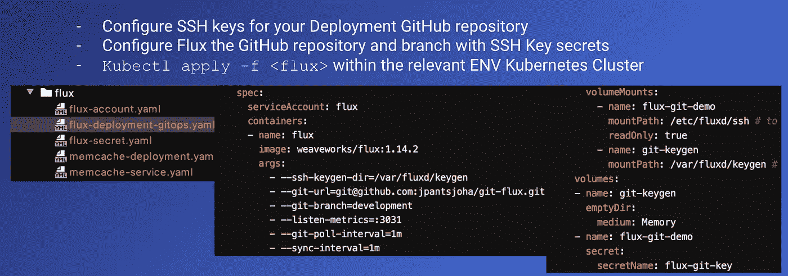
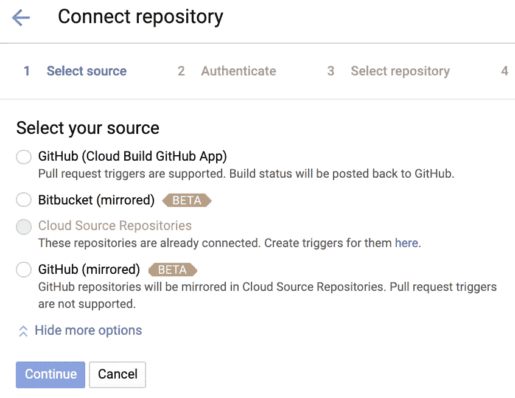
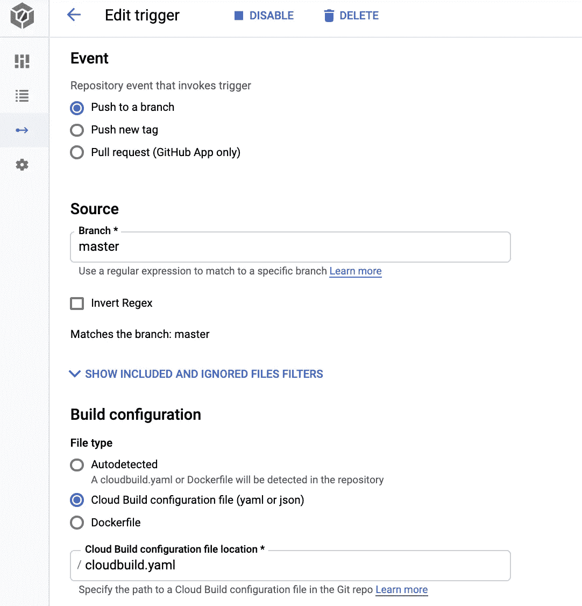
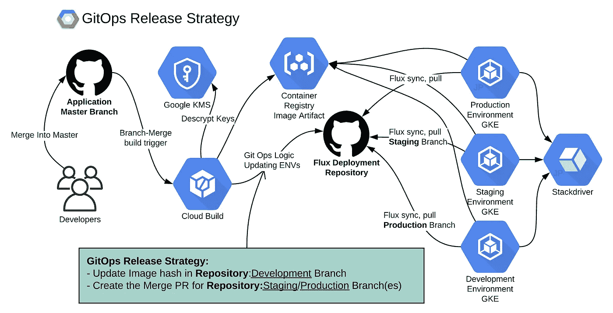
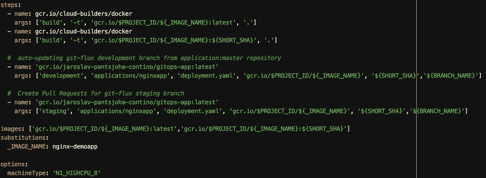
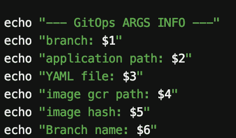
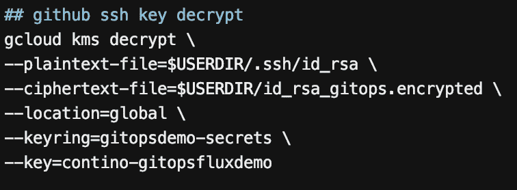
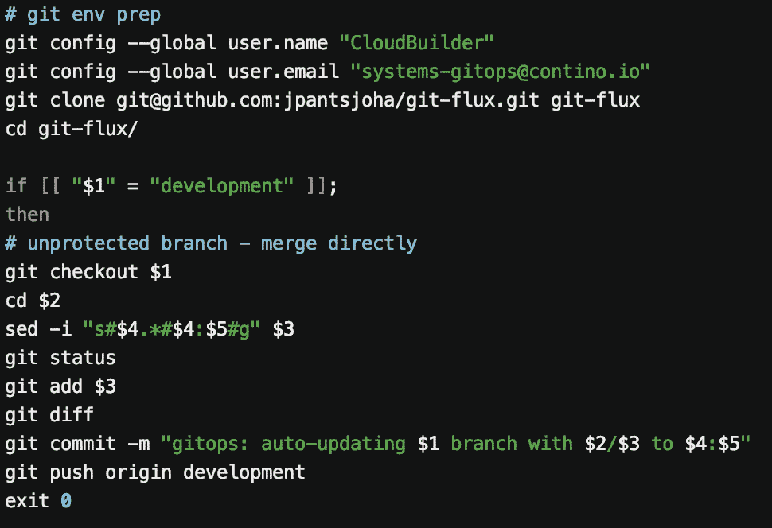

# 如何在使用 CloudBuild 和 GKE 的谷歌云平台上使用 GitHub 进行#GitOps

> 原文：<https://itnext.io/how-to-do-gitops-with-github-on-google-cloud-platform-using-cloudbuild-gke-de417d9b6668?source=collection_archive---------2----------------------->

如果你在这里，那么你一定听说过 GitOps。你的同事对此赞不绝口，也许你办公室的人也在窃窃私语，或者你在公交车上坐在某个“使用”GitOps 的人旁边。

**H** 阅读一下我的同事[西恩·里格比](https://medium.com/u/4b4dc30319a3?source=post_page-----21e022904e94----------------------)最近写的 [GitOps 流程和与 flux 的集成](https://medium.com/contino-engineering/integrating-gitops-deployments-in-kubernetes-using-weave-flux-9a617ea17684)，这篇文章对这个主题进行了高度概括。

否则，让我们回顾一下特性，更深入地研究组件和实现。

**GitOps 实施的主要特点**

*   跨环境的强大版本一致性和标准化——保证您的 GitHub 源定义按设计运行。
*   强大的审计跟踪——PR 批准、Git 历史记录跟踪、出色的可见性。
*   更强的可靠性和稳定性—标准化发布流程和一致部署架构的结果
*   改进的开发人员体验—构建您决定的每个提交、任何分支。视情况配置您的触发器
*   强制的应用质量所有权——符合敏捷实践。你建造，你运输。
*   结果提高了生产效率——更多的发布，小的增量交付成果由您批准

#GitOps 发布模式的技术先决条件是 **Google Kubernetes 引擎、云构建**和 good ol’**GitHub**。其他云提供商也可能实施同样的方案。

所以你喜欢你听到的。很好，我们还有你。让我们给你点好处。让我们回顾一下这种 CI/CD 方法的主要特点和优势

**GitOps CI/CD 管道的已实现收益**

*   简化和自动化的发布渠道
*   从开发人员和发布团队中抽象出固执己见的发布过程
*   减少自我管理的工具维护和依赖性
*   使用通用的最佳实践模式来执行发布
*   减少点击量——这是真事。(你点击，点击，再点击一些，然后一些释放发生。然后您验证它确实发生了)
*   强制存储库处于所需的远程状态

这是“**在 GCP 完成# GitOps**”指南，包含“3 个简单步骤”。我将介绍组件的细节，并在后面的部分深入研究如何操作

#GitOps 有 **3 个基本组件，用于构建 **CI/CD** 模型，包括以下内容:**

1.  **持续部署**工具**——我使用 Weaveworks Flux**——提取 **Release-Env Deployment** 存储库并应用与当前状态相比的【所有】变更。当然，还有像 ArgoCD 这样的替代品
2.  **持续集成**组件 **—** 由一个代码库(GitHub)组成，该代码库包含所有应用源代码作为事实**，集成**与 **CloudBuild、**和适当的触发器。
3.  **CI/CD 发布策略，GitOps 逻辑**，为上述 CI 构建执行发布，以便 CD 组件自动拾取

# 获得 GitOps CI/CD 模型的 3 个“简单”步骤

# 1-配置连续部署

我使用[的 Weaveworks flux](https://www.weave.works/oss/flux/)——这一步配置&在 GKE 上部署 Flux。详细的操作方法已经由[西恩·里格比](https://medium.com/u/4b4dc30319a3?source=post_page-----21e022904e94----------------------)在[博客](https://medium.com/contino-engineering/integrating-gitops-deployments-in-kubernetes-using-weave-flux-9a617ea17684)上发布了

应用 Yaml 清单的整个列表，部署、帐户、Memcached 部署&服务和秘密将具有 github **<清单-部署-存储库>:分支**来拉取和`kubectl apply -f .`清单。

# 2 —将源存储库与 CloudBuild 集成

CloudBuild 集成支持以下云存储库:GitHub、BitBucket 和云存储库(Google 自己的产品)

过程相对简单。按照说明进行操作，并选择需要连接的应用程序存储库。

接下来，您需要用触发器配置那个位，以便在**合并/提交**上“做事情”。这是您配置**触发器**的地方。

我已经将我的触发器配置为对一个特定的分支使用`cloudbuild.yaml`:`master`事件。

例如，您可以将触发器配置为 Cloudbuild `Dockerfile`，并在引入变更时自动构建。我们指定`cloudbuild.yaml`的原因——顾名思义——这允许我们为云构建定义更多的范围。

这就是了。每次您引入对`master`分支的更改时，CloudBuild 将执行一次运行，执行那个`cloudbuild.yaml`定义中的步骤。你说的文件里面是什么？那块宝石是给#GitOps 的下一部分的。

# 3 — CI/CD 发布策略 GitOps 逻辑

这里的基础是这个 GitOps 逻辑将作为应用程序的另一个`cloudbuild.yaml`特色构建步骤。

它将作为一个单独的映像运行，托管我们希望执行的操作的“GitOps 的逻辑脚本”。这些操作是什么，我们如何访问另一个 **<部署-存储库>** 尽管构建自 **<应用程序-存储库>** 所有好问题。这就是我们需要合并到 **gitops** 图像中的内容。

*   **解密**由 Flux(CD 组件)操作的 GitHub **<部署库>** 的 SSH 密钥秘密
*   更新 **<部署库>** 的`**development**`分支的**部署**应用构建哈希
*   可选附加功能:*创建合并* ***拉取请求*** *对于同一个* *应用程序构建 Hash 为* ***<部署-存储库>***

要考虑的附加发布策略:*开发分支的触发器。精神食粮。剥这只猫的皮有很多方法。请在下面的评论区告诉我你的想法。*

**同时，让我们来看看这个:**

**<应用程序-存储库>** `master`分支提交/合并事件*触发*指定的构建`cloudbuild.yaml`

典型的多步构建——你可以在 Gitlab、Jenkins、circle-ci pipelines 等中找到。希望直截了当

我还有你和我在一起？很好。
自变量是 bash 参数，它们使 gitops 映像在应用程序之间更具互操作性。PS 你永远不会使用`latest`标签。这只是一个简单的 PoC 示例。和我在一起。

这些论点是什么，它们是如何与 GitOps 逻辑联系在一起的？我们快到了。以下是截图，供参考。

构建此类 gitOps 映像的参考。我花了一个下午来润色，也许更久。这很大程度上是一个普通的操作系统，使用谷歌工具包来启用 **<部署的**解密**-存储库>** ssh 密钥，我知道这是一个感性的选项。它还具有 sed、git 和 hub——后者允许创建拉请求。得心应手。

这个演示展示了 KMS 加密的 SSH 密钥的使用。其中的编码斑点会出现在 gitops docker 图像上

基础和基本逻辑。使用传入参数通过您自己的策略进行处理。参见开发环境字符串匹配示例，自动提交和推送未受保护的开发 <depeloyment>repostoy，包含应用程序的 YAML 清单</depeloyment>

不用说，每一个这样的 GKE 集群(DEV、STAGE、PROD)都将运行自己的 flux 部署，然后轮询 GitHub 上包含 YAML 清单的 **<部署库>** 的相应-env 分支(或 repo)。

# 这个 GitOps 听起来很有用

GitOps CI/CD 模型补充了敏捷实践，并强化了 DevOps 方法，以支持跨环境的频繁增量发布。

# 精益平均 GitOps CI/CD 机的核心优势:

- **平均上市时间** —缩短从代码提交到代码在生产中运行的交付时间。

- **可观察性和监控** —一致和简化的发布模型，从开发周期的最早阶段，通过环境到生产，增加反馈。“什么是 GitHub 存储库，生产中运行的是什么”

- **持续集成和创新** —更简单的发布流程更易于理解、审查和优化。基础设施即代码方法提高了云提供商之间的可移植性

- **维护成本** —在设计定制版本解决方案或锁定替代 CI/CD 平台时，减少、消除配置、修补、修复和重做工作的持续成本。

*   **提高安全性** —通过减少修补，它减少了 CICD 操作环境中的人为错误和漏洞。通过变更集历史记录提供完整的 GitHub 专用日志记录

**名、姓、字、智。有一定的自由去设计你喜欢的东西。只要确保它不会变成你自己的一个宠物项目，而且只是你自己的。同事必须能够完全理解逻辑，以便在必要时进行故障排除和调试。如果有一个全职的、永久的团队来支持这样的 **gitops** 发布策略设计，— super。**

简而言之，保持你自己的 gitOps 逻辑简单、精简、经过同行评审，并附有相关的质量架构设计图(如果需要的话，可以借用我的)作为文档。

在这个领域，开源项目维护的解决方案很可能是最好的，特别是如果维护得好的话。当我找到一个合适的时候，我很乐意尝试和考虑这样的操作系统。如果你知道，请在下面的评论中给我留言。我很想在下一个 GitOps 实现中探索这样的选项。

喜欢吗？请喜欢这篇文章，并分享它！

**PS** 在 **Contino** 有很多激动人心的 Kubernetes 项目。如果你正在寻找最新最棒的基础设施或者寻找挑战，——[联系我们！我们正在招聘](https://www.linkedin.com/in/johas/)，寻找各个层次的聪明人。在 **Contino** ，我们自豪地为中型企业和大型企业提供最佳实践云转型项目。

地方官

# 顺便说一下，👏🏻*鼓掌*👏🏻如果你喜欢这篇文章，请举手(高达 50 倍)。它鼓励我继续写作，并帮助其他人找到它:)