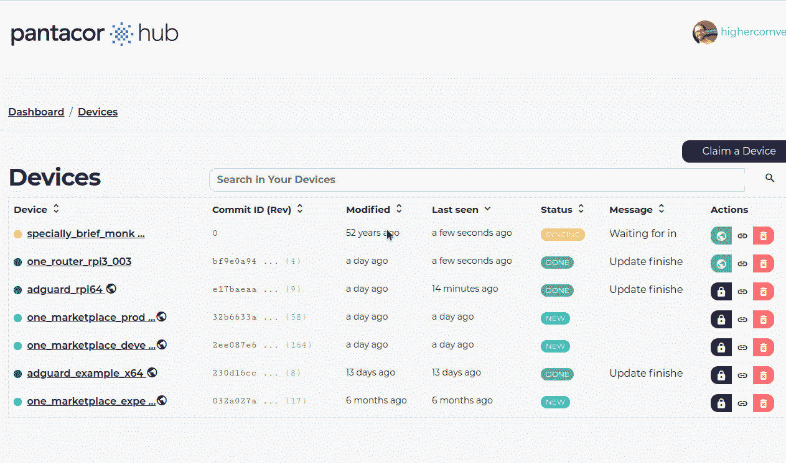
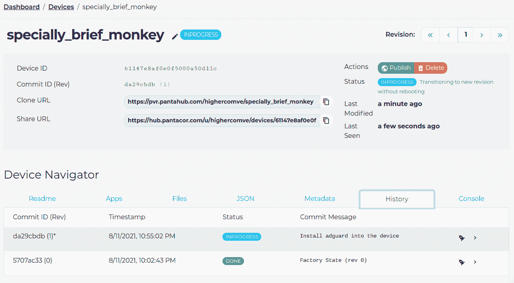
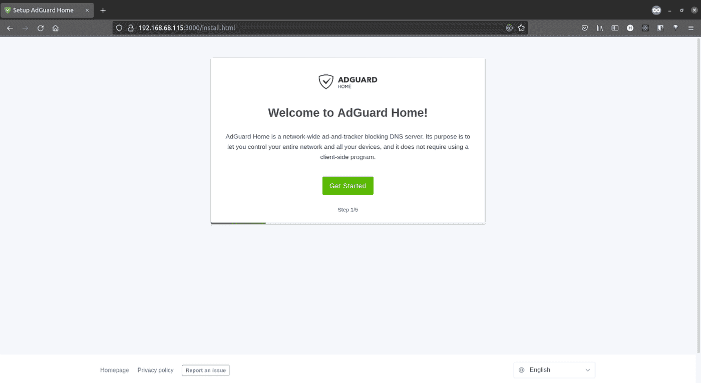
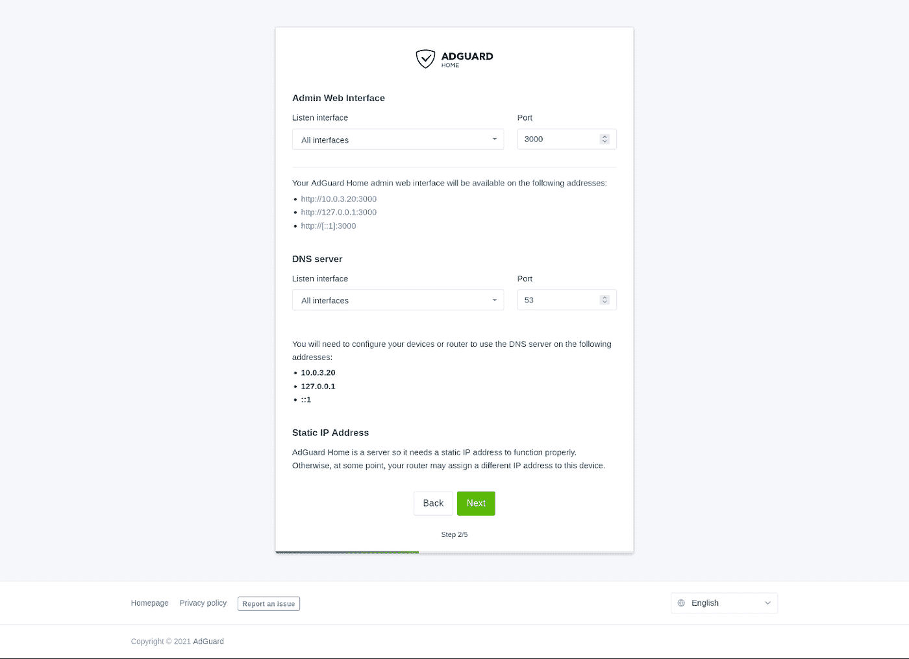
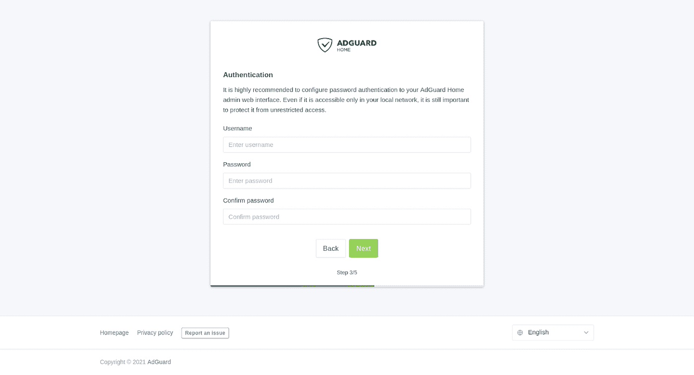
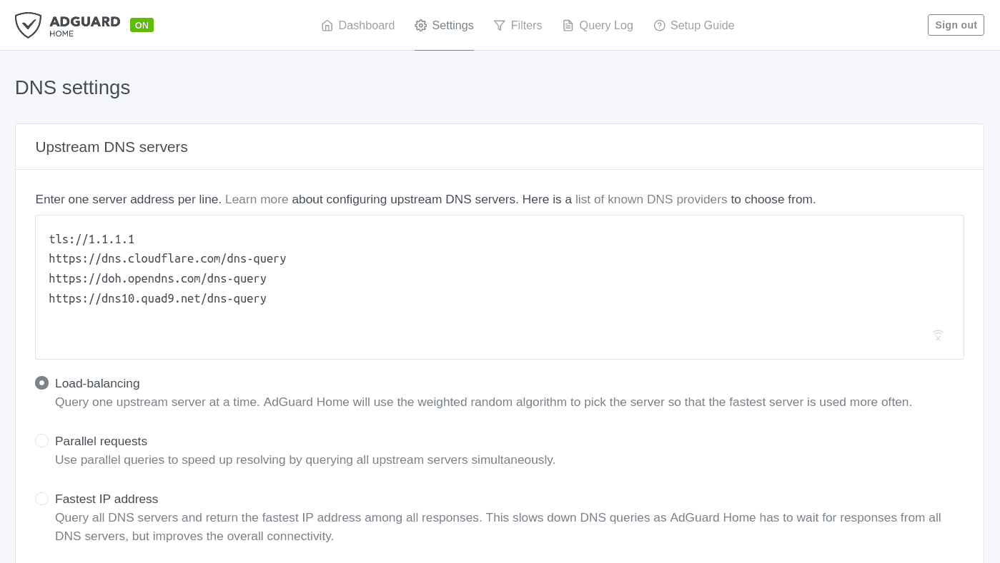

# 如何使用防火墙在 LXC 上进行端口转发

> 原文：<https://itnext.io/how-to-do-port-forwarding-on-lxc-with-awall-bd498da69164?source=collection_archive---------1----------------------->

# 介绍

我们将使用一个 Linux 系统来运行我们的 LXC 容器，以便在由 T2 panta cor 构建的嵌入式设备上运行容器，这样我们将减少管理 LXC 容器的麻烦，并且我们将使用 Raspberry PI 4 来运行一切。

Pantavisor 使用 LXC 在嵌入式计算机上运行容器。默认情况下，所有容器共享主机的网络命名空间，因此，网络的 LXC 配置将为:

**lxc.net.[0]。type = none**

[LXC —联机帮助页— lxc.container.conf.5](https://linuxcontainers.org/lxc/manpages/man5/lxc.container.conf.5.html#lbAO)

这意味着如果有多个容器使用同一个网络**端口，**容器初始化将会失败。解决该问题的一种方法是创建具有虚拟以太网类型网络的容器，然后从主机网络向容器 IP 进行端口转发。

在 Docker 中，当您运行容器时，端口转发是一个简单的配置。但对于 LXC 集装箱来说，事情就没那么简单了。在本帖中，我们将描述如何在 *pantavisor 内部转发端口。*使用 Pantavisor 工具，您将创建 LXC 配置，然后使用*墙*构建将管理转发的容器 IP 表。

# 将 Raspberry Pi 配置为 Adguard 的 DNS 服务器

在这个用例中，您将使用一个 Raspberry PI 作为 DNS 服务器，使用 [adguard](https://hub.docker.com/r/adguard/adguardhome) 应用程序直接过滤来自 DNS 的任何广告。

首先，让我们观察 Docker 上的 Adguard 端口:

```
docker run --name adguardhome \
    --restart unless-stopped \
    -v /my/own/workdir:/opt/adguardhome/work \
    -v /my/own/confdir:/opt/adguardhome/conf \
    -p 53:53/tcp -p 53:53/udp \
    -p 67:67/udp -p 68:68/udp \
    -p 3000:3000/tcp \
    -p 853:853/tcp \
    -p 784:784/udp -p 853:853/udp -p 8853:8853/udp \
    -p 5443:5443/tcp -p 5443:5443/udp \
    -d adguard/adguardhome
```

要映射的端口有:

*   **53 tcp/udp** :普通 DNS。
*   **67/udp，68 tcp/udp** :如果您打算将 AdGuard Home 用作 DHCP 服务器，请添加。
*   **3000/tcp** :如果您想使用 AdGuard Home 的管理面板，并且还想将 AdGuard Home 作为 HTTPS/DNS-over-HTTPS 服务器运行，请添加此选项。
*   **853/tcp** :如果您计划将 AdGuard Home 作为 DNS-over-TLS 服务器运行，请添加。
*   **784/udp、853 udp、8853/udp** :如果要将 AdGuard Home 作为 DNS-over-QUIC 服务器运行，请添加。你只能留下一两个。
*   **5443/tcp，5443/udp:** 如果要将 AdGuard Home 作为 DNSCrypt 服务器运行，请添加。

在 Pantavisor 模式中， [awconnect](https://gitlab.com/pantacor/pv-platforms/wifi-connect) 容器为 Raspberry PI 上 Pantavisor 的默认映像执行所有网络管理。这让你可以通过 wifi 将树莓皮连接到互联网，或者通过 wifi 热点分享你的有线互联网。

正是这个容器提供了 DNS 和 DHCP。除此之外，您可能还有另一个使用端口 3000 的容器。

# 开始之前

为了解决这个问题，我们需要一个支持 Pantavisor 的 Raspberry PI 3+或 Raspberry PI 4。您还需要在开发计算机上安装以下软件:

1.  fakeroot
2.  squashfs
3.  码头工人
4.  pvr cli
5.  在 hub.pantacor.com[注册账户](https://hub.pantacor.com/)

你可以从你的发行版或者你的 OS 软件包管理器安装 **fakeroot** 和**squashfs**:apt，yum，apk，homebrew 等等。

例如，基于 Ubuntu/Debian 的发行版会安装这些实用程序:

```
sudo apt install fakeroot squashfs-tools
```

要为您的特定操作系统安装 Docker，请参考 Docker [安装文档](https://docs.docker.com/engine/install/)

最后但同样重要的是，您还需要安装 PVR cli 来管理[hub.pantacor.com](https://hub.pantacor.com/)内的 [pantavisor](https://www.pantavisor.io/) 设备。你可以在 Pantacor [文档](https://docs.pantahub.com/install-pvr/)中找到更多关于如何安装 PVR 的信息。

因为我们将从您的开发计算机远程向设备发送新的修订和配置，所以设备需要连接到[hub.pantacor.com](https://hub.pantacor.com/)云服务。您需要在那里创建一个帐户。

现在您已经安装了所有的东西，我们可以继续解决我们的网络隔离和端口转发问题。

# #1 安装 Pantavisor 并认领设备

声明过程可以使最终用户能够声明设备并证明其所有权。这种过程最初是通过声明消息触发的，这可以通过几种方式来完成。

在您安装了 Pantavisor 映像之后，或者如果您已经安装了 Pantavisor，您需要申请您的设备。有几种方法可以认领您的设备:

**1。-使用预先声明的图像**

认领该设备最简单的方法是下载一个映像，在第一次启动时自动认领。从[https://hub.pantacor.com/download-image](https://hub.pantacor.com/download-image)下载这张图片

2.- **手动申报**

另一种申请方式是遵循 pantavisor.io 上的[入门指南](https://www.pantavisor.io/guides/getting_started/)，然后在您的开发计算机上使用 PVR CLI 手动申请该设备:

```
pvr device scan
```

该命令的结果应该如下所示:

```
sergiomarin@penguin:~$ pvr device scan
Scanning ...
        ID: 61147e8af0e0f5000a50d11c (unclaimed)
        Host: localhost.local.
        IPv4: [192.168.68.115]
        IPv6: [fe80::d4ac:9722:ab19:7b81]
        Port: 22
        Claim Cmd: pvr claim -c marginally-optimum-midge https://api.pantahub.com:443/devices/61147e8af0e0f5000a50d11c
Pantavisor devices detected in network: 1 (see above for details)
```

然后取要求的 Cmd 值并运行它。例如:

```
pvr claim -c marginally-optimum-midge [https://api.pantahub.com:443/devices/61147e8af0e0f5000a50d11c](https://api.pantahub.com:443/devices/61147e8af0e0f5000a50d11c)
```

完成此步骤后，您将能够在“设备”页面的 hub.pantacor.com[看到您申请的设备。](https://hub.pantacor.com/)



您将看到状态为**同步的新设备。**，这意味着您的设备已被认领，正在上传到云端。当这个过程**完成后，**您将能够克隆和修改设备。


# #2 将设备 URL 克隆到您的计算机

在设备详细信息面板中，您将看到**克隆 URL** 。复制 URL 并在您的开发笔记本电脑上运行以下命令:

```
pvr clone CLONE_URL
```

示例:

```
pvr clone [https://pvr.pantahub.com/highercomve/specially_brief_monkey](https://pvr.pantahub.com/highercomve/specially_brief_monkey)
```

这就创建了一个名为`**specially _ brief _ monkey`**的新文件夹，很像“git clone”的工作方式。在该文件夹中，您应该会看到类似如下的结构:

```
specially_brief_monkey
├── awconnect
│   ├── lxc.container.conf
│   ├── root.squashfs
│   ├── root.squashfs.docker-digest
│   ├── run.json
│   └── src.json
├── bsp
│   ├── addon-plymouth.cpio.xz4
│   ├── build.json
│   ├── firmware.squashfs
│   ├── kernel.img
│   ├── modules.squashfs
│   ├── pantavisor
│   ├── run.json
│   └── src.json
├── _hostconfig
│   └── pvr
│       └── docker.json
├── network-mapping.json
├── pv-avahi
│   ├── lxc.container.conf
│   ├── root.squashfs
│   ├── root.squashfs.docker-digest
│   ├── run.json
│   └── src.json
├── pvr-sdk
│   ├── lxc.container.conf
│   ├── root.squashfs
│   ├── root.squashfs.docker-digest
│   ├── run.json
│   └── src.json
└── storage-mapping.json
```

这是 Pantavisor 定义设备及其运行容器的方式:

*   **BSP** :在嵌入式系统中，板支持包(BSP)是一层软件，包含特定于硬件的驱动程序和其他例程，允许特定的操作系统在特定的硬件环境中运行。
*   **awconnect** :设备的 Pantavisor 基础平台，网络配置在此[容器](https://gitlab.com/pantacor/pv-platforms/wifi-connect)中。
*   pv-avahi :一个容器，它发送使用 pvr 设备扫描发现网络中的设备所需的所有信息，并为此使用 avahi 协议。你可以在这里看到源容器:[https://gitlab.com/pantacor/pv-platforms/pv-avahi](https://gitlab.com/pantacor/pv-platforms/pv-avahi)
*   **pv-sdk** :带有 Pantavisor SDK 的容器，允许您直接从设备维护设备，并负责管理设备和设备内部容器的 ssh 连接。

这些容器中的每一个都有一个 **src.json** 文件，该文件描述了创建容器的源以及运行容器的一些 Pantavisor 特定的配置。

# #3 为我们的设备添加 adguard

我们将使用 [adguard docker 容器](https://hub.docker.com/r/adguard/adguardhome)作为 Pantavisor 容器(基本上是一个 LXC 容器)的源。为了在由 **pvr 克隆**进程创建的文件夹中添加一个来自 Docker 的新容器，我们将运行以下命令:

```
pvr app add --from=adguard/adguardhome:latest adguard
```

这将在设备定义中创建一个名为 adguard 的新文件夹，其结构如下:

```
adguard/
├── lxc.container.conf
├── root.squashfs
├── root.squashfs.docker-digest
├── run.json
└── src.json
```

src.json 应该是这样的:

```
{
  "#spec": "service-manifest-src@1",
  "template": "builtin-lxc-docker",
  "args": {
   "PV_RUNLEVEL": "app"
  },
  "config": {},
  "docker_name": "adguard/adguardhome",
  "docker_tag": "latest",
  "docker_digest": "adguard/adguardhome@sha256:cd5e6641e969ec8a1df1ed02dc969db49d6cf540055f14346d0d5d42951f75d6",
  "docker_source": "remote,local",
  "docker_platform": "linux/arm",
  "persistence": {}
}
```

# #4 配置 LXC 功能和 Adguard 持久性的参数

现在，我们将只讨论这个文件的两个部分: **args** 和 **persistence。**

*   **参数:**这是 pvr cli 工具的配置，它为 LXC 容器设置了一些功能。
*   **持久化**:卷的配置和运行容器的持久化。默认情况下，pvr 会自动添加 Dockerfile 文件中定义的所有卷。您可以在这里添加更多的卷，即使它们没有在 docker 文件中定义。

如前所述，pvr 默认将所有容器添加到主机网络名称空间中。因此，我们需要做的第一个配置是在 LXC 网桥网络内隔离这个容器。

为此，我们需要在 args 配置中添加几个新参数:

*   **PV _ LXC _ 网络 _ 类型**:此参数配置 **lxc.net.[0]。键入**和 LXC 配置中的其他参数，具体取决于我们在那里分配的值。
*   **PV _ LXC _ 网络 _ IPV4 _ 地址**:这将是分配给虚拟网络接口的 IP 地址。

产生的**参数**如下所示:

```
"args": {
    "PV_LXC_NETWORK_IPV4_ADDRESS": "10.0.3.20/24",
    "PV_LXC_NETWORK_TYPE": "veth",
    "PV_RUNLEVEL": "app"
}
```

如果你想知道更多关于什么参数可以被使用，你可以阅读我们的[模板的源代码来构建 lxc 配置](https://gitlab.com/pantacor/pvr/-/blob/develop/templates/builtin-lxc-docker.go)。

为了持久化，我们需要添加 **/opt/adguardhome/work** 和 **/opt/adguardhome/conf** 文件夹。adguard 使用这两者来保存服务的配置。

最终的持久性配置将是:

```
"persistence": {
    "/opt/adguardhome/conf/": "permanent",
    "/opt/adguardhome/work/": "permanent"
}
```

# #5 安装 Adguard 应用程序

设置好持久性并启用 LXC 功能后，您就可以使用 **pvr 安装 Adguard 应用程序了。**

首先，检查最终的 src.json 看起来像这样:

```
{
  "#spec": "service-manifest-src@1",
  "args": {
    "PV_LXC_NETWORK_IPV4_ADDRESS": "10.0.3.20/24",
    "PV_LXC_NETWORK_TYPE": "veth",
    "PV_RUNLEVEL": "app"
  },
  "config": {},
  "docker_digest": "adguard/adguardhome@sha256:cd5e6641e969ec8a1df1ed02dc969db49d6cf540055f14346d0d5d42951f75d6",
  "docker_name": "adguard/adguardhome",
  "docker_platform": "linux/arm",
  "docker_source": "remote,local",
  "docker_tag": "latest",
  "persistence": {
    "/opt/adguardhome/conf/": "permanent",
    "/opt/adguardhome/work/": "permanent"
  },
  "template": "builtin-lxc-docker"
}
```

如果您的“src.json”看起来不错，让我们使用以下命令继续安装:

```
pvr app install adguard
```

要查看 Adguard 是如何安装和隔离的，请将更改推送到设备:

```
pvr add && pvr commit && pvr post -m "Install adguard into the device"
```

在此之后，您将能够在[hub.pantacor.com](https://hub.pantacor.com/)看到设备的新版本，与此类似:



当设备状态为**完成**或**更新**时，流程结束。该设备现在应该运行 Adguard，但由于它是隔离的，您将无法使用 web UI，甚至无法将其用作 DNS。

# #6 用 wall 映射 Adguard 端口

**awconnect** 平台使用 iptables 来管理防火墙并管理路由，而 **awall** 是一个基于 JSON 配置生成 iptables 和路由的实用程序。

这是一个关于防火墙如何工作的很好的指南。我不会进入墙的最深处，相反，我将展示如何在这个用例中使用它。

# 为 Pantavisor 配置墙

首先，让我们开始添加这个小的实用程序脚本来运行 wall，而不是安装在您的计算机上，而是从 Docker 容器中运行它。你可以在这里看到并下载脚本[。](https://gist.githubusercontent.com/highercomve/295cf75fb660be4c6b054627c330cb4b/raw/d51989dd5c57c36136814033af6d460db3024bef/awall2pvmwall)

```
wget https://gist.githubusercontent.com/highercomve/295cf75fb660be4c6b054627c330cb4b/raw/d51989dd5c57c36136814033af6d460db3024bef/awall2pvmwall &amp;&amp; chmod +x awall2pvmwall
```

该脚本针对设备文件夹的根目录中的“awall.json”文件以及设备的任何应用程序或平台内的任何“awall configuration”文件夹运行。

我们将创建几个 JSON 文件来配置防火墙。Port_forward_example 是我的设备存储库所在的文件夹名称，也是我们将添加所有新文件进行配置的位置。

```
mkdir -p adguard/_awall
touch awall.json
touch adguard/_awall/config.json
touch bsp/_awall.json
```

配置文件 bsp/_awall.json 为我们的设备定义了几个变量。

```
{
   "variable": {
   	"containernet_if": "lxcbr0",
   	"wan_if": "eth0",
   	"lan_if": "wlan0"
   }
}
```

这些是 Pantavisor 为 Raspberry PI 4 设置的默认值。如果你的 Raspberry Pi 通过以太网电缆连接到互联网，那么 **wan_if** 将会是 **eth0** 并且也许你的 wifi 将会是局域网。在某些情况下，您可能通过 wifi 连接到互联网提供商，并将 eth0 用作本地网络的入口点。

**awall.json** 配置文件定义了设备的通用防火墙规则。我们将在该文件中添加与主机网络命名空间直接相关的所有内容。

```
{
   "description": "How to use awall",
   "filter": [
       {
           "action": "accept",
           "in": "internet",
           "service": [
               "ping",
               "dns",
               "ssh",
               "dhcp",
               "pvssh"
           ]
       },
       {
           "action": "accept",
           "in": "intranet",
           "service": [
               "dns",
               "ping",
               "ssh",
               "dhcp",
               "pvssh"
           ]
       },
       {
           "action": "accept",
           "in": "internet",
           "out": "_fw",
           "service": [
               "ssh",
               "dhcp",
               "pvssh"
           ]
       },
       {
           "action": "accept",
           "out": "internet",
           "service": [
               "http",
               "https"
           ]
       }
   ],
   "import": [
       "bsp"
   ],
   "policy": [
       {
           "action": "accept",
           "out": "internet"
       },
       {
           "action": "drop",
           "in": "internet"
       },
       {
           "action": "accept",
           "out": "intranet"
       },
       {
           "action": "drop",
           "in": "intranet"
       },
       {
           "action": "accept",
           "in": "containernet"
       },
       {
           "action": "accept",
           "out": "containernet"
       },
       {
           "action": "reject"
       }
   ],
   "service": {
       "pvssh": [
           {
               "port": 8222,
               "proto": "tcp"
           }
       ]
   },
   "snat": [
       {
           "out": "internet"
       }
   ],
   "zone": {
       "containernet": {
           "iface": "$containernet_if"
       },
       "internet": {
           "iface": "$wan_if"
       },
       "intranet": {
           "iface": "$lan_if"
       }
   }
}
```

通过这种配置，我们可以访问设备的某些端口:

*   **ssh** :访问 **pvr-sdk** 容器的端口 22
*   **pvssh** :端口 8222 直接进入一个容器
*   **dns** :端口 53
*   **ping:** icmp 端口
*   **dhcp:** 端口 67 和 68

# #7 使用 DNAT 将流量重定向到 Adguard IP

现在，让我们使用 DNAT 配置将所有内容重定向到 Adguard IP 地址。我们需要用这个配置填充`**aguard/_ a wall/config . JSON `**文件。

```
{
   "description": "Forward All need it ports to this container",
   "filter": [
       {
           "action": "accept",
           "dnat": "10.0.3.20",
           "in": "internet",
           "service": "adguard-web"
       },
       {
           "action": "accept",
           "dnat": "10.0.3.20",
           "in": "intranet",
           "service": "adguard-web"
       },
       {
           "action": "accept",
           "dnat": "10.0.3.20",
           "in": "internet",
           "service": "adguard-dotls"
       },
       {
           "action": "accept",
           "dnat": "10.0.3.20",
           "in": "intranet",
           "service": "adguard-dotls"
       },
       {
           "action": "accept",
           "dnat": "10.0.3.20",
           "in": "internet",
           "service": "adguard-dnsencrypt"
       },
       {
           "action": "accept",
           "dnat": "10.0.3.20",
           "in": "intranet",
           "service": "adguard-dnsencrypt"
       }
   ],
   "service": {
       "adguard-web": [
           {
               "port": 3000,
               "proto": "tcp"
           },
           {
               "port": 3000,
               "proto": "udp"
           }
       ],
       "adguard-dotls": [
           {
               "port": 53,
               "proto": "tcp"
           },
           {
               "port": 53,
               "proto": "udp"
           },
           {
               "port": 853,
               "proto": "tcp"
           },
           {
               "port": 853,
               "proto": "udp"
           },
           {
               "port": 784,
               "proto": "udp"
           },
           {
               "port": 8853,
               "proto": "udp"
           },
           {
               "port": 5443,
               "proto": "tcp"
           },
           {
               "port": 8853,
               "proto": "udp"
           }
       ],
       "adguard-dnsencrypt": [
           {
               "port": 5443,
               "proto": "tcp"
           },
           {
               "port": 8853,
               "proto": "udp"
           }
       ]
   }
}
```

在那里，您可以看到按服务分组的端口。所有这些服务都将从 WAN 和 LAN 接口转换到容器 IP。

# #8 设置端口转发并查看 Adguard 仪表板

现在我们已经准备好了所有的 JSON 配置，我们可以运行 **awall2pvmwall** 脚本来创建一个具有如下结构的文件夹:

```
_config/
└── awconnect
	└── etc
    	└── iptables
        	├── dump
        	├── rules.v4
        	└── rules.v6
```

现在，我们可以将这个新版本发布到我们的设备上:

```
pvr add .
pvr commit
pvr post -m "Update awconnect with port forwading to adguard"
```



**注意:在这里，从端口 80 移动到 3000** 很重要



在几个 next 和 next 之后，您将能够进入 adguard 仪表板，使用您的 Raspberry PI 作为整个网络的 DNS，并且还将通过 DoT 使用上游 DNS 来阻止广告，等等..



这里有一个已知 DNS 提供商的列表供选择。

你可以在[这里](https://hub.pantacor.com/u/highercomve/devices/61147e8af0e0f5000a50d11c)看到我为这个指南制作的设备，或者你也可以用:

```
pvr clone [https://pvr.pantahub.com/highercomve/port_fordward_example](https://pvr.pantahub.com/highercomve/port_fordward_example)
```

现在去玩 Pantavisor 和容器吧，愿原力与你同在。