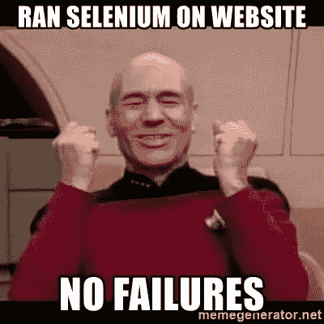

# 如何在 Headless Chrome 中下载和测试文件

> 原文：<https://itnext.io/how-to-download-and-test-files-in-headless-chrome-100dcef58ea3?source=collection_archive---------6----------------------->



挑战在于下载一个 excel 文件并在无头浏览器(Chrome)中检查其内容。多亏了我的同事，我们终于可以完成这项任务了。虽然这是 Excel 文件的一个示例，但是您可以将它用于其他类型的文件。

我正在使用 [WebdriverIO](http://webdriver.io) 和 Mocha 进行我们的回归测试，我用来下载文件的包是[下载文件](https://www.npmjs.com/package/download-file)。这很简单。

**步骤 1:编写您的异步测试:**

```
const page = require('./page.js');describe('Assert file download function:', () => {    
    before( () => {        
        browser.url('/');                            
    });   

    it('Download an Excel file', async () => {         
        await page.downloadExcelFile();                
        await page.assertExcelFile();      
    });
});
```

**第二步:编写下载并断言函数**

下载之前，您需要安装此软件包:

```
npm install download-file
```

然后写你的下载函数。这将有助于下载您的 excel 文件，并将其放在 ***tempDownload*** 文件夹中。

```
// page.jsdownloadExcelFile() {
   // Get excel url                   
   let excelUrl = $(this.excelBtn).getAttribute('href');        

   let options = {
        directory: './tempDownload',
        filename: 'file-name.xlsx'          
   } return new Promise(async (reject) => {
        download(excelUrl, options, err => {                
              reject(err);          
        });            
   });     
}
```

他们编写你的测试函数。只是为了让你知道我正在使用[***xlsx***](https://www.npmjs.com/package/xlsx)包来读取一个 excel 文件的内容。

```
// page.jsasync assertExcelFile() {                
     const filePath = path.join('your-download-dir', 'file-name.xlsx'); browser.call(() => {
            return waitForFileExists(filePath, 10000);
     }); let workbook = XLSX.readFile(filePath);        
     let firstSheetName = workbook.SheetNames[0];
     let workSheet = workbook.Sheets[firstSheetName];
     // Do what ever you want here. Remember to read the document // Remove temporary download folder
     rmdir('your-download-dir');
}
```

你可能想知道**waitforfilexists**和 **rmdir** 从何而来。它们是额外的功能，帮助在测试前检查文件是否存在，并确保测试后下载文件夹将被删除。

```
// wait_for_file_exists.jsconst fs = require('fs')
const path = require('path')// pulled from [https://stackoverflow.com/a/47764403](https://stackoverflow.com/a/47764403)
module.exports = function waitForFileExists(filePath, timeout) {
  return new Promise(function (resolve, reject) {
    let timer = setTimeout(function () {
      watcher.close();
      reject(new Error('File did not exists and was not created during the timeout.'));
    }, timeout);

    fs.access(filePath, fs.constants.R_OK, function (err) {
      if (!err) {        
        clearTimeout(timer);
        watcher.close();
        resolve();
      }
    }); let dir = path.dirname(filePath);
    let basename = path.basename(filePath);
    let watcher = fs.watch(dir, function (eventType, filename) {
      if (eventType === 'rename' && filename === basename) {
        clearTimeout(timer);
        watcher.close();
        resolve();
      }
    });
  });
}
```

对于删除文件夹功能:

```
// rmdir.jsconst path = require('path')
const fs = require('fs')// Pulled from [https://gist.github.com/tkihira/2367067](https://gist.github.com/tkihira/2367067)
module.exports = function rmdir(dir) {
  let list = fs.readdirSync(dir);
  for(let i = 0; i < list.length; i++) {
    let filename = path.join(dir, list[i]);
    let stat = fs.statSync(filename);if(filename == "." || filename == "..") {
      // pass these files
    } else if(stat.isDirectory()) {
      // rmdir recursively
      rmdir(filename);
    } else {
      // rm fiilename
      fs.unlinkSync(filename);
    }
  }
  fs.rmdirSync(dir);
}
```

从现在开始，你可以在 Chrome headless 中下载任何文件。我还没和其他车手试过。

希望对此有所帮助；)