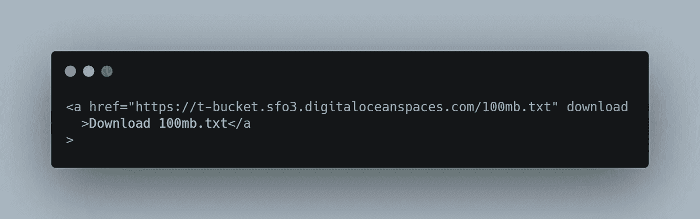
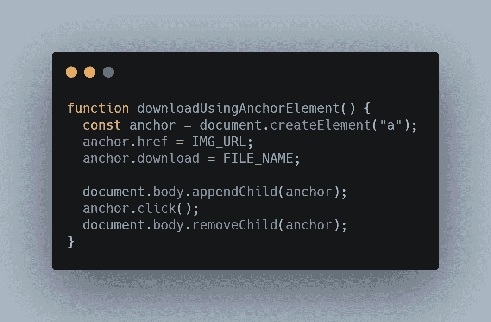
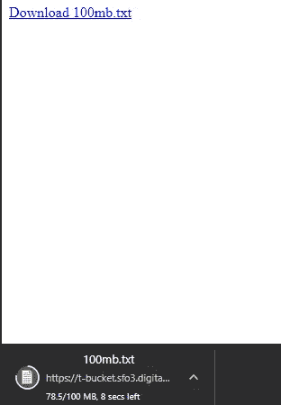
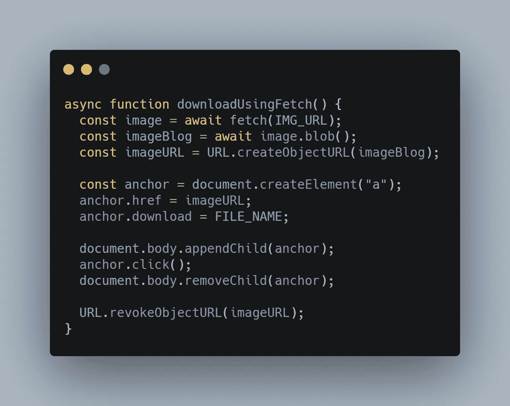
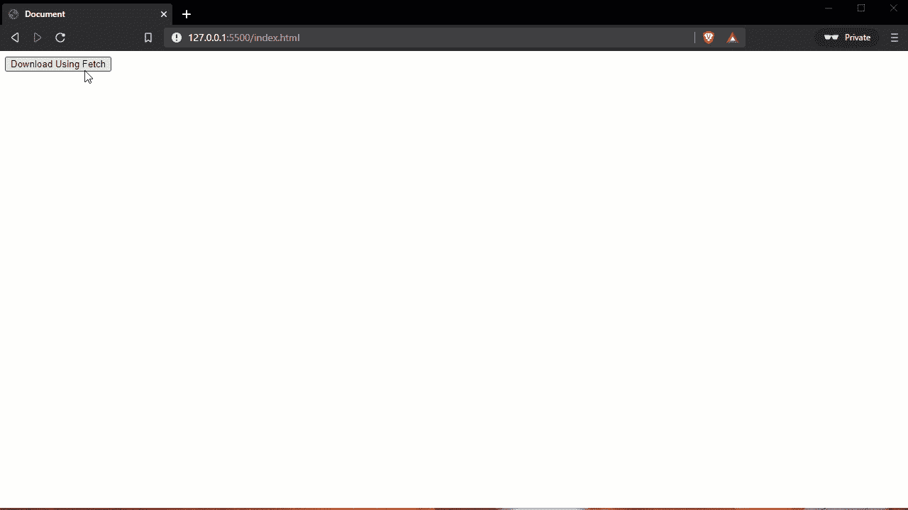
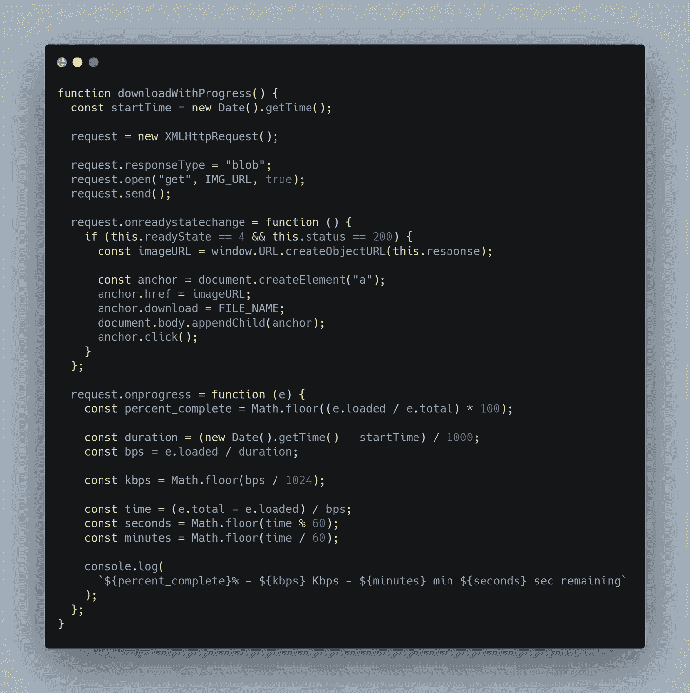
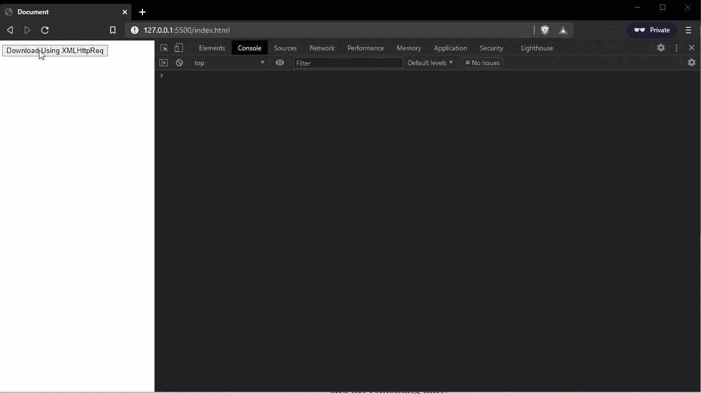

# 如何用 JavaScript 下载文件

> 原文：<https://itnext.io/how-to-download-files-with-javascript-d5a69b749896?source=collection_archive---------0----------------------->

照片由[潘卡杰·帕特尔](https://unsplash.com/@pankajpatel?utm_source=unsplash&utm_medium=referral&utm_content=creditCopyText)在 [Unsplash](https://unsplash.com/s/photos/loading?utm_source=unsplash&utm_medium=referral&utm_content=creditCopyText) 上拍摄

下载文件是网上冲浪的一个重要方面。每天从互联网上下载大量文件，从二进制文件(如应用程序、图像、视频和音频)到纯文本文件。

如果你有一个 web 开发人员，你想把这个特性添加到你的应用程序中，你可以这样做。

我们将考察 3 种不同的方法:

*   仅使用 HTML 元素的基本模式；
*   使用带有 [Fetch API](https://developer.mozilla.org/en-US/docs/Web/API/Fetch_API) 和 HTML 元素的 JavaScript
*   使用 XMLHttpRequest 和 HTML 元素，但是在一个更复杂的场景中，我们实现了一个测量进度的系统；

# 方法一

第一种也是最简单的方法意味着创建一个具有`download`属性的锚 HTML 元素。

根据定义，`download`属性指定当用户点击超链接时，目标(在`href`属性中指定的文件)将被下载。

同样，使用这个`download`属性，我们可以在下载后指定文件的新名称。因此，如果我们想下载一个特定名称的文件，我们可以使用这个属性来控制它。但是，当本地下载窗口出现时，用户仍然可以更改名称，但是我们提供的名称将是默认名称。

如果省略该值，则使用原始文件名。

[原始](https://carbon.now.sh/?bg=rgba%28171%2C+184%2C+195%2C+1%29&t=seti&wt=none&l=htmlmixed&ds=true&dsyoff=20px&dsblur=68px&wc=true&wa=true&pv=56px&ph=56px&ln=false&fl=1&fm=Hack&fs=14px&lh=133%25&si=false&es=2x&wm=false&code=%253Ca%2520href%253D%2522https%253A%252F%252Ft-bucket.sfo3.digitaloceanspaces.com%252F100mb.txt%2522%2520download%250A%2520%2520%253EDownload%2520100mb.txt%253C%252Fa%250A%253E)

当我们不需要基于这个下载过程做任何动作的时候，这个方法是很棒的。

同时，我们可以使用这个方法，即使我们不能使用 JavaScript 呈现锚 HTML 元素。

[生](https://carbon.now.sh/?bg=rgba%28171%2C+184%2C+195%2C+1%29&t=seti&wt=none&l=javascript&ds=true&dsyoff=20px&dsblur=68px&wc=true&wa=true&pv=56px&ph=56px&ln=false&fl=1&fm=Hack&fs=14px&lh=133%25&si=false&es=2x&wm=false&code=function%2520downloadUsingAnchorElement%28%29%2520%257B%250A%2520%2520const%2520anchor%2520%253D%2520document.createElement%28%2522a%2522%29%253B%250A%2520%2520anchor.href%2520%253D%2520IMG_URL%253B%250A%2520%2520anchor.download%2520%253D%2520FILE_NAME%253B%250A%2520%2520%250A%2520%2520document.body.appendChild%28anchor%29%253B%250A%2520%2520anchor.click%28%29%253B%250A%2520%2520document.body.removeChild%28anchor%29%253B%250A%257D)

上面的函数做的是一样的，只是我们创建了锚 HTML 元素，只是为了这个下载动作，然后我们删除它。

*   `IMG_URL`是我们要下载的图片的网址；
*   `FILE_NAME`是文件下载后的新名称；

这个方法的限制是它必须遵守*同源策略*，因此这个属性对于同源 URL 是正确的。

一个常见的情况是，当您想从另一个服务器下载图像，而不是下载它，浏览器会在一个新的标签中打开它。

这种方法的关键在于下载过程会自动开始，并且可以在浏览器中直接查看。

请注意上图中下载过程是如何被发送到浏览器来管理的，浏览器提供了对它的控制并显示进度。

## 方法二

第二个方法和第三个方法对 anchor 元素使用了相同的技术，但是我们没有提供图像 URL，而是将文件的内容转换为一个 [Blob](https://developer.mozilla.org/en-US/docs/Web/API/Blob) ，然后使用 [createObjectURL](https://developer.mozilla.org/en-US/docs/Web/API/URL/createObjectURL) 方法从中创建 [DOMString](https://developer.mozilla.org/en-US/docs/Web/API/DOMString) 。

[生](https://carbon.now.sh/?bg=rgba%28171%2C+184%2C+195%2C+1%29&t=seti&wt=none&l=javascript&ds=true&dsyoff=20px&dsblur=68px&wc=true&wa=true&pv=56px&ph=56px&ln=false&fl=1&fm=Hack&fs=14px&lh=133%25&si=false&es=2x&wm=false&code=async%2520function%2520downloadUsingFetch%28%29%2520%257B%250A%2520%2520const%2520image%2520%253D%2520await%2520fetch%28IMG_URL%29%253B%250A%2520%2520const%2520imageBlog%2520%253D%2520await%2520image.blob%28%29%253B%250A%2520%2520const%2520imageURL%2520%253D%2520URL.createObjectURL%28imageBlog%29%253B%250A%250A%2520%2520const%2520anchor%2520%253D%2520document.createElement%28%2522a%2522%29%253B%250A%2520%2520anchor.href%2520%253D%2520imageURL%253B%250A%2520%2520anchor.download%2520%253D%2520FILE_NAME%253B%250A%250A%2520%2520document.body.appendChild%28anchor%29%253B%250A%2520%2520anchor.click%28%29%253B%250A%2520%2520document.body.removeChild%28anchor%29%253B%250A%250A%2520%2520URL.revokeObjectURL%28imageURL%29%253B%250A%257D)

注意，在最后我们使用了`URL.revokeObjectURL`，这在内存管理方面很重要。当使用`URL.createObjectURL`时，会创建一个新的对象 URL，即使它是用同一个 blob 对象调用的。

每当创建一个对象 URL 时，它会在创建它的文档的生命周期内一直存在。卸载文档时，浏览器将释放所有对象 URL。但是，为了提高性能和最小化内存使用，在不再需要对象 URL 时释放它们是很重要的。

这种方法的关键是下载过程会自动开始，但是在我们的应用程序中，并且只有在下载完成时才会传递给浏览器。

请注意，在上面的 GIF 中，一旦我们单击了 Download 按钮，似乎什么也没有发生，因为下载在我们的应用程序中作为异步任务发生，一旦完成，它将被传递给浏览器。

一旦浏览器窗口出现，我们点击保存，文件会自动保存在我们的计算机上。

通过这种方法，我们现在可以下载任何类型的文件，而不用考虑原始服务器。然而，问题是因为下载发生在我们的应用程序内部，用户可能认为当他点击时什么也没发生，因此通过实现进度的测量来管理大文件下载是我们的责任。

同时，当文件下载完成后，我们需要在应用程序内部执行某些操作时，这种方法非常有用。显示一条消息，向后端发送一个请求，呈现一个新页面，等等…

## 方法三

第三种方法类似于第二种方法，我们仍然要使用 Blob 和 createObjectURL，但是不使用 Fetch API，我们将使用 [XMLHttpRequest](http://org/en-US/docs/Web/API/XMLHttpRequest) 。

我们使用 XMLHttpRequest 而不是 Fetch，因为目前 Fetch API 没有提供进度测量的接口，而 XMLHttpRequest 提供了。

[生](https://carbon.now.sh/?bg=rgba%28171%2C+184%2C+195%2C+1%29&t=seti&wt=none&l=javascript&ds=true&dsyoff=20px&dsblur=68px&wc=true&wa=true&pv=56px&ph=56px&ln=false&fl=1&fm=Hack&fs=14px&lh=133%25&si=false&es=2x&wm=false&code=function%2520downloadWithProgress%28%29%2520%257B%250A%2520%2520const%2520startTime%2520%253D%2520new%2520Date%28%29.getTime%28%29%253B%250A%250A%2520%2520request%2520%253D%2520new%2520XMLHttpRequest%28%29%253B%250A%250A%2520%2520request.responseType%2520%253D%2520%2522blob%2522%253B%250A%2520%2520request.open%28%2522get%2522%252C%2520IMG_URL%252C%2520true%29%253B%250A%2520%2520request.send%28%29%253B%250A%250A%2520%2520request.onreadystatechange%2520%253D%2520function%2520%28%29%2520%257B%250A%2520%2520%2520%2520if%2520%28this.readyState%2520%253D%253D%25204%2520%2526%2526%2520this.status%2520%253D%253D%2520200%29%2520%257B%250A%2520%2520%2520%2520%2520%2520const%2520imageURL%2520%253D%2520window.URL.createObjectURL%28this.response%29%253B%250A%250A%2520%2520%2520%2520%2520%2520const%2520anchor%2520%253D%2520document.createElement%28%2522a%2522%29%253B%250A%2520%2520%2520%2520%2520%2520anchor.href%2520%253D%2520imageURL%253B%250A%2520%2520%2520%2520%2520%2520anchor.download%2520%253D%2520FILE_NAME%253B%250A%2520%2520%2520%2520%2520%2520document.body.appendChild%28anchor%29%253B%250A%2520%2520%2520%2520%2520%2520anchor.click%28%29%253B%250A%2520%2520%2520%2520%257D%250A%2520%2520%257D%253B%250A%250A%2520%2520request.onprogress%2520%253D%2520function%2520%28e%29%2520%257B%250A%2520%2520%2520%2520const%2520percent_complete%2520%253D%2520Math.floor%28%28e.loaded%2520%252F%2520e.total%29%2520*%2520100%29%253B%250A%250A%2520%2520%2520%2520const%2520duration%2520%253D%2520%28new%2520Date%28%29.getTime%28%29%2520-%2520startTime%29%2520%252F%25201000%253B%250A%2520%2520%2520%2520const%2520bps%2520%253D%2520e.loaded%2520%252F%2520duration%253B%250A%250A%2520%2520%2520%2520const%2520kbps%2520%253D%2520Math.floor%28bps%2520%252F%25201024%29%253B%250A%250A%2520%2520%2520%2520const%2520time%2520%253D%2520%28e.total%2520-%2520e.loaded%29%2520%252F%2520bps%253B%250A%2520%2520%2520%2520const%2520seconds%2520%253D%2520Math.floor%28time%2520%2525%252060%29%253B%250A%2520%2520%2520%2520const%2520minutes%2520%253D%2520Math.floor%28time%2520%252F%252060%29%253B%250A%250A%2520%2520%2520%2520console.log%28%250A%2520%2520%2520%2520%2520%2520%2560%2524%257Bpercent_complete%257D%2525%2520-%2520%2524%257Bkbps%257D%2520Kbps%2520-%2520%2524%257Bminutes%257D%2520min%2520%2524%257Bseconds%257D%2520sec%2520remaining%2560%250A%2520%2520%2520%2520%29%253B%250A%2520%2520%257D%253B%250A%257D)

开始和`onreadystatechange`块类似于第二个功能。将响应作为 Blob 对象下载，创建一个 DOMString，并使用锚元素下载文件。

在`onprogress`中，我们使用`e.loaded`和`e.total`值来计算进度百分比和所用时间，以及下载速度和剩余时间。

请注意，在上面的 GIF 中，我们的行为与第二种方法相同，只是现在我们可以监控进度。文件下载完成后，将被发送到浏览器，然后立即保存到磁盘。

# 包裹

上述每种方法都是对以前方法的更新。

第一种方法最简单。在这种情况下，我们只需将下载过程转发到浏览器进行本地管理。当应用程序不必根据加载状态执行某些操作时，此方法是首选方式。

在第二种情况下，我们在内部管理下载，只有在下载完成时才将其发送到浏览器。通过这种方式，我们可以控制应用程序内部的下载，并根据其状态做出反应。这种方法适用于下载速度很快的小文件，但是当文件太大时，如果用户界面上没有任何提示用户下载正在进行，用户可能会认为应用程序有问题。

在最后一种方法中，我们实现了我们自己的进度度量，这与浏览器中的度量类似。