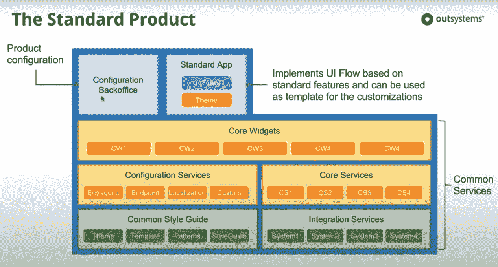
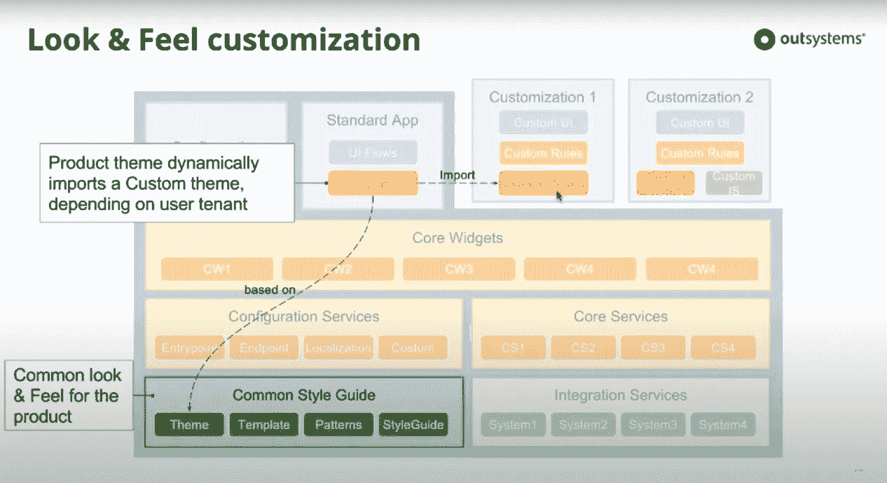
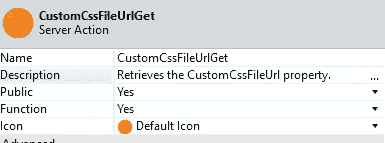
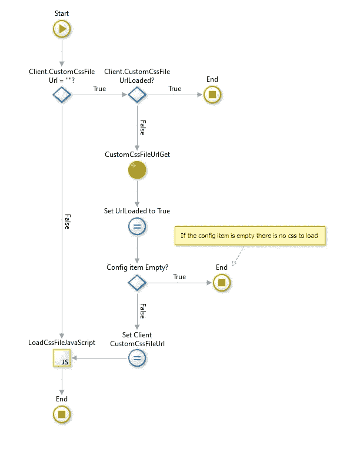

# 如何在基础产品中动态导入定制产品主题

> 原文：<https://itnext.io/how-to-dynamically-import-the-customized-product-theme-in-the-base-product-b10b534e3e1a?source=collection_archive---------3----------------------->

为客户开发产品应用程序时，可能会有不同的实例要使用它。你可以想象，在某些情况下，特定的定制是必要的，调整到他们特定的用例。例如，应用程序要求每个国家都有不同的外观。或者在简单的用户交互中需要一些调整。本课[如何创建基础应用的定制版本](https://success.outsystems.com/Documentation/Best_Practices/Architecture/How_to_Create_Customized_Versions_of_a_Base_Application)描述了在不同安装中定制的产品架构。标准产品的架构如下所示:

挑战之一是将定制产品的样式应用于基础产品。如该表所示

在本指南中，我们将一步一步地指导您如何实现这一目标。

# 反应式 Web 应用程序的实现步骤

*   创建**基本产品主题**并应用基本样式，如字体和颜色。
*   创建一个**定制产品实例主题**例如`ACME Theme`并应用定制样式
*   在**配置服务**应用程序中，创建一个**配置服务定制**服务模块，用于保存配置项。关于如何创建配置项的示例，请参见[应用框架](https://www.outsystems.com/forge/component-overview/5944/application-framework) forge 组件。
*   在**配置服务定制**模块中，创建一个配置项来保存*“定制产品实例主题”CSS 文件*的完整 URL 路径，例如:名为`CustomCssFileUrl`的`<server path>/AcmeTheme/AcmeTheme.css`。
*   在**CustomizationsServices _ CS**模块中创建一个服务器动作`CustomCssFileUrlGet`，该动作将输出变量`CustomCssFileUrl`设置为配置项的值:

*   在 **BaseProductTheme** 模块中创建一个客户端变量`CustomCssFileUrl`
*   在 **BaseProductTheme** 模块中，创建一个客户端动作`ClientCustomCssFileUrlSet`，该动作将`CustomCssFileUrlGet`的输出分配给客户端变量
*   在 **BaseProductTheme** 中创建一个布尔客户端变量`CustomCssFileUrlLoaded`这个变量将被用于只加载 css 一次
*   在 **BaseProductTheme** 中，使用以下逻辑创建一个公共客户端动作`LoadCustomCssFile` :

*   在 JS 块中插入以下代码:

切换到界面选项卡并定位**布局** UIFlow。对于每个布局，打开`OnReady`客户端动作，并将`LoadCssFile`添加到动作流中。例如`LayoutTopMenu`

*   打开**定制服务配置后台**，将`CustomCssFileUrl`配置项的值设置为定制产品主题 CSS 文件的*完整 url 路径*。

现在，基于布局的每个屏幕都将加载 CSS 并应用定制产品实例的样式。

OutSystems [专家](https://www.outsystems.com/profile/81934/)团队创建了[多主题反应](https://www.outsystems.com/forge/component-overview/9084/multi-theme-reactive) forge 组件来演示主题切换甚至更多。