# 如何在 React 中轻松渲染多个元素

> 原文：<https://itnext.io/how-to-easily-render-multiple-elements-in-react-c9193a06f23a?source=collection_archive---------0----------------------->

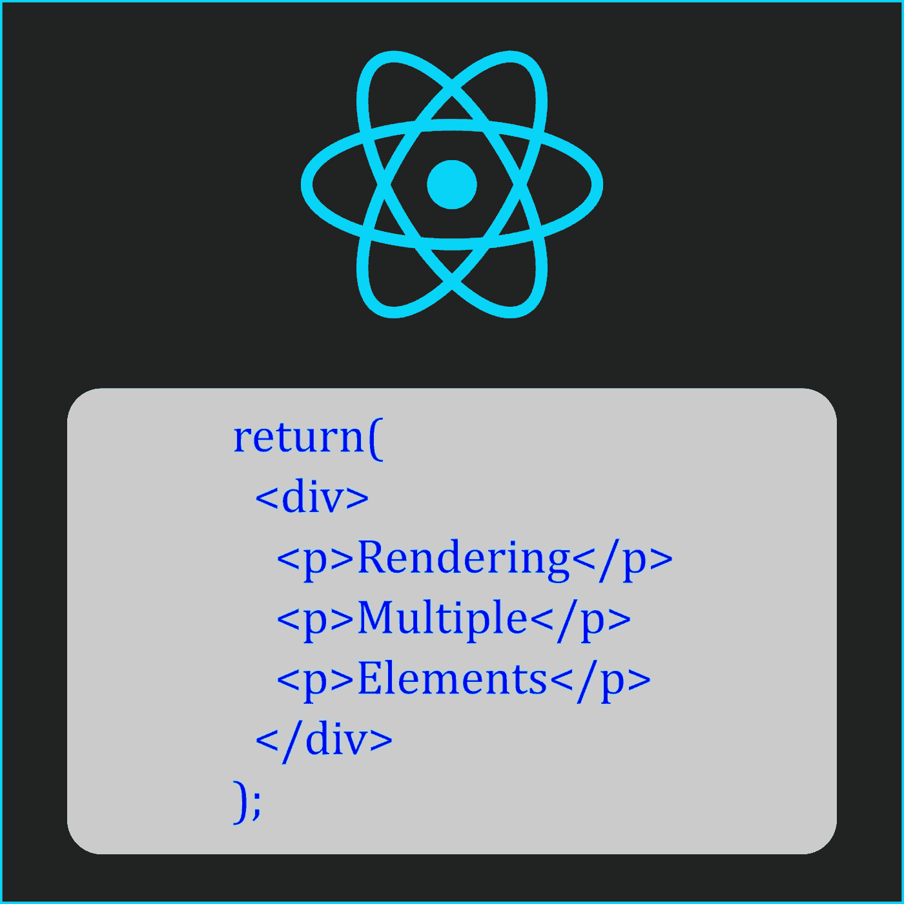

我和 Vuejs 一起工作了一年多，用它做了不少个人项目。最近开始学习 Reactjs 后，发现了这个确定的特性。

在 Vue 和 React 中，我们只能渲染一个元素。即使我们有多个元素要渲染，也只能有一个*单根元素*。这意味着如果我们想要呈现两个或更多的元素，我们必须将它们包装在另一个元素或组件中。通常，用于此的元素是一个`
`标签。这对页面结构没有太大影响，所以`div`是一个流行的包装元素。

但是，有时候，使用包装器元素可能是低效的。在某些情况下，拥有包装组件会导致 CSS 不一致，从而导致头痛。这并不意味着我们绝对不能使用包装元素。但是这种解决方法可能会很难，而且很耗时。

# 这里有一些这样的例子

第一个例子是我亲身经历的。我想创建一个倒计时定时器，并添加一个背景图片。这个项目没什么大不了的，因为我只是做它来练习我的反应技能。组件的结构大致是这样的:

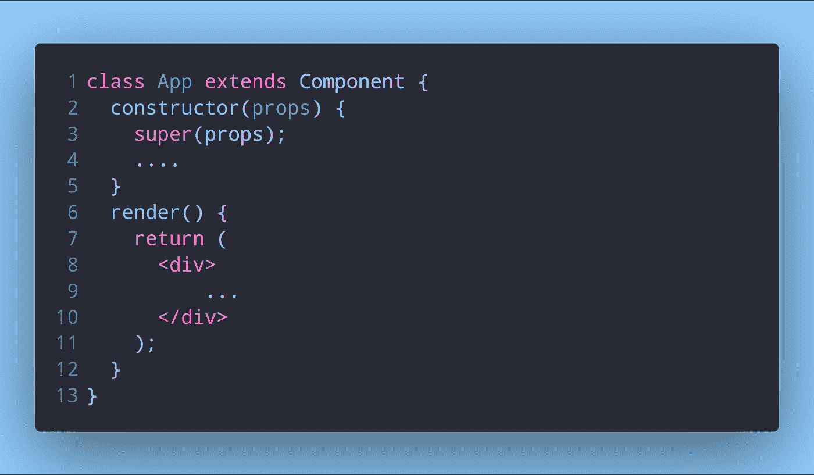

我的倒计时项目的结构

现在请记住，这个`div`以及里面的所有内容都将在另一个`div`中呈现，T3 是 DOM 中的目标元素。当我尝试应用背景图像时，它要么不成比例，要么在顶部留下了一些空白。我试了我能想到的一切，但结果是一样的。为了让它工作，我甚至将背景图片作为内嵌样式添加到 HTML 的主体中。最后，我不得不与`position: absolute`合作，改变两个`div`的宽度和高度，并让它正常工作。

这很好，因为唯一要显示的内容是倒计时。但是如果应用程序更复杂，处理起来会更令人沮丧。当然，也有可能有一个更好的解决方案，只是我没有足够的经验去发现它。不管怎样，根据项目的复杂程度，变通方法也可能同样复杂。

第二个例子来自 React 文档。

此示例在一个组件中有一个表格，该组件有一个表格行，该行中有一个子组件。

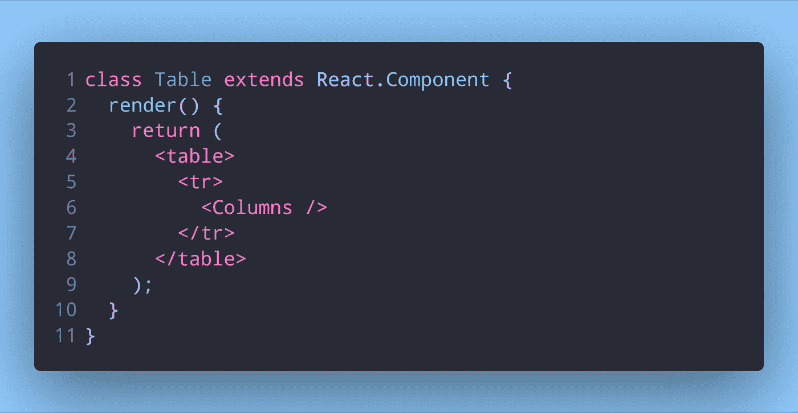

React 文档示例中的表组件

`Table`组件将呈现表格本身和行，而`Columns`子组件将返回列。一切看起来都很好。但是看一看`Columns`组件:

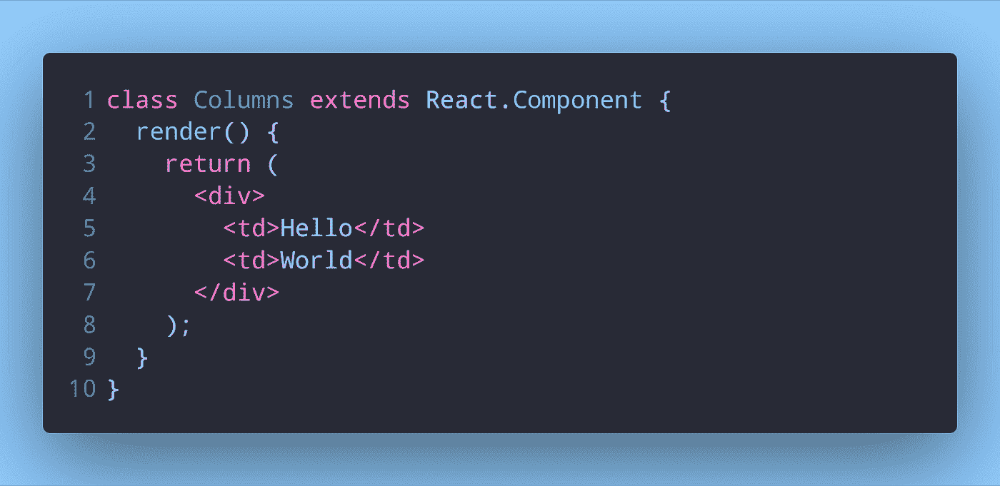

React 文档示例中的列组件

虽然这是一个有效的组件，它返回了包装在一个`div`中的多个元素，但是它不能与父组件`Table`一起工作。看看渲染的结果:

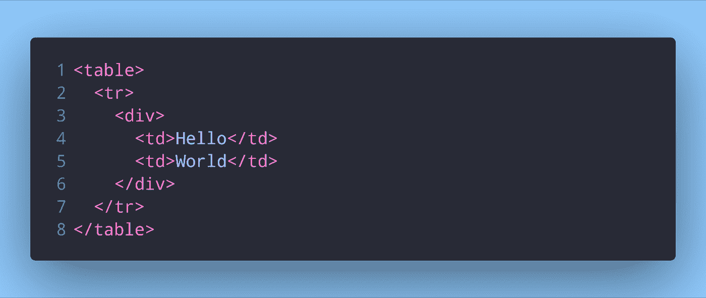

无效的 HTML 结果

这是完全无效的 HTML。

幸运的是，有一种方法可以解决这个问题。有了这个，我们就不必担心调整 CSS，也将满足呈现多个元素的需求。

有两种方法可以解决这个问题。

# 第一种解决方案

第一个解决方案是使用 React 提供的一个特性，叫做`Fragments`。一个*片段*是一个空的包装组件，它不呈现任何自己的 HTML。它只是返回写在标签中的内容。将此应用于 React docs 示例，我们将得到:

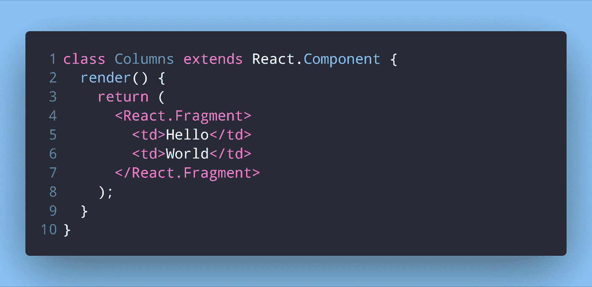

使用反应片段的第一种解决方案

然后，`Table`组件将呈现有效的 HTML:

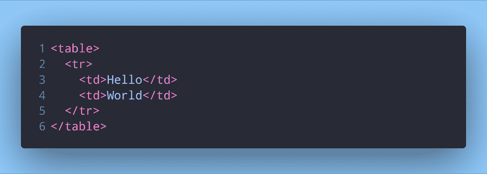

有效的 HTML 结果

React v16.2 提供了这个特性。

`React.Fragment`实现起来并不那么困难。我们可以做一个空的组件，得到同样的结果。

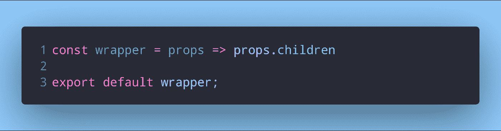

实现 React 片段

我们可以像使用`Fragment`一样使用这个定制的包装组件。

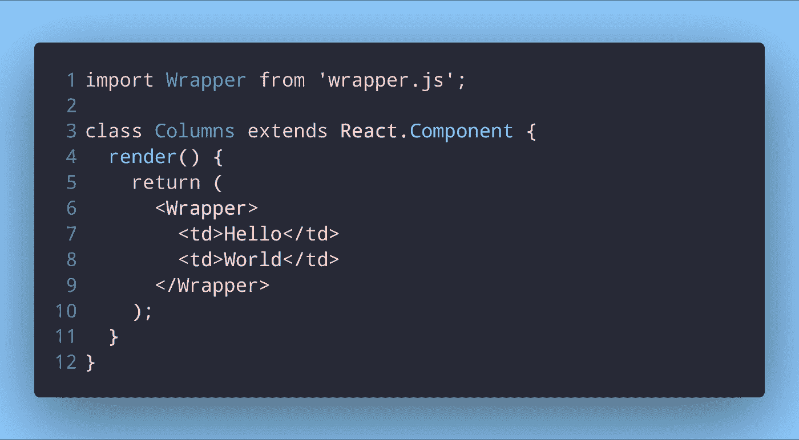

使用片段实现

产生的 HTML 将是相同的。虽然我们可以自己实现，但是使用`React.Fragment`意味着我们的项目树中少了一个组件，使用`Fragments`会更有效，因为它在默认的 React 包中可用。

有一个新的短语法可供您用于*片段*:

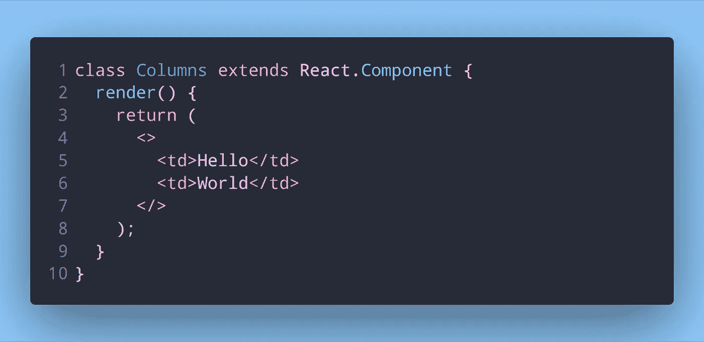

片段的简短语法

你可以像平常的组件一样使用`<></>`，但是它不支持属性或者键。

# 另一种解决方案

第二个解决方案是将返回的 JSX 放在方括号中，而不是括号中。

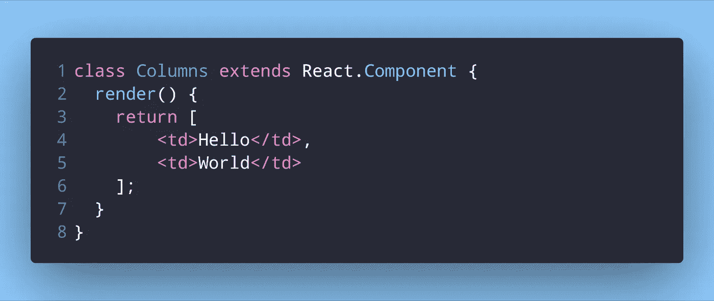

第二种解决方案

这是完全有效的，也是我们想要它做的。React 呈现元素的方式是，当我们返回包装在单个`
`元素中的整个 JSX 时，它将这个单个`
`传递给`ReactDOM.createElement()`方法。该方法只接受一个参数。

这就是我们上面的解决方案有效的原因。尽管它实际上是一组没有任何包装元素的元素，如`
`，但它是单个数组的一部分(记住，数组实际上是对象)。因此，我们将单个对象传递给`ReactDOM.createElement()`。

但是，这确实有一个缺点。虽然这样做很好，但是 React 会给我们一个警告。每个元素都必须有一个键。这类似于我们要求 Vuejs 中的`v-for`元素每个都有一个键。添加了所需的键后，我们看到了缺点:

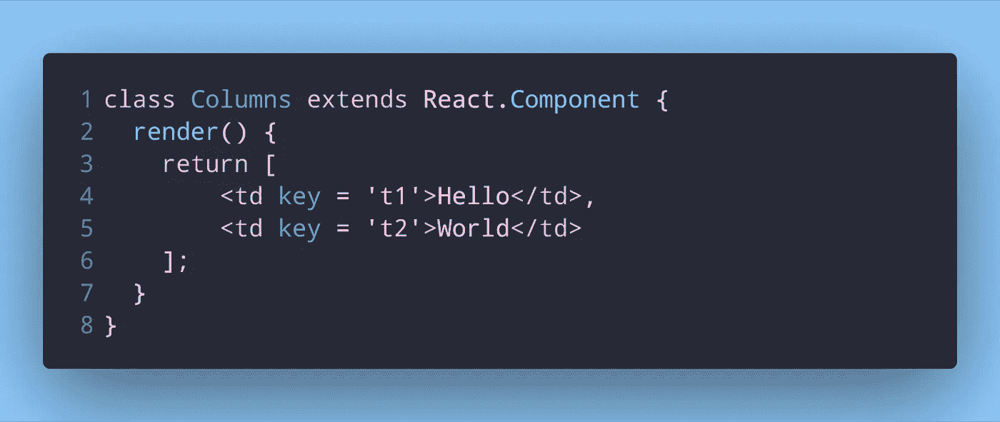

带钥匙的第二种解决方案

这意味着我们必须为每个元素添加一个唯一的键。这可能会变得相当乏味。对于一个 JSX 很少的小组件来说可能没问题，但是对于渲染大量 JSX 的巨大而复杂的组件来说，使用*片段*可能会更好。你可以在 React 文档中阅读更多关于片段[的内容。](https://reactjs.org/docs/fragments.html)

# 收尾

包装另一个组件的组件实际上被称为高阶组件(Higher Order Component，HOC ),但这不是本文讨论的范围。如果你有兴趣，可以在 React 文档中了解更多关于 hoc 的信息。

我希望这篇文章教你一些关于 React 如何渲染元素的新知识。了解 React 中的多个元素是如何呈现的，将所有元素包装在一个根元素中的原因是什么，以及当情况需要时我们如何绕过它，如果不是必要的话，这对成为 React 开发人员是有益的。

如果你对我如何改进这篇文章有任何建议或任何问题，请在下面的评论中留下。

*最初发布于* [*dev.to*](https://dev.to/napoleon039/how-to-easily-render-multiple-elements-in-react-4020) *。*