# 如何弹性化 SIEM(第 1 部分)

> 原文：<https://itnext.io/how-to-elastic-siem-part-1-a39167b8bd23?source=collection_archive---------0----------------------->


IT 环境变得越来越大，越来越分散，越来越难以管理。必须保护和监控所有系统组件免受网络威胁。您需要一个能够存储和分析日志、指标和事件的可扩展平台。SIEM 解决方案可能会耗费大量资金。在本案例中，我们将了解弹性堆栈中的免费解决方案，即弹性 SIEM。

# 我们将使用什么？

Elastic Stack 是一组组件:Elasticsearch、Kibana、Logstash 和 Beats。关于本故事中所用内容的简要信息:

*   弹性搜索—文档数据库/搜索引擎
*   kibana——用于弹性搜索的数据可视化仪表板
*   Filebeat —轻量级日志收集器([可用模块](https://www.elastic.co/guide/en/beats/filebeat/current/filebeat-modules.html))
*   Packetbeat —轻量级网络协议收集器([及更多](https://www.elastic.co/guide/en/beats/packetbeat/current/configuration-protocols.html))
*   audibeat——不使用 auditd 的轻量级安全事件收集器
*   winlogbeat——一个来自 Windows 系统的轻量级事件收集器。

# 环境

我在 Azure cloud 上创建了 3 个虚拟机:

*   ELK—Ubuntu 20.04—elastic search+Kibana
*   Ubuntu 1—Ubuntu 20–04—文件节拍、数据包节拍、审计节拍
*   Win10 — Windows 10 — Auditbeat、Packetbeat、Winlogbeat

# Elasticsearch + Kibana 安装

我们将放置一个简单的单节点集群。在这里你可以下载 [Elasticsearch](https://www.elastic.co/downloads/elasticsearch) 和 [Kibana](https://www.elastic.co/downloads/kibana) deb 文件。

安装:

```
sudo dpkg -i file_name.deb
```

弹性搜索配置位于`/etc/elasticsearch/elasticsearch.yml`中。值得改变的是:

*   `network.host: 0.0.0.0` #或机器的 IP/主机，以便从外部可以看到 ES
*   `discovery.type: single-node`

Kibana 配置位于/etc/kiban/kiban/yml 中。值得改变的是:

*   `server.host: “0.0.0.0”`

现在你可以启动服务了。

```
sudo systemctl enable elasticsearch
sudo systemctl enable kibana
sudo systemctl start elasticsearch
sudo systemctl start kibana
```

如果一切正常，你应该可以使用 curl 并从 ES 得到答案。

```
root@ELK:/home/azureuser# curl localhost:9200
{
  "name" : "ELK",
  "cluster_name" : "hey."
  "cluster_uid" : "u6FDeHNsTmWJcnf-jYUH7Q",
  "version" : {
    "number" : "7.8.1",
    "build_flavor" "default."
    "build_type" : "deb."
    "build_hash" : "b5ca9c58fb664ca8bf9e4057fc229b3396bf3a89",
    "build_date" : "2020-07-21T16:40:44.668009Z",
    "build_snapshot" : false,
    "lucene_version" : "8.5.1."
    "minimum_wire_compatibility_version" : "6.8.0",
    "minimum_index_compatibility_version" : "6.0.0-beta1".
  },
  "tagline" : "You Know, for Search"
}
```

另一方面，使用 web 浏览器可以在端口 5601 访问 Kibana。

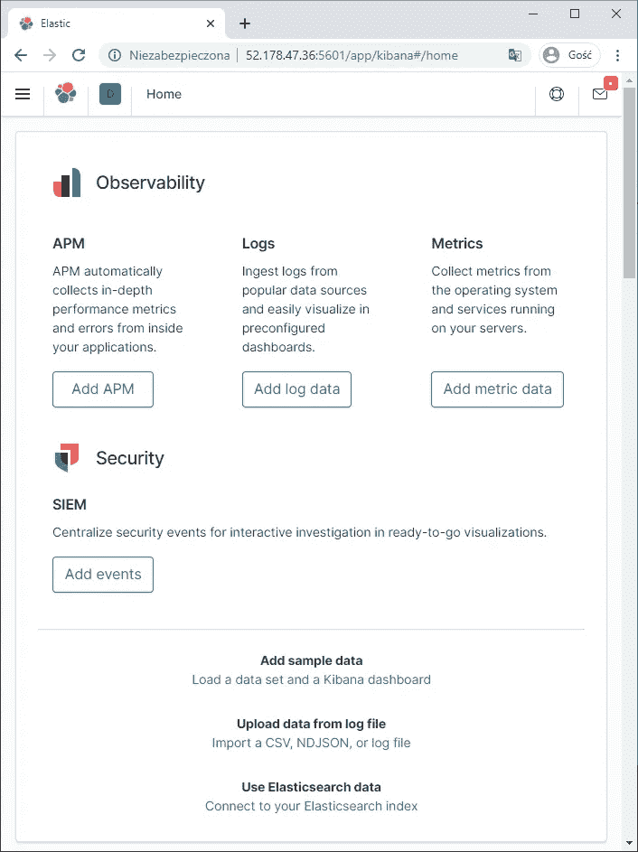

# 从 Ubuntu 添加日志

## Filebeat => syslog

Filebeat deb 文件可以从这里下载。安装:

```
dpkg -i package_name.deb
```

Filebeatconfiguration 位于`/etc/filebeat/filebeat.yml`。

*   `filebeat.config.modules.reload.enabled: true` #我们不希望每次更换模块时都重启服务
*   `setup.kibana.host: “10.0.0.4:5601”` #我们的基巴纳
*   o `utput.elasticsearch.hosts: [“10.0.0.4:9200”]` #我们的弹性搜索节点
*   `monitoring.enabled: true` #我们想在 Elasticsearch/Kibana 中监控节拍

一旦我们这样做了，你需要配置 Filebeat 和 Elasticsearch。Filebeat 将添加 ILM、模板和仪表盘。

```
filebeat setup
```

假设我们想从虚拟机收集系统日志。要显示可用模块并激活系统日志，您必须:

```
filebeat modules list
filebeat modules enable system
```

系统模块配置见`*/etc/filebeat/modules.d/system.yml*`。如果您没有更改默认路径，只需将*设置为 enabled: true* 。

```
# Module: system
# Docs: [https://www.elastic.co/guide/en/beats/filebeat/7.8/filebeat-module-system.html](https://www.elastic.co/guide/en/beats/filebeat/7.8/filebeat-module-system.html)

- module: system
  # Syslog
  syslog:
    enabled: true

    # Set custom paths for the log files. If left empty,
    # Filebeat will choose the paths depending on your OS.
    #var.paths:

  # Authorization logs
  auth:
    enabled: true

    # Set custom paths for the log files. If left empty,
    # Filebeat will choose the paths depending on your OS.
    #var.paths:
```

现在只需打开 Filebeat 服务

```
sudo systemctl enable filebeat
sudo systemctl start filebeat
```

## 审计节拍

就像 Filebeat 一样。Deb 文件可以在[这里](https://www.elastic.co/downloads/beats/auditbeat)下载。唯一的区别是配置文件路径(`/etc/autidbeat/auditbeat.yml`)。

这个节拍没有模块。您将在主配置 yml 文件中找到所有的可能性。记得使用“auditbeat 设置”并打开该服务。

## 包装杯

就像 Filebeat 一样。Deb 文件可以在[这里](https://www.elastic.co/downloads/beats/packetbeat)下载。唯一的区别是配置文件路径(`/etc/packetbeat/packetbeat.yml`)。

这个节拍没有模块。您将在主配置 yml 文件中找到所有的可能性。记得使用“packetbeat setup”并启用该服务。

# 添加 Windows 10 日志

## Winlogbeat

你会在这里找到安装文件。我用的是 MSI 64x。

配置文件可以在`*C:\ProgramData\Elastic\Beats\winlogbeat*` *中找到。*和之前的 Beats 一样，你必须改变 Kibana 和 Elasticsearch 的地址。

Beats 配置是 Powershell 中的以下命令:

```
winlogbeat.cmd setup
```

我们像这样打开 WinlogBeat:

```
Start-Service winlogbeat
```

# 基巴纳的 SIEM 模块

如果索引(filebeat-*、packetbeat-*、auditbeat-*)包含符合 ECS 的数据，则 SIEM 模块可用。ECS 定义了在 Elasticsearch 中存储事件数据时使用的一组通用字段，如日志和指标。Elasticsearch 或任何 NoSQL 数据库没有模式是不正确的。😉

如果您需要来自某个应用程序/系统的日志，而该应用程序/系统在某个 beats 中不能作为模块使用，那么您需要提供这些日志，并将它们处理成符合 ECS 的映射。您可以使用 Filebeat 和 Logstash 来实现这一点。

您可以在左侧的安全选项卡中找到 SIEM 模块。

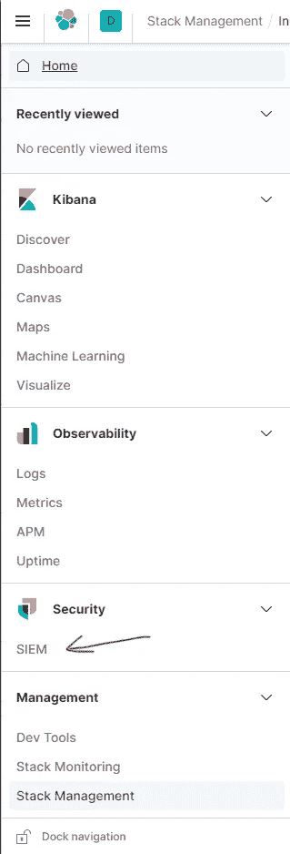

在 overview 选项卡中，您已经可以看到从虚拟机收集的日志的效果。

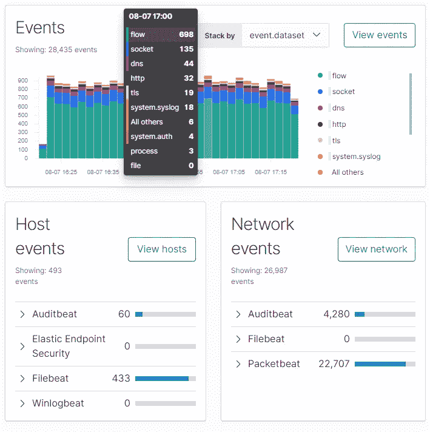

网络选项卡包含源 IPs 和目标 IPs 数据以及带有地址地理位置的地图。

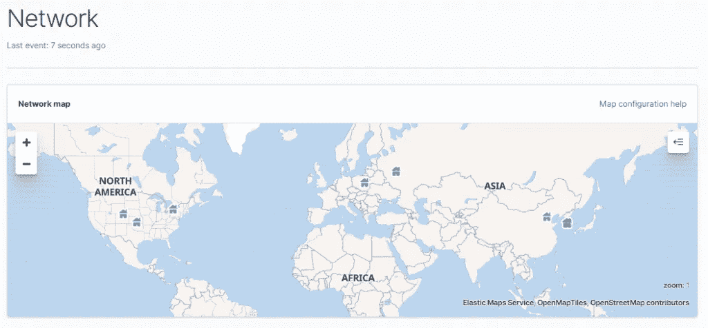

安装 beats 花了一段时间，在 Kibana 周围看了看。你知道吗？**已经有 20 次使用 SSH 通过机器登录的尝试**。

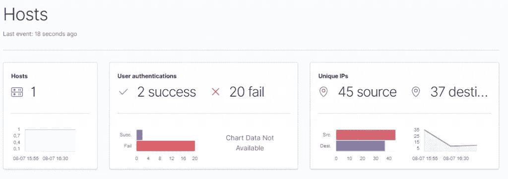

我们可以看到尝试次数、用户和 IP 地址。

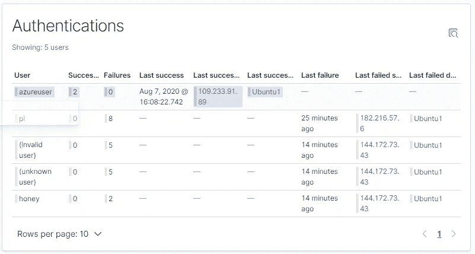

# 时间表

我们来调查一下！

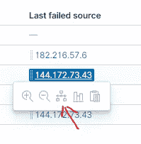

时间线是一个追踪和调查威胁的工作空间。通过这种方式，我们可以添加新的过滤器，并获得更详细的视图。下面您可以看到给定 IP 的网络流相关记录(数据包节拍)和日志记录错误(审计节拍)。如您所见，攻击者使用了许多端口。

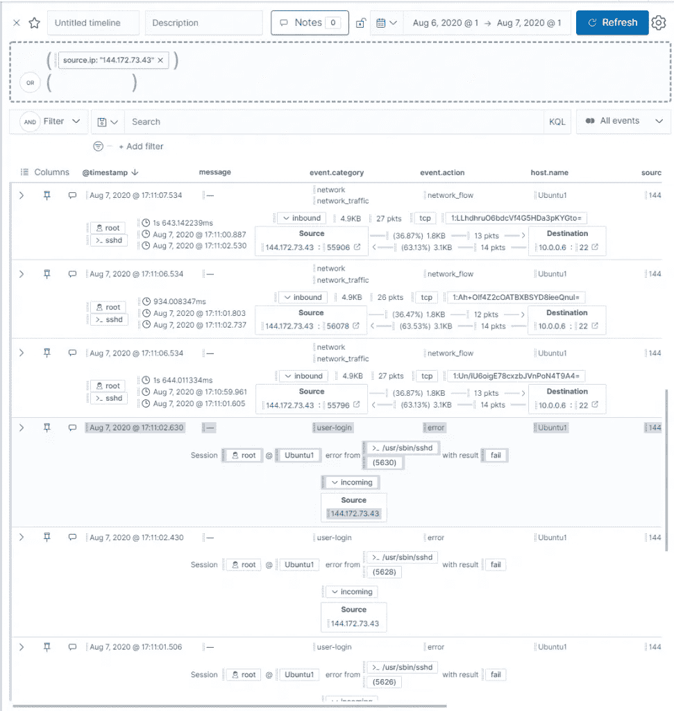

我们可以保存时间表，并将观察结果作为注释添加到案例中。

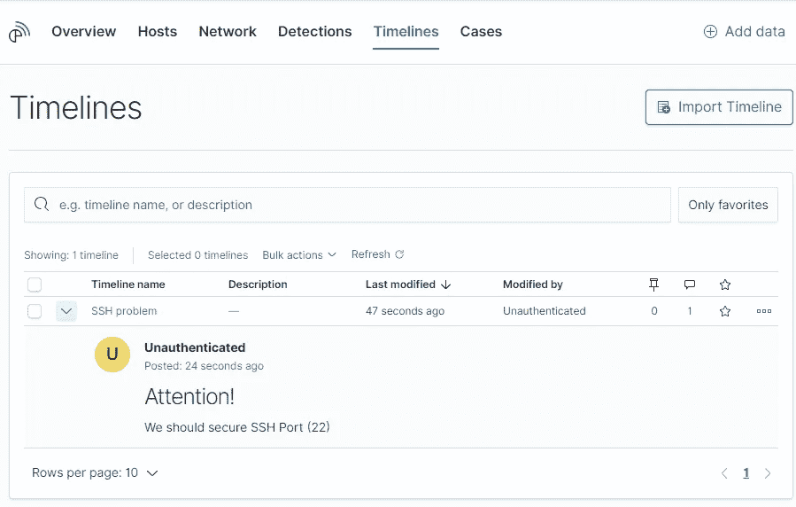

## 过滤

你不应该盲目相信仪表盘。两台机器 113 次登录？肯定有人接管了机器🙈。

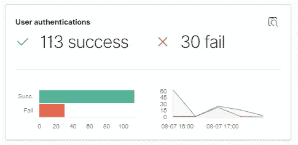

系统用户(不仅仅是)混淆了这种情况。让我们用过滤器把他排除在搜索之外。

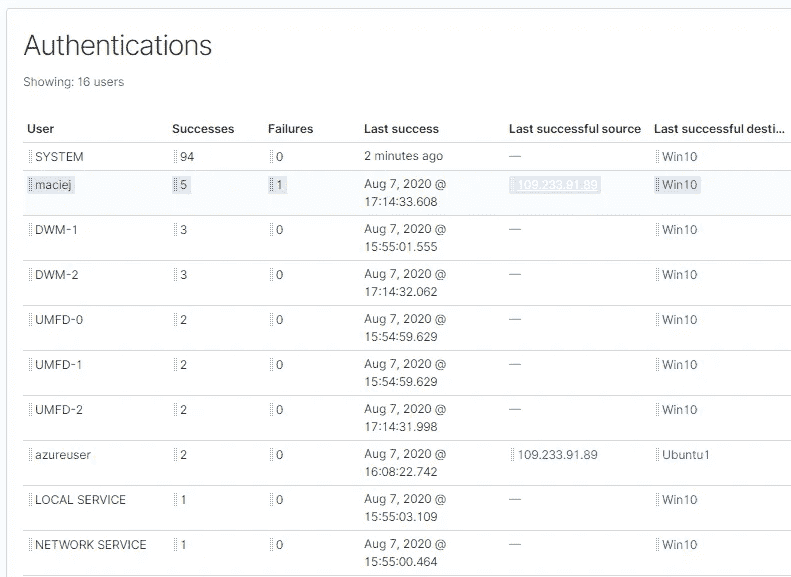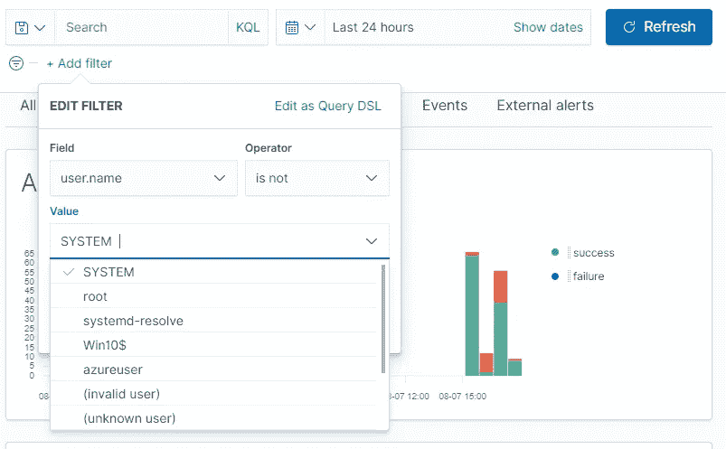

# 在下一集里

在这个故事中，SIEM 模块几乎没有被提及。在本系列的下一篇文章中，您将了解如何保护您的集群并解锁检测选项卡。

编辑:[这里是](https://medium.com/@zorteran/how-to-elastic-siem-part-2-bf0940f745e5)

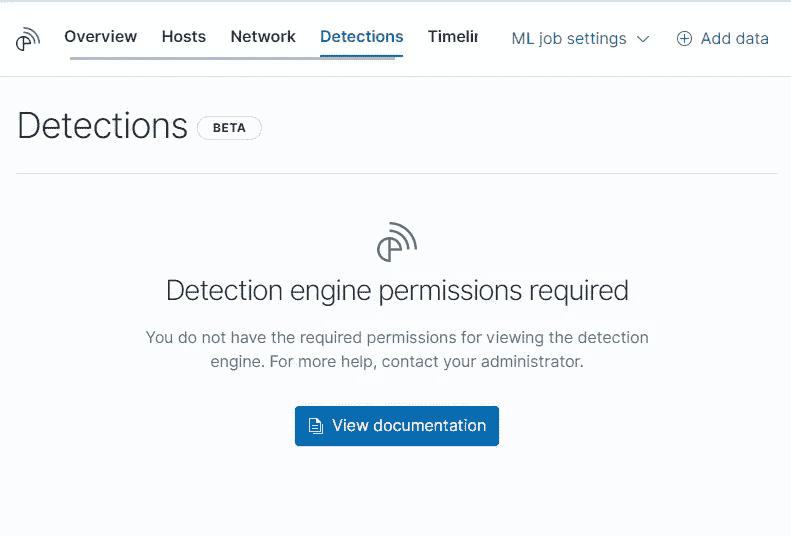