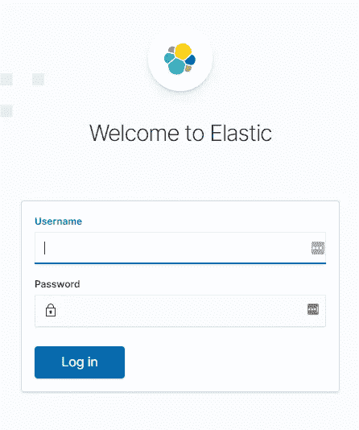
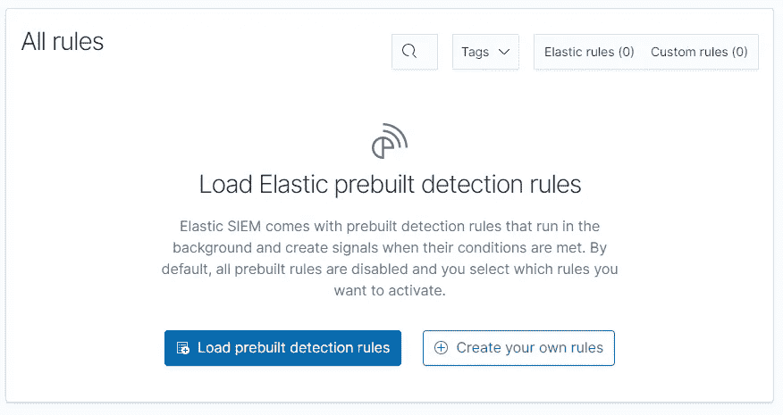
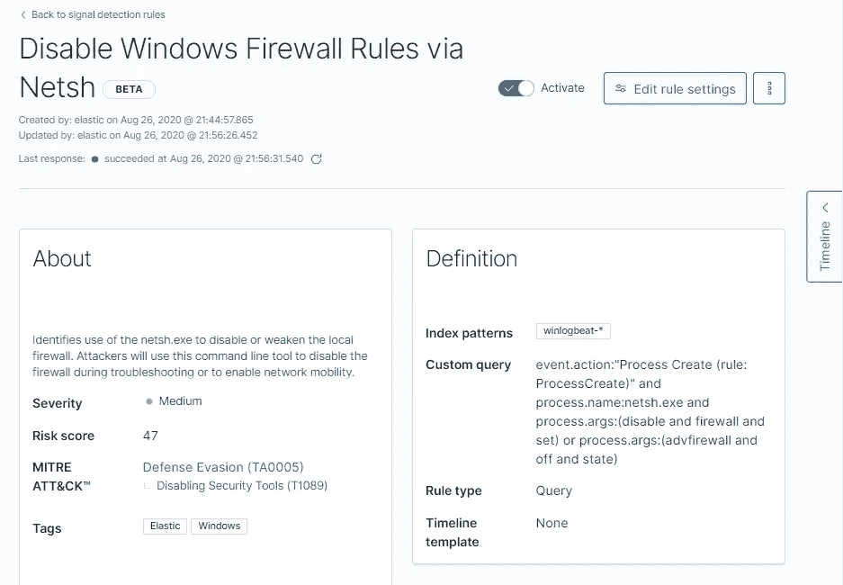
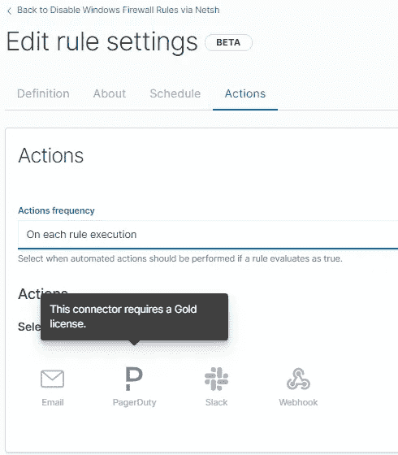
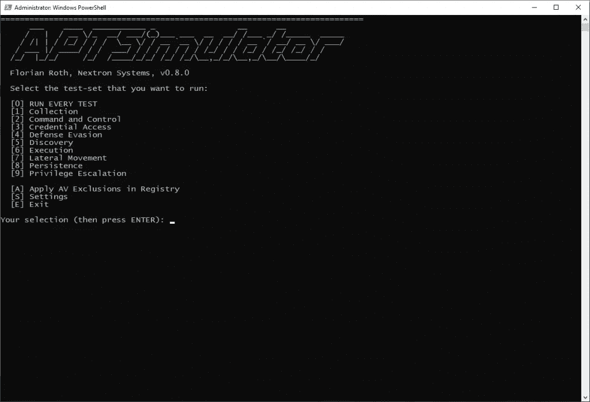
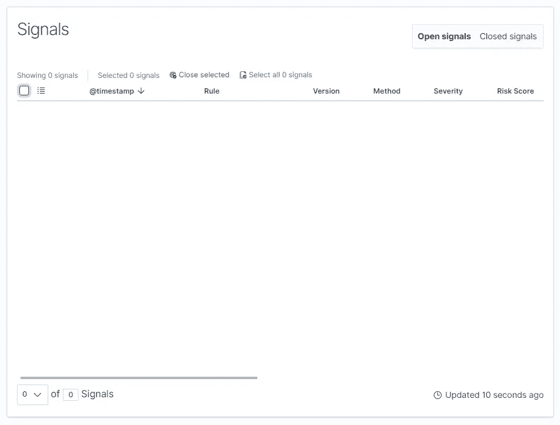
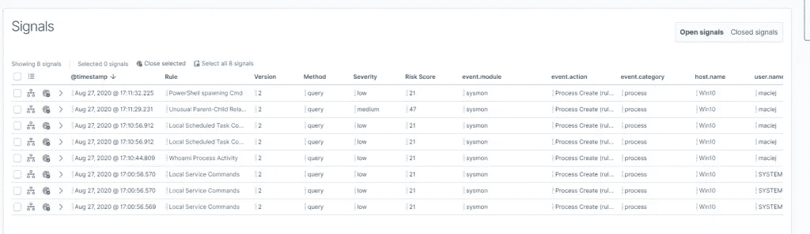

# 如何弹性化 SIEM(第二部分)

> 原文：<https://itnext.io/how-to-elastic-siem-part-2-bf0940f745e5?source=collection_archive---------0----------------------->


这是上一个故事[的延续。这一次，我们将查看弹性 SIEM 中的“检测”选项卡。我们的目标是使用成熟的规则自动检测 IOC。提醒一下:我们在其中一个虚拟机上安装了 Elasticsearch + Kibana。我们监控一个 Ubuntu (Auditbeat，Filebeat，Packetbeat)和 Windows 10 VM (Winlogbeat)，虽然在这个故事中我们将重点放在 Windows 上。](/how-to-elastic-siem-part-1-a39167b8bd23)


# 如何解锁弹性 SIEM 中的检测？

我们必须:

*   通过 TLS 提供 elastic search-Kiban 通信
*   在 Elasticsearch 中启用 xpack.security
*   在 Kibana 中设置 xpack . encryptedsavedobjects . encryption key

## 保护弹性搜索

在本例中，我们有一个单节点的 Elasticsearch 集群，所以我们需要做的就是在`/etc/elasticsearch/elasticsearch.yml`行的末尾添加一行

```
xpack.security.enabled: true
```

并重新启动 Elasticsearch 服务

```
service elasticsearch restart
```

> **注意**:对于普通集群来说，这并不容易。您需要保护节点之间的通信。[在这里你可以找到详细信息。](https://www.elastic.co/guide/en/elasticsearch/reference/current/configuring-tls.html)

我们刚刚破坏了整个日志系统，因为从现在开始需要认证😉。

```
root@ELK:/etc/elasticsearch# curl localhost:9200?pretty
{
  "error" : {
    "root_cause" : [
      {
        "type" : "security_exception",
        "reason" : "missing authentication credentials for REST request [/?pretty]",
        "header" : {
          "WWW-Authenticate" : "Basic realm=\"security\" charset=\"UTF-8\""
        }
      }
    ],
    "type" : "security_exception",
    "reason" : "missing authentication credentials for REST request [/?pretty]",
    "header" : {
      "WWW-Authenticate" : "Basic realm=\"security\" charset=\"UTF-8\""
    }
  },
  "status" : 401
}
```

我们需要生成默认帐户和密码。为此使用了一个特殊的`elasticsearch-setup-passwords`工具，位于 Elasticsearch 目录下，即`/usr/share/elasticsearch/bin/`。我在任何地方都使用相同的密码(*弹性*)。请不要重复那个😊。

```
root@ELK:/etc/elasticsearch# cd /usr/share/elasticsearch/
root@ELK:/usr/share/elasticsearch# bin/elasticsearch-setup-passwords interactive
Initiating the setup of passwords for reserved users elastic,apm_system,kibana,kibana_system,logstash_system,beats_system,remote_monitoring_user.
You will be prompted to enter passwords as the process progresses.
Please confirm that you would like to continue [y/N]y

Enter password for [elastic]:
Reenter password for [elastic]:
Enter password for [apm_system]:
Reenter password for [apm_system]:
Enter password for [kibana_system]:
Reenter password for [kibana_system]:
Enter password for [logstash_system]:
Reenter password for [logstash_system]:
Enter password for [beats_system]:
Reenter password for [beats_system]:
Enter password for [remote_monitoring_user]:
Reenter password for [remote_monitoring_user]:
Changed password for user [apm_system]
Changed password for user [kibana_system]
Changed password for user [kibana]
Changed password for user [logstash_system]
Changed password for user [beats_system]
Changed password for user [remote_monitoring_user]
Changed password for user [elastic]
```

现在 Elasticsearch 会在我们提供登录名和密码后回复。

```
root@ELK:/usr/share/elasticsearch# curl -u elastic:elastic localhost:9200?pretty 
{                                                                                
  "name" : "ELK",                                                                
  "cluster_name" : "siem",                                                       
  "cluster_uuid" : "u6FDeHNsTmWJcnf-jYUH7Q",                                     
  "version" : {                                                                  
    "number" : "7.8.1",                                                          
    "build_flavor" : "default",                                                  
    "build_type" : "deb",                                                        
    "build_hash" : "b5ca9c58fb664ca8bf9e4057fc229b3396bf3a89",                   
    "build_date" : "2020-07-21T16:40:44.668009Z",                                
    "build_snapshot" : false,                                                    
    "lucene_version" : "8.5.1",                                                  
    "minimum_wire_compatibility_version" : "6.8.0",                              
    "minimum_index_compatibility_version" : "6.0.0-beta1"                       
  },                                                                             
  "tagline" : "You Know, for Search"                                            
}
```

我们还需要通过将登录名和密码添加到`/etc/kibana/kibana.yml`来“修复”Kibana

```
...
elasticsearch.username: "kibana_system"
elasticsearch.password: "elastic"
...
```

## Elasticsearch 和 Kibana 之间的 TLS

要配置 TLS，我们需要 CA 和证书。如果你有 PKI——很好——如果没有，你需要生成 CA。Elasticsearch 有一个叫做`elasticsearch-certutil`的特殊工具，它会简化这个过程。

```
root@ELK:/usr/share/elasticsearch# ./bin/elasticsearch-certutil ca
This tool assists you in the generation of X.509 certificates and certificate
signing requests for use with SSL/TLS in the Elastic stack.

The 'ca' mode generates a new 'certificate authority'
This will create a new X.509 certificate and private key that can be used
to sign certificate when running in 'cert' mode.

Use the 'ca-dn' option if you wish to configure the 'distinguished name'
of the certificate authority

By default the 'ca' mode produces a single PKCS#12 output file which holds:
    * The CA certificate
    * The CA's private key

If you elect to generate PEM format certificates (the -pem option), then the output will
be a zip file containing individual files for the CA certificate and private key

Please enter the desired output file [elastic-stack-ca.p12]:
Enter password for elastic-stack-ca.p12 :
```

生成 CA ( `elastic-stack-ca.p12`)后，我们可以创建一个证书。

```
./bin/elasticsearch-certutil cert --ca elastic-stack-ca.p./bin/elasticsearch-certutil cert \
> --ca elastic-stack-ca.p12 \
> --dns localhost \
> --ip 127.0.0.1 \
> --out http.p12
```

生成的 http.12 放在`/etc/elasticsearch/certs/`中，并设置了对该文件夹的权限。

```
mkdir /etc/elasticsearch/certs
cp elastic-stack-ca.p12 /etc/elasticsearch/certs/
cp http.p12 /etc/elasticsearch/certs/
chown -R elasticsearch:elasticsearch /etc/elasticsearch/certs/
```

现在，在`/etc/elasticsearch/elasticsearch.yml`中，我们可以添加创建的证书。如果您不喜欢在配置文件中明确输入您的密码，还有一个带有密钥库的选项。

```
...
xpack.security.http.ssl.enabled: true
xpack.security.http.ssl.keystore.path: "./certs/http.p12"
xpack.security.http.ssl.keystore.password: "elastic"
```

重新启动服务后，我们可以向集群发送请求。

```
root@ELK:/etc/elasticsearch# curl -u elastic:elastic localhost:9200?pretty
curl: (52) Empty reply from server
```

我们需要将 url 改为`[https://](https://)...`，但是不可信的 CA 会有问题。

```
root@ELK:/etc/elasticsearch# curl -u elastic:elastic [https://localhost:9200?pretty](https://localhost:9200?pretty)
curl: (60) SSL certificate problem: self signed certificate in certificate chain
More details here: [https://curl.haxx.se/docs/sslcerts.html](https://curl.haxx.se/docs/sslcerts.html)

curl failed to verify the legitimacy of the server and therefore could not
establish a secure connection to it. To learn more about this situation and
how to fix it, please visit the web page mentioned above.
```

…我们可以使用`--insecure`忽略它😎。

```
root@ELK:/etc/elasticsearch# curl -u elastic:elastic --insecure [https://localhost:9200?pretty](https://localhost:9200?pretty) 
{                                   
  "name" : "ELK",                   
  "cluster_name" : "siem",          
  "cluster_uuid" : "u6FDeHNsTmWJcnf-
  "version" : {                     
    "number" : "7.8.1",             
    "build_flavor" : "default",     
    "build_type" : "deb",           
    "build_hash" : "b5ca9c58fb664ca8
    "build_date" : "2020-07-21T16:40
    "build_snapshot" : false,       
    "lucene_version" : "8.5.1",     
    "minimum_wire_compatibility_vers
    "minimum_index_compatibility_ver
  },                                
  "tagline" : "You Know, for Search"
}
```

## 基巴纳的修复——在我们信任的加州

我们还得修理基巴纳。代替 PKCS12，我们将以 PEM 文件的形式获取 CA，并将其放入 Kibana config 目录。

```
openssl pkcs12 -in elastic-stack-ca.p12 -out ca.pem -clcerts -noke ys
cp cert.pem /etc/kibana
chown kibana:kibana /etc/kibana/ca.pem
```

现在我们所要做的就是将条目添加到`/etc/kibana/kibana.yml`并重启 Kibana 服务。

```
...
elasticsearch.hosts: ["[https://localhost:9200](https://localhost:9200)"]
elasticsearch.ssl.certificateAuthorities: ["/etc/kibana/ca.pem"]
...
xpack.encryptedSavedObjects.encryptionKey: 'fhjskloppd678ehkdfdlliverpoolfcr'
```



## Beats 修复

你可能以为一切都结束了。惊喜！😉Elasticsearch 现在需要认证。我们将**简化**修复:使用超级用户帐号并忽略 CA 验证。**不要在生产中这样做！**

修复包括正确配置输出。弹性搜索部分。

```
...
output.elasticsearch:
  # Array of hosts to connect to.
  hosts: ["10.0.0.4:9200"]

  # Protocol - either `http` (default) or `https`.
  protocol: "https"
  ssl.verification_mode: "none"

  # Authentication credentials - either API key or username/password.
  #api_key: "id:api_key"
  username: "elastic"
  password: "elastic"
```

Winlogbeat 配置文件可以在这里找到:`*C:\ProgramData\Elastic\Beats\winlogbeat\winlogbeat.yml*` *。*您可以通过在 PowerShell 中键入以下命令来重新启动 Winlogbeat 服务。

```
Restart-Service winlogbeat
```

# 加载默认检测规则弹性 SIEM

最后，我们可以进入探测舱。我们可以加载预先构建的规则。



默认规则的列表相当大。为了测试，我已经把它们都激活了。



每个规则都有描述和依赖关系。其中一些需要机器学习功能(阅读:不是免费的)。



在免费版本中，我们不能发送检测通知。

# 检测机制的验证

## apt 模拟器

我们将使用装有 Windows 10 的机器。 [APTSimulator](https://github.com/NextronSystems/APTSimulator) 将帮助我们做到这一点。下载后，只需解压并启动`APTSimulator.bat`。



选择运行每个测试

现在是一个惊喜。未检测到生成的攻击。



## Sysmon 配置

Winlogbeat 收集操作系统提供的尽可能多的数据。我们需要增加我们收集的事件类型。 [Sysmon](https://technet.microsoft.com/en-us/sysinternals/sysmon) 是一个 Windows 内部活动监视器。它是一个系统服务，跟踪文件系统、注册表、网络和正在运行的应用程序的活动。

下载后，我们可以继续安装

```
Sysmon64.exe -i -accepteula -h md5,sha256,imphash -l -n
```

在这种情况下，我们将希望收集一切。在实践中，我们应该思考哪些事件对我们来说是重要的。我们将使用来自 [HELK](https://github.com/Cyb3rWard0g/HELK) 项目的配置。这里有一个[链接](https://gist.github.com/Cyb3rWard0g/136481552d8845e52962534d1a4b8664#file-startlogging-xml)到配置。

```
Sysmon64.exe -c config.xml
```

# 威胁检测

重新启动 APTSimulator 后，您已经可以看到效果了。除了事件本身，我们还可以看到风险水平和信息来源。



从检测到的规则视图中，我们可以创建一个新的时间表并开始调查。

# 结论

我们看到 **SIEM** 在**免费版**中已经做得相当不错了。有许多内置规则，我们可以添加自己的规则。不幸的是，我们将无法使用机器学习功能。缺少发送检测通知的可能性也是一个问题，尽管我觉得你可以用 **ElastAlert** 来解决这个问题。我猜这些检测只是坐在一些内部索引的某个地方。

# 嘿！

请记住，在本文中，我们没有保护节点之间的通信(因为这是一个单节点集群)，也没有保护 Kibana 与客户端的 HTTP 通信。你也应该避免使用超级用户账号在 Beats 中与 Elasticsearch 交流。

# 接下来呢？

我在想[**ElastAlert**](https://github.com/Yelp/elastalert)**和** [**适马**](https://github.com/Neo23x0/sigma) 。让我知道你对它的想法。也许你知道些什么？欢迎随时在 Twitter 或 Linkedin 上给我发短信。