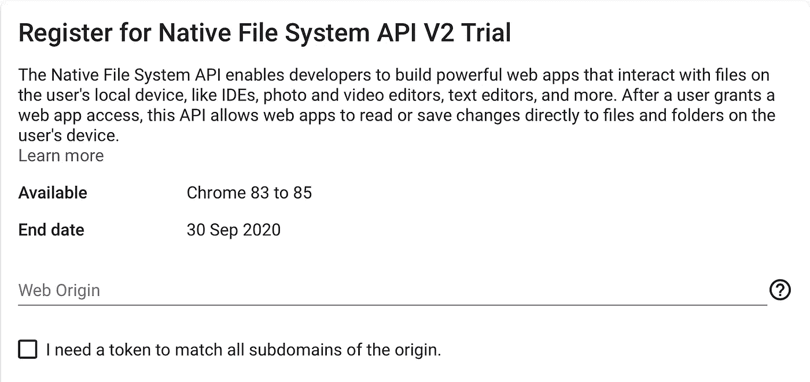
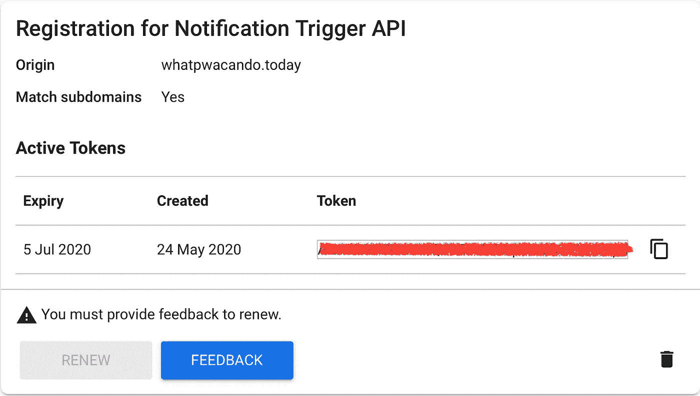
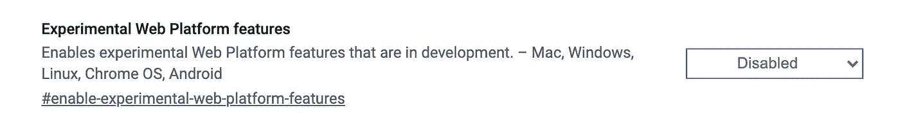

# 如何在您的 Web 应用程序中启用实验功能

> 原文：<https://itnext.io/how-to-enable-experimental-features-in-your-web-app-c3f117e3aa3d?source=collection_archive---------6----------------------->

不需要传输


比尔·牛津在 Unsplash[拍摄的照片](https://unsplash.com?utm_source=medium&utm_medium=referral)

如今，网络应用比以往任何时候都更强大，在功能方面可以轻松与本地应用竞争。

JavaScript 比以往任何时候都更强大，你的浏览器现在配备了地理定位、媒体捕捉和访问移动设备传感器等功能。

这无疑是激动人心的时刻。

W3C 开发了新的标准，供浏览器供应商实施，这自然需要时间。我一直是尝试前沿功能的粉丝，所以我对 [Chrome origin 试用版](https://github.com/GoogleChrome/OriginTrials/blob/gh-pages/developer-guide.md)感到非常兴奋。

Origin 试用版允许开发人员尝试新功能，并向 web 标准社区提供可用性、实用性和有效性方面的反馈。通过令牌和元标签为特定的源启用这些功能。

# 今天就实现明天的功能

在您的 web 应用程序中启用实验性功能的过程非常简单。

您可以在[活动试用列表](https://developers.chrome.com/origintrials/#/trials/active)中找到您想要启用的功能。找到您的功能后，单击“注册”:


积极的审判

输入您想要激活试用版的域名(源域名),您是否想要包含子域名、预期浏览量并同意条款:



为活动试用注册令牌

之后，将为您指定的域颁发一个令牌。请注意，该令牌仅适用于指定的域。当它包含在另一个域中时，它将被忽略。

上面的屏幕还显示了直到哪个版本的 Chrome 试用将被激活。在后续版本中，该功能将默认可用，或者将被完全删除。

*所以请记住，某个特性最终可能会被* ***而不是*** *发货并因此被删除。*

令牌目前的有效期为 6 周，到期后可以续订，但您需要提供反馈才能续订:



通知触发器 API 的令牌

在这里，您可以看到我在 PWA 展示中使用的令牌屏幕[PWA 今天可以做什么](https://whatpwacando.today)。

点击右侧图标，复制令牌并将其添加到您想要启用该功能作为`meta`标签的 web 应用程序的 HTML 页面:

```
<meta http-equiv="origin-trial" content="[your token here]">
```

您还可以配置您的 web 服务器来发送响应头:

```
Origin-Trial: [your token here]
```

您选择的功能现在应该可以在您的 web 应用程序中使用了。

您可以向您的应用程序添加任意数量的 origin 试用版，但请记住，您的应用程序需要在 HTTPS 上提供，并且功能是按页面启用的。

在单页应用程序中，你只需要将它添加到你的`index.html`中，但是如果你有多个页面，则需要将`meta`标签添加到需要启用该功能的每个页面中。

为了防止大型网站变得依赖最终可能被删除的实验功能，origin trials 有一个内置的保护措施，如果其使用量超过所有 Chrome 页面负载的 0.5%，就会自动在全球范围内限制它。

# 如何在本地测试

由于一个起源试用的令牌被绑定到某个域，它不会在你的`localhost`上本地工作。

为了能够在本地测试这些实验性功能，请在您的 Chrome 浏览器中访问`chrome://flags`并搜索“实验性网络平台功能”。

点击按钮启用并重启 Chrome。该功能现在也可以在本地使用:



# Microsoft Edge 原始试用版

微软的 Edge 浏览器最近也开始支持 origin 试用版。该过程与 Chrome Origin 试验一致。在撰写本文的时候，只有[两个活跃的试验](https://developer.microsoft.com/en-us/microsoft-edge/origin-trials/)，但是名单预计很快会扩大。

# 使用风险自担

Origin 试用版是一项非常激动人心的开发，它使开发人员能够试验新功能，并为进一步改进提供早期反馈。

但是请记住，这些功能最终可能会被弃用或删除，因此您需要确保您的 web 应用程序不会过于依赖某个功能。

然而，已经完成的试验带来了令人兴奋的新功能，并推动了网络的发展，这份清单相当长。

你可以在 Twitter 上关注我，我经常在那里写关于 PWAs、网络组件和现代网络功能的文章。