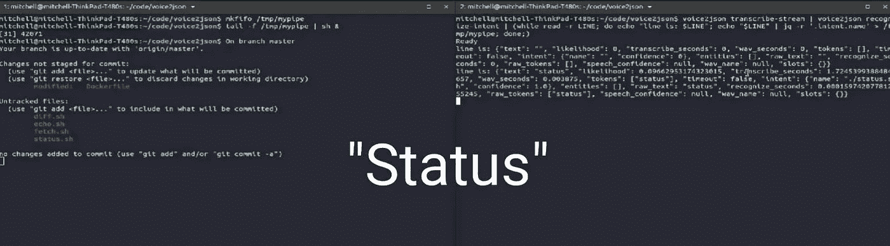

# 如何在 Linux 上用你的声音执行终端命令

> 原文：<https://itnext.io/how-to-execute-terminal-commands-with-your-voice-on-linux-eb1f6de58bff?source=collection_archive---------0----------------------->



开源 NLP 工具 [voice2json](http://voice2json.org/) 最近在[黑客新闻](https://news.ycombinator.com/item?id=27235970)上引起了我的注意:

> *voice2json 是一个命令行工具集合，用于 Linux 上的离线语音/意图识别。它是免费的、开源的(MIT)，支持 17 种人类语言。*

这让我想到，用这个工具只用你的声音来执行终端命令会有多难，事实证明…不是很难！

# **安装**

参见[文档](http://voice2json.org/install.html)了解 voice2json 安装说明的全部细节。

在我的第一次尝试中，我使用了 [Docker 映像](http://voice2json.org/install.html#docker-image)，但是我确实遇到了[音频输入被 Docker 拾取的问题](https://github.com/synesthesiam/voice2json/issues/21)，所以为了更平稳地启动过程，我推荐使用 [Debian 包](http://voice2json.org/install.html#debian-package)，你可以在他们的 [GitHub 版本](https://github.com/synesthesiam/voice2json/releases)中找到它。

你还需要[下载一个简介](http://voice2json.org/install.html#download-profile)，对于英语，我去找了他们推荐的 [Pocketsphinx](https://github.com/synesthesiam/en-us_pocketsphinx-cmu) ，到目前为止它对我很有用。下载。t[ar.gz 文件](https://github.com/synesthesiam/en-us_pocketsphinx-cmu/releases)并解压到`＄HOME/。config/voice2json `。这本质上就是你训练好的离线机器学习模型。

# **基本用法**

首先，您需要运行命令:

```
voice2json train-profile
```

应该只需要一两秒钟。

要检查一切是否正常运行:

```
voice2json transcribe-stream --open
```

这将转录您的讲话，并以 json 格式将各种相关信息输出到“stdout”。现在，我有北方英语口音，所以对我来说转录当然不是完美的，但是当结合语音识别和意图识别时，这种工具的力量来自于它。

您可以定义一组与给定“意图”相关的短语，因此“打开起居室的灯”可以映射到意图“改变状态”。这些意图映射在文件`$HOME/中定义。你可以在这里看到一个例子。更多细节见[如何工作](http://voice2json.org/#how-it-works)。

所以下面的命令:

```
voice2json transcribe-stream | voice2json recognize-intent
```

将尝试将您所说的话与最接近的匹配短语匹配，从而匹配意图。我发现当我用满手的短语时，这个工具非常善于发现正确的意图，甚至是我的口音！

# **如何执行命令**

现在我们已经有了从一组可能性中识别我们意图的工具，我们现在如何使用它来执行终端命令呢？

**Fifo 命名管道**

首先，我们需要做一个 fifo(先进先出)[命名管道](https://man7.org/linux/man-pages/man7/fifo.7.html)，这将最终允许我们将命令从一个终端传输到另一个终端。让我们创建一个名为`/tmp/mypipe '的管道，它将在以下位置创建一个文件:

```
mkfifo /tmp/mypipe
```

**决定你的命令集**

我从选择几个基本的 git 命令开始，我将下面的命令保存到`＄HOME/。config/voice 2 JSON/sentences . ini `:

```
[~/status.sh]
status[~/fetch.sh]
fetch[~/diff.sh]
diff
```

例如，它将语音“status”映射到 intent ` ~/status . sh `, intent 实际上是保存到我的机器上的这个位置的一个文件，稍后将执行这个文件。

这三个文件的内容是:

~/status.sh:

```
#!/bin/bash
git status
```

~/fetch.sh:

```
#!/bin/bash
git fetch --verbose
```

~/diff.sh:

```
#!/bin/bash
git diff --exit-code
```

通过在每个文件上运行“sudo chmod +x <file>”来确保这些文件是可执行的。</file>

**命令执行**

以下 bash 命令将执行写入命名管道`/tmp/mypipe '的任何行，在 git 存储库中的终端中运行该命令:

```
tail -f /tmp/mypipe | sh &
```

**向命名管道发送意图**

打开第二个终端并运行:

```
voice2json transcribe-stream | voice2json recognize-intent | (while read -r LINE; do echo “line is: $LINE”; echo “$LINE” | jq -r ‘.intent.name’ > /tmp/mypipe; done;)
```

实际上，每当 voice2json 工具识别出一个意图时，json blob 就被回显到“stdout ”,但是它也通过管道传送到“jq”工具，该工具提取意图名称，在本例中是文件的名称，并将其发送到命名管道“/tmp/mypipe”。

例如，如果您说出单词“status ”,您应该会看到在第一个终端中运行命令“git status ”!

终端语音命令演示

# **接下来的步骤**

既然我们已经证明了能够只用我们的声音执行一行 bash 命令的概念，那么这个概念很容易扩展到运行 python 脚本，启动一个 [ansible](https://www.ansible.com/) deploy 或者任何您喜欢的东西。

在生产环境中，这种快速破解肯定不是您想要依赖的东西。Voice2json 确实提供了通过 [MQTT](https://mqtt.org/) 向 [Mosquitto](https://mosquitto.org/) 这样的经纪人[发布意图识别事件](http://voice2json.org/commands.html#stream-events)的能力。更健壮的解决方案是使用 MQTT 客户机来订阅这些事件，以便对它们做出反应。这当然可以将您的力量扩展到通过语音而不仅仅是终端来控制物联网设备的领域。

如果使用得当，这种设置可以提高开发人员的工作效率。这让我想到用你的声音执行 IDE 快捷方式会很酷，我选择的 IDE 是 [VS Code](https://code.visualstudio.com/) ，为了让 IDE 能够与 voice2json 工具交互，我必须编写一个 VS Code 插件。在此之前，继续深入下去，我做了一个可用的 VS 代码扩展的快速搜索，看看是否已经存在一个语音命令插件，这时我发现…

# **Serena de . ai**

[塞拉诺](https://serenade.ai/)自称:

> *使用自然语言编程的最有效方法。通过在工作流程中添加语音来提高您的工作效率。*

它采用了软件语音控制的概念，并与它一起运行了一英里，有最流行的 ide 插件和 Python，JavaScript，Java，C++，HTML 等编程语言支持。这一点的执行完全是专业的，文档[是该产品质量的良好指标。你不仅可以用它在你的 IDE 中用你的声音写代码，你还可以使用](https://serenade.ai/docs/) [Chrome 扩展](https://serenade.ai/docs/chrome/)用声音命令改变窗口焦点和浏览网页。

除了数据隐私，免费层给了你几乎所有的东西。上机教程真的是一次很愉快的体验，每个微小的细节都考虑到了。你甚至可以编写你自己的[自定义语音命令](https://serenade.ai/docs/api/)或者编写你自己的[自定义插件](https://serenade.ai/docs/protocol/)与 Seranade 集成。

我是否会将它集成到我的日常开发工作流程中还有待观察，最多我可以看到自己在这里和那里使用它作为一些快捷方式，而不是扔掉我的键盘。

如果你像我一样现在在家工作，在工作的时候对着电脑说话会更容易接受一些，但是当我的狗对着我的电脑大喊“去捡球”的时候，它总是认为我有球要扔…

*最初发表于:*[*【https://www.mitchell-harle.dev/execute-commands-with-voice/】*](https://www.mitchell-harle.dev/execute-commands-with-voice/)