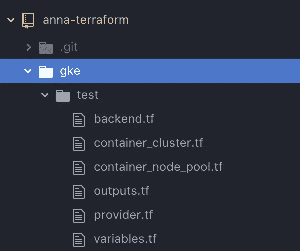
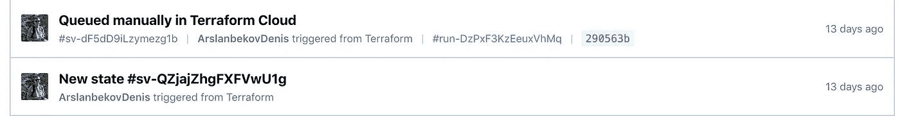
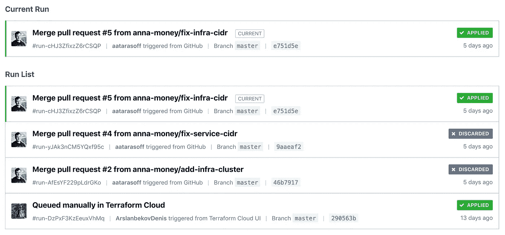
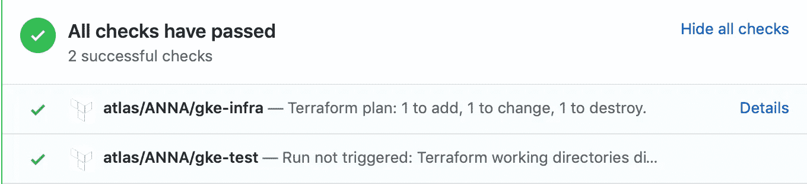
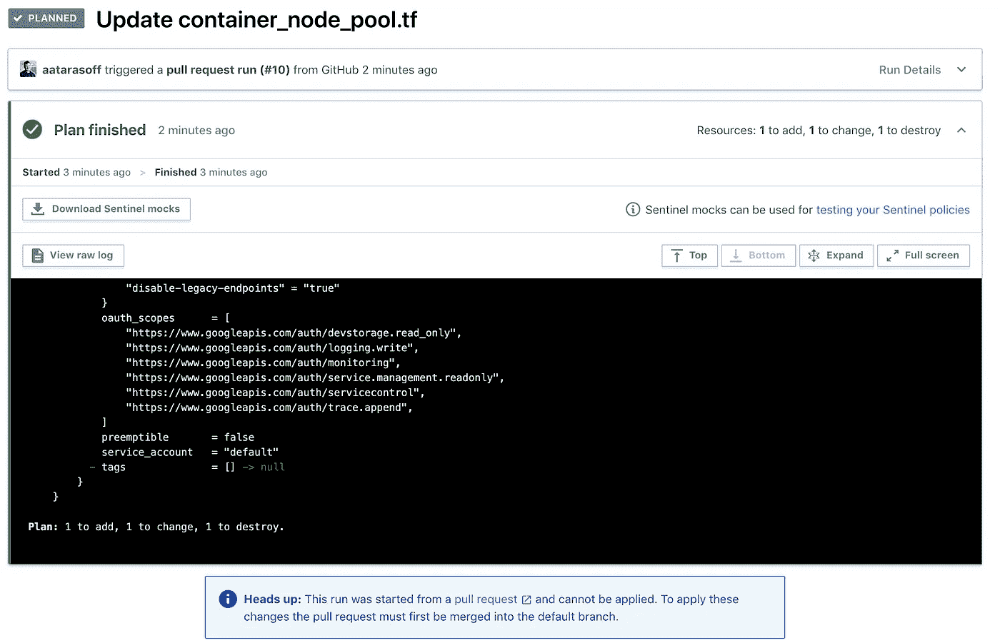
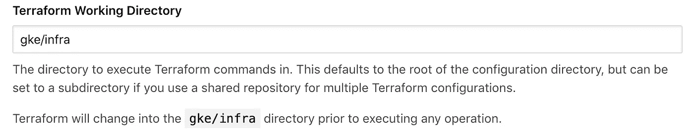
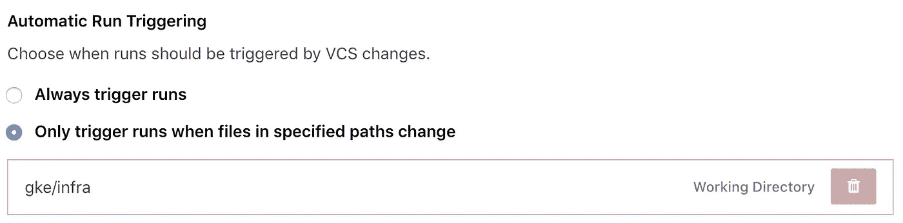
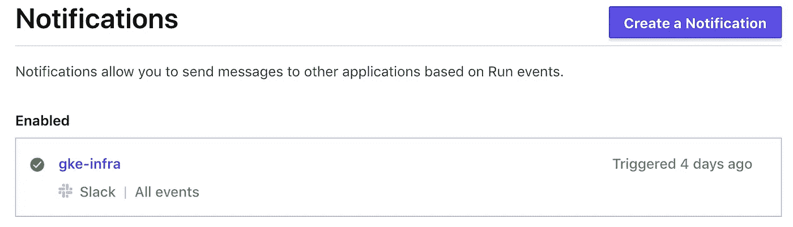

# 如何将您的 GKE 集群导出到 Terraform Cloud

> 原文：<https://itnext.io/how-to-export-your-gke-cluster-to-terraform-cloud-with-some-blood-and-pain-f0b7d55d39b2?source=collection_archive---------6----------------------->

**免责声明**:这个故事是基于我在[安娜·钱](https://anna.money/)和[丹尼斯·阿斯兰别科夫](https://medium.com/u/8da870e219bd?source=post_page-----f0b7d55d39b2--------------------------------)的团队合作。他帮我写了这篇文章。


由 [Cassi Josh](https://unsplash.com/@cassi_josh?utm_source=unsplash&utm_medium=referral&utm_content=creditCopyText) 在 [Unsplash](https://unsplash.com/s/photos/blood?utm_source=unsplash&utm_medium=referral&utm_content=creditCopyText) 上拍摄的照片

你好，我的观众。我来告诉你这篇文章的背景。有一天，我们从自己在 GCP 的 Kubernetes 安装迁移到由谷歌管理的名为 GKE 的 Kubernetes 服务。我们在测试环境中这样做，但是是通过 web 控制台。这是在 GCP 开始任何事情的最简单的方法，对吗？然而，这是不可复制的，而且通常这样做是非常非常不好的。在我们迁移生产环境之前，我们决定成为“好人”，并使用**基础设施即代码**原则来描述我们已经完成的工作。

我们需要解决一些问题:

*   我们不应该打破或摧毁现有的 GKE 集群
*   我们应该做一个严格的复制，并做到幂等

那时，我们有两个选择。使用[ansi ble 模块](https://docs.ansible.com/ansible/latest/modules/gcp_container_cluster_module.html)或 Terraform 来描述集群。选择什么是一个品味问题，我们选择 Terraform 有两个原因:

1. [Terraformer](https://github.com/GoogleCloudPlatform/terraformer) CLI 工具，用于将现有的 GCP 配置导出到 tf 文件中(不仅仅是 GKE，还包括网络、DNS 等)

2.[地形云](https://www.terraform.io/)管理环境

首先，我们使用这个简单的命令通过 **Terraformer** 导出测试 GKE 集群配置:

```
**terraformer import** google --resources=gke --connect=true --regions=${region} --projects=${project}
```

> 默认情况下，Terraformer CLI 会为每个导出的服务创建`*/generated/{provider}/{service}*`文件夹。您可以通过 CLI 选项来更改它，或者将文件移动到您希望的任何文件结构中。

**注意**如果你以前没有使用过 Terraform，你需要在这里下载与你的提供商[一起使用的插件，并把它放到](https://releases.hashicorp.com/terraform-provider-google/)

```
$HOME/.terraform.d/plugins/darwin_amd64
```

我们接受了以下结构:



导出后，使用本地后端并为 GKE 集群生成包含当前状态的`terraform.tfstate`文件。集群定义放在`container_cluster.tf`文件中，节点池定义放在`container_node_pool.tf`中。

我们使用`terraform plan`命令在本地检查导出的配置。一切都很好。我们试图通过**应用**命令做一些小的改变，它们被成功应用。

毫无疑问，我们决定在云中运行它。我们打开了 **Terraform Cloud** web 控制台，创建了一个新的工作区，并使用导出的配置连接到 GitHub 存储库。

> 工作区有助于组织基础设施，它们非常类似于 CI 中的构建配置。它们包含地形配置、变量值、秘密、运行历史和状态。

我们修补了`provider.tf`文件，通过 Terraform 云引擎传递机密变量，并为工作区添加了这些变量:

```
**variable "google-credentials" {}**provider "google" {
  project = "anna-money"
  version = ">=2.15.0"
  **credentials = "${var.google-credentials}"**
}
```

在此之前，我们愉快地将代码推送到目标存储库的`./gke/test`文件夹中，发现敏感数据泄露。在 Terraform 状态文件中，我们创建了包含编码证书的**master _ auth . 0 . cluster _ ca _ certificate**属性。可悲，但我们应该删除状态文件，进行强制推送，下次要更加小心。

在那之后，我们有了一个新的问题。在没有状态文件的情况下，Terraform Cloud 制定了一个重新创建现有集群的计划。完全不是你所期望的。你不能只是将现有的配置转移到云中。您必须首先迁移后端。

对于迁移，我们应该创建 API 用户令牌，在用户主目录中创建`./terraformrc`文件，并将其填充如下:

```
credentials "app.terraform.io" {
  token = "<token_here>"
}
```

然后将后端配置从本地后端更改为远程:

```
terraform {
  **backend "remote"** {
    hostname = "app.terraform.io"
    #this should be your organization
    organization = "ANNA"workspaces {
      name = "gke-test"
    }
  }
}
```

并执行`terraform init`命令将状态迁移到云端。

> 警告:如果您在远程工作区中启动计划，您应该在初始化之前重新创建工作区，因为可能会出现错误的保存状态。

当我们把事情做对了，我们得到了没有改变的计划:

```
**Plan:** 0 to add, 0 to change, 0 to destroy.
```

或者，进行不应该影响现有集群的微小更改:

```
+ min_master_version      = "1.14.3-gke.11"
```

不破坏工作的测试环境对我们来说是至关重要的，所以我们应该确保应用的修改不会导致这种情况。

在 state 选项卡上，我们有两种状态:初始状态和第一个排队计划之后的状态:



在 run 选项卡上，我们有完整的执行历史:



作为奖励，我们对 PRs 进行了 GitHub 检查:



此外，当我们点击**详细信息**链接时，我们可以看到预期的计划，并检查是否如我们计划的那样:



接下来，我们通过 Terraform 创建的内部基础架构的 GKE 集群忽略了 GCP web 控制台。我希望您记得，我们希望正确管理基础架构。

我们在 GitHub 存储库中创建了另一个文件夹，从测试集群中进行了*智能复制粘贴*配置，并在 Terraform Cloud 中创建新的工作区。正确配置的工作区应该知道分配给它的文件夹。我们通过工作区设置:



同样，我们设置相同的文件夹来自动触发 VCS:



然后，我们尝试将一个计划排队并应用它。你认为一切进展顺利吗？不。我们得到了错误:

```
**Error: error creating NodePool: googleapi: Error 409: Already exists**on container_node_pool.tf line 1, in resource "google_container_node_pool" "anna-infra_default-pool":
   1: resource "google_container_node_pool" "anna-infra_default-pool" {
```

我们打开 GCP 控制台，发现默认池已成功创建。我们尝试删除集群并重新创建。我们决定首先手动删除节点池。无济于事。我们做错了什么？

好吧，我们没有阅读手册，并把赌注押在已经运行良好的配置上。在[官方文件](https://www.terraform.io/docs/providers/google/r/container_cluster.html#example-usage-with-a-separately-managed-node-pool-recommended-)中，我们发现了一个关于我们痛苦的有趣解释:

```
# We can't create a cluster with no node pool defined, 
# but we want to only use
# separately managed node pools. 
# So we create the smallest possible default
# node pool and immediately delete it.
**remove_default_node_pool = true**
initial_node_count **=** 1
```

或者，不要定义默认节点池，而是使用群集配置中的属性。我们选择了第二种方法，创建一个尽可能小的默认池，并用不同的名称设置一个单独的池。

这对我们很有效。

锦上添花的是，我们通过云 web 控制台设置了 Slack 集成:



并开始接收通知:


**我们做了什么？**

1.  使用 Terraformer CLI 导出现有的 GKE 配置
2.  清理导出的配置并检查它
3.  在 Terraform cloud 中创建一个工作区，配置它，将状态转移到其中，设置与 GitHub 和 Slack 的集成
4.  检查我们没有破坏现有的集群
5.  测试更重要的变化
6.  在同一个 GitHub 项目中定义一个新的集群，但是是一个新的工作空间
7.  修复一些问题，并通过 Terraform 而不是 web 控制台创建它

**我们最终得到了什么？**

1.  基础设施是我们 GKE 集群的代码
2.  友好的 UX 提供免费(当然是为我们的小团队)云解决方案
3.  安全、可靠且可预测的基础架构变更流程

**现在什么叫冷？**

1.  在 Terraform Cloud 中，变量、机密和通知不能在组织级别上共享或定义
2.  整个过程有些棘手，我们需要考虑下一步的简化，例如将 GCP 网络配置转换为 Terraform

那是我所有的朋友。如果你有同样的问题或者想了解更多，请留言评论或者直接电报(`aatarasoff`、`arslanbekov`)找我们。