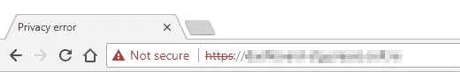
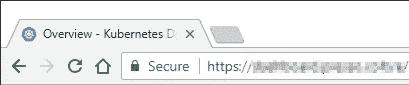
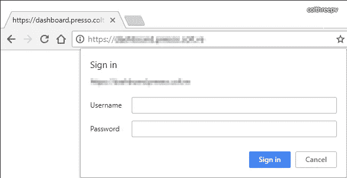

# 如何使用证书管理器显示您的 Kubernetes 仪表板

> 原文：<https://itnext.io/how-to-expose-your-kubernetes-dashboard-with-cert-manager-422ab1e3bf30?source=collection_archive---------0----------------------->

所以 [kube-lego](https://github.com/jetstack/kube-lego#kube-lego) 已经死了，如果你在你的 Kubernetes 集群上使用[包管理器](https://www.helm.sh/)(你应该这样做)，你现在除了使用 cert-manager 别无选择。

作为一种商品，我真的很喜欢将 Kubernetes 仪表板暴露给公众，通过简单的基本认证来保护，我还没有找到如何在 1-2-3 步指南中完成这一点。

所以，在这里！

# 证书颁发者

假设您的集群已经有 [cert-manager](https://github.com/jetstack/cert-manager) 和 [nginx-ingress](https://github.com/kubernetes/ingress-nginx) 在工作，您的下一步将是设置 [Issuer](http://docs.cert-manager.io/en/latest/reference/issuers.html) 或 [ClusterIssuer](http://docs.cert-manager.io/en/latest/reference/clusterissuers.html)

我们将设置一个临时 ClusterIssuer:

**letsencrypt-stg.yaml**

这个 ClusterIssuer 假设您已经在 **kube-system** 名称空间中安装了 nginx-ingress 和 cert-manager，如果不是这样，您应该更改**名称空间**元数据。

来申请吧:`kubectl apply -f letsencrypt-stg.yaml`

我们可以检查我们创建的 ClusterIssuer `kubectl -n kube-system describe clusterissuer letsencrypt-stg`

# 证书的显式创建

对于通过 cert-manager 公开的大多数服务，您可以使用[ingress-shim](http://docs.cert-manager.io/en/latest/reference/ingress-shim.html)[annotations](http://docs.cert-manager.io/en/latest/reference/ingress-shim.html#supported-annotations)，但是 Kubernetes 仪表板通常只在 HTTPS 上公开，这会干扰证书的自动生成。

那么，让我们使用一个显式证书

创建证书:`kubectl apply -f kubernetes-dashboard-stg.yaml`

检查您新创建的资源:`kubectl -n kube-system describe certificates kubernetes-dashboard-stg`

此时我们应该检查我们的证书的创建:`kubectl -n kube-system describe certificate kubernetes-dashboard-stg`

你应该看到这样的东西:

```
Reason               Message
------               -------
PrepareCertificate   Preparing certificate with issuer
PresentChallenge     Presenting http-01 challenge for domain your.awesome.host
SelfCheck            Performing self-check for domain your.awesome.host
ObtainAuthorization  Obtained authorization for domain your.awesome.host
IssueCertificate     Issuing certificate...
CeritifcateIssued    Certificated issued successfully
RenewalScheduled     Certificate scheduled for renewal in 1438 hours
```

使用以下嵌套命令，还可以通过查看您的证书管理器窗格来跟踪证书创建:

```
kubectl -n kube-system logs -f $(kubectl -n kube-system get pods -l app=cert-manager -o jsonpath="{.items[0].metadata.name}") cert-manager
```

您应该会看到类似这样的内容:

```
Setting lastTransitionTime for Certificate "kubernetes-dashboard-stg" condition "Ready"
Certificated issued successfully
Certificate scheduled for renewal in 1438 hours
certificates controller: Finished processing work item "kube-system/kubernetes-dashboard-stg"
certificates controller: syncing item 'kube-system/kubernetes-dashboard-stg'
Certificate scheduled for renewal in 1438 hours
certificates controller: Finished processing work item "kube-system/kubernetes-dashboard-stg"
```

# 入口本身的创建

最后，我们的系统只缺少一个入口来启动一切。

仪表板的工作入口应该是这样的:

这种配置中一些值得注意的关键点:

**secretName** 必须是上面的证书中指定的那个，因为这两个资源之间没有自动绑定。

kubernetes.io/ingress.class 指定使用哪种负载均衡器，如果你使用 GKE 或裸机实例，`nginx` 是你想要的值。

**nginx.ingress.kubernetes.io/ssl-redirect**指示 NGINX 将 HTTP 流量重定向到 HTTPS，您的 kubernetes 仪表板将没有**HTTP 版本，因为仪表板本身由 HTTPS 提供服务。**

**nginx.ingress.kubernetes.io/secure-backends**明确指出仪表板只在 HTTPS 提供服务，所以不要期待 HTTP 响应，而是 HTTPS 响应。

[商品:nginx-ingress 注释的完整引用](https://github.com/kubernetes/ingress-nginx/blob/master/docs/user-guide/nginx-configuration/annotations.md)

此时，导航到[https://your . awesome . host](https://your.awesome.host)应该会显示如下内容:



这看起来像是 Chrome 上的临时 Letsencrypt 证书，看起来不太成功。但事实如此。

如果我们正确地完成了这一步，我们基本上已经成功了，现在我们只需要复制我们的所有资源用于生产部署。

# **生产部署**

此时，新的 ClusterIssuer、证书和入口将是继续生产环境所必需的。

我将包括一个 ClusterIssuer 的例子，因为它很难在线获得:

继续复制其他资源，记住使用不同的秘密名称，因为这个原因，之前已经使用了前缀`stg`。

在过程的最后，我们应该会得到一个可用的仪表板 URL:



生产许可证工作中的加密证书

我们完事了吗？不完全是。我们仍然没有隐私可言，绝对的最低要求是在到达仪表板之前有一个基本的认证墙。

# 基本认证

首先，让我们生成一些凭证；我们将使用 MD5 hash 而不是 Bcrypt(这样更安全)，因为 NGINX [似乎与它](https://stackoverflow.com/questions/31833583/nginx-gives-an-internal-server-error-500-after-i-have-configured-basic-auth/35834603#35834603)有问题。

```
docker run --rm -it xmartlabs/htpasswd -m <user> <password >> htpasswd-dashboard
```

可以多次使用该命令来获取有效的用户/密码组合列表。

一旦完成，我们将把这个文件转换成一个 Kubernetes [秘密](https://kubernetes.io/docs/concepts/configuration/secret/)

```
kubectl -n kube-system create secret generic htpasswd-dashboard --from-file=auth=htpasswd-dashboard
```

因此，我们创建了一个名为 **htpasswd-dashboard** 的秘密，其中包含一个 **auth** 密钥，表明这是我们的 htpasswd 文件；NGINX 想要这种格式的秘密。

我们必须在入口中添加一些元数据:

```
metadata: annotations: nginx.ingress.kubernetes.io/auth-type: basic nginx.ingress.kubernetes.io/auth-secret: htpasswd-dashboard nginx.ingress.kubernetes.io/auth-realm: "Authentication Required"
```

一旦我们编辑或应用了新修改的入口，我们就可以开始了。



在配置 Kubernetes 时，即使得到密码提示也是成功的一刻。

目标是安全地公开 Kubernetes 仪表板，在基本的 auth 登录之后，您必须提供一个 kubeconfig/ServiceAccount 令牌。

有了这些令牌，您可以充分利用基于角色的访问控制。

到下一次。

[-瓦莱里奥](https://about.me/colthreepv)