# 如何使用 AdvancedFormat 扩展图表功能？

> 原文：<https://itnext.io/how-to-extend-chart-capabilities-using-advancedformat-630c9052990?source=collection_archive---------2----------------------->

有一次，我被要求用几个图表构建一个仪表板。其中一个图表需要多个 y 轴，这让我想到了 [OutSystems Charts](https://www.outsystems.com/forge/component-overview/4141/outsystems-charts) 组件中更高级的选项。OutSystems 图表基于 [Highcharts API](https://www.highcharts.com/) ，并且可以选择通过向图表添加高级格式来扩展现有图表组件的功能。这种高级格式可以使用 JSON 的片段进行配置。

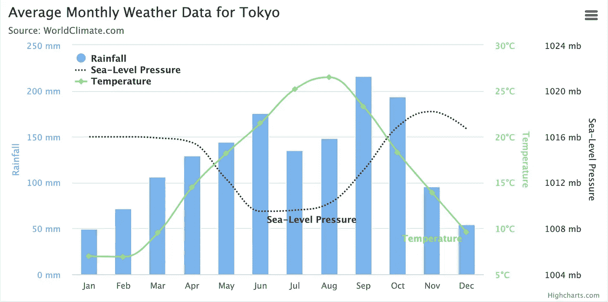

本文是一个循序渐进的教程，它解释了如何使用 OutSystems 图表的高级格式来生成一个具有两个或更多不同 y 轴的图表。作为奖励，还有一个带演示的的[锻造组件，你可以作为参考。](https://www.outsystems.com/forge/Component_Overview.aspx?ProjectId=12422)

一旦您将一个图表组件拖放到 [OutSystems Service Studio](https://www.outsystems.com/downloads/) 的屏幕上，您就有了一个强制输入，正如您在下面看到的，这就是 SourceDataPointList。

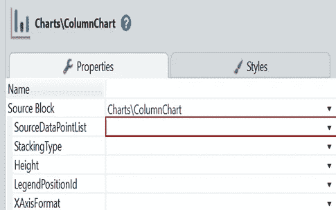

该输入参数代表应该显示的数据点。在基本图表中，您至少需要以下内容才能得到有意义的图表:

*   **标签**:在 x 轴上可见的标签，例如工作日、月份或一个国家的不同地区。
*   **值**:图形中某一点的值
*   **数据系列名称**:为了对数据进行分组，可以创建一个或多个系列。例子有:不同的群体，男性&女性或不同的城市

有了这些信息，您可以创建一个显示数据的图表，如下图所示。

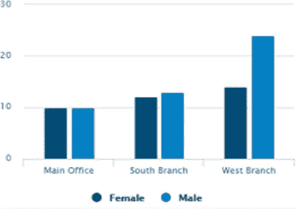

基于上图显示不同选项值的说明:

*   **标签**:总公司、南分公司、西分公司
*   **值**:条形高度
*   **数据系列名称**:母&公(结果在图例中，每个标签有多个条形)

现在我们进入更高级的图表。

假设您需要实现不同类型的图表，例如，具有不同 y 轴的柱形图和折线图的组合。

如果您想知道需要不同 y 轴的情况，请查看以下示例:

*   两个数据序列用**相同的**度量，但**不同的**
*   显示相对值和绝对值的两个数据系列
*   显示完全**不同值的两个数据系列**

让我们以下一个练习的最后一个例子为例，构建一个带有两个 y 轴的图表。我们将构建一个类似于图表的东西，您可以在 [Highcharts 演示](https://www.highcharts.com/demo/combo-multi-axes)页面上找到它。我们提供了几个月的数据:

*   降雨
*   海平面压力
*   温度

首先，我们定义下面的结构——同样，它可以在[组件](https://www.outsystems.com/forge/Component_Overview.aspx?ProjectId=12422)中找到。

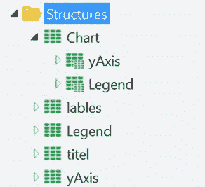

其次，创建一个客户端动作，可用于配置高级格式。它将有三个不同的列表来输入数据集。每个点和标签数据集一个列表，一个列表输出，用相同的结构返回数据点。这将是我们用作多 y 轴图表输入的列表。

一步一步，看起来是这样的:

1.  将这三个列表附加到输出列表中。


2.定义图表始于:

通过向 y 轴列表中添加 y 轴项目，定义每个列表的 y 轴，标题与每个列表的数据系列名称相匹配。有两件事需要注意:

*   **对面**:y 轴将出现的地方
*   **可见**:使 y 轴可见。请确保在结构中定义了它并将其设置为 true。否则 y 轴就看不到了！相信我，我知道…

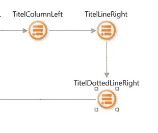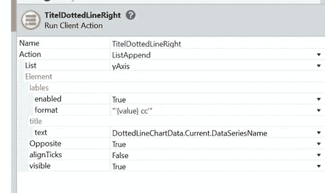

下面是当**可见时**值被设置为假:

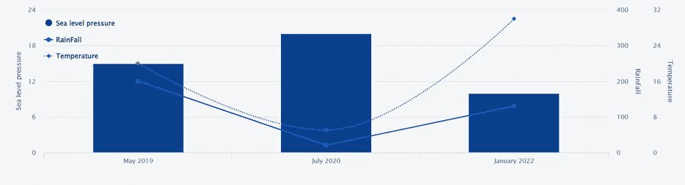

当 visible 值设置为 true 时，您实际上可以看到 yAxis，而不是三者之间共享的一个，这实际上是我们的目标:

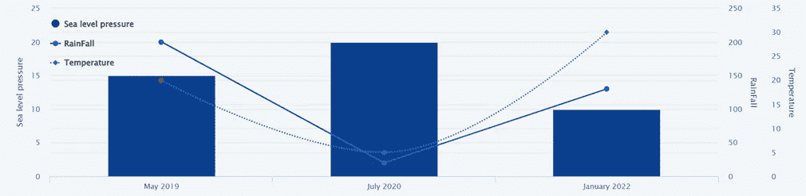

然后，添加其余图表对象元素的配置。当需要覆盖默认值时，可以向结构中添加更多配置。配置的其他选项可以在 [Highchart](https://www.highcharts.com/demo/combo-multi-axes) s 的文档中找到。我在文章中使用了一些例子来给你一个可能性的基本概念。

最后，使用 JSONserialize 将刚刚创建的 Structure 对象(输出)转换为序列化的 JSON 字符串。


3.配置数据系列和 y 轴外观的时间:

*   **数据系列名称**:应与定义列表中的数据系列名称相匹配
*   **DataseriesJSON** :我输入下面的代码，并确保 Name 属性的值与数据系列名称相匹配。
*   **名称**:如上所述。
*   **类型**:定义你想要显示的图形类型。例如条形图、虚线或实线。您可以在示例中更好地探索它。
*   **yAxis** :从 0 开始，你要给每个 yAxis 一个数字，用它自己的值来表示，不与其他 yAxis 共享。

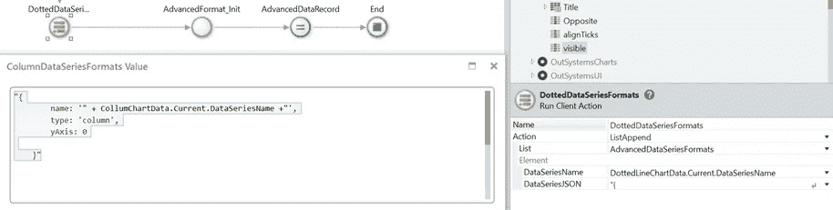

```
“{name: ‘“ + CollumChartData.Current.DataSeriesName +”’,type: ‘column’,yAxis: 0}”
```

4.最后，OutSystems 默认拥有来自 OutSystemsChart 模块的 AdvancedFormat_Init 客户端函数。这用于用作为参数传递的值初始化 AdvancedFormat 记录。我们将使用输出，键入 AdvancedFormat，并将其作为输入传递给图表输入参数 AdvancedFormat

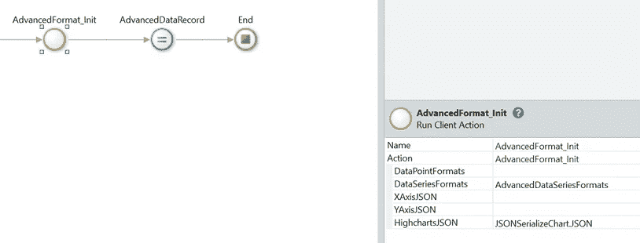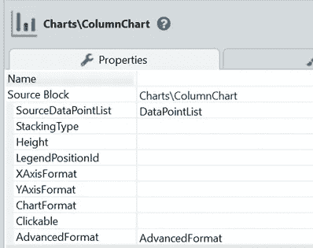

我们结束了。看看下面的图表就知道了。

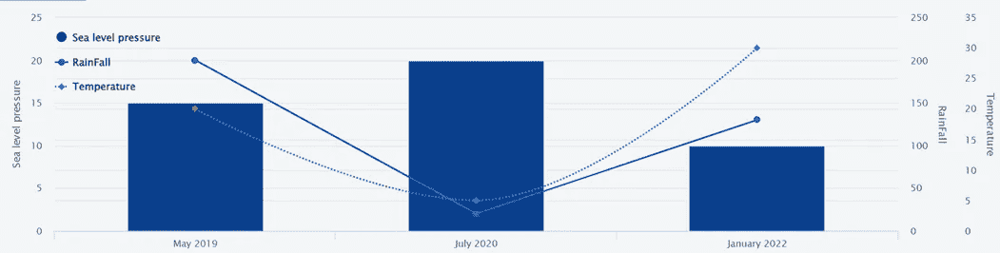

你可以在铁匠铺的[演示中找到更多细节，并以此为基础提高你的外部系统图表能力！](https://www.outsystems.com/forge/Component_Overview.aspx?ProjectId=12422)