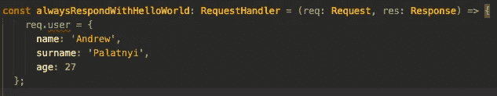

# 如何用 Typescript 扩展 ExpressJS 请求对象👨🏻‍💻❓

> 原文：<https://itnext.io/how-to-extend-the-expressjs-request-object-with-typescript-26675cda0632?source=collection_archive---------4----------------------->


🔶最近，我开始着手一个新的 NodeJS 项目。我们有一个由一个人组成的难以置信的大团队。我有丰富的前端开发经验，有心爱的 ReactJS 和新的印象深刻的 Flutter。看起来很奇怪，那个用 React 做了很多 web 开发的家伙提到了 Flutter。但是不管这篇文章是关于服务器端开发🧠的

我听说了很多关于 Typescript 的事情，也看到了许多图表显示了它不可阻挡的受欢迎程度📈，但没试过。所以我决定这是一个绝佳的机会。

像往常一样，我通过安装最少的必需依赖项来开始我的项目:

```
npm -g install typescript
npm install express —-save
npm install [@types/node](http://twitter.com/types/node) [@types/express](http://twitter.com/types/express) —-save-dev
tsc -v //check that Typescript installed correctly
tsc —-init //create ttsconfig.json
```

很好。生成的 tsconfig.json:

```
{"compilerOptions": {"target": "es6","module": "commonjs","outDir": "./dist","rootDir": "./src","strict": true,"moduleResolution": "node","baseUrl": ".","typeRoots": ["node_modules/@types"],"esModuleInterop": true},"exclude": ["node_modules", "dist"],"include": ["src/**/*"]}
```

关于“字根”property❗️的心理笔记

接下来，我使用 ExpressJS 编写了一个小型 NodeJS 服务器，以理解使用 Typescript 和第三方包时的基本概念。

⚫️:很好，一切正常。编辑器不会突出显示任何错误。中间件和关键实例代表。👌🏻对于我的项目，需要一些自定义变量。这样的变量是“user”，它包含一个在 Request ExpressJS 对象中带有用户数据的对象。
我添加了它，并得到了我的第一个错误:

如果你试图编译，你会得到一个错误。

```
Property ‘user’ does not exist on type ‘Request<ParamsDictionary>
```

可能文本编辑器突出显示了它:



d

## 声明合并来拯救！🧞‍♂️ 🧞‍♂️ 🧞‍♂️

> 从 TS 官方文档网站:'[声明合并](https://www.typescriptlang.org/docs/handbook/declaration-merging.html) —编译器将两个用相同名称声明的独立声明合并成一个定义。'

🔵因此，让我们看看这个概念如何帮助我们处理“req.user”

创建这个文件夹结构——“src/types/index . ts”——我们把我们的自定义类型。将这些行添加到新创建的文件中:

现在我们需要更新 tsconfig.json，告诉编译器包含来自 src/types/index.ts 文件的自定义类型。

还记得“typeRoots”属性吗？更新其值。

```
"typeRoots": [
    "src/types/index.ts","node_modules/@types"
],
```

这里重要的是在 node_module/@types 之前包含 src/types

简单地说。编译器从 node_modules/@types/express 文件夹中获取我们的自定义类型和请求对象的类型，然后将其合并，并使用我们的“user”字段生成新类型。

如果你试着编译并运行你的应用程序，一切都会好的。编辑器不应突出显示该错误。

🔻结论:
我对打字稿有一种复杂的感情。一方面，它提供了自动完成、类型安全和一个巨大的社区。什么叫牛逼！然而，另一方面，我们有 Dart lang，其中所有类型检查功能都是现成的。

感谢阅读！[🤖](https://emojipedia.org/robot-face/) [🤘](https://emojipedia.org/sign-of-the-horns/)🤙