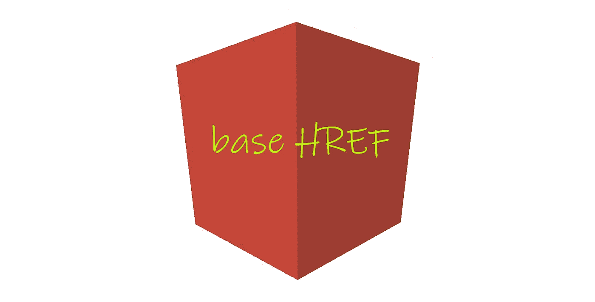
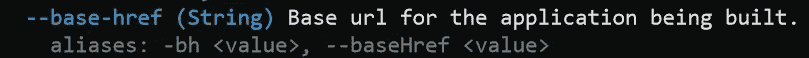

# 如何提取有角的 HREF？

> 原文：<https://itnext.io/how-to-extract-the-base-href-in-angular-bbbd559a1ad6?source=collection_archive---------1----------------------->

使用定位策略，可以在 ng build 命令中传递基本 HREF。

原来 Angular 提供了开箱即用的`[APP_BASE_HREF](https://angular.io/api/common/APP_BASE_HREF)` 注入令牌，但是如果您尝试并注入它:

你得到一个错误，声称没有人提供它！

> NullInjectorError:没有用于 InjectionToken appBaseHref 的提供程序！

当我们构建我们的应用程序时，我们可以**为它指定**基础 **HREF** :

来自 ng build - help

例如:`ng build --base-href /admin`将构建我们的应用程序，并指示它使用`/admin`的**基本 HREF** ，如果应用程序的管理部分作为一个单独部署的应用程序与我们的主应用程序在同一域下，这可能是有用的。

为了在我们的应用程序逻辑中使用这一点，我们可以:

这是 **it** ，有需要就去用吧。
免责声明:如果您使用的是 **HashLocationStrategy** ，将不起作用！

如果你对**和**的来源很好奇，这里有几个**链接**到 Angular 源代码:
那个 [**平台定位**](https://github.com/angular/angular/blob/168abc6d6f52713383411b14980e104c99bfeef5/packages/common/src/location/platform_location.ts#L119) 我们上面用过的方法。进而使用来自[**的方法浏览**](https://github.com/angular/angular/blob/168abc6d6f52713383411b14980e104c99bfeef5/packages/platform-browser/src/browser/browser_adapter.ts#L94) **。**

在我们的用例中，如果提供了一个**基 HREF** `/my/`(它打破了我们从`ng-inline-svg`开始使用的`SvgCacheService`)，我们必须删除最后一个斜杠

感谢阅读:)