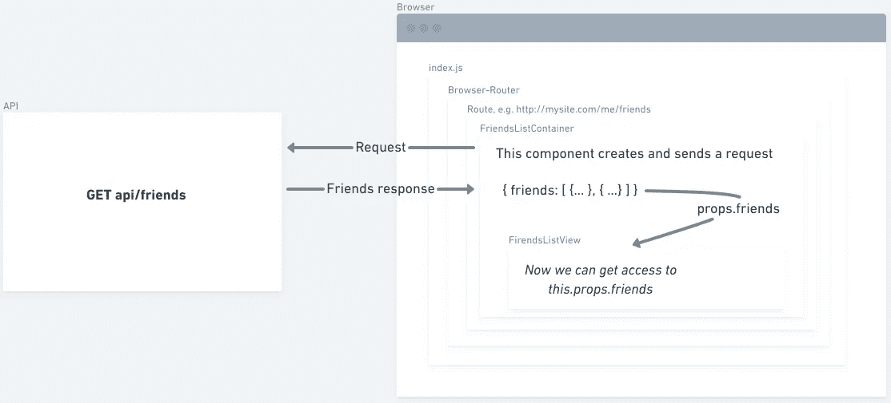
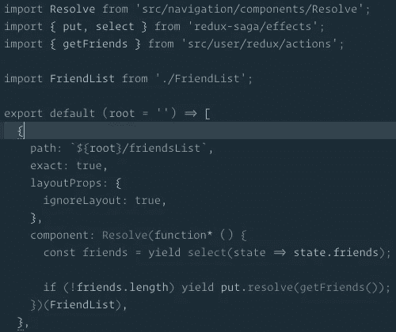

# 如何在 react 应用程序中获取数据？

> 原文：<https://itnext.io/how-to-fetch-data-inside-react-apps-2ca430c202c5?source=collection_archive---------4----------------------->

获取数据是现在几乎每个应用程序都要做的事情之一。我们要求数据，我们编辑它，我们保存它。我们的目标是让 UX 对用户来说尽可能的简单和流畅。有时我们希望在后台获取数据，有时通过单击按钮或向下滚动页面在前台获取数据。现在，我们将了解如何、在哪里以及何时在 react 应用程序中获取数据。

**问题**

问题很简单——我们希望尽快获取数据，这样用户就不必等待很长时间。要做到这一点，我们需要知道我们需要获取什么数据，并且我们需要在意识到这一点之后马上去做。有时候我们能马上做到，有时候不能。假设我们想显示所有用户的好友列表，这将是我们想象的例子。

**哪里**

创建和发送请求的理想位置是我们的入口点。如果我们谈论一般的应用程序，那么每个应用程序的入口点将是 index.js。这是第一次呈现的内容，所以我们可能希望在那里获取数据，只有在我们没有路径的情况下。如果我们有路线，并且我们想为每条路线提取不同的数据，该怎么办？首先，我们需要了解我们的切入点是什么？如果对于整个应用程序，它是 index.js，那么对于路线，它将是路线组件的渲染函数，例如，它是一个我们已经知道需要为特定路线渲染什么组件的地方。

其次，我们需要开始加载数据，等待它被获取，同时显示一个微调器，最后当数据被获取时，我们希望显示组件。

**如何**

好了，现在我们知道什么时候我们需要开始获取数据，让我们来谈谈我们将如何去做。

这取决于您使用什么工具来提供数据，但无论如何这很简单:您需要创建并发送一个 XHR 请求。调用`fetch`就可以了。如果你使用 redux，你可能最终会使用 [sagas](https://redux-saga.js.org/) 或 [thunk](https://github.com/reduxjs/redux-thunk) 。我个人更喜欢 saga，因为它是声明性的，而且用 saga 比用 thunk 更容易处理副作用。我们在 [@unicorndev](http://twitter.com/unicorndev) 是这样做的:

我们有一个名为 Resolve 的组件，它是一个特设组件。获取一个 saga →运行它→在获取数据时显示一个微调器→当数据准备好时显示所需的组件(FriendListContaner)。

**当**

我们知道如何以及在哪里获取数据，但是我们什么时候需要这样做呢？很明显，我们需要尽可能早地这样做，所以这将是我们知道需要什么数据的第一个地方。我们有什么选择:

*   组件安装
*   组件将安装

这些是最流行的处理副作用的生命周期挂钩。你需要检查这两个钩子之间的区别，但是我们在 [@unicorndev](http://twitter.com/unicorndev) 使用 componentDidMount，但是这是另一个故事了。

**结束**

这是当今软件开发中最常见的问题之一。人们试图用不同的方法来解决这个问题，有些人试图在服务器端获取所有数据，有些人使用查询语言来减少数据量，以便可以更快地获取数据。我希望这篇文章能让您了解如何获取数据以及如何尽可能快地获取数据。

还有什么？如果您正在学习 React，那么您可能也会喜欢这些文章:

*   [如何学会反应](/a-way-to-learn-react-b95056eafebb)
*   【React 类和函数的区别
*   [如何构建你的应用](/how-to-structure-your-react-app-2-2cf3b8040634)

请点赞&分享。和平。